# 十大排序算法


## 对数器验证法

用于验证自己写的算法是否正确，对数意思是一个一个数比较，看看对不对。

```java
public class AlgorithmUtil {
    /**
     *  随机生成一个数组
     * @param maxSize 最大长度
     * @param maxValue 最大值
     * @return
     */
    public static int[] generateRandomArray(int maxSize, int maxValue){
        int[] arr = new int[(int) (Math.random() * (maxSize + 1))]; //长度随机：[0,maxSize]
        for(int i = 0; i < arr.length; i++){
            arr[i] = (int)(Math.random() * (maxSize + 1)) - (int)(Math.random() * maxSize); //数值数值：[-maxValue+1,maxValue]
        }
        return arr;
    }

    /**
     * 复制一个array
     * @param target
     * @return
     */
    public static int[] copyArray(int[] target){
        int[] result = new int[target.length];
        for(int i = 0; i < target.length; i++){
            result[i] = target[i];
        }
        return result;
    }

    /**
     * 比较两个array中的元素是否一致
     * @param arr1
     * @param arr2
     * @return
     */
    public static boolean isEqual(int[] arr1, int[] arr2){
        for(int i = 0; i < arr1.length; i++){
            if(arr1[i] != arr2[i]){
                return  false;
            }
        }
        return true;
    }
}
```

## 1.冒泡排序

### 1.原版

```java
public static void main(String[] args) {
    int[] array = new int[]{5,8,6,3,4,9,2,1,7};
    sort(array);
    System.out.println(Arrays.toString(array));
}

public static void sort(int[] array){
    int length = array.length;
    for(int i = 0; i < length - 1; i++){
        for(int j = 0; j < length - i - 1; j++){
            //升序
            if(array[j] > array[j+1]){
                swap(array, j, j + 1);
            }
        }
    }
}

public static void swap(int[] array, int i, int j){
    int temp = array[i];
    array[i] = array[j];
    array[j] = temp;
}
```

### 2.改进版1——当数组有序后不再进行剩下的排序

```java
public static void main(String[] args) {
    int[] array = new int[]{5,8,6,3,4,9,2,1,7};
    sort(array);
    System.out.println(Arrays.toString(array));
}

public static void sort(int[] array){
    //有序标记，每一轮的初始值都是true
    int length = array.length;
    for(int i = 0; i < length - 1; i++){
        boolean isSorted = true;
        for(int j = 0; j < length - i - 1; j++){
            //升序
            if(array[j] > array[j+1]){
                swap(array, j, j + 1);
                //因为有元素进行交换，所以不是有序的，标记变为false
                isSorted = false;
            }
        }
        //如果没有匀速进行交换，则说明数组已经有序，跳出循环
        if(isSorted){
            break;
        }
    }
}

public static void swap(int[] array, int i, int j){
    int temp = array[i];
    array[i] = array[j];
    array[j] = temp;
}
```

### 3.改进版2——避免有序区的重复比较

```java
    public static void main(String[] args) {
        int[] array = new int[]{3,4,2,1,5,6,7,8};
        sort(array);
        System.out.println(Arrays.toString(array));
    }

    public static void sort(int[] array){
        //有序标记，每一轮的初始值都是true
        int length = array.length;
        //无序数列的边界，每次比较只需要比到这里为止
        int sortedBorder = length - 1;
        //记录最后一次交换的位置
        int lastExchangeIndex = 0;

        for(int i = 0; i < length - 1; i++){
            boolean isSorted = true;
            for(int j = 0; j < sortedBorder; j++){
                //升序
                if(array[j] > array[j+1]){
                    swap(array, j, j + 1);
                    //因为有元素进行交换，所以不是有序的，标记变为false
                    isSorted = false;
                    //更新为最后一次交换元素的位置
                    lastExchangeIndex = j;
                }
            }
            //更新有序区的边界
            sortedBorder = lastExchangeIndex;
            //如果没有匀速进行交换，则说明数组已经有序，跳出循环
            if(isSorted){
                break;
            }
        }
    }

    public static void swap(int[] array, int i, int j){
        int temp = array[i];
        array[i] = array[j];
        array[j] = temp;
    }
```

## 2.选择排序

```java
    public static void selectionSort(int[] arr){
        if(arr == null || arr.length < 2){
            return;
        }
        for(int i = 0; i < arr.length; i++){
            int minIndex = i;
            for(int j = i + 1; j < arr.length; j++){
                minIndex = arr[j] < arr[minIndex] ? j : minIndex;
            }
            swap(arr, minIndex, i);
        }
    }

    public static void swap(int[] arr, int i, int j){
        int temp = arr[i];
        arr[i] = arr[j];
        arr[j] = temp;
    }

	/*对数器验证*/
    public static void main(String[] args) {
        int[] arr1 = AlgorithmUtil.generateRandomArray(10000,100);
        int[] arr2 = AlgorithmUtil.copyArray(arr1);
        Arrays.sort(arr1);
        selectionSort(arr2);
        System.out.println(AlgorithmUtil.isEqual(arr1, arr2));
    }
```

## 3.插入排序

```java
    public static void insertSort(int[] arr){
        if(arr == null || arr.length < 2){
            return;
        }
        for(int i = 1; i < arr.length; i++){
            int currentNum = arr[i];
            int j = i - 1;
            while(j >= 0 && currentNum < arr[j]){
                arr[j + 1] = arr[j];
                j--;
            }
            arr[j + 1] = currentNum;
        }
    }


    /*对数器验证*/
    public static void main(String[] args) {
        int[] arr1 = AlgorithmUtil.generateRandomArray(10000,100);
        int[] arr2 = AlgorithmUtil.copyArray(arr1);
        Arrays.sort(arr1);
        selectionSort(arr2);
        System.out.println(AlgorithmUtil.isEqual(arr1, arr2));
    }
```

## 4.归并排序

```java
   //详细的写法，写题目可以精简
   public static void mergeSort(int[] arr, int left, int right){
        if(left == right){
            return;
        }
        int mid = left + ((right - left) >> 1);
        mergeSort(arr, left, mid);
        mergeSort(arr, mid + 1, right);
        merge(arr, left, mid, right);
    }
    private static void merge(int[] arr, int left, int mid, int right) {
        int[] temp = new int[right -left + 1];
        int pointer1 = left;
        int pointer2 = mid + 1;
        int i = 0;
        while (pointer1 <= mid && pointer2 <= right){
            if(arr[pointer1] < arr[pointer2]){
                temp[i] = arr[pointer1];
                pointer1++;
            }else{
                temp[i] = arr[pointer2];
                pointer2++;
            }
            i++;
        }
        while(pointer1 <= mid){
            temp[i] = arr[pointer1];
            i++;
            pointer1++;
        }
        while (pointer2 <= right){
            temp[i] = arr[pointer2];
            i++;
            pointer2++;
        }
        for(i = 0; i < temp.length; i++){
            arr[left + i] = temp[i];
        }
    }

    /*对数器验证*/
    public static void main(String[] args) {
        int[] arr1 = AlgorithmUtil.generateRandomArray(10000,100);
        int[] arr2 = AlgorithmUtil.copyArray(arr1);
        Arrays.sort(arr1);
        mergeSort(arr2,0,arr2.length-1);
        System.out.println(AlgorithmUtil.isEqual(arr1, arr2));
    }
```

### 剑指 Offer 51. 数组中的逆序对

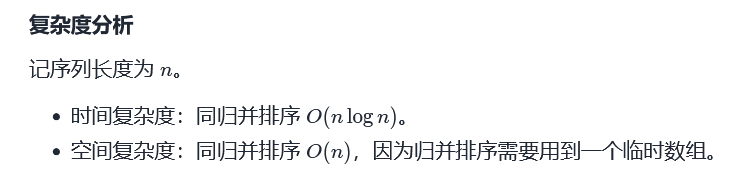

```java
//本体充分利用到了归并排序的思想，以及其稳定性思想
class Solution {
    public int reversePairs(int[] nums) {
        if(nums == null || nums.length < 2){
            return 0;
        }
        return solve(nums, 0, nums.length - 1);
    }
      private int solve(int[] nums, int left, int right){
        if(left == right){
            return 0;
        }
        int mid = left + ((right - left) >> 1);
        return solve(nums, left, mid) + solve(nums, mid + 1, right) + merge(nums, left, mid, right);
    }

    private int merge(int[] nums, int left, int mid, int right){
        int[] temp = new int[right - left + 1];
        int i = 0;
        int pointer1 = left;
        int pointer2 = mid + 1;
        int result = 0;
        while(pointer1 <= mid && pointer2 <= right){
            if(nums[pointer1] > nums[pointer2]){
                //归并排序稳定性的体现
                result += right - pointer2 + 1;
                temp[i++] = nums[pointer1++];;
            }else{
                temp[i++] = nums[pointer2++];
            }
        }

        while(pointer1 <= mid){
            temp[i++] = nums[pointer1++];
        }

        while(pointer2 <= right){
            temp[i++] = nums[pointer2++];
        }

        for(i = 0; i < temp.length; i++){
            nums[i + left] = temp[i];
        }
        
        return result;
    }
}
```

#### [148. 排序链表](https://leetcode-cn.com/problems/sort-list/)


```JAVA
/**
 * Definition for singly-linked list.
 * public class ListNode {
 *     int val;
 *     ListNode next;
 *     ListNode() {}
 *     ListNode(int val) { this.val = val; }
 *     ListNode(int val, ListNode next) { this.val = val; this.next = next; }
 * }
 */
//自顶向下，空间复杂度为O(n)
class Solution {
    public ListNode sortList(ListNode head) {
        if(head == null || head.next == null){
            return head;
        }

        ListNode slow = head;
        ListNode fast = head.next;
        while(fast != null && fast.next != null){
            fast = fast.next.next;
            slow = slow.next;
        }
        ListNode temp = slow.next;
        slow.next = null;

        ListNode head1 = sortList(head);
        ListNode head2 = sortList(temp);

        ListNode merged = merge(head1, head2);
        return merged;
    }
    private ListNode merge(ListNode head1, ListNode head2){
        ListNode dummy = new ListNode(0);
        ListNode pointer1 = head1;
        ListNode pointer2 = head2;
        ListNode curr = dummy;
        while(pointer1 != null && pointer2 != null){
            if(pointer1.val < pointer2.val){
                curr.next = pointer1;
                pointer1 = pointer1.next;
            }else{
                curr.next = pointer2;
                pointer2 = pointer2.next;
            }
            curr = curr.next;
        }
        curr.next = pointer1 == null ? pointer2 : pointer1;
        return dummy.next;
    }
}
```


## 5.快速排序

```java
    private static Random random = new Random();
    private static void quickSort(int[] arr, int start, int end){
        if(end <= start){
            return;
        }
        int partitionIndex = partition(arr, start, end);
        quickSort(arr, start, partitionIndex - 1);
        quickSort(arr, partitionIndex + 1, end);
    }

    private static int partition(int[] arr, int start, int end) {
        int pivotIndex = random.nextInt(end - start + 1) + start;
        int mark = start;
        int pivot = arr[pivotIndex];
        swap(arr, start, pivotIndex);
        for(int i = start; i <= end; i++){
            if(arr[i] < pivot){
                mark++;
                swap(arr, i, mark);
            }
        }
        swap(arr, start, mark);
        return mark;
    }


    private static void swap(int[] arr, int i, int j){
        int temp = arr[i];
        arr[i] = arr[j];
        arr[j] = temp;
    }

    public static void main(String[] args) {
        int[] arr1 = AlgorithmUtil.generateRandomArray(10000,1000);
        int[] arr2 = AlgorithmUtil.copyArray(arr1);
        Arrays.sort(arr1);
        quickSort(arr2,0,arr2.length-1);
        System.out.println(AlgorithmUtil.isEqual(arr1, arr2));
    }
```

### [215. 数组中的第K个最大元素](https://leetcode-cn.com/problems/kth-largest-element-in-an-array/)


## 6.堆排序

```java
    public static void heapSort(int[] arr){
        if(arr == null || arr.length < 2){
            return;
        }
        
        //构造堆，如果数是一个一个给的，可以用这个
        /*
        for(int i = 0; i < arr.length; i++){
            upper(arr, i);
        }
        */
        
        //构造堆更好的写法，如果直接给一个矩阵，可以用这个
        for(int i = arr.length / 2; i >= 0; i--){
            down(arr, i, arr.length - 1);
        }
        
        int end = arr.length - 1;
        //交换
        swap(arr, 0, end);
        while (end > 0){
            end--;
            //调整
            down(arr, 0, end);
            swap(arr, 0, end);
        }
    }

    //向上调整
    public static void upper(int[] arr, int index){
        while (index > 0 && arr[index] > arr[(index - 1) / 2] ){
            swap(arr, index, (index - 1) / 2);
            index = (index - 1) / 2;
        }
    }

    //向下调整
    public static void down(int[] arr, int index, int end){
        int leftIndex = (index * 2) + 1;
        while (leftIndex <= end){
            int largestIndex =  leftIndex;
            if(leftIndex + 1 <= end && arr[leftIndex] < arr[leftIndex + 1]){
                largestIndex = leftIndex + 1;
            }
            if(arr[index] < arr[largestIndex]){
                swap(arr, index, largestIndex);
            }else{
                break;
            }
            index = largestIndex;
            leftIndex = (index * 2) + 1;
        }
    }

    public static void swap(int[] arr, int i, int j){
        int temp = arr[i];
        arr[i] = arr[j];
        arr[j] = temp;
    }

    public static void main(String[] args) {
        int[] arr1 = AlgorithmUtil.generateRandomArray(10000,1000);
        int[] arr2 = AlgorithmUtil.copyArray(arr1);
        Arrays.sort(arr1);
        heapSort(arr2);
        System.out.println(AlgorithmUtil.isEqual(arr1, arr2));
    }
```

## 7.剩下三个懒得写

# 数组

## 二分查找

### [704. 二分查找](https://leetcode-cn.com/problems/binary-search)

```java
/*
target在[left, right) 区间内的写法
*/
class Solution {
    public int search(int[] nums, int target) {
        int left = 0, right = nums.length;
        while(left < right){
            int mid = ((right - left) >> 1)+ left;
            if(nums[mid] < target){
                left = mid + 1;
            }else if(nums[mid] > target){
                right = mid;
            }else{
                return mid;
            }
        }
        return -1;
    }
}


/*
target在[left, right] 区间内的写法
*/
class Solution {
    public int search(int[] nums, int target) {
        int left = 0, right = nums.length - 1;
        while(left <= right){
            int mid = ((right - left) >> 1)+ left;
            if(nums[mid] < target){
                left = mid + 1;
            }else if(nums[mid] > target){
                right = mid - 1;
            }else{
                return mid;
            }
        }
        return -1;
    }
}
```

### [69. x 的平方根 ](https://leetcode-cn.com/problems/sqrtx/)

```java
class Solution {
    public int mySqrt(int x) {
        int right = x;
        int result = 0;
        while(left <= right){
            int mid = ((right - left) >> 1) + left;
            if((long) mid * mid > x){
                right = mid - 1;
            }else{
                left = mid + 1;
            }
        }
        return right;
    }
}
```

### [153. 寻找旋转排序数组中的最小值](https://leetcode-cn.com/problems/find-minimum-in-rotated-sorted-array/)

```java
class Solution {
    public int findMin(int[] nums) {
        int left = 0;
        int right = nums.length - 1;
        while(left < right){
            int mid = ((right - left) >> 1) + left;
            if(nums[mid] < nums[right]){
                right = mid;
            }else{
                left = mid + 1;
            }
        }
        return nums[left];
    }
}

```


#### [33. 搜索旋转排序数组](https://leetcode-cn.com/problems/search-in-rotated-sorted-array/)

### [162. 寻找峰值](https://leetcode-cn.com/problems/find-peak-element/)


```java
class Solution {
    public int findPeakElement(int[] nums) {
        int left = 0;
        int right = nums.length - 1;

        while(left < right){
            int mid = ((right - left) >> 1) + left;
            if(nums[mid] > nums[mid + 1]){
                right = mid;
            }else{
                left = mid + 1;
            }
        }
        return left;  
    }
}
```


## 双指针

#### [88. 合并两个有序数组](https://leetcode-cn.com/problems/merge-sorted-array/)

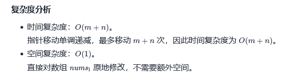

```JAVA
class Solution {
    public void merge(int[] nums1, int m, int[] nums2, int n) {
        int pointer1 = m - 1;
        int pointer2 = n - 1;

        while(pointer1 >= 0 && pointer2 >= 0){
            if(nums1[pointer1] > nums2[pointer2]){
                nums1[pointer1 + pointer2 + 1] = nums1[pointer1];
                pointer1--; 
            }else{
                nums1[pointer1 + pointer2 + 1] = nums2[pointer2];
                pointer2--;
            }
        }

        while(pointer2 >= 0){
            nums1[pointer2] = nums2[pointer2];
            pointer2--;
        }

    }
}
```

 


#### [15. 三数之和](https://leetcode-cn.com/problems/3sum/)

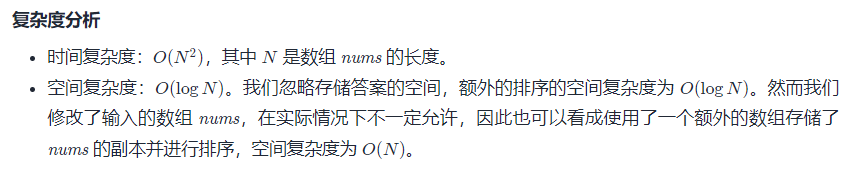

```java
class Solution {
    public List<List<Integer>> threeSum(int[] nums) {
        List<List<Integer>> result = new ArrayList<>();
        if(nums == null || nums.length < 3){
            return result;
        }
        Arrays.sort(nums);
        for(int i = 0; i < nums.length; i++){
            if(nums[i] > 0){
                return result;
            }
            if(i > 0 && nums[i] == nums[i-1]){
                continue;
            }
            int left = i + 1;
            int right = nums.length - 1;
            int target = 0 - nums[i];
            while(left < right){
                if(nums[left] + nums[right] < target){
                    left++;
                }else if(nums[left] + nums[right] > target){
                    right--;
                }else{
                    result.add(Arrays.asList(nums[i], nums[left], nums[right]));
                    while(left < right && nums[left] == nums[left + 1]){
                        left++;
                    }
                    while(left < right && nums[right] == nums[right - 1]){
                        right--;
                    }
                    left++;
                    right--;
                }
            }
        }
            return result;
    }
}
```

#### [18. 四数之和](https://leetcode-cn.com/problems/4sum/)

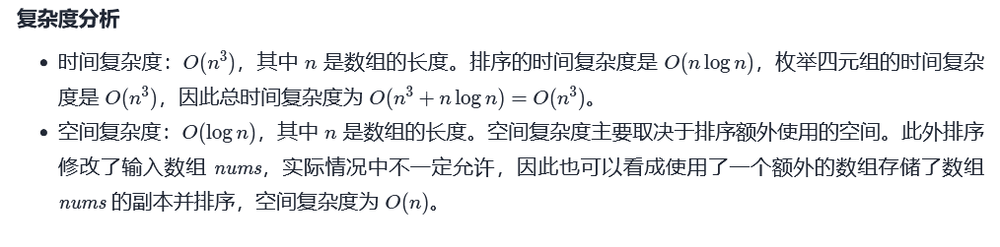

```java
//注意整形溢出
class Solution {
    public List<List<Integer>> fourSum(int[] nums, int target) {
        List<List<Integer>> result = new ArrayList<>();
        if(nums == null || nums.length < 4){
            return result;
        }
        Arrays.sort(nums);
        for(int i = 0; i < nums.length - 3; i++){
			//剪枝：接下来的数之和大于目标数，则不用继续判断之后的数了
            if((long)nums[i] + nums[i + 1] + nums[i + 2] + nums[i + 3] > target){
                return result;
            }
            //重复则跳过
            if(i > 0 && nums[i] == nums[i - 1]){
                continue;
            }
            //剪枝：如果第一个数加上最大的三个数还是小于目标数，说明要将第一个数变大
            if ((long) nums[i] + nums[nums.length - 3] + nums[nums.length - 2] + nums[nums.length - 1] < target) {
                continue;
            }


            for(int j = i + 1; j < nums.length - 2; j++){
                //剪枝：接下来的数之和大于目标数，则不用继续判断之后的数了
                if((long)nums[j] + nums[j + 1] + nums[j + 2]> target - nums[i]){
                    break;
                }
                //重复则跳过
                if(j > i + 1 && nums[j] == nums[j - 1]){
                    continue;
                }
                //剪枝：如果第一个（已知）和第二个数 加上最大的二个数还是小于目标数，说明要将第二个数变大
                if ((long) nums[j] + nums[nums.length - 2] + nums[nums.length - 1] < target - nums[i]) {
                    continue;
                }
                //下面与三数之和一样
                int left = j + 1;
                int right = nums.length - 1;
                while(left < right){ 
                    long sum =  nums[i] + nums[j] + nums[left] + nums[right];
                    if(sum < target){
                        left++;
                    }else if(sum > target){
                        right--;
                    }else{
                        result.add(Arrays.asList(nums[i], nums[j], nums[left], nums[right]));
                        while(left < right && nums[left] == nums[left + 1]){
                            left++;
                        }
                        while(left < right && nums[right] == nums[right - 1]){
                            right--;
                        }
                        left++;
                        right--;
                    }
                }
            }
        }
        return result;
    }
}
```


#### [11. 盛最多水的容器](https://leetcode-cn.com/problems/container-with-most-water/)

```java
//S(i,j)=min(h[i],h[j])×(j−i)
//1.若向内 移动短板 ，水槽的短板 min(h[i],h[j]  可能变大，因此下个水槽的面积 可能增大 。
//2.若向内 移动长板 ，水槽的短板 min(h[i],h[j]) 不变或变小，因此下个水槽的面积 一定变小 。
//时间复杂度：O(N)  空间复杂度：O(1)
class Solution {
    public int maxArea(int[] height) {
        int left = 0, right = height.length - 1, ans = 0;
        boolean flag = true;
        while(left <= right){
            if(height[left] <= height[right]){
                ans = Math.max(ans, height[left] * (right - left));
                left++;
            }else{
                ans = Math.max(ans, height[right] * (right - left));
                right--;
            }
        }
        return ans;
    }
}
```


#### [611. 有效三角形的个数](https://leetcode-cn.com/problems/valid-triangle-number/)

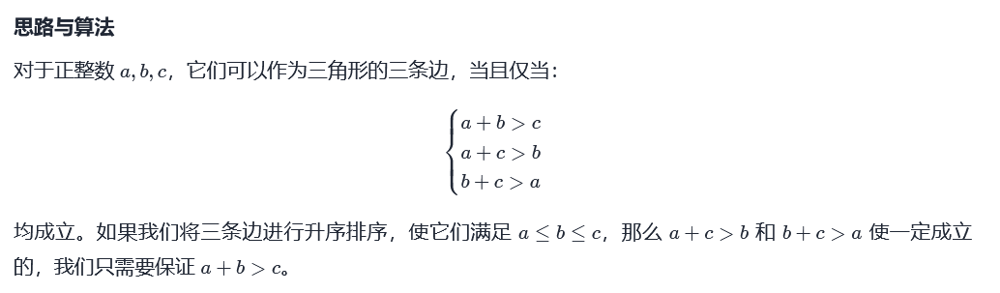

```java
//然后固定最长边，使用双指针法
//空间复杂度:O(N^2),时间复杂度:O(1)
class Solution {
    public int triangleNumber(int[] nums) {
        if(nums == null || nums.length < 3){
            return 0;
        }
        int result = 0;
        Arrays.sort(nums);
        for(int i = nums.length - 1; i >= 0; i--){
            int start = 0, end = i - 1;
            while(start < end){
                if(nums[i] < nums[start] + nums[end]){
                    result += end - start;
                    end--;
                }else{
                    start++;
                }    
            }
        }
        return result;
    }
}
```

#### [4. 寻找两个正序数组的中位数](https://leetcode-cn.com/problems/median-of-two-sorted-arrays/)

```java
class Solution {
    public double findMedianSortedArrays(int[] nums1, int[] nums2) {
        int sum = nums1.length + nums2.length;
        int pointer1 = 0;
        int pointer2 = 0;
        int leftNum = 0;
        int rightNum = 0;

        for(int i = 0; i <= sum / 2; i++){
            leftNum = rightNum;
            if(pointer1 <= nums1.length - 1 && (pointer2 > nums2.length - 1 || nums1[pointer1] < nums2[pointer2])){
                rightNum = nums1[pointer1];
                pointer1++;
            }else{
                rightNum =  nums2[pointer2];
                pointer2++;
            }
        }

        if(sum % 2 == 1){
            return rightNum;
        }else{
            return (double)((rightNum + leftNum) / 2.0);
        }

    }
}
```


## 利用哈希表

### 不使用额外空间

#### [剑指 Offer 03. 数组中重复的数字](https://leetcode-cn.com/problems/shu-zu-zhong-zhong-fu-de-shu-zi-lcof/)

```java
//使用哈希表查重
//空间复杂度:O(N),时间复杂度:O(N)
class Solution {
    public int findRepeatNumber(int[] nums) {
        Set<Integer> dic = new HashSet<>();
        for(int num : nums) {
            if(dic.contains(num)) return num;
            dic.add(num);
        }
        return -1;
    }
}
//使用原地哈希表查重
//空间复杂度:O(N),时间复杂度:O(1)
class Solution {
    public int findRepeatNumber(int[] nums) {
        int i = 0;
        while(i < nums.length){
            if(nums[i] == i){
                i++;
                continue;
            }
            if(nums[nums[i]] == nums[i]){
                return nums[i];
            }
            int temp = nums[i];
            nums[i] = nums[temp];
            nums[temp] = temp;
        }
        return -1;
    }
} 
```

#### [448. 找到所有数组中消失的数字](https://leetcode-cn.com/problems/find-all-numbers-disappeared-in-an-array/)

```java
//题目要求空间复杂度达到O(1)
//使用原地哈希表查重
class Solution {
    public List<Integer> findDisappearedNumbers(int[] nums) {    
        for(int i = 0; i < nums.length; i++){
            while(nums[i] != nums[nums[i] - 1]){
                int temp = nums[nums[i] - 1];
                nums[nums[i] - 1] = nums[i] ;
                nums[i] = temp; 
            }
        }
        List<Integer> result = new ArrayList<>();
        for(int i = 0; i < nums.length; i++){
            if(nums[i] != i + 1){
                result.add(i + 1);
            }
        }
        return result;
    }
}


//题目要求空间复杂度达到O(1)
//使用原地哈希表查重
/*
对于第 i 个数字 nums[i]，我们位置 (nums[i] - 1) % n 的位置增加 n，这样不会覆盖原数组，因为 (nums[i] - 1) % n = (nums[i] - 1 + n) % n，这样如果最后遍历完数组，nums[i] 小于等于 n，就是数组中中消失的数字。
*/

class Solution {
    public List<Integer> findDisappearedNumbers(int[] nums) { 
        int n = nums.length;   
        for(int i = 0; i < n; i++){
            int x = (nums[i] - 1) % n;
            nums[x] += n;
        }
        List<Integer> result = new ArrayList<>();
        for(int i = 0; i < n; i++){
            if(nums[i] <= n){
                result.add(i + 1);
            }
        }
        return result;
    }
}
```

#### [41. 缺失的第一个正数](https://leetcode-cn.com/problems/first-missing-positive/)

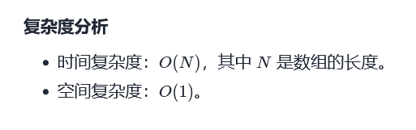

```java
//题目要求空间复杂度达到O(1)
//使用原地哈希表查重
class Solution {
    public int firstMissingPositive(int[] nums) {
        int length = nums.length;
        for(int i = 0; i < nums.length; i++){
            while(nums[i] <= nums.length && nums[i] > 0 && nums[i] != nums[nums[i] - 1]){
                int temp = nums[nums[i] - 1];
                nums[nums[i] - 1] = nums[i];
                nums[i] = temp;
            }
        }
        int result = 0;
        for(int i = 0; i < nums.length; i++){
            if(nums[i] != i + 1){
                return i + 1;
            }
        }
        return nums.length + 1;
    }
}
```

### 使用额外空间

#### [128. 最长连续序列](https://leetcode-cn.com/problems/longest-consecutive-sequence/)

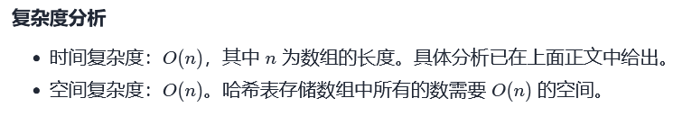

```java
class Solution {
    public int longestConsecutive(int[] nums) {
        Set<Integer> set = new HashSet<>();
        int ans = 0;
        for(int i = 0; i < nums.length; i++){
            set.add(nums[i]);
        }
        for(int num : set){
            int currMax = 0;
            if(!set.contains(num - 1)){
                while(set.contains(num)){
                    currMax++;
                    num++;
                }
            }
            ans = Math.max(currMax, ans);
        }
        return ans;
    }
}
```

#### [349. 两个数组的交集](https://leetcode-cn.com/problems/intersection-of-two-arrays/)

```java
class Solution {
    public int[] intersection(int[] nums1, int[] nums2) {
        Set<Integer> set = new HashSet<>();
        Set<Integer> result = new HashSet<>();
        for(int i = 0; i < nums1.length; i++){
            set.add(nums1[i]);
        }
        for(int i = 0; i < nums2.length; i++){
            if(set.contains(nums2[i])){
                result.add(nums2[i]);
            }
        }
        int[] ans = new int[result.size()];
        int i = 0;
        for(int e : result){
            ans[i] = e;
            i++;
        }
        return ans;
        
    }
}
```


# 字符串

## 双指针


```java
class Solution {
    public String reverseWords(String s) {
        if(s == null || s.length() == 0){
            return s;
        }
        StringBuilder builder = trim(s);
        reverse(builder, 0, builder.length() - 1);
        reverseSingle(builder);
        return builder.toString();
    }


     

    public StringBuilder trim (String s){
        int left = 0;
        int right = s.length() - 1;
        while(left <= right && s.charAt(left) == ' '){
            left++;
        }

        while(left <= right && s.charAt(right) == ' '){
            right--;
        }
        StringBuilder builder = new StringBuilder();
        while(left <= right){
            char c = s.charAt(left);
            if(c != ' '){
                builder.append(c);
            }else if(builder.charAt(builder.length() - 1) != ' '){
                builder.append(c);
            }
            left++;
        }
        return builder;
    }

    public void reverse(StringBuilder builder, int left, int right){
        while(left < right){
            char temp = builder.charAt(left);
            builder.setCharAt(left, builder.charAt(right));
            builder.setCharAt(right, temp);
            left++;
            right--;
        }
    }

    public void reverseSingle(StringBuilder builder){
        int left = 0, right = 0;
        int length = builder.length();
        while(right < length){
            while(right < length && builder.charAt(right) != ' '){
                right++;
            }
            reverse(builder, left, right - 1);
            left = right + 1;
            right++;
        }
    }
}

```


## KMP算法

```java
    public static void main(String[] args) {
        String target = "aabaabaafa";
        String template = "aabaaf";
        System.out.println(Arrays.toString(getNext(template)));
        System.out.println("匹配结果：" + strStr(target, template));
    }

	//求模式串的next数组
    public static int[] getNext(String template){
        int length = template.length();
        int next[] = new int[length];
        /*i为后缀末尾，从[1] - [length - 1]
          j为前缀末尾，从[0] - [length - 2]*/
        int j = 0;
        for(int i = 1; i < length; i++){
            /*前后缀不相同时，需要一直回退*/
            while(j > 0 && template.charAt(i) != template.charAt(j)){
                j = next[j - 1];
            }
            /*前后缀相同时，j++*/
            if(template.charAt(i) == template.charAt(j)){
                j++;
            }
            /*更新next[i]*/
            next[i] = j;
        }
        return next;
    }

	//匹配函数
    public static int strStr(String target, String template){
        if(template.length() == 0){
            return 0;
        }
        int[] next = getNext(template);
        int j = 0;
        for(int i = 0; i < target.length(); i++){
            /*如果当前模式串索引为j的字符 与 文本串索引为i的字符不匹配， 注意：j = 0 时不匹配，下面的代码都不执行，j不动，i++
            j指针应该移动到next[j-1]的地方，重新进行匹配*/
            while (j > 0 && target.charAt(i) != template.charAt(j)){
                j = next[j - 1];
            }
            /*如果匹配，j指针后移*/
            if(target.charAt(i) == template.charAt(j)){
                j++;
            }
            if(j == template.length()){
                return i - template.length() + 1;
            }
        }
        return -1;
    }
```

## Manacher算法

### [5. 最长回文子串](https://leetcode-cn.com/problems/longest-palindromic-substring/)


```java
//中心扩散算法


//Manacher算法基于动态规划和中心扩散算法
/*
amr_lenth[]:回文串的臂长
right：当前最靠右回文串的右边界
center：当前右边界最靠右回文串的中心
i：当前遍历的字符下标 
mirror：当前遍历的字符下标根据center对称的下标 

分类讨论：
当i<=right:
	1. if ((right - i) > arm_length[mirror]))  arm_length[i] = arm_length[mirror]
	2. if ((right - i) < arm_length[mirror]))  arm_length[i] = right - i
	3. if ((right - i) == arm_length[mirror])) arm_length[i] = expand(s, i - arm_length[i], i + arm_length[i])
当i>right时：
	arm_length[i] = expand(s, i, i)

*/
class Solution {
    public String longestPalindrome(String s) {
        if(s == null || s.length() <= 1){
            return s;
        }

        //处理后的String
        StringBuilder tempS = new StringBuilder("#");
        for(int i = 0; i < s.length(); i++){
            tempS.append(s.charAt(i));
            tempS.append("#");
        }
        s = tempS.toString();

        //结果字符串的起始和终止结点[start, end]
        int start = 0;
        int end = 0;
        //记录臂长数组,在这里臂长不包含自己：aba臂长为1
        int[] arm_length = new int[s.length()];
        //right 和 center初始为-1
        int right = -1, center = -1; 

        for(int i = 0; i < s.length(); i++){
            //以当前下标字符为中心扩散出去的回文臂长。
            int curr_arm = 0;   
            if(i <= right){
                //i<=right 三种情况的简短代码，也可以用if
                int mirror = 2 * center - i;
                //根据Math.min(arm_length[mirror], right - i)，先得到一次curr_arm
                curr_arm = Math.min(arm_length[mirror], right - i);
                //不管怎么样都扩一次，反正第一种和第二种情况都会break，第三种情况会继续中心扩散
                curr_arm = expand(s, i - curr_arm, i + curr_arm);
            }else{
                //i在right外面，直接中心扩散
                curr_arm = expand(s, i, i);
            }

            //为当前下标的臂长赋值
            arm_length[i] = curr_arm;

            //更新最右边界和其对应的center
            if(i + curr_arm > right){
                center = i;
                right = i + curr_arm;
            }

            //更新答案的start和end下标
            if(2 * curr_arm + 1 > end - start){
                end = i + curr_arm;
                start =  i - curr_arm ;
            }
        }

        //返回结果
        StringBuffer ans = new StringBuffer();
        for (int i = start; i <= end; i++) {
            if (s.charAt(i) != '#') {
                ans.append(s.charAt(i));
            }
        }
        return ans.toString();
    }

    //中心扩散函数，返回臂长，注意：[left, right]
    private int expand(String s, int left, int right){
        while(left >= 0 && right < s.length() && s.charAt(left) == s.charAt(right)){
            right++;
            left--;
        }
        //因为[left, right]，所以别忘了-2
        return (right - left - 2) / 2;
    }
}


```


## [14. 最长公共前缀](https://leetcode-cn.com/problems/longest-common-prefix/)

```java
class Solution {
    public String longestCommonPrefix(String[] strs) {
        if(strs == null || strs.length == 0){
            return "";
        }
        //将第一个字符串作为基准
        //循环的设计需要仔细思考
        for(int i = 0; i < strs[0].length(); i++){
            char temp = strs[0].charAt(i);
            for(int j = 1; j < strs.length; j++){
                if(i >= strs[j].length() || strs[j].charAt(i) != temp){
                    return strs[0].substring(0, i);
                }
            }
        }
        return strs[0];
    }
}
```


#### 

# 队列

## 双端队列

### [239. 滑动窗口最大值](https://leetcode-cn.com/problems/sliding-window-maximum/)

```java
class Solution {
    //1.当滑动窗口右边的元素 > 队尾元素, 循环剔除队尾元素
    //2.加入滑动窗口右边的元素至队尾
    //3.确认队头元素在滑动窗口中，不在则循环剔除队头元素
    //4.将队头元素添入答案中
    public int[] maxSlidingWindow(int[] nums, int k) {
        //从队头到队尾，元素（对应的下标）依次递减的双端队列
        Deque<Integer> queue = new LinkedList<>();
        
        for(int i = 0; i < k; i++){
            while(!queue.isEmpty() && nums[i] > nums[queue.peekLast()]){
                queue.pollLast();
            }
            queue.offerLast(i);
        }

        int[] ans = new int[nums.length - k + 1];
        ans[0] = nums[queue.peekFirst()];
        for(int i = k; i < nums.length; i++){
            while(!queue.isEmpty() && nums[i] > nums[queue.peekLast()]){
                queue.pollLast();
            }
            queue.offerLast(i);
            while(!queue.isEmpty() && queue.peekFirst() < i - k + 1){
                queue.pollFirst();
            }
            ans[i - k + 1] = nums[queue.peekFirst()];
        }
        return ans;
    }
}
```


## 优先队列（本质是堆）

### [239. 滑动窗口最大值](https://leetcode-cn.com/problems/sliding-window-maximum/)

```java
class Solution {
    public int[] maxSlidingWindow(int[] nums, int k) {
        //维护一个大顶堆，元素为 [下标，num[下标]]
        PriorityQueue<int[]> queue = new PriorityQueue<>((o1, o2) -> {
            return o1[0] != o2[0] ? o2[1] - o1[1] : o2[0] - o1[0];
        });

        int[] ans = new int[nums.length - k + 1];
        for(int i = 0; i < k; i++){
            queue.offer(new int[]{i, nums[i]});
        }
        ans[0] = nums[queue.peek()[0]];

        for(int i = k; i < nums.length; i++){
            queue.offer(new int[]{i, nums[i]});
            //看看堆顶元素是否在滑动窗口中，不在则循环剔除堆顶元素
            while(queue.peek()[0] < i - k + 1){
                queue.poll();
            }
            ans[i - k + 1] = nums[queue.peek()[0]];
        }
        return ans;
    }
}
```


# 链表


## [206. 反转链表](https://leetcode-cn.com/problems/reverse-linked-list/)

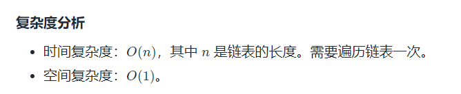

```java
/**
 * Definition for singly-linked list.
 * public class ListNode {
 *     int val;
 *     ListNode next;
 *     ListNode() {}
 *     ListNode(int val) { this.val = val; }
 *     ListNode(int val, ListNode next) { this.val = val; this.next = next; }
 * }
 */
class Solution {
    public ListNode reverseList(ListNode head) {
        ListNode prev = null;
        ListNode curr = head;
        while(curr != null){
            ListNode next = curr.next;
            curr.next = prev;
            prev = curr;
            curr = next;
        }
        return prev;
    }
}
```


## 1.利用指针

#### [141. 环形链表](https://leetcode-cn.com/problems/linked-list-cycle/)

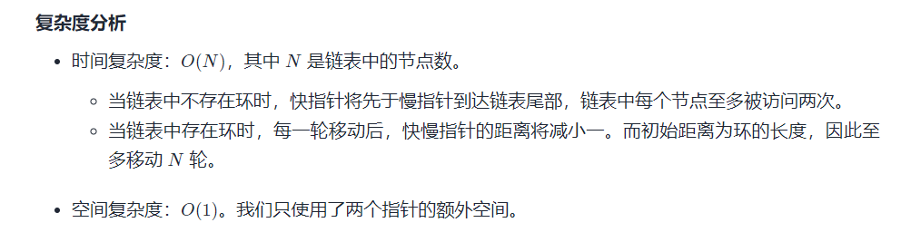

```java
/**
 * Definition for singly-linked list.
 * class ListNode {
 *     int val;
 *     ListNode next;
 *     ListNode(int x) {
 *         val = x;
 *         next = null;
 *     }
 * }
 */
 
public class Solution {
    public boolean hasCycle(ListNode head) {
        ListNode slow = head;
        ListNode fast = head;
        while(fast != null && fast.next != null){
            slow = slow.next;
            fast = fast.next.next;
            if(slow == fast){
                return true;
            }
        }
        return false;
    }
}
```

#### [142. 环形链表 II](https://leetcode-cn.com/problems/linked-list-cycle-ii/)

```java
/**
 * Definition for singly-linked list.
 * class ListNode {
 *     int val;
 *     ListNode next;
 *     ListNode(int x) {
 *         val = x;
 *         next = null;
 *     }
 * }
 */
//空间复杂度：0（n） 时间复杂度：O（1）
public class Solution {
    public ListNode detectCycle(ListNode head) {
        ListNode slow = head;
        ListNode fast = head;
        while(fast != null && fast.next != null){
            slow = slow.next;
            fast = fast.next.next;
            if(slow == fast){
                fast = head;
                while(fast != slow){
                    fast = fast.next;
                    slow = slow.next;
                }
                return slow;
            }
        }
        return null;
    }
}
```


#### [206. 反转链表](https://leetcode-cn.com/problems/reverse-linked-list/)

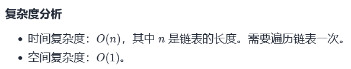

```java
/**
 * Definition for singly-linked list.
 * public class ListNode {
 *     int val;
 *     ListNode next;
 *     ListNode() {}
 *     ListNode(int val) { this.val = val; }
 *     ListNode(int val, ListNode next) { this.val = val; this.next = next; }
 * }
 */
class Solution {
    public ListNode reverseList(ListNode head) {
        ListNode prev = null;
        ListNode curr = head;
        while(curr != null){
            ListNode next = curr.next;
            curr.next = prev;
            prev = curr;
            curr = next;
        }
        return prev;
    }
}

```

#### [92. 反转链表 II](https://leetcode-cn.com/problems/reverse-linked-list-ii/)

```java
/**
 * Definition for singly-linked list.
 * public class ListNode {
 *     int val;
 *     ListNode next;
 *     ListNode() {}
 *     ListNode(int val) { this.val = val; }
 *     ListNode(int val, ListNode next) { this.val = val; this.next = next; }
 * }
 */
class Solution {
    public ListNode reverseBetween(ListNode head, int left, int right) {
        ListNode hair = new ListNode(0, head);
        ListNode prevNode = hair;
        ListNode nextNode = hair;
        ListNode leftNode = hair;
        ListNode rightNode = hair;

        for(int i = 0; i < left; i++){
            if(i != 0){
                prevNode = prevNode.next;
            }
            leftNode = leftNode.next;
        }

        for(int i = 0; i < right; i++){
            nextNode = nextNode.next;   
            rightNode = rightNode.next;
        }
        nextNode = nextNode.next;

        prevNode.next = null;
        rightNode.next = null;

        ListNode[] reverse = reverse(leftNode);
        prevNode.next = reverse[0];
        reverse[1].next = nextNode;

        return hair.next;
        
    }

    private ListNode[] reverse(ListNode node){
        ListNode prev = null;
        ListNode tail = node;
        while(node != null){
            ListNode next = node.next;
            node.next = prev;
            prev = node;
            node = next;
        }
        return new ListNode[]{prev, tail};
    }
}
```

#### [25. K 个一组翻转链表](https://leetcode-cn.com/problems/reverse-nodes-in-k-group/)

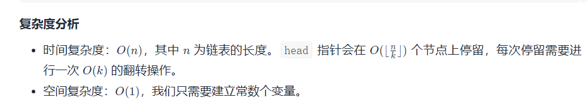

```java
/**
 * Definition for singly-linked list.
 * public class ListNode {
 *     int val;
 *     ListNode next;
 *     ListNode() {}
 *     ListNode(int val) { this.val = val; }
 *     ListNode(int val, ListNode next) { this.val = val; this.next = next; }
 * }
 */
class Solution {
    public ListNode reverseKGroup(ListNode head, int k) {
        ListNode hair = new ListNode(0);
        hair.next = head;
        ListNode currTail = hair;
        ListNode currHead = hair.next;
        
        while(true){
            ListNode prev = currTail;
            for(int i = 0; i < k; i++){
                 currTail = currTail.next;
                if(currTail != null){
                    continue;
                }else{
                    return hair.next;
                }
            }
            ListNode next = currTail.next;
            prev.next = null;
            currTail.next = null;
            ListNode[] result = reverse(currHead);
            ListNode tempHead = result[0];
            ListNode tempTail = result[1];
            prev.next = tempHead;
            tempTail.next = next;
            currHead = next;
            currTail = tempTail;
        }
        
    }
    //返回反转后的头，尾
    public ListNode[] reverse(ListNode head){
        ListNode tail = head;
        ListNode prev = null;
        ListNode curr = head;
        while(curr != null){
            ListNode next = curr.next;
            curr.next = prev;
            prev = curr;
            curr = next;
        }
        return new ListNode[]{prev, tail};
    }
}
```


#### [21. 合并两个有序链表](https://leetcode-cn.com/problems/merge-two-sorted-lists/)

```java
/**
 * Definition for singly-linked list.
 * public class ListNode {
 *     int val;
 *     ListNode next;
 *     ListNode() {}
 *     ListNode(int val) { this.val = val; }
 *     ListNode(int val, ListNode next) { this.val = val; this.next = next; }
 * }
 */
class Solution {
    public ListNode mergeTwoLists(ListNode list1, ListNode list2) {

        ListNode head = new ListNode(-1);
        ListNode prev = head;
        while(list1 != null && list2 != null){
            if(list1.val < list2.val){
                prev.next = list1;
                list1 = list1.next;
            }else{
                prev.next = list2;
                list2 = list2.next;
            }
            prev = prev.next;
        }
        prev.next = list1 == null ? list2 : list1;
        return head.next;
    }
}

```

#### [23. 合并K个升序链表](https://leetcode-cn.com/problems/merge-k-sorted-lists/)

```java
/**
 * Definition for singly-linked list.
 * public class ListNode {
 *     int val;
 *     ListNode next;
 *     ListNode() {}
 *     ListNode(int val) { this.val = val; }
 *     ListNode(int val, ListNode next) { this.val = val; this.next = next; }
 * }
 */
class Solution {
    public ListNode mergeKLists(ListNode[] lists) {
        if(lists == null || lists.length == 0 ){
            return null;
        }
        int left = 0;
        int right = lists.length - 1;
        return sovle(lists, left, right);
    }

    private ListNode sovle(ListNode[] lists, int left, int right){
        if(left == right){
            return lists[left];
        }
        int mid = ((right - left) >> 1) + left;
        ListNode node1 = sovle(lists, left, mid);
        ListNode node2  = sovle(lists, mid + 1, right);

        return merge(node1, node2);
    }

    private ListNode merge(ListNode node1, ListNode node2){
        ListNode head = new ListNode(0);
        
        ListNode prev = head;
        while(node1 != null && node2 != null){
            if(node1.val < node2.val){
                prev.next = node1;
                node1 = node1.next;
            }else{
                prev.next = node2;
                node2 = node2.next;
            }
            prev = prev.next;
        }
        prev.next = node1 == null ? node2 : node1;
        return head.next;

    }
}
```

#### [剑指 Offer 22. 链表中倒数第k个节点](https://leetcode-cn.com/problems/lian-biao-zhong-dao-shu-di-kge-jie-dian-lcof/)

```java
/**
 * Definition for singly-linked list.
 * public class ListNode {
 *     int val;
 *     ListNode next;
 *     ListNode(int x) { val = x; }
 * }
 */
class Solution {
    public ListNode getKthFromEnd(ListNode head, int k) {
    
        ListNode fast = head;
        for(int i = 0; i < k; i++){
            fast = fast.next;
        }
        ListNode slow = head;
        while(fast != null){
            slow = slow.next;
            fast = fast.next;
        }
        return slow;
    }
}
```

#### [19. 删除链表的倒数第 N 个结点](https://leetcode-cn.com/problems/remove-nth-node-from-end-of-list/)

```java
/**
 * Definition for singly-linked list.
 * public class ListNode {
 *     int val;
 *     ListNode next;
 *     ListNode() {}
 *     ListNode(int val) { this.val = val; }
 *     ListNode(int val, ListNode next) { this.val = val; this.next = next; }
 * }
 */
class Solution {
    public ListNode removeNthFromEnd(ListNode head, int n) {
        ListNode dummy = new ListNode(0, head);
        ListNode fast = dummy;

        for(int i = 0; i < n; i++){
            fast = fast.next;
        }

        ListNode prev = dummy;
        ListNode slow = head;
        while(fast.next != null){
            fast = fast.next;
            slow = slow.next;
            prev = prev.next;
        }
        
        prev.next = slow.next;
        return dummy.next;
    }
}
```

#### [82. 删除排序链表中的重复元素 II](https://leetcode-cn.com/problems/remove-duplicates-from-sorted-list-ii/)

```java
/**
 * Definition for singly-linked list.
 * public class ListNode {
 *     int val;
 *     ListNode next;
 *     ListNode() {}
 *     ListNode(int val) { this.val = val; }
 *     ListNode(int val, ListNode next) { this.val = val; this.next = next; }
 * }
 */
class Solution {
    public ListNode deleteDuplicates(ListNode head) {
        if(head == null || head.next == null){
            return head;
        }
        ListNode dummy = new ListNode(0, head);
        ListNode prev = dummy;
        ListNode curr = head;
        ListNode next = head.next;
        while(next != null){
            if(curr.val == next.val){
                while(curr.val == next.val){
                    next = next.next;
                    if(next == null){
                        prev.next = null;
                        return dummy.next;
                    }
                }
                curr = next;
                next = next.next;
                prev.next = curr;
            }else{
                prev = prev.next;
                curr = curr.next;
                next = next.next;
            }
        }
        return dummy.next;

    }
}
```

#### [2. 两数相加](https://leetcode-cn.com/problems/add-two-numbers/)


```java
/**
 * Definition for singly-linked list.
 * public class ListNode {
 *     int val;
 *     ListNode next;
 *     ListNode() {}
 *     ListNode(int val) { this.val = val; }
 *     ListNode(int val, ListNode next) { this.val = val; this.next = next; }
 * }
 */
class Solution {
    public ListNode addTwoNumbers(ListNode l1, ListNode l2) {
        ListNode dummy = new ListNode(0);
        ListNode tempNode = dummy;
        ListNode p1 = l1;
        ListNode p2 = l2;
        int sum = 0;
        int curr = 0;
        int odd = 0;
        while(p1 != null || p2 != null){
            int v1 = 0;
            int v2 = 0;
            if(p1 != null){
                v1 = p1.val;
                p1 = p1.next;
            }
            if(p2 != null){
                v2 = p2.val;
                p2 = p2.next;
            }
            sum = v1 + v2 + odd;
            curr = sum % 10;
            odd = sum / 10;
            tempNode.next = new ListNode(curr);
            tempNode = tempNode.next;  
        }
        if(odd != 0){
            tempNode.next = new ListNode(odd);
        }
        return dummy.next;
    }
}
```


#### [160. 相交链表](https://leetcode-cn.com/problems/intersection-of-two-linked-lists/)

```
public class Solution {
    public ListNode getIntersectionNode(ListNode headA, ListNode headB) {
        ListNode pointA = headA;
        ListNode pointB = headB;
        int lengthA = 0;
        int lengthB = 0;
        while(pointA != null){
            pointA = pointA.next;
            lengthA++;
        }

        while(pointB != null){
            pointB = pointB.next;
            lengthB++;
        }
        if(pointB != pointA){
            return null;
        }

        pointA = headA;
        pointB = headB;
        if(lengthA > lengthB){
            int move = lengthA - lengthB;
            for(int i = 0; i < move; i++){
                pointA = pointA.next;
            }
        }else{
            int move = lengthB - lengthA;
            for(int i = 0; i < move; i++){
                pointB = pointB.next;
            }
        }

        while(pointA != null){
            if(pointA == pointB){
                return pointA;
            }
            pointA = pointA.next;
            pointB = pointB.next;
        }
        return null;
    }
}
```

#### [143. 重排链表](https://leetcode-cn.com/problems/reorder-list/)

```java
/**
 * Definition for singly-linked list.
 * public class ListNode {
 *     int val;
 *     ListNode next;
 *     ListNode() {}
 *     ListNode(int val) { this.val = val; }
 *     ListNode(int val, ListNode next) { this.val = val; this.next = next; }
 * }
 */
class Solution {
    public void reorderList(ListNode head) {
        ListNode mid = getMid(head);
        ListNode head2 = reverse(mid.next);
        mid.next = null;
        merge(head, head2);
    }

    private void merge(ListNode head1, ListNode head2){
        ListNode l1 = head1;
        ListNode l2 = head2;
        while(head1 != null && head2 != null){
            l1 = head1.next;
            l2 = head2.next;
            
            head1.next = head2;
            head2.next = l1;

            head1 = l1;
            head2 = l2;
        }
    }

    private ListNode reverse(ListNode head){
        ListNode prev = null;
        while(head != null){
            ListNode next = head.next;
            head.next = prev;
            prev = head;
            head= next;
        }
        return prev;
    }

    private ListNode getMid(ListNode head){
        ListNode slow = head;
        ListNode fast = head;
        while(fast != null && fast.next != null){
            slow = slow.next;
            fast = fast.next.next;
        }
        return slow;
    }
}
```


#### [234. 回文链表](https://leetcode-cn.com/problems/palindrome-linked-list/)

- **笔试（笔试就是要求写的快，过了就行）写法，利用数组：**

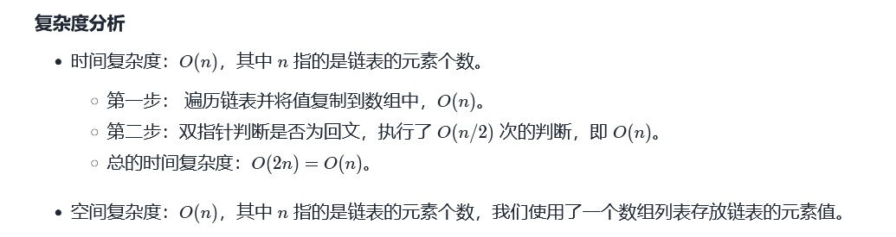

- **面试写法，双指针**

  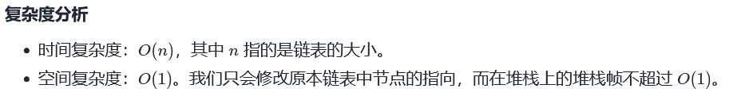

```java
/**
 * Definition for singly-linked list.
 * public class ListNode {
 *     int val;
 *     ListNode next;
 *     ListNode() {}
 *     ListNode(int val) { this.val = val; }
 *     ListNode(int val, ListNode next) { this.val = val; this.next = next; }
 * }
 */
 //笔试写法，时间复杂度O（n），空间复杂度O（n）
class Solution {
    public boolean isPalindrome(ListNode head) {
        List<Integer> list = new ArrayList<>();
        ListNode temp = head;
        while(temp != null){
            list.add(temp.val);
            temp = temp.next;
        }
        int front = 0;
        int end = list.size() - 1;
        while(front < end){
            if(list.get(front) != list.get(end)){
                return false;
            }
            front++;
            end--;
        }
        return true;
    }
}
```


#### [面试题 02.04. 分割链表](https://leetcode-cn.com/problems/partition-list-lcci/)

```java
/**
 * Definition for singly-linked list.
 * public class ListNode {
 *     int val;
 *     ListNode next;
 *     ListNode(int x) { val = x; }
 * }
 */
 
 //笔试写法 时间复杂度:O(n)  空间复杂度：O(N)
class Solution {
    public ListNode partition(ListNode head, int x) {
        List<ListNode> list = new ArrayList<>();
        ListNode temp = head;
        while(temp != null){
            list.add(temp);
            temp = temp.next;
        }
        int mark = 0;
        for(int i = 0; i < list.size(); i++){
            if(list.get(i).val < x){
                temp = list.get(i);
                list.set(i, list.get(mark));
                list.set(mark, temp);
                mark++;
            }
        }
        ListNode result = new ListNode();
        temp = result;
        for(int i = 0; i < list.size(); i++){
            temp.next = list.get(i);
            temp = temp.next;
        }
        temp.next = null;
        return result.next;
    }
}
```

#### [24. 两两交换链表中的节点](https://leetcode-cn.com/problems/swap-nodes-in-pairs/)


## 2.链表的深拷贝


#### [138. 复制带随机指针的链表](https://leetcode-cn.com/problems/copy-list-with-random-pointer/)

```java
/*
// Definition for a Node.
class Node {
    int val;
    Node next;
    Node random;

    public Node(int val) {
        this.val = val;
        this.next = null;
        this.random = null;
    }
}
*/
//原节点后面跟一个深拷贝的结点
class Solution {
    public Node copyRandomList(Node head) {
        if(head == null){
            return null;
        }

        Node curr = head;
        while(curr != null){
            Node temp = new Node(curr.val);
            temp.next = curr.next;
            curr.next = temp;
            curr = temp.next;
        }

        Node front = head.next;
        Node behind = head;
        while(front != null){
            if(behind.random == null){
                front.random = null;
            }else{
                front.random = behind.random.next;
            }
            //指针后移
            front = front.next;
            behind = behind.next;
            if(front == null){
                break;
            }
            front = front.next;
            behind = behind.next;
        }

        Node dummyNode = new Node(0);
        curr = dummyNode;
        behind = head;
        front = head.next;
        while(front != null){
            //还原原链表
            behind.next = behind.next.next;
            behind = behind.next;

            //处理深拷贝的链表
            curr.next = front;
            if(front.next == null){
                break;
            }
            front.next = front.next.next;
            curr = front;
            front = front.next;
        }

        return dummyNode.next;
    }
}
```


# 栈

## [394. 字符串解码](https://leetcode-cn.com/problems/decode-string/)


```java
class Solution {
    public String decodeString(String s) {
        Deque<StringBuilder> stack = new LinkedList<>();
        Deque<Integer> times = new LinkedList<>();
        StringBuilder result = new StringBuilder();
        char[] charArray = s.toCharArray();
        int tempTime = 0;

        for(char c : charArray){
            if(Character.isDigit(c)){
                tempTime = tempTime * 10 + c - '0';
            }else if(Character.isLetter(c)){
                result.append(c);
            }else if(c == '['){
                stack.push(result);
                times.push(tempTime);
                tempTime = 0;
                result = new StringBuilder();
            }else{
                int time = times.pop();
                StringBuilder topStr = stack.pop();
                StringBuilder temp = new StringBuilder();
                for(int i = 0; i < time; i++){
                    temp.append(result);
                }
                result = topStr.append(temp);
            }
        }
        return result.toString();
        
    }
}
```


## [20. 有效的括号](https://leetcode-cn.com/problems/valid-parentheses/)

```java
class Solution {
    public boolean isValid(String s) {
        char[] arrary = s.toCharArray();
        Deque<Character> stack = new LinkedList<>();
        for(int i = 0; i < arrary.length; i++){
            if(arrary[i] == '('){
                stack.push(arrary[i]);
            }else if(arrary[i] == '['){
                stack.push(arrary[i]);
            }else if(arrary[i] == '{'){
                stack.push(arrary[i]);
            }

            if(arrary[i] == ')'){
                if(stack.size() == 0 || stack.peek() != '('){
                    return false;
                }
                stack.pop();  
            }else if(arrary[i] == ']'){
                if(stack.size() == 0 || stack.peek() != '['){
                    return false;
                }  
                stack.pop();               
            }else if(arrary[i] == '}'){
                if(stack.size() == 0 || stack.peek() != '{'){
                    return false;
                }
                stack.pop();  
            }
        }
        if(stack.size() != 0){
            return false;
        }else{
            return true;
        }
    }
}
```


## 单调栈

单调栈：从栈底到栈顶所代表的元素是单调递增或递减的栈

应用：**通常是一维数组，要寻找任一个元素的右边或者左边第一个比自己大或者小的元素的位置，此时我们就要想到可以用单调栈了**。

#### [739. 每日温度](https://leetcode-cn.com/problems/daily-temperatures/)

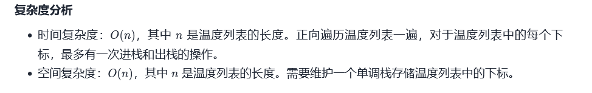

```java
class Solution {
    public int[] dailyTemperatures(int[] temperatures) {
        //单调栈，需要维持一个从栈底到栈顶所代表的元素由大到小的单调栈
        //这里单调栈记录数组下标
        Deque<Integer> stack = new LinkedList<>();
        int result[] = new int[temperatures.length];

    
        for(int i = 0; i < temperatures.length; i++){
            while(stack.size() != 0 && temperatures[i] > temperatures[stack.peek()]){
                int index = stack.pop();
                result[index] = i - index;
            }
            stack.push(i);
        }

        //最后栈里剩下的下标右边没有比它大的
        while(!stack.isEmpty()){
            result[stack.pop()] = 0;
        }
        return result;
    }
}
```


# 树

## 深度遍历优先DFS

### 前序遍历

#### [剑指 Offer 26. 树的子结构](https://leetcode-cn.com/problems/shu-de-zi-jie-gou-lcof/)

```java
/**
 * Definition for a binary tree node.
 * public class TreeNode {
 *     int val;
 *     TreeNode left;
 *     TreeNode right;
 *     TreeNode(int x) { val = x; }
 * }
 */
class Solution {
    public boolean isSubStructure(TreeNode A, TreeNode B) {
        if(A == null || B == null){
            return false;
        }
        return solve(A, B) || isSubStructure(A.left, B) || isSubStructure(A.right, B);
    }

    public boolean solve(TreeNode A, TreeNode B){
        if(B == null){
            return true;
        }
        if(A == null || A.val != B.val){
            return false;
        }
        return solve(A.left, B.left) && solve(A.right, B.right);
    }
}
```

#### [199. 二叉树的右视图](https://leetcode-cn.com/problems/binary-tree-right-side-view/)

```java
/**
 * Definition for a binary tree node.
 * public class TreeNode {
 *     int val;
 *     TreeNode left;
 *     TreeNode right;
 *     TreeNode() {}
 *     TreeNode(int val) { this.val = val; }
 *     TreeNode(int val, TreeNode left, TreeNode right) {
 *         this.val = val;
 *         this.left = left;
 *         this.right = right;
 *     }
 * }
 */
class Solution {
    List<Integer> result = new ArrayList<>();

    public List<Integer> rightSideView(TreeNode root) {
        solve(root, 0);
        return result;
    }
    private void solve(TreeNode root, int depth){
        if(root == null){
            return;
        }
        if(depth == result.size()){
            result.add(root.val);     
        }
        depth++;
        solve(root.right, depth);
        solve(root.left, depth);
    }
}
```


### 中序遍历

#### [94. 二叉树的中序遍历](https://leetcode-cn.com/problems/binary-tree-inorder-traversal/)

```java
/**
 * Definition for a binary tree node.
 * public class TreeNode {
 *     int val;
 *     TreeNode left;
 *     TreeNode right;
 *     TreeNode() {}
 *     TreeNode(int val) { this.val = val; }
 *     TreeNode(int val, TreeNode left, TreeNode right) {
 *         this.val = val;
 *         this.left = left;
 *         this.right = right;
 *     }
 * }
 */
 //递归版本
class Solution {
    public List<Integer> inorderTraversal(TreeNode root) {
        List<Integer> result = new ArrayList<>();
        solve(root, result);
        return result;
    }
    private void solve(TreeNode root, List<Integer> result){
        if(root == null){
            return;
        }
        solve(root.left, result);
        result.add(root.val);
        solve(root.right, result);
        return;
    }
}

//非递归版本
class Solution {
    public List<Integer> inorderTraversal(TreeNode root) {
        List<Integer> result = new ArrayList<>();
        Deque<TreeNode> stack = new LinkedList<>();
        while(root != null || !stack.isEmpty()){
            while(root != null){
                stack.push(root);
                root = root.left;
            }
            root = stack.pop();
            result.add(root.val);
            root = root.right;
        }
        return result;
    }
}
```

#### [98. 验证二叉搜索树](https://leetcode-cn.com/problems/validate-binary-search-tree/)

```java
/**
 * Definition for a binary tree node.
 * public class TreeNode {
 *     int val;
 *     TreeNode left;
 *     TreeNode right;
 *     TreeNode() {}
 *     TreeNode(int val) { this.val = val; }
 *     TreeNode(int val, TreeNode left, TreeNode right) {
 *         this.val = val;
 *         this.left = left;
 *         this.right = right;
 *     }
 * }
 */
//中序遍历递归方式  
class Solution {
    private long preValue = Long.MIN_VALUE;
    public boolean isValidBST(TreeNode root) {    
        if(root == null){
            return true;
        }
        boolean leftResult = isValidBST(root.left);
        if(!leftResult){
            return false;
        }
        if(root.val <= preValue){
            return false;
        }else{
            preValue = root.val;
        }
        return isValidBST(root.right);
    }
}

//中序遍历非递归方式
class Solution {
    public boolean isValidBST(TreeNode root) {   
        long prev = Long.MIN_VALUE; 
        Deque<TreeNode> stack = new LinkedList<>();
        while(root != null || !stack.isEmpty()){
            while(root != null){
                stack.push(root);
                root = root.left;
            }
            root = stack.pop();
            if(prev < root.val){
                prev = root.val;
            }else{
                return false;
            }
            root = root.right;
        }
        return true;
    }
}
```


### 后序遍历

#### [236. 二叉树的最近公共祖先](https://leetcode-cn.com/problems/lowest-common-ancestor-of-a-binary-tree/)

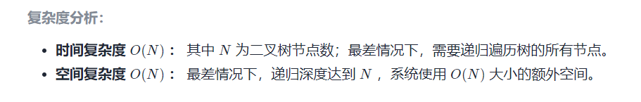

```java
//时间复杂度：O(n)，空间复杂度：O(n)
class Solution {
    
    public TreeNode lowestCommonAsncestor(TreeNode root, TreeNode p, TreeNode q) {
        if(root == null){
            return null;
        }
        TreeNode left = lowestCommonAncestor(root.left, p, q);
        TreeNode right = lowestCommonAncestor(root.right, p, q);
        if(root == p || root == q){
            return root;
        }else if(left != null && right == null){
            return left;
        }else if(left == null && right != null){
            return right;
        }else if(left != null && right != null){
            return root;
        }
        return null;
    }
}
```


#### [124. 二叉树中的最大路径和](https://leetcode-cn.com/problems/binary-tree-maximum-path-sum/)

```JAVA
/**
 * Definition for a binary tree node.
 * public class TreeNode {
 *     int val;
 *     TreeNode left;
 *     TreeNode right;
 *     TreeNode() {}
 *     TreeNode(int val) { this.val = val; }
 *     TreeNode(int val, TreeNode left, TreeNode right) {
 *         this.val = val;
 *         this.left = left;
 *         this.right = right;
 *     }
 * }
 */
class Solution {
    int result = Integer.MIN_VALUE;
    public int maxPathSum(TreeNode root) {
        sovle(root);
        return result;
    }
    public int sovle(TreeNode root){
        if(root == null){
            return 0;
        }

        int leftMax = sovle(root.left);
        int rightMax = sovle(root.right);
        int returnValue = Math.max(Math.max(leftMax + root.val, rightMax + root.val), root.val);
        result = Math.max(Math.max(leftMax + rightMax + root.val, returnValue), result);
        
        return returnValue;
    }
}
```


## 广度优先遍历

### [102. 二叉树的层序遍历](https://leetcode-cn.com/problems/binary-tree-level-order-traversal/)

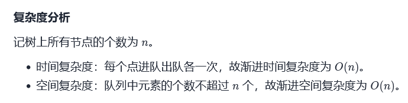

```java
/**
 * Definition for a binary tree node.
 * public class TreeNode {
 *     int val;
 *     TreeNode left;
 *     TreeNode right;
 *     TreeNode() {}
 *     TreeNode(int val) { this.val = val; }
 *     TreeNode(int val, TreeNode left, TreeNode right) {
 *         this.val = val;
 *         this.left = left;
 *         this.right = right;
 *     }
 * }
 */
class Solution {
    public List<List<Integer>> levelOrder(TreeNode root) {
        List<List<Integer>> result = new ArrayList<>();
        if(root == null){
            return result;
        }
        Deque<TreeNode> queue = new LinkedList<>();
        queue.offer(root);
        while(!queue.isEmpty()){
            int size = queue.size();
            List<Integer> layerResult = new ArrayList<>();
            for(int i = 0; i < size; i++){
                TreeNode curr = queue.poll();
                layerResult.add(curr.val);
                if(curr.left != null){
                    queue.offer(curr.left);
                }
                if(curr.right != null){
                    queue.offer(curr.right);
                }
            }
            result.add(layerResult);
        }
        return result;
    }
}
```


### 是否为完全二叉树

```java
     public  class TreeNode {
          int val;
          TreeNode left;
          TreeNode right;
          TreeNode(int x) { val = x; }
      }

    public  boolean isCompleteBinaryTree(TreeNode root){
        if(root == null){
            return true;
        }
        Deque<TreeNode> queue = new LinkedList<>();
        queue.offer(root);
        boolean isLeaf = false;
        while (!queue.isEmpty()){
            TreeNode node = queue.poll();
            TreeNode left = node.left;
            TreeNode right = node.right;
            if(left == null && right != null){
                return false;
            }
            if(isLeaf && (left != null || right != null)){
                return false;
            }
            if(left != null){
                queue.offer(left);
            }
            if(right != null){
                queue.offer(right);
            }

            if(left == null || right == null){
                isLeaf = true;
            }
        }
        return true;
    }
```


### [662. 二叉树最大宽度](https://leetcode-cn.com/problems/maximum-width-of-binary-tree/)

```java
/**
 * Definition for a binary tree node.
 * public class TreeNode {
 *     int val;
 *     TreeNode left;
 *     TreeNode right;
 *     TreeNode() {}
 *     TreeNode(int val) { this.val = val; }
 *     TreeNode(int val, TreeNode left, TreeNode right) {
 *         this.val = val;
 *         this.left = left;
 *         this.right = right;
 *     }
 * }
 */
class Solution {
    public int widthOfBinaryTree(TreeNode root) {
        if(root == null){
            return 0;
        }
        Deque<MyNode> queue = new LinkedList<>();
        queue.offer(new MyNode(root, 0, 0));
        int result = 0;
        int currLevel = 0;
        int currLevelStart = 0;
        while(!queue.isEmpty()){
            MyNode currNode = queue.poll();
            TreeNode currTreeNode = currNode.node;
            if(currLevel != currNode.depth){
                currLevelStart = currNode.position;
                currLevel = currNode.depth;
            }
            result = Math.max(result, currNode.position - currLevelStart + 1);
            if(currTreeNode.left != null){
                queue.offer(new MyNode(currTreeNode.left, currNode.position * 2,  currNode.depth + 1));
            }

            if(currTreeNode.right != null){
                queue.offer(new MyNode(currTreeNode.right, currNode.position * 2 + 1,  currNode.depth + 1));
            }
        }
        return  result;
    }

    class MyNode{
        TreeNode node;
        int position;
        int depth;
        public MyNode(TreeNode node, int position, int depth){
            this.node = node;
            this.position = position;
            this.depth = depth;
        }
    }
}
```


### [103. 二叉树的锯齿形层序遍历](https://leetcode-cn.com/problems/binary-tree-zigzag-level-order-traversal/)

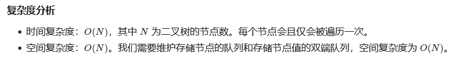

```java
/**
 * Definition for a binary tree node.
 * public class TreeNode {
 *     int val;
 *     TreeNode left;
 *     TreeNode right;
 *     TreeNode() {}
 *     TreeNode(int val) { this.val = val; }
 *     TreeNode(int val, TreeNode left, TreeNode right) {
 *         this.val = val;
 *         this.left = left;
 *         this.right = right;
 *     }
 * }
 */
class Solution {
    public List<List<Integer>> zigzagLevelOrder(TreeNode root) {
        boolean flag = false;
        List<List<Integer>> result = new ArrayList<>();
        if(root == null){
            return result;
        }
        Deque<TreeNode> queue = new LinkedList<>();
        queue.addFirst(root);

        while(queue.size() != 0 && root != null){
            int layerSize = queue.size();
            Deque<Integer> layerResult = new LinkedList<>();
            for(int i = 0; i < layerSize; i++){
                TreeNode currNode = queue.poll();
                if(currNode.left != null){
                    queue.offer(currNode.left);
                }
                if(currNode.right != null){
                    queue.offer(currNode.right);
                }
                if(flag){
                    layerResult.addFirst(currNode.val);
                }else{
                    layerResult.addLast(currNode.val);
                }
            }
             flag = !flag;
            result.add(new ArrayList<>(layerResult));

        }
        return result;
        
    }
}
```


## 树型DP

很多后序遍历题目一种公式型写法和思路，适用于：汇集左右两颗子树的所有信息，并结合自己可以得到答案的题。

经验：看看头节点是否参与，要进行讨论和总和

### 验证满二叉树

```java
/**
 * Definition for a binary tree node.
 * public class TreeNode {
 *     int val;
 *     TreeNode left;
 *     TreeNode right;
 *     TreeNode() {}
 *     TreeNode(int val) { this.val = val; }
 *     TreeNode(int val, TreeNode left, TreeNode right) {
 *         this.val = val;
 *         this.left = left;
 *         this.right = right;
 *     }
 * }
 */
class Solution {
    public  boolean isFullTree(TreeNode root){
        Info result = solve(root);
        return ((1 << result.height) - 1) == result.nodes;
    }

    public  Info solve(TreeNode root){
        if(root == null){
            return new Info(0, 0);
        }
        Info leftResult = solve(root.left);
        Info rightResult = solve(root.right);
        int height = Math.max(leftResult.height, rightResult.height) + 1;
        int nodes = leftResult.nodes + rightResult.nodes + 1;
        return new Info(height, nodes);
    }

    public static class Info{
         public int height;
         public int nodes;
        public Info(int height, int nodes) {
            this.height = height;
            this.nodes = nodes;
        }
    }
    
}
```

### [98. 验证二叉搜索树](https://leetcode-cn.com/problems/validate-binary-search-tree/)

```java
/**
 * Definition for a binary tree node.
 * public class TreeNode {
 *     int val;
 *     TreeNode left;
 *     TreeNode right;
 *     TreeNode() {}
 *     TreeNode(int val) { this.val = val; }
 *     TreeNode(int val, TreeNode left, TreeNode right) {
 *         this.val = val;
 *         this.left = left;
 *         this.right = right;
 *     }
 * }
 */
class Solution {
 
    public boolean isValidBST(TreeNode root) {
        return solve(root).isValid;
    }

    public Info solve(TreeNode root){
        if(root == null){
            return null;
        }

        Info leftResult = solve(root.left);
        Info rightResult = solve(root.right);

        boolean isValid = true;
        int max = root.val;
        int min = root.val;
        if(leftResult != null){
            min = Math.min(min, leftResult.min);
            max = Math.max(max, leftResult.max);
            isValid = isValid && leftResult.isValid && leftResult.max < root.val;
        }

        if(rightResult != null){
            min = Math.min(min, rightResult.min);
            max = Math.max(max, rightResult.max);
            isValid = isValid && rightResult.isValid && rightResult.min > root.val;
        }

        return new Info(max, min, isValid);
    }


    class Info{
        int max;
        int min;
        boolean isValid;
        Info(int max, int min, boolean isValid){
            this.max = max;
            this.min = min;
            this.isValid = isValid;
        }
    }

}
```


### [110. 平衡二叉树](https://leetcode-cn.com/problems/balanced-binary-tree/)

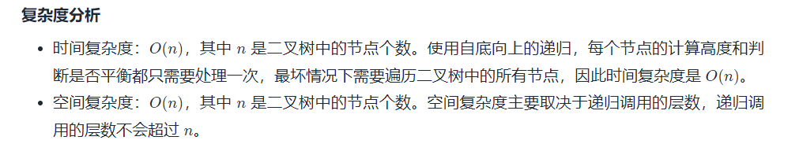

```java
/**
 * Definition for a binary tree node.
 * public class TreeNode {
 *     int val;
 *     TreeNode left;
 *     TreeNode right;
 *     TreeNode() {}
 *     TreeNode(int val) { this.val = val; }
 *     TreeNode(int val, TreeNode left, TreeNode right) {
 *         this.val = val;
 *         this.left = left;
 *         this.right = right;
 *     }
 * }
 */
class Solution {
    public boolean isBalanced(TreeNode root) {   
        return solve(root).isBalanced;
    }

    public ReturnType solve(TreeNode root){
        if(root == null){
            return new ReturnType(true, 0);
        }
        ReturnType leftResult = solve(root.left);
        ReturnType rightResult = solve(root.right);

        //当前节点高度
        int height = Math.max(leftResult.height, rightResult.height) + 1;
        boolean isBalanced = leftResult.isBalanced && rightResult.isBalanced && (Math.abs(leftResult.height - rightResult.height) < 2);
        return new ReturnType(isBalanced, height);

    }
    
    class ReturnType{
        boolean isBalanced;
        int height;
        
        ReturnType(boolean isBalanced, int height){
            this.isBalanced = isBalanced;
            this.height = height;
        }
    }
}
```


### 


## 构造二叉树

### [105. 从前序与中序遍历序列构造二叉树](https://leetcode-cn.com/problems/construct-binary-tree-from-preorder-and-inorder-traversal/)


```java
/**
 * Definition for a binary tree node.
 * public class TreeNode {
 *     int val;
 *     TreeNode left;
 *     TreeNode right;
 *     TreeNode() {}
 *     TreeNode(int val) { this.val = val; }
 *     TreeNode(int val, TreeNode left, TreeNode right) {
 *         this.val = val;
 *         this.left = left;
 *         this.right = right;
 *     }
 * }
 */
class Solution {
    public TreeNode buildTree(int[] preorder, int[] inorder) {
        Map<Integer, Integer> map = new HashMap<>();
        for(int i = 0; i < inorder.length; i++){
            map.put(inorder[i], i);
        }
        return solve(preorder, inorder, 0, preorder.length - 1, 0, inorder.length - 1, map);
    }
//使用前序遍历进行构造，注意区间左闭右闭
    private TreeNode solve(int[] preorder, int[] inorder, int preStart, int preEnd, int inStart, int inEnd, Map<Integer, Integer> map){
        if(preStart > preEnd){
            return null;
        }
        TreeNode root = new TreeNode(preorder[preStart]);
        int indexOfInorder = map.get(root.val);
        int leftCount = indexOfInorder - inStart;
        int rightCount = inEnd - indexOfInorder;
        root.left = solve(preorder, inorder, preStart + 1, preStart + leftCount, indexOfInorder - leftCount, indexOfInorder - 1, map);
        root.right = solve(preorder, inorder, preStart + 1 + leftCount, preEnd, indexOfInorder + 1, indexOfInorder + rightCount, map);
        return root;
    }
}
```

### [106. 从中序与后序遍历序列构造二叉树](https://leetcode-cn.com/problems/construct-binary-tree-from-inorder-and-postorder-traversal/)

```java
/**
 * Definition for a binary tree node.
 * public class TreeNode {
 *     int val;
 *     TreeNode left;
 *     TreeNode right;
 *     TreeNode() {}
 *     TreeNode(int val) { this.val = val; }
 *     TreeNode(int val, TreeNode left, TreeNode right) {
 *         this.val = val;
 *         this.left = left;
 *         this.right = right;
 *     }
 * }
 */
class Solution {
    public TreeNode buildTree(int[] inorder, int[] postorder) {
        Map<Integer, Integer> map = new HashMap<>();
        
        for(int i = 0; i < inorder.length; i++){
            map.put(inorder[i], i);
        }
        return solve(inorder, postorder, 0, inorder.length - 1, 0, postorder.length - 1, map);
    }
//使用前序遍历进行构造，注意区间左闭右闭
    private TreeNode solve(int[] inorder, int[] postorder, int inStart, int inEnd, int postStart, int postEnd, Map<Integer, Integer> map){
        if(inStart > inEnd){
            return null;
        }
        TreeNode root = new TreeNode(postorder[postEnd]);
        int indexOfInorder = map.get(postorder[postEnd]);
        int leftCount = indexOfInorder - inStart;
        int rightCount = inEnd - indexOfInorder;
        root.left = solve(inorder, postorder, inStart, indexOfInorder - 1, postStart, postStart + leftCount - 1, map);
        root.right = solve(inorder, postorder, indexOfInorder + 1, inEnd, postEnd - rightCount, postEnd - 1, map);
        return root;
    }
}
```

### [889. 根据前序和后序遍历构造二叉树](https://leetcode-cn.com/problems/construct-binary-tree-from-preorder-and-postorder-traversal/)

```java
/**
 * Definition for a binary tree node.
 * public class TreeNode {
 *     int val;
 *     TreeNode left;
 *     TreeNode right;
 *     TreeNode() {}
 *     TreeNode(int val) { this.val = val; }
 *     TreeNode(int val, TreeNode left, TreeNode right) {
 *         this.val = val;
 *         this.left = left;
 *         this.right = right;
 *     }
 * }
 */
class Solution {
    public TreeNode constructFromPrePost(int[] preorder, int[] postorder) {
        Map<Integer, Integer> map = new HashMap<>();
        for(int i = 0; i < postorder.length; i++){
            map.put(postorder[i], i);
        }
        return solve(preorder, postorder, 0, preorder.length - 1, 0, postorder.length, map);
    }

    private TreeNode solve(int[] preorder, int[] postorder, int preStart, int preEnd, int postStart, int postEnd, Map<Integer, Integer> map){
        if(preStart > preEnd){
            return null;
        }
        TreeNode root = new TreeNode(preorder[preStart]);
        if(preStart + 1 > preEnd){
            return root;
        }
        int indexOfPostorder = map.get(preorder[preStart + 1]);
        int leftCount = indexOfPostorder - postStart + 1;
        int rightCount = postEnd - 1 - indexOfPostorder;
        root.left = solve(preorder, postorder, preStart + 1, preStart + leftCount, postStart, indexOfPostorder, map);
        root.right = solve(preorder, postorder, preStart + leftCount + 1, preEnd, indexOfPostorder + 1, postEnd - 1, map);
        return root;
    }
}
```


### [剑指 Offer 37. 序列化二叉树](https://leetcode-cn.com/problems/xu-lie-hua-er-cha-shu-lcof/)

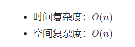

```java
/**
 * Definition for a binary tree node.
 * public class TreeNode {
 *     int val;
 *     TreeNode left;
 *     TreeNode right;
 *     TreeNode(int x) { val = x; }
 * }
 */

//前序法。 
public class Codec {
    private String result = new String();

    // Encodes a tree to a single string.
    public String serialize(TreeNode root) {
        serializeSolve(root);
        return result.toString();
    }

    public void serializeSolve(TreeNode root){
        if(root == null){
            result += "#,";
            return;
        }
        result = result + root.val + ",";
        serialize(root.left);
        serialize(root.right);
    }


    // Decodes your encoded data to tree.
    public TreeNode deserialize(String data) {
        String[] nodes = data.split(",");
        Deque<String> queue = new LinkedList<>();
        for(String node : nodes){
            queue.offer(node);
        }
        return deserializeSolve(queue);
    }

    public TreeNode deserializeSolve(Deque<String> queue){
        String curr = queue.poll();
        if("#".equals(curr)){
            return null;
        }
        TreeNode head = new TreeNode(Integer.valueOf(curr));
        head.left = deserializeSolve(queue);
        head.right = deserializeSolve(queue);
        return head;
    }

}

// Your Codec object will be instantiated and called as such:
// Codec codec = new Codec();
// codec.deserialize(codec.serialize(root));
```


## 二叉搜索树

### [700. 二叉搜索树中的搜索](https://leetcode-cn.com/problems/search-in-a-binary-search-tree/)

```java
/**
 * Definition for a binary tree node.
 * public class TreeNode {
 *     int val;
 *     TreeNode left;
 *     TreeNode right;
 *     TreeNode() {}
 *     TreeNode(int val) { this.val = val; }
 *     TreeNode(int val, TreeNode left, TreeNode right) {
 *         this.val = val;
 *         this.left = left;
 *         this.right = right;
 *     }
 * }
 */
class Solution {
    public TreeNode searchBST(TreeNode root, int val) {
        if(root == null || root.val == val){
            return root;
        }
        if(val > root.val){
            return searchBST(root.right, val);
        }else{
            return searchBST(root.left, val);
        }
    }
}
```

## 前缀树

### [208. 实现 Trie (前缀树)](https://leetcode-cn.com/problems/implement-trie-prefix-tree/)

```java
class Trie {
    //节点就是占位的，并且记录经过节点的次数，和以该节点为重点的次数
    class TrieNode{
        private int pass;
        private int end;
        private TrieNode[] nexts;

        public TrieNode(){
            this.pass = 0;
            this.end = 0;
            this.nexts = new TrieNode[26];
        }
    }

    private TrieNode root;

    public Trie() {
        root = new TrieNode();
    }
    
    public void insert(String word) {
        if(word == null || "".equals(word)){
            return;
        }
        char[] chs = word.toCharArray();
        TrieNode curr = this.root;
        root.pass++;
        int index = 0;
        for(int i = 0; i < chs.length; i++){
            index = chs[i] - 'a';
            if(curr.nexts[index] == null){
                curr.nexts[index] = new TrieNode();
            }
            curr = curr.nexts[index];
            curr.pass++; 
        }
        curr.end++;
    }
    
    public boolean search(String word) {
        if(word == null || "".equals(word)){
            return false;
        }
        char[] chs = word.toCharArray();
        TrieNode curr = this.root;
        int index = 0;
        for(int i = 0; i < chs.length; i++){
            index = chs[i] - 'a';
            if(curr.nexts[index] == null){
                return false;  
            }
            curr = curr.nexts[index];
        }
        if(curr.end != 0){
            return true;
        }
        return false;
        
    }
    
    public boolean startsWith(String prefix) {
        if(prefix == null || "".equals(prefix)){
            return false;
        }
        char[] chs = prefix.toCharArray();
        TrieNode curr = this.root;
        int index = 0;
        for(int i = 0; i < chs.length; i++){
            index = chs[i] - 'a';
            if(curr.nexts[index] == null){
                return false;  
            }
            curr = curr.nexts[index];
        }
        if(curr.pass != 0){
            return true;
        }
        return false;
    }

}

/**
 * Your Trie object will be instantiated and called as such:
 * Trie obj = new Trie();
 * obj.insert(word);
 * boolean param_2 = obj.search(word);
 * boolean param_3 = obj.startsWith(prefix);
 */
```

## 堆


#### [剑指 Offer 41. 数据流中的中位数](https://leetcode-cn.com/problems/shu-ju-liu-zhong-de-zhong-wei-shu-lcof/)

```java
class MedianFinder {

    private PriorityQueue<Integer> maxHeap;
    private PriorityQueue<Integer> minHeap;


    /** initialize your data structure here. */
    public MedianFinder() {
        maxHeap = new PriorityQueue<>((o1, o2) -> {
            return o2 - o1;
        });
        minHeap = new PriorityQueue<>((o1, o2) -> {
            return o1 - o2;
        });
    }
    
    public void addNum(int num) {
        //第一个数先进大根堆
        if(maxHeap.isEmpty()){
            maxHeap.offer(num);
            return;
        }
    
        //来一个数num，判断num是否<=大根堆的堆顶,是的话进入大根堆，否则，进入小根堆
        if(!maxHeap.isEmpty()){
            if(num <= maxHeap.peek()){
                maxHeap.offer(num);
            }else{
                minHeap.offer(num);
            }
        }

        //判断两个堆是否size >= 2 ，是的话 size大的poll一个数到size小的堆去
        if(maxHeap.size() >= minHeap.size() + 2){
            minHeap.offer(maxHeap.poll());
        }else if(minHeap.size() >= maxHeap.size() + 2){
            maxHeap.offer(minHeap.poll());
        }

    }
    
    public double findMedian() {
        if(!maxHeap.isEmpty() && !minHeap.isEmpty()){
            if(maxHeap.size() == minHeap.size()){
                //偶数：返回两个堆顶的元素/2.0
                return ((double)maxHeap.peek() + (double)minHeap.peek()) / 2.0;
            }else{
                //奇数：返回size较大的堆顶元素
                return maxHeap.size() > minHeap.size() ? maxHeap.peek() : minHeap.peek();
            }
        } 
        if(!maxHeap.isEmpty()){
            return maxHeap.peek();
        }
        return 0.0;      
    }

}

/**
 * Your MedianFinder object will be instantiated and called as such:
 * MedianFinder obj = new MedianFinder();
 * obj.addNum(num);
 * double param_2 = obj.findMedian();
 */
```


# 图

## 深度遍历优先（DFS）

### [797. 所有可能的路径](https://leetcode-cn.com/problems/all-paths-from-source-to-target/)

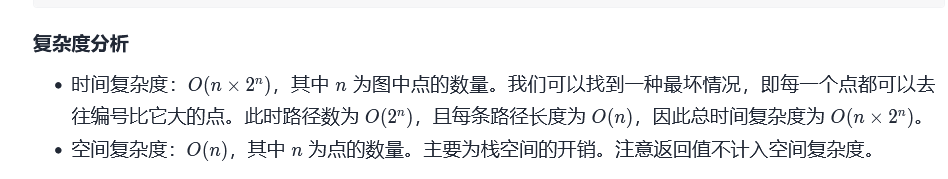

```java
//本题中的图为有向无环图，搜索过程中不会反复遍历同一个点，因此我们无需判断当前点是否遍历过。
class Solution {
    private List<List<Integer>> result = new ArrayList<>();
    private List<Integer> path = new ArrayList<>();
    public List<List<Integer>> allPathsSourceTarget(int[][] graph) {
        solve(graph, 0);
        return result;
    }

    private void solve(int[][] graph, int curr){
        path.add(curr);
        if(curr == graph.length - 1){
            result.add(new ArrayList<>(path));
            return;
        }

        for(int next : graph[curr]){
            solve(graph, next);
            path.remove(path.size() - 1);
        }
        return;
    }
}
```

### [200. 岛屿数量](https://leetcode-cn.com/problems/number-of-islands/)

```java
class Solution {
    public int numIslands(char[][] grid) {
        int result = 0;
        for(int i = 0; i < grid.length; i++){
            for(int j = 0; j < grid[0].length; j++){
                if(grid[i][j] == '1'){
                    result++;
                    solve(grid, i, j);
                }
            }
        }
        return result;
    }

    public void solve(char[][] grid, int i, int j){
        if(i < 0 || i >= grid.length || j < 0 || j >= grid[0].length || grid[i][j] == '0'){
            return;
        }
        grid[i][j] = '0';
        solve(grid, i + 1, j);
        solve(grid, i - 1, j);
        solve(grid, i, j + 1);
        solve(grid, i, j - 1);
    }
}
```

### [695. 岛屿的最大面积](https://leetcode-cn.com/problems/max-area-of-island/)

```java
class Solution {
    public int maxAreaOfIsland(int[][] grid) {
        int result = 0;
        for(int i = 0; i < grid.length; i++){
            for(int j = 0; j < grid[0].length; j++){
                if(grid[i][j] == 1){
                    int area = solve(grid, i, j);
                    result = Math.max(result, area);
                }
            }
        }
        return result;
    }

    private int solve(int[][] grid, int i, int j){
        if(i >= grid.length || i < 0 || j >= grid[0].length || j < 0 || grid[i][j] == 0){
            return 0;
        }
        grid[i][j] = 0;

        int top = solve(grid, i + 1, j);
        int bottom = solve(grid, i - 1, j);
        int right = solve(grid, i, j + 1);
        int left = solve(grid, i, j - 1);

        return top + bottom + right + left + 1;
    }
}
```


## 广度优先遍历（BFS）

### [797. 所有可能的路径](https://leetcode-cn.com/problems/all-paths-from-source-to-target/)


### [200. 岛屿数量](https://leetcode-cn.com/problems/number-of-islands/)

## 并查集

### 基于QuickUnion的按秩合并路径压缩的并查集

```java
    //记录各个节点的父结点，数组下标是node的position，数组元素为node的父节点position
    private int[] root;
    //记录根节点的高度，数组下标是root的position，数组元素是root的高度
    private int[] rank;

    public UnionFind(int size){
        this.root = new int[size];
        this.rank = new int[size];
        for (int i = 0; i < size; i++) {
            root[i] = i; // 初始化：每个node的root都是自己
            rank[i] = 1; // 初始化：每个root的高度都为1
        }
    }

    //按路径压缩的find函数,找到父节点后，将遍历过的所有元素的父节点都改成根节点
    public int find(int node){
        if(node == root[node]) {
            return node;
        }
        int rootPosition = find(root[node]);
        root[node] = rootPosition;

        return rootPosition;
    }

    //按秩的union函数
    public void union(int node1, int node2){
        int root1 = find(node1);
        int root2 = find(node2);
        if(root1 != root2){
            //node1的根节点高度更大，将node2的根节点合并入node1的根节点
            if(rank[root1] > rank[root2]){
                root[root2] = root1;
            }else if(rank[root1] < rank[root2]){
                root[root1] = root2;
            }else{
                //高度相同的时候，将node2的根节点合并入node1的根节点，node1的根节点高度+1
                root[root2] = root1;
                rank[root1] ++;
            }
        }
    }

    //判断两个节点是否连通
    public boolean connected(int node1, int node2) {
        return find(node1) == find(node2);
    }

    public static void main(String[] args) throws Exception {
        UnionFind uf = new UnionFind(10);
        // 1-2-5-6-7 3-8-9 4
        uf.union(1, 2);
        uf.union(2, 5);
        uf.union(5, 6);
        uf.union(6, 7);
        uf.union(3, 8);
        uf.union(8, 9);
        System.out.println(uf.connected(1, 5)); // true
        System.out.println(uf.connected(5, 7)); // true
        System.out.println(uf.connected(4, 9)); // false
        // 1-2-5-6-7 3-8-9-4
        uf.union(9, 4);
        System.out.println(uf.connected(4, 9)); // true
    }
```


## 最小生成树

### Kruskal 算法

```java
class Solution {
    public int minCostConnectPoints(int[][] points) {
        if(points == null || points.length < 1){
            return 0;
        }
        //利用优先队列将边根据边的权值从小大到大排序
        PriorityQueue<Edge> pq = new PriorityQueue<>((o1, o2) -> o1.weight - o2.weight);
        //利用并查集结构来快速合并结点，并验证结点是否连通
        UnionAndFind unionAndFind = new UnionAndFind(points.length);
        for(int i = 0; i < points.length; i++){
            for(int j = i + 1; j < points.length; j++){
                //构造边
                Edge edge = new Edge(i, j, Math.abs(points[i][0] - points[j][0]) + Math.abs(points[i][1] - points[j][1]));
                //加入优先队列，根据权值从小到大排列
                pq.offer(edge);
            }
        }
        //计算结果
        int result = 0;
        //只需要count条边即可生成最小生成树
        int count = points.length - 1;
        while(count > 0){
            Edge currEdge = pq.poll();
            if(!unionAndFind.isConnected(currEdge.start, currEdge.end)){
                unionAndFind.union(currEdge.start, currEdge.end);
                count--;
                result += currEdge.weight;
            }
        }
        return result;
    }


    class Edge{
        //边的起点
        public int start;
        //边的终点
        public int end;
        //边的权值
        public int weight;

        public Edge(int start, int end, int weight){
            this.start = start;
            this.end = end;
            this.weight = weight;
        }
    }

    class UnionAndFind{
        private int[] root;
        private int[] rank;
        
        public UnionAndFind(int size){
            this.root = new int[size];
            this.rank = new int[size];
            for(int i = 0; i < size; i++){
                root[i] = i;
                rank[i] = 1;
            }
        }

        public int find(int node){
            if(node == root[node]){
                return node;
            }
            int rootPosition = find(root[node]);
            root[node] = rootPosition;
            return rootPosition;
        }

        public void union(int node1, int node2){
            int root1 = find(node1);
            int root2 = find(node2);
            if(root1 != root2){
                int rank1 = rank[root1];
                int rank2 = rank[root2];
                if(rank1 > rank2){
                    root[root2] = root1;
                }else if(rank1 < rank2){
                    root[root1] = root2;
                }else{
                    root[root1] = root2;
                    rank[root2]++;
                }
            }
        }

        public boolean isConnected(int node1, int node2){
            return find(node1) == find(node2);
        }
    }
}
```

### Prim 算法


## 单源最短路径算法

### Dijkstra 算法

「Dijkstra 算法」针对的「图」的类型 **必须** 满足以下条件：

- 所有边的权重为非负数。

#### [743. 网络延迟时间](https://leetcode-cn.com/problems/network-delay-time/)

```java
class Solution {
    //防止distances[i] = Math.min(distances[minNode] + edges[minNode][i], distances[i]); 溢出
    private int INF = Integer.MAX_VALUE / 2;
    public int networkDelayTime(int[][] times, int n, int k) {
        
        //邻接表表示图
        int[][] edges = new int[n][n];
        //从k出发到对应节点的最小距离 （1点对应的数组下标为0）
        int[] distances = new int[n];
        //记录是否被访问过
        boolean[] isVisited = new boolean[n];

        //初始化邻接矩阵和distances数组
        for(int i = 0; i < n; i++){
            Arrays.fill(edges[i], INF);
            distances[i] = INF;
            isVisited[i] = false;
        }
        distances[k - 1] = 0;

        //构造图
        for(int i = 0; i < times.length; i++){
            int start = times[i][0] - 1;
            int end = times[i][1] - 1;
            edges[start][end] = times[i][2];
        }

        //从k点出发，开始查找
        int minNode = k - 1;
        while(minNode != INF){
            for(int i = 0; i < n; i++){
                //minNode和i连通并且i没有访问过，进行距离的更新
                if(edges[minNode][i] != INF && !isVisited[i]){
                    distances[i] = Math.min(distances[minNode] + edges[minNode][i], distances[i]);
                }
            }
            //标记一下该点已经被访问。
            isVisited[minNode] = true;
            //获得下一个没被访问过的distance值最小节点
            minNode= getMinNode(distances, isVisited);
        } 
        int result = -1;
        for(int i = 0; i < n; i++){
            //如果有distance值是INF，说明与起始点没有连通，return -1
            if(distances[i] == INF){
                return -1;
            }
            //否则找最大的
            result = Math.max(result, distances[i]);
        }
        return result;

    }

    //用遍历的方式找下一个distance最小且没被访问过的点
    private int getMinNode(int[] distances, boolean[] isVisited){
        int result = INF;
        int temp = INF;
        for(int i = 0; i < distances.length; i++){
            if(!isVisited[i] && distances[i] < temp){
                temp = distances[i];
                result = i;
            }
        }
        return result;
    }
}
```


## 拓扑排序值Kahn算法

可以解决是否有循环依赖，并且找到优先加载顺序的问题

### [207. 课程表](https://leetcode-cn.com/problems/course-schedule/)

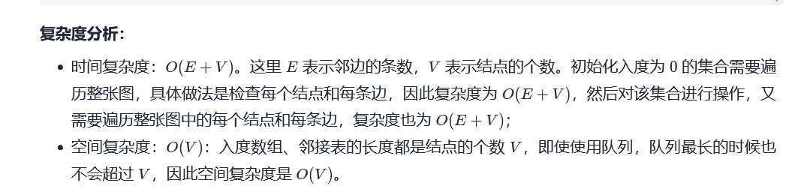

```java
class Solution {
    public boolean canFinish(int numCourses, int[][] prerequisites) {
        //记录每门课的入度，数组下标为课程序号，元素为入度
        int[] inDgree = new int[numCourses];
        //记录边，数组下标为出发节点序号，元素为目标节点序号
        List<List<Integer>> edges = new ArrayList<>();
        //利用队列进行广度遍历
        Deque<Integer> queue = new LinkedList<>();
        //记录结果,count为可以学习多少门课程
        int count = numCourses;

        //初始化
        for(int i = 0; i < numCourses; i++){
            edges.add(new ArrayList<>());
        }
        for(int[] course : prerequisites){
            edges.get(course[1]).add(course[0]);
            inDgree[course[0]]++;
        }
        //遍历入度数组，将入度为0的课程加入队列和结果中，表示需要优先学习
        for(int i = 0; i < numCourses; i++){
            if(inDgree[i] == 0){
                queue.offer(i);
                count--;
            }
        }
        //进行广度优先遍历，得到出队列的元素的邻接节点，并将邻接节点的入度减一（即：消除出队列元素的影响）
        while(!queue.isEmpty()){
            int curr = queue.poll();
            for(int next : edges.get(curr)){
                inDgree[next]--;
                if(inDgree[next] == 0){
                    queue.offer(next);
                    count--;
                }
            }
        }
        return count == 0;
    }
}
```


### [210. 课程表 II](https://leetcode-cn.com/problems/course-schedule-ii/)


```java
class Solution {
    public int[] findOrder(int numCourses, int[][] prerequisites) {
        //记录每门课的入度，数组下标为课程序号，元素为入度
        int[] inDgree = new int[numCourses];
        //记录边，数组下标为出发节点序号，元素为目标节点序号
        List<List<Integer>> edges = new ArrayList<>();
        //利用队列进行广度遍历
        Deque<Integer> queue = new LinkedList<>();
        //记录结果，count为可以学习多少门课程
        int[] result = new int[numCourses];
        int count = numCourses;
        //初始化
        for(int i = 0; i < numCourses; i++){
            edges.add(new ArrayList<>());
        }
        for(int[] course : prerequisites){
            edges.get(course[1]).add(course[0]);
            inDgree[course[0]]++;
        }
		//遍历入度数组，将入度为0的课程加入队列和结果中，表示需要优先学习
        for(int i = 0; i < numCourses; i++){
            
            if(inDgree[i] == 0){
                queue.offer(i);
                result[numCourses - count] = i;
                count--;
            }
        }
        //进行广度优先遍历，得到出队列的元素的邻接节点，并将邻接节点的入度减一（即：消除出队列元素的影响）
        while(!queue.isEmpty()){
            int curr = queue.poll();
            for(int next : edges.get(curr)){
                inDgree[next]--;
                if(inDgree[next] == 0){
                    queue.offer(next);
                    result[numCourses - count] = next;
                    count--;
                }
            }
        }
        if(count == 0){
            return result;
        }
        return new int[0];

    }
}
```


```java
class Solution {

    class findUnion
    {
        private int size;
        private int[] root;
        private int[] rank;

        public findUnion(int size){
            //有size个省
            this.size = size;
            this.root = new int[size];
            this.rank = new int[size];
            for(int i = 0; i < size; i++){
                rank[i] = 1;
                root[i] = i;
            }
        }

        public int find(int node){
            if(node == root[node]){
                return node;
            }
            int rootPosition = find(root[node]);
            root[node] = rootPosition;
            return rootPosition;
        }

        public void union(int node1, int node2){
            int root1 = find(node1);
            int root2 = find(node2);
            if(root1 != root2){
                if(rank[root1] > rank[root2]){
                    root[root2] = root1;
                }else if(rank[root1] < rank[root2]){
                    root[root1] = root2;
                }else{
                    root[root1] = root2;
                    rank[root2]++;
                }
                //每合并一个省，就少一个省
                size--;
            }
        }
    }

    public int findCircleNum(int[][] isConnected) {
        findUnion solve = new findUnion(isConnected.length);
        for(int i = 0; i < isConnected.length; i++){
            for(int j = 0; j < isConnected.length; j++){
                if(isConnected[i][j] == 1){
                    solve.union(i, j);
                }
            }
        }
        return solve.size;
    }
}
```

# 滑动窗口

## [3. 无重复字符的最长子串](https://leetcode-cn.com/problems/longest-substring-without-repeating-characters/)

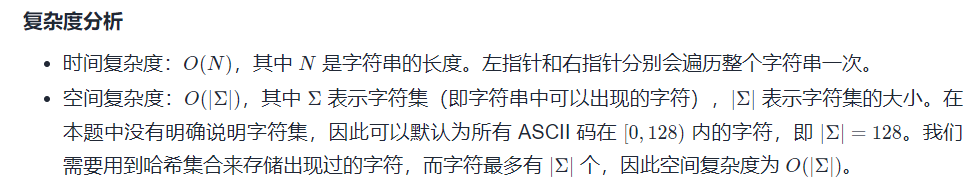

```java
class Solution {
    public int lengthOfLongestSubstring(String s) {
        int left = -1;
        int right = 0;
        int result = 0;
        Set<Character> set = new HashSet<>();
        while(right < s.length()){
            while(set.contains(s.charAt(right))){
                left++;
                set.remove(s.charAt(left));
            }
            set.add(s.charAt(right));
            right++;
            result = Math.max(result, right - left - 1);
        }
        return result;
    }
}
```

## [159. 至多包含两个不同字符的最长子串](https://leetcode-cn.com/problems/longest-substring-with-at-most-two-distinct-characters/)

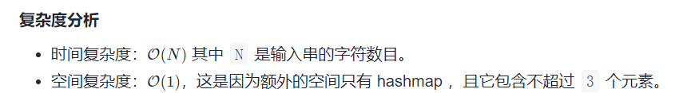

```java
class Solution {
    public int lengthOfLongestSubstringTwoDistinct(String s) {
        HashMap<Character, Integer> map = new HashMap<>();
        int result = 0;
        int cnt = 0;
        int right = 0;
        int left = 0;

        while(right < s.length()){
            char curr = s.charAt(right);
            if(!map.containsKey(curr)){
                map.put(curr, 1);
                cnt++;
            }else{
                map.put(curr, map.get(curr) + 1);
            } 

            if(cnt <= 2){
                result = Math.max(result, right - left + 1); 
            }  

            while(cnt > 2){
                curr = s.charAt(left);
                map.put(curr, map.get(curr) - 1);
                if(map.get(curr) == 0){
                    cnt--;
                    map.remove(curr);
                }
                left++;
            }
            
            right++;
        }
        return result;
    }
}
```

## [340. 至多包含 K 个不同字符的最长子串](https://leetcode-cn.com/problems/longest-substring-with-at-most-k-distinct-characters/)

```java
class Solution {
    public int lengthOfLongestSubstringKDistinct(String s, int k) {
 HashMap<Character, Integer> map = new HashMap<>();
        int result = 0;
        int cnt = 0;
        int right = 0;
        int left = 0;

        while(right < s.length()){
            char curr = s.charAt(right);
            if(!map.containsKey(curr)){
                map.put(curr, 1);
                cnt++;
            }else{
                map.put(curr, map.get(curr) + 1);
            } 

            if(cnt <= k){
                result = Math.max(result, right - left + 1); 
            }  

            while(cnt > k){
                curr = s.charAt(left);
                map.put(curr, map.get(curr) - 1);
                if(map.get(curr) == 0){
                    cnt--;
                    map.remove(curr);
                }
                left++;
            }
            
            right++;
        }
        return result;
    }
}
```

## [209. 长度最小的子数组](https://leetcode-cn.com/problems/minimum-size-subarray-sum/)

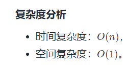

```java
class Solution {
    public int minSubArrayLen(int target, int[] nums) {
        int left = 0;
        int right = 0;
        int currSum = 0;
        int result = Integer.MAX_VALUE;
        while(right < nums.length){
            currSum += nums[right];
            while(currSum >= target){
                result = Math.min(result, right - left + 1);
                currSum -= nums[left];
                left++;
            }
            right++;
        }
        return result == Integer.MAX_VALUE ? 0 : result;
    }
}
```

## [567. 字符串的排列](https://leetcode-cn.com/problems/permutation-in-string/)

```java
class Solution {
    public boolean checkInclusion(String s1, String s2) {
        if(s1.length() > s2.length()){
            return false;
        }
        int[] map = new int[26];
        int[] supportMap = new int[26];
        for(int i = 0; i < s1.length(); i++){
            int index = s1.charAt(i) - 'a';
            map[index]++;
        }
        int cnt = 0;
        int left = 0;
        int right = 0;
        for(int i = 0; i < s1.length(); i++){
            int currIndex = s2.charAt(i) - 'a';
            if(map[currIndex] != 0 && supportMap[currIndex] < map[currIndex]){
                cnt++;
            }
            supportMap[currIndex]++;
            if(cnt == s1.length()){
                return true;
            }
            right++;
        }

        while(right < s2.length()){
            int leftIndex = s2.charAt(left) - 'a';
            if(map[leftIndex] != 0 && supportMap[leftIndex] <= map[leftIndex]){
                cnt--;
            }
            supportMap[leftIndex]--;

            int rightIndex = s2.charAt(right) - 'a';
            if(map[rightIndex] != 0 && supportMap[rightIndex] < map[rightIndex]){
                cnt++;
            }
            supportMap[rightIndex]++;
            
            if(cnt == s1.length()){
                return true;
            }
            left++;
            right++;
        }
        return false;
    }
}
```


## [239. 滑动窗口最大值](https://leetcode-cn.com/problems/sliding-window-maximum/)

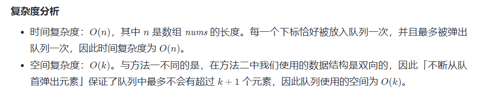

```java
//利用双端队列，保证队列从头部到尾部代表的元素是递增的
class Solution {
    public int[] maxSlidingWindow(int[] nums, int k) {
        //双端队列,记录nums的下标，
        LinkedList<Integer> list = new LinkedList<>();
        //结果
        int[] result = new int[nums.length - k + 1];

        for(int i = 0; i < nums.length; i++){
           //滑动窗口右边界一直在往右移动
           //具体做法：每次新进来一个数，都需要让双端队列从队头到队尾代表的元素 严格递增
            while(list.size() != 0 && nums[i] >nums[list.peekLast()]){
                list.removeLast();
            }
                list.addLast(i);        
            
            //滑动左边界移动，只有i-k>=0才开始移动
            //具体做法：观察双端队列的头部元素是否为滑动窗口左边界元素下标，是则弹出。
            if(i - k >= 0){
                if(list.peekFirst() == (i - k)){
                    list.removeFirst();
                }
            }
            //记录答案
            if(i - k + 1>= 0){
                result[i - k + 1] = nums[list.peekFirst()];
            }
        }
        return result;
    }

}
```

## [76. 最小覆盖子串](https://leetcode-cn.com/problems/minimum-window-substring/)

```java
class Solution {
    public String minWindow(String s, String t) {
        //一共需要多少个字母
        int count = t.length();
        //用于记录t中各个字母出现的次数
        HashMap<Character, Integer> tCountMap = new HashMap<>();
        //用于记录滑动窗口中，对应t中的各个字母在滑动窗口中出现的次数
        HashMap<Character, Integer> strCountMap = new HashMap<>();
        for(int i = 0; i < count; i++){
           if(!tCountMap.containsKey(t.charAt(i))){
               tCountMap.put(t.charAt(i), 1);
           }else{
               tCountMap.put(t.charAt(i), tCountMap.get(t.charAt(i)) + 1);
           }
        }
        //记录答案的变量
        int leftAns = 0;  
        int rightAns = 0;
        int minLength = Integer.MAX_VALUE;

        //滑动窗口左右指针
        int currLeft = 0;
        int currRight = 0;

        //currCount == count 说明滑动窗口包含了t
        int currCount = 0;
        while(currRight <= s.length() - 1){
            while(currCount != count && currRight <= s.length() - 1){
                if(tCountMap.containsKey(s.charAt(currRight))){
                    if(!strCountMap.containsKey(s.charAt(currRight))){
                            strCountMap.put(s.charAt(currRight), 1);
                        }else{
                            strCountMap.put(s.charAt(currRight), strCountMap.get(s.charAt(currRight)) + 1);
                        }
                    if(strCountMap.get(s.charAt(currRight)) <= tCountMap.get(s.charAt(currRight))){
                        currCount += 1;
                    }
                }
                currRight++;
            }

            while(currCount == count){
               if(minLength >= currRight - currLeft + 1){
                   minLength = currRight - currLeft + 1;
                   leftAns = currLeft;
                   rightAns = currRight;
               }
                if(tCountMap.containsKey(s.charAt(currLeft))){
                    strCountMap.put(s.charAt(currLeft), strCountMap.get(s.charAt(currLeft)) - 1);
                    if(strCountMap.get(s.charAt(currLeft)) < tCountMap.get(s.charAt(currLeft))){
                        currCount -= 1;
                    }
                }
                currLeft++;               
            }
        }
        return s.substring(leftAns, rightAns);
    }
}
```


## [632. 最小区间](https://leetcode-cn.com/problems/smallest-range/)

## [727. 最小窗口子序列](https://leetcode-cn.com/problems/minimum-window-subsequence/)


#### 

# 动态规划

## 子序列问题

### 1.单串

#### 1.LIS

##### [300. 最长递增子序列](https://leetcode-cn.com/problems/longest-increasing-subsequence/) (LIS)

```java
//动态规划
//时间复杂度：O(n^2)，空间复杂度：O(n)
class Solution {
    public int lengthOfLIS(int[] nums) {
        int[] dp = new int[nums.length];
        int ans = 0;
        for(int i = 0; i < nums.length; i++){
            dp[i] = 1;
            for(int j = 0; j < i; j++){
                if(nums[i] > nums[j]){
                    dp[i] = Math.max(dp[i], dp[j] + 1);
                }
            }
            ans = Math.max(ans, dp[i]);
        }
        return ans;
    }
}


//动态规划 + 二分查找
//时间复杂度：O(nlogn)，空间复杂度：O(n)
class Solution {
    public int lengthOfLIS(int[] nums) {
        int[] dp = new int[nums.length];
        int ans = 0;
        for(int i = 0; i < nums.length; i++){
            int left = 0, right = ans;
            while(left < right){
                int mid = (left + right) / 2;
                if(dp[mid] >= nums[i]){
                    right = mid;
                }else{
                    left = mid + 1;
                }
            }
            dp[right] = nums[i];
            if(ans == right){ans++;}
        }
        return ans;
    }
}
```

##### [673. 最长递增子序列的个数](https://leetcode-cn.com/problems/number-of-longest-increasing-subsequence/)(LIS)


##### [354. 俄罗斯套娃信封问题](https://leetcode-cn.com/problems/russian-doll-envelopes/)(LIS)

```java
//定制排序 + 动态规划
//时间复杂度：O(n^2)，空间复杂度：O(n)
class Solution {
    public int maxEnvelopes(int[][] envelopes) {
        int[] dp = new int[envelopes.length];
        int ans = 0;
        Arrays.sort(envelopes, (o1, o2) -> {
            if(o1[0] != o2[0]){
                return o1[0] - o2[0];
            }else{
                return o2[1] - o1[1];
            }
        });

        for(int i = 0; i < envelopes.length; i++){
            dp[i] = 1;
            for(int j = 0; j < i; j++){
                if(envelopes[i][0] > envelopes[j][0] && envelopes[i][1] > envelopes[j][1]){
                    dp[i] = Math.max(dp[i], dp[j] + 1);
                }
            }
            ans = Math.max(ans, dp[i]);
        }
        return ans;
    }
}


//定制排序 + 动态规划 + 二分查找
//时间复杂度：O(nlogn)，空间复杂度：O(n)
class Solution {
    public int maxEnvelopes(int[][] envelopes) {
        int ans = 0;
        int[] tails = new int[envelopes.length];

        //比起之前的LIS多了一个定制排序
        Arrays.sort(envelopes, (o1, o2) -> {
            if(o1[0] != o2[0]){
                return o1[0] - o2[0];
            }else{
                return o2[1] - o1[1];
            }
        });

        //因为排序过了，所以只需要考虑width维度
        for(int i = 0; i < envelopes.length; i++){
            int left = 0, right = ans;
            while(left < right){
                int mid = ((right - left) >> 1) + left;
                if(tails[mid] >= envelopes[i][1]){
                    right = mid;
                }else {
                    left = mid + 1;
                }
            }
            tails[right] = envelopes[i][1];
            if(right == ans) ans++;
        } 
         return ans;
    }
}
```


#### [32. 最长有效括号](https://leetcode-cn.com/problems/longest-valid-parentheses/)

```java
class Solution {
    public int longestValidParentheses(String s) {
        int result = 0;
        int length = s.length();
        int[] dp = new int[length];//以第i个字符结尾的最长有效子串的长度
        for(int i = 1; i < length; i++){
            if(s.charAt(i) == ')'){
                if(s.charAt(i - 1) == '('){
                    dp[i] = 2;
                    if(i - 2 >= 0){
                        dp[i] += dp[i - 2];
                    }
                }else{
                    if(i - dp[i - 1] - 1 >= 0 && s.charAt(i - dp[i - 1] - 1) == '('){
                        dp[i] = dp[i - 1] + 2;
                        if(i - dp[i - 1] - 2 >= 0){
                            dp[i] += dp[i - dp[i - 1] - 2];
                        }
                    }
                }
            }
            result = Math.max(result, dp[i]);
        }
        return result;
    }
}
```


### 2.双串

#### 1.LCS

```java
class Solution {
    public int longestCommonSubsequence(String text1, String text2) {
        int[][] dp = new int[text1.length() + 1][text2.length() + 1];
        for(int i = 1; i <= text1.length(); i++){
            char char1 = text1.charAt(i - 1) ;
            for(int j = 1; j <= text2.length(); j++){
                if(char1 == text2.charAt(j - 1)){
                    dp[i][j] = dp[i - 1][j - 1] + 1;
                }else{
                    dp[i][j] = Math.max(dp[i - 1][j], dp[i][j - 1]);
                }
            }
        }
        return dp[text1.length()][text2.length()];
    }
}
```


#### 2.字符串匹配问题

##### [72. 编辑距离](https://leetcode-cn.com/problems/edit-distance/)

```java
class Solution {
    public int minDistance(String word1, String word2) {
        int dp[][] = new int[word1.length() + 1][word2.length() + 1];
        for(int i = 1; i <= word1.length(); i++){
            dp[i][0] = dp[i - 1][0] + 1;
        }

        for(int i = 1; i <= word2.length(); i++){
            dp[0][i] = dp[0][i - 1] + 1;
        }

        for(int i = 1; i <= word1.length(); i++){
            for(int j = 1; j <= word2.length(); j++){
                if(word1.charAt(i - 1) == word2.charAt(j - 1)){
                    dp[i][j] = dp[i - 1][j - 1];
                }else{
                    dp[i][j] = Math.min(dp[i - 1][j - 1], Math.min(dp[i - 1][j], dp[i][j - 1])) + 1;
                }
            }
        }
        return dp[word1.length()][word2.length()];

    }
}
```


##### [10. 正则表达式匹配](https://leetcode-cn.com/problems/regular-expression-matching/)

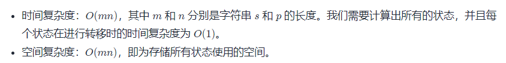

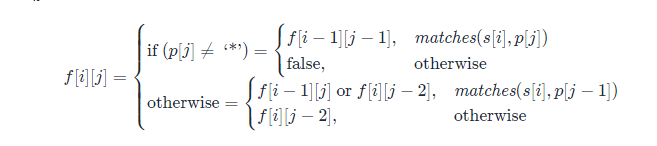

```java
class Solution {
    public boolean isMatch(String s, String p) {
        //dp[i][j]表示s的前i个字符与p的前j个字符是否能匹配。
        boolean[][] dp = new boolean[s.length() + 1][p.length() + 1];
        dp[0][0] = true;
        for(int i = 0; i <= s.length(); i++){
            for(int j = 1; j <= p.length(); j++){
                if(p.charAt(j - 1) == '*'){
                    if(matches(s, p, i, j - 1)){
                        dp[i][j] = dp[i][j - 2] || dp[i - 1][j];
                    }else{
                        dp[i][j] = dp[i][j - 2];
                    }
                }else{
                    if(matches(s, p, i, j)){
                        dp[i][j] = dp[i - 1][j - 1];
                    }else{
                        dp[i][j] = false;
                    }
                }
            }
        }
        return dp[s.length()][p.length()];
    }
        public boolean matches(String s, String p, int i, int j) {
        if (i == 0) {
            return false;
        }
        if (p.charAt(j - 1) == '.') {
            return true;
        }
        return s.charAt(i - 1) == p.charAt(j - 1);
    }
}
```

## 前缀和问题

### [1. 两数之和](https://leetcode-cn.com/problems/two-sum/)

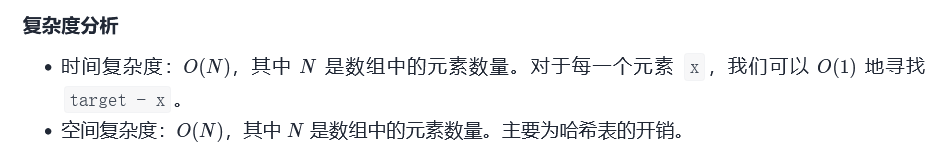

```java
class Solution {
    public int[] twoSum(int[] nums, int target) {
        Map<Integer, Integer> map = new HashMap<>();
        for(int i = 0; i < nums.length; i++){
            int temp = target - nums[i];
            if(map.containsKey(temp)){
                return new int[]{i, map.get(temp)};
            }else{
                map.put(nums[i], i);
            }
        }
        return null;
    }
}
```

### [724. 寻找数组的中心下标](https://leetcode-cn.com/problems/find-pivot-index/)

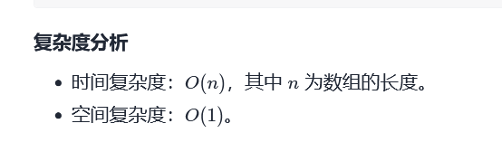

```java
//简单的前缀和：total = nums[i] + sumLeft + sumRight 其中 sumLeft = sumRight
class Solution {
    public int pivotIndex(int[] nums) {
        int total = 0;
        for(int i = 0; i < nums.length; i++){
            total += nums[i];
        }
        int sumLeft = 0;
        for(int i = 0; i < nums.length; i++){
            if(nums[i] == total - 2 * sumLeft){
                return i;
            }
            sumLeft += nums[i];
        }
        return -1;
    }
}
```

### [560. 和为 K 的子数组](https://leetcode-cn.com/problems/subarray-sum-equals-k/)

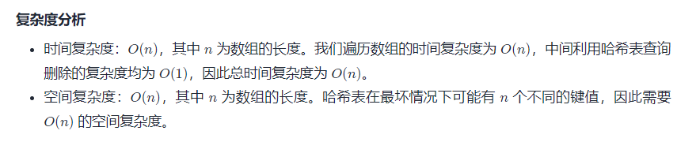

```java
//前缀和+哈希表
class Solution {
    public int subarraySum(int[] nums, int k) {
        //该map就是前缀和，key为当前的和，value为当前和出现的次数
        Map<Integer, Integer> map = new HashMap<>();
        int result = 0;
        int preSum = 0;
        //一开始，前缀和为 0，个数为 1
        map.put(0, 1);
        for(int i = 0; i < nums.length; i++){
            preSum += nums[i];         
            if(map.containsKey(preSum - k)){
                result += map.get(preSum - k);
            }
            map.put(preSum, map.getOrDefault(preSum, 0) + 1);
        }
        return result;
    }
}
```

### [1248. 统计「优美子数组」](https://leetcode-cn.com/problems/count-number-of-nice-subarrays/)

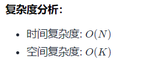

```java
class Solution {
    public int numberOfSubarrays(int[] nums, int k) {
         // 该数组的下标是前缀和（即当前奇数的个数），值是前缀和的个数。
        int[] pre = new int[nums.length + 1];
        int preOddSum = 0;
        int result = 0;
        pre[0] = 1;
        for(int i = 0; i < nums.length; i++){
            preOddSum += nums[i] & 1; 
            if(preOddSum - k >= 0){
                result += pre[preOddSum - k];
            }  
            pre[preOddSum]++;
        }
        return result;
    }
}
```

### [974. 和可被 K 整除的子数组](https://leetcode-cn.com/problems/subarray-sums-divisible-by-k/)


```java
class Solution {
    public int subarraysDivByK(int[] nums, int k) {
        int preSum = 0;
        int result = 0;
        //该数组的下标是前缀和（即当前和取模后的结果），值是前缀和的个数
        int pre[] = new int[k];
        pre[0] = 1;
        for(int i = 0; i < nums.length; i++){
            preSum += nums[i];
            //注意：取模的特殊性，当被除数为负数时，取模结果也为负数，需要进行纠正
            int key = (preSum % k + k) % k;
            result += pre[key];
            pre[key]++;
        }
        return result;
    }
}
```

### [523. 连续的子数组和](https://leetcode-cn.com/problems/continuous-subarray-sum/)

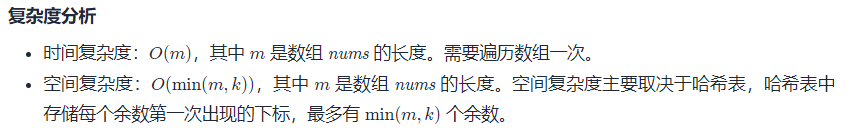

```java
class Solution {
    public boolean checkSubarraySum(int[] nums, int k) {
        //该map就是前缀和，key为当前和取模的结果，value为key第一次出现的下标
        Map<Integer, Integer> map = new HashMap<>();
        int preSum = 0;
        map.put(0, -1);
        for(int i = 0; i < nums.length; i++){
            preSum += nums[i];
            int key = (preSum % k + k) % k;
            if(map.containsKey(key)){
                if(i - map.get(key) >= 2){
                    return true;
                }
            }else{
                map.put(key, i);
            }
        }
        return false;
    }
}
```


## 回文问题

### [5. 最长回文子串](https://leetcode-cn.com/problems/longest-palindromic-substring/)

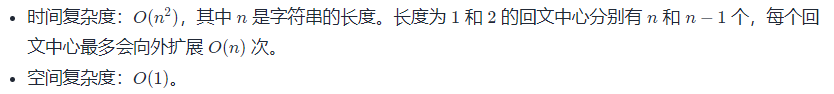

```java
class Solution {
    public String longestPalindrome(String s) {
        int maxLength = 0;
        int[] resultIndex = new int[2];

        for(int i = 0; i < s.length() - 1; i++){
            int[] temp1 = expand(s, i, i);
            int[] temp2 = expand(s, i, i + 1);
            if(temp1[1] - temp1[0] + 1 >= maxLength){
                maxLength = temp1[1] - temp1[0] + 1;
                resultIndex[0] = temp1[0];
                resultIndex[1] = temp1[1];
            }
            if(temp2[1] - temp2[0] + 1 >= maxLength){
                maxLength = temp2[1] - temp2[0] + 1;
                resultIndex[0] = temp2[0];
                resultIndex[1] = temp2[1];
            }
        }
        return s.substring(resultIndex[0], resultIndex[1] + 1);
    }

    private int[] expand(String s, int left, int right){
        while(left >= 0 && right <= s.length() - 1){
            if(s.charAt(left) == s.charAt(right)){
                left--;
                right++;
            }else{
                break;
            }
        }
        return new int[]{left + 1, right - 1};
    }
}
```


## 路径问题

### [62. 不同路径](https://leetcode-cn.com/problems/unique-paths/)

```java
class Solution {
    public int uniquePaths(int m, int n) {
        int[][] dp = new int[m][n];
        for(int i = 0; i < m; i++){
            dp[i][0] = 1;
        }

        for(int i = 0; i < n; i++){
            dp[0][i] = 1;
        }

        for(int i = 1; i < m; i++){
            for(int j = 1; j < n; j++){
                dp[i][j] = dp[i - 1][j] + dp[i][j - 1];
            }
        }
        return dp[m - 1][n - 1];
    }
}
```


### [64. 最小路径和](https://leetcode-cn.com/problems/minimum-path-sum/)

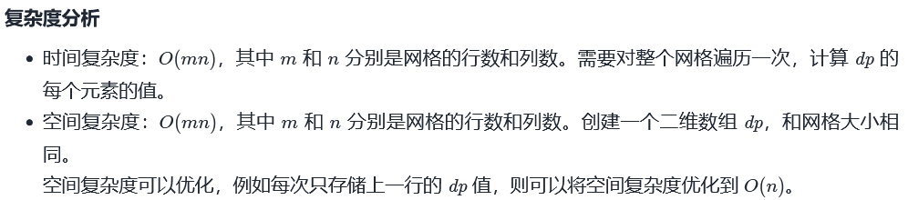

```java
class Solution {
    public int minPathSum(int[][] grid) {
        int m = grid.length;
        int n = grid[0].length;
        int[][] dp = new int[m][n];  //dp[i][j] 代表 走到grid[i][j]的最小数字总和
        dp[0][0] = grid[0][0];  
        for(int i = 1; i < m; i++){
            dp[i][0] = grid[i][0] + dp[i - 1][0];
        }
        for(int j = 1; j < n; j++){
            dp[0][j] += grid[0][j] + dp[0][j - 1];
        }
        for(int i = 1; i < m; i++){
            for(int j = 1; j < n; j++){
                dp[i][j] = Math.min(dp[i - 1][j], dp[i][j - 1]) + grid[i][j];
            }
        }
        return dp[m - 1][n - 1];
    }
}
```


## 背包问题

### 01背包

#### 01背包案例

### 完全背包

#### [139. 单词拆分](https://leetcode-cn.com/problems/word-break/)


## 打家劫舍问题

#### [198. 打家劫舍](https://leetcode-cn.com/problems/house-robber/)

```Java

dp[i][0] : 代表不打劫第i个屋子能获得最大的利益。 前一个屋子要么被打劫过，要么就没被打劫过  dp[i][0] = Math.max(dp[i - 1][0], dp[i - 1][1])
dp[i][1] : 代表打劫第i个屋子能获得最大的利益。 前一个屋子一定没被打劫过  dp[i][1] = dp[i - 1][0] + nums[i]


class Solution {
    public int rob(int[] nums) {
        int[][] dp = new int[nums.length][2];
        dp[0][0] = 0;
        dp[0][1] = nums[0];
        for(int i = 1; i < nums.length; i++){
            dp[i][0] = Math.max(dp[i - 1][0], dp[i - 1][1]);
            dp[i][1] = dp[i - 1][0] + nums[i];
        }
        return Math.max(dp[nums.length - 1][0], dp[nums.length - 1][1]);
    }
}

//滚动数组
class Solution {
    public int rob(int[] nums) {
        int[] dp = new int[2];
        dp[0] = 0;
        dp[1] = nums[0];
        for(int i = 1; i < nums.length; i++){
            int prev0 = dp[0];
            int prev1 = dp[1];
            dp[0] = Math.max(prev0, prev1);
            dp[1] = prev0 + nums[i];
        }
        return Math.max(dp[0], dp[1]);
    }
}

```


## 股票问题

参考：https://leetcode-cn.com/circle/article/qiAgHn/

通解:

符号规定：

- 用 `n` 表示股票价格数组的长度；
- 用 `i` 表示第 `i` 天（`i` 的取值范围是 `0` 到 `n - 1`）；
- 用 `k` 表示允许的最大交易次数；
- 用`j`表示当天结束后持有股票的份数
- `dp[i][k][j]`表示第`i`天结束时，最多可以进行`k`次交易的情况下，持有`j`份股票的情况下可以获得最大的利益。

初始情况：

```java
dp[-1][k][0] = 0   		  //没有进行股票交易时没有收益
dp[-1][k][1] = -MIN_VALUE  //没有进行股票交易时不允许持有股票。

dp[i][0][0] = 0			  //没有进行股票交易时没有收益
dp[i][0][1] = -MIN_VALUE   //没有进行股票交易时不允许持有股票。
```

每天情况：

```java
//第i天结束后，没有持有股票，那第i天的操作就只能是卖出或者休息了。
//dp[i - 1][k][0] 是休息操作可以得到的最大收益
//T[i - 1][k][1] + prices[i] 是卖出操作可以得到的最大收益
dp[i][k][0] = max(dp[i - 1][k][0], dp[i - 1][k][1] + prices[i]) 

//第 i 天结束后，持有股票，进行的操作只能是休息或买入
//dp[i - 1][k][1] 是休息操作可以得到的最大收益
//dp[i - 1][k - 1][0] - prices[i] 是买入操作可以得到的最大收益。注意到允许的最大交易次数减少了一次，因为每次买入操作会使用一次交易。
dp[i][k][1] = max(dp[i - 1][k][1], dp[i - 1][k - 1][0] - prices[i])

```

最终答案：

```
//因为结束时持有 0 份股票的收益一定大于持有 1 份股票的收益。
dp[n - 1][k][0]
```


### [121. 买卖股票的最佳时机](https://leetcode-cn.com/problems/best-time-to-buy-and-sell-stock/)

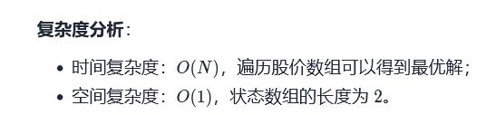

```java
//在这里 k == 1
//通解：
			  //休息              //卖出
dp[i][1][0] = max(dp[i-1][1][0], dp[i-1][1][1] + prices[i])
			  //休息              //买入
dp[i][1][1] = max(dp[i-1][1][1], dp[i-1][0][0] - prices[i]) = max(dp[i - 1][1][1], -prices)

//简化：   
dp[i][0] = max(dp[i-1][0], dp[i-1][1] + prices[i]);
dp[i][1] = max(dp[i-1][1], -prices[i]);


public class Solution {
    public int maxProfit(int[] prices) {
        int[][] dp = new int[len][2];
        //初始化：第一天结束后的情况，防止下标溢出
        dp[0][0] = 0;
        dp[0][1] = -prices[0];

        //从第二天开始遍历
        for (int i = 1; i < len; i++) {
            dp[i][0] = Math.max(dp[i - 1][0], dp[i - 1][1] + prices[i]);
            dp[i][1] = Math.max(dp[i - 1][1], -prices[i]);
        }
        return dp[len - 1][0];
    }
}


//观察上面式子，i只与i-1有关，可以利用滚动数组优化空间：
class Solution {
    public int maxProfit(int[] prices) {
        int[]dp = new int[2];
        dp[0] = 0;
        dp[1] = -prices[0];
        for(int i = 1; i < prices.length; i++){
            dp[0] = Math.max(dp[0], dp[1] + prices[i]);
            dp[1] = Math.max(dp[1], -prices[i]);
        }
        return dp[0];
    }
}
```

### [122. 买卖股票的最佳时机 II](https://leetcode-cn.com/problems/best-time-to-buy-and-sell-stock-ii/)


```java
//在这里k == 无穷
//通解：
			  //休息              //卖出
dp[i][1][0] = max(dp[i-1][k][0], dp[i-1][k][1] + prices[i])
			  //休息              //买入
dp[i][1][1] = max(dp[i-1][k][1], dp[i-1][k-1][0] - prices[i]) = max(dp[i - 1][k][1], dp[i-1][k][0] - prices)
    
//k没用作用了，可以优化：
			  //休息              //卖出
dp[i][1][0] = max(dp[i-1][0], dp[i-1][1] + prices[i])
			  //休息              //买入
dp[i][1][1] = max(dp[i-1][1], dp[i-1][0] - prices[i]) 
    

class Solution {
    public int maxProfit(int[] prices) {
        int[][] dp = new int[prices.length][2];
        dp[0][0] = 0;
        dp[0][1] = -prices[0];
        for(int i = 1; i < prices.length; i++){
            dp[i][0] = Math.max(dp[i-1][0], dp[i-1][1] + prices[i]);
            dp[i][1] = Math.max(dp[i-1][1], dp[i-1][0] - prices[i]);
        }
        return dp[prices.length - 1][0];
    }
}

//滚动数组
class Solution {
    public int maxProfit(int[] prices) {
        int[] dp = new int[2];
        dp[0] = 0;
        dp[1] = -prices[0];
        for(int i = 1; i < prices.length; i++){
            dp[0] = Math.max(dp[0], dp[1] + prices[i]);
            dp[1] = Math.max(dp[1], dp[0] - prices[i]);
        }
        return dp[0];
    }
}
```

### [123. 买卖股票的最佳时机 III](https://leetcode-cn.com/problems/best-time-to-buy-and-sell-stock-iii/)

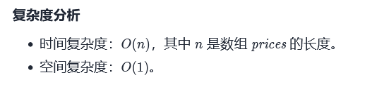

```java
//在这里k == 2
//通解：
			  //休息              //卖出
dp[i][2][0] = max(dp[i-1][2][0], dp[i-1][2][1] + prices[i])
			  //休息              //买入
dp[i][2][1] = max(dp[i-1][2][1], dp[i-1][1][0] - prices[i]) 
			  //休息              //卖出
dp[i][1][0] = max(dp[i-1][1][0], dp[i-1][1][1] + prices[i])
			  //休息              //买入
dp[i][1][1] = max(dp[i-1][1][1], dp[i-1][0][0] - prices[i]) = max(dp[i - 1][1][1],  -prices[i])


class Solution {
    public int maxProfit(int[] prices) {
        int[][][] dp = new int[prices.length][3][2];
        dp[0][2][0] = 0;
        dp[0][2][1] = -prices[0];
        dp[0][1][0] = 0;
        dp[0][1][1] = -prices[0];

        for(int i = 1; i < prices.length; i++){                 
            dp[i][2][0] = Math.max(dp[i-1][2][0], dp[i-1][2][1] + prices[i]);
            dp[i][2][1] = Math.max(dp[i-1][2][1], dp[i-1][1][0] - prices[i]);
            dp[i][1][0] = Math.max(dp[i-1][1][0], dp[i-1][1][1] + prices[i]);
            dp[i][1][1] = Math.max(dp[i-1][1][1], dp[i-1][0][0] - prices[i]);
        }
        return dp[prices.length - 1][2][0];
    }
}

//滚动数组
class Solution {
    public int maxProfit(int[] prices) {
        int[][] dp = new int[3][2];
        dp[2][0] = 0;
        dp[2][1] = -prices[0];
        dp[1][0] = 0;
        dp[1][1] = -prices[0];
        dp[0][0] = 0;

        for(int i = 1; i < prices.length; i++){                 
            dp[2][0] = Math.max(dp[2][0], dp[2][1] + prices[i]);
            dp[2][1] = Math.max(dp[2][1], dp[1][0] - prices[i]);
            dp[1][0] = Math.max(dp[1][0], dp[1][1] + prices[i]);
            dp[1][1] = Math.max(dp[1][1], dp[0][0] - prices[i]);
        }
        return dp[2][0];
    }
}
```

### [188. 买卖股票的最佳时机 IV](https://leetcode-cn.com/problems/best-time-to-buy-and-sell-stock-iv/)


```java

class Solution {
    public int maxProfit(int k, int[] prices) {
        if( prices == null || k == 0 || prices.length == 0 ){
            return 0;
        }
        int dp[][][] = new int[prices.length][k + 1][2];
        
        for(int i = 1; i <= k; i++){
            dp[0][i][0] = 0;
            dp[0][i][1] = -prices[0];    
        }

        for(int i = 1; i < prices.length; i++){
            for(int j = k; j > 0; j--){
                dp[i][j][0] = Math.max(dp[i-1][j][0], dp[i-1][j][1] + prices[i]);
                dp[i][j][1] = Math.max(dp[i-1][j][1], dp[i-1][j-1][0] - prices[i]);
            }
        }
        return dp[prices.length - 1][k][0];
    }
}

//滚动数组
class Solution {
    public int maxProfit(int k, int[] prices) {
        if( prices == null || k == 0 || prices.length == 0 ){
            return 0;
        }
        int dp[][] = new int[k + 1][2];
        
        for(int i = 1; i <= k; i++){
            dp[i][0] = 0;
            dp[i][1] = -prices[0];    
        }

        for(int i = 1; i < prices.length; i++){
            for(int j = k; j > 0; j--){
                dp[j][0] = Math.max(dp[j][0], dp[j][1] + prices[i]);
                dp[j][1] = Math.max(dp[j][1], dp[j-1][0] - prices[i]);
            }
        }
        return dp[k][0];
    }
}

//最终优化优化
```


### [309. 最佳买卖股票时机含冷冻期](https://leetcode-cn.com/problems/best-time-to-buy-and-sell-stock-with-cooldown/)

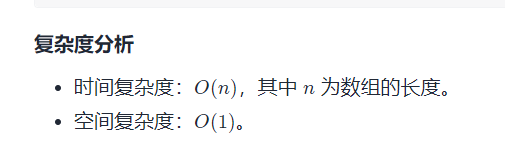

```java
//在这里k == 无穷，但是有冷冻期
//通解：
			  //休息              //卖出
dp[i][1][0] = max(dp[i-1][k][0], dp[i-1][k][1] + prices[i])
			  //休息              //买入，但是有冷冻期
dp[i][1][1] = max(dp[i-1][k][1], dp[i-2][k-1][0] - prices[i]) = max(dp[i - 1][k][1], dp[i-2][k][0] - prices)
    
//k没用作用了，可以优化：
			  //休息              //卖出
dp[i][1][0] = max(dp[i-1][0], dp[i-1][1] + prices[i])
			  //休息              //买入
dp[i][1][1] = max(dp[i-1][1], dp[i-2][0] - prices[i]) 
    
    
    
class Solution {
    public int maxProfit(int[] prices) {
        int[][] dp = new int[prices.length][2];
        dp[0][0] = 0;
        dp[0][1] = -prices[0];
        for(int i = 1; i < prices.length; i++){
            dp[i][0] = Math.max(dp[i-1][0], dp[i-1][1] + prices[i]);
            dp[i][1] = Math.max(dp[i-1][1], i < 2 ? 0 -prices[i] : (dp[i-2][0] - prices[i]));
        }
        return dp[prices.length - 1][0];
    }
}

//滚动数组
class Solution {
    public int maxProfit(int[] prices) {
        int prevProfit0 = 0, profit0 = 0, profit1 = -prices[0];
        int length = prices.length;
        for (int i = 1; i < length; i++) {
            int nextProfit0 = Math.max(profit0, profit1 + prices[i]);
            int nextProfit1 = Math.max(profit1, prevProfit0 - prices[i]);
            prevProfit0 = profit0;
            profit0 = nextProfit0;
            profit1 = nextProfit1;
        }
        return profit0;
    }
}
```

### [714. 买卖股票的最佳时机含手续费](https://leetcode-cn.com/problems/best-time-to-buy-and-sell-stock-with-transaction-fee/)


```java
//在这里k == 无穷，但是有手续费
//通解：
			  //休息              //卖出
dp[i][1][0] = max(dp[i-1][k][0], dp[i-1][k][1] + prices[i] - fee)
			  //休息              //买入
dp[i][1][1] = max(dp[i-1][k][1], dp[i-1][k-1][0] - prices[i]) = max(dp[i - 1][k][1], dp[i-1][k][0] - prices)
    
//k没用作用了，可以优化：
			  //休息              //卖出
dp[i][1][0] = max(dp[i-1][0], dp[i-1][1] + prices[i] - fee)
			  //休息              //买入
dp[i][1][1] = max(dp[i-1][1], dp[i-1][0] - prices[i]) 
    
    
    
class Solution {
    public int maxProfit(int[] prices, int fee) {
        int[][] dp = new int[prices.length][2];
        dp[0][0] = 0;
        dp[0][1] = -prices[0];
        for(int i = 1; i < prices.length; i++){
            dp[i][0] = Math.max(dp[i-1][0], dp[i-1][1] + prices[i] - fee);
            dp[i][1] = Math.max(dp[i-1][1], dp[i-1][0] - prices[i]);
        }
        return dp[prices.length - 1][0];
    }
}

//滚动数组
class Solution {
    public int maxProfit(int[] prices, int fee) {
        int[] dp = new int[2];
        dp[0] = 0;
        dp[1] = -prices[0];
        for(int i = 1; i < prices.length; i++){
            dp[0] = Math.max(dp[0], dp[1] + prices[i] - fee);
            dp[1] = Math.max(dp[1], dp[0] - prices[i]);
        }
        return dp[0];
    }
}
```

#### [221. 最大正方形](https://leetcode-cn.com/problems/maximal-square/)


```java
class Solution {
    public int maximalSquare(char[][] matrix) {
        int[][] dp = new int[matrix.length][matrix[0].length];
        int ans = 0;

        for(int i = 0; i < matrix.length; i++){
            if(matrix[i][0] == '1'){
                ans = 1;
                dp[i][0] = 1;
            }
        }

        for(int j = 1; j < matrix[0].length; j++){
            if(matrix[0][j] == '1'){
                ans = 1;
                dp[0][j] = 1;
            }
        }

        for(int i = 1; i < matrix.length; i++){
            for(int j = 1; j < matrix[0].length; j++){
                if(matrix[i][j] == '1'){
                    dp[i][j] = Math.min(Math.min(dp[i - 1][j], dp[i][j - 1]), dp[i - 1][j - 1]) + 1;
                    ans = Math.max(ans, dp[i][j]);
                }
            }
        }
        return ans * ans;
    }
}
```


## [1277. 统计全为 1 的正方形子矩阵](https://leetcode-cn.com/problems/count-square-submatrices-with-all-ones/)

```java
class Solution {
    public int countSquares(int[][] matrix) {
        int[][] dp = new int[matrix.length][matrix[0].length];
        int ans = 0;

        for(int i = 0; i < matrix.length; i++){
            if(matrix[i][0] == 1){
                ans += 1;
                dp[i][0] = 1;
            }
        }

        for(int j = 1; j < matrix[0].length; j++){
            if(matrix[0][j] == 1){
                ans += 1;
                dp[0][j] = 1;
            }
        }

        for(int i = 1; i < matrix.length; i++){
            for(int j = 1; j < matrix[0].length; j++){
                if(matrix[i][j] == 1){
                    dp[i][j] = Math.min(Math.min(dp[i - 1][j], dp[i][j - 1]), dp[i - 1][j - 1]) + 1;
                    ans += dp[i][j];
                }
            }
        }
        return ans;
    }
}
```


## [42. 接雨水](https://leetcode-cn.com/problems/trapping-rain-water/)

```java
class Solution {
    public int trap(int[] height) {
        int[] leftMax = new int[height.length];
        int[] rightMax = new int[height.length];

       
        leftMax[0] = height[0];
        rightMax[height.length - 1] = height[height.length - 1];
        for(int i = 1; i < height.length; i++){
            leftMax[i] = Math.max(height[i], leftMax[i - 1]);
        }

        for(int i = height.length - 2; i >= 0; i--){
            rightMax[i] = Math.max(height[i], rightMax[i + 1]);
        }

        int result = 0;
        for(int i = 0; i < height.length; i++){
            result += Math.min(leftMax[i], rightMax[i]) - height[i];
        }
        return result;
    }
}
```


# 回溯算法

## [面试题 08.06. 汉诺塔问题](https://leetcode-cn.com/problems/hanota-lcci/)

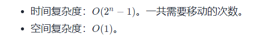

```java
class Solution {
    public void hanota(List<Integer> A, List<Integer> B, List<Integer> C) {
        solve(A.size(), A , B, C);
    }
    public void solve(int n, List<Integer> from, List<Integer> support, List<Integer> to){
        //baseCase：只有一个盘子，那就直接从A移动到C
        if(n == 1){
            to.add(from.remove(from.size() - 1));
            return;
        }
        //把A上面n - 1个盘子，从A借助C移动到B上。
        solve(n - 1, from, to, support);
        //把A的第n个盘子，移动到C上。
        to.add(from.remove(from.size() - 1));
        //把B上的盘子，借助A移动到C上即可
        solve(n - 1, support, from, to);;
    }

}
```

## [46. 全排列](https://leetcode-cn.com/problems/permutations/)


```java
class Solution {
    private List<List<Integer>> result = new ArrayList<>();
    private Deque<Integer> path = new LinkedList<>();

    public List<List<Integer>> permute(int[] nums) {
        boolean[] marks = new boolean[nums.length];
        sovle(nums, marks);
        return result;
    }

    private void sovle(int[] nums, boolean[] marks){
        if(path.size() == nums.length){
            result.add(new ArrayList<>(path));
            return; 
        }

        for(int i = 0; i < nums.length; i++){
            if(marks[i]){
                continue;
            }
            path.addLast(nums[i]);
            marks[i] = true;
            sovle(nums, marks);
            path.removeLast();
            marks[i] = false;
        }

    }
}
```

## [78. 子集](https://leetcode-cn.com/problems/subsets/)

```
class Solution {
    List<List<Integer>> result = new ArrayList<>();
    List<Integer> path = new ArrayList<>();
    public List<List<Integer>> subsets(int[] nums) {
        sovle(nums, 0);
        return result;
    }

    public void sovle(int[] nums, int index){
        result.add(new ArrayList<>(path));
        if(index == nums.length){
            return;
        }

        for(int i = index; i < nums.length; i++){
            path.add(nums[i]);
            sovle(nums, i + 1);
            path.remove(path.size() - 1);
        }

    }
}
```


## [22. 括号生成](https://leetcode-cn.com/problems/generate-parentheses/)

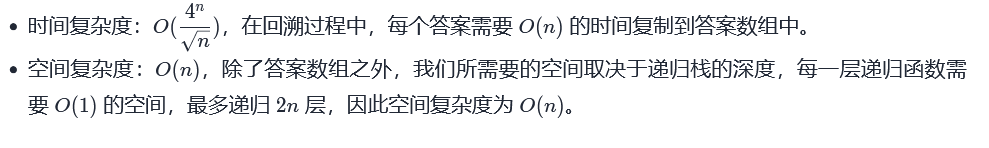

```java
class Solution {
    private List<String> result = new ArrayList<>();
    private StringBuilder path = new StringBuilder();
    private int countLeft = 0;
    private int countRight = 0;
    public List<String> generateParenthesis(int n) {
        backTracking(n);
        return result;
    }

    private void backTracking(int n){
        if(countLeft + countRight == 2 * n){
            result.add(path.toString());
            return;
        }
            if(countLeft < n){
                countLeft++;
                path.append('(');
                backTracking(n);
                path.deleteCharAt(path.length() - 1);
                countLeft--;
            } 
            if(countRight < countLeft){
                countRight++;
                path.append(')');
                backTracking(n);
                path.deleteCharAt(path.length() - 1);
                countRight--;
            }
    }
}
```

## [93. 复原 IP 地址](https://leetcode-cn.com/problems/restore-ip-addresses/)

```java
class Solution {
    List<String> result = new ArrayList<>();

    public List<String> restoreIpAddresses(String s) {
        if (s.length() > 12) return result; // 算是剪枝了
        backTrack(s, 0, 0);
        return result;
    }

    // startIndex: 搜索的起始位置， pointNum:添加逗点的数量
    private void backTrack(String s, int startIndex, int pointNum) {
        if (pointNum == 3) {// 逗点数量为3时，分隔结束
            // 判断第四段⼦字符串是否合法，如果合法就放进result中
            if (isValid(s,startIndex,s.length()-1)) {
                result.add(s);
            }
            return;
        }
        for (int i = startIndex; i < s.length(); i++) {
            if (isValid(s, startIndex, i)) {
                s = s.substring(0, i + 1) + "." + s.substring(i + 1);    //在str的后⾯插⼊⼀个逗点
                pointNum++;
                backTrack(s, i + 2, pointNum);// 插⼊逗点之后下⼀个⼦串的起始位置为i+2
                pointNum--;// 回溯
                s = s.substring(0, i + 1) + s.substring(i + 2);// 回溯删掉逗点
            } else {
                break;
            }
        }
    }

    // 判断字符串s在左闭⼜闭区间[start, end]所组成的数字是否合法
    private Boolean isValid(String s, int start, int end) {
        if (start > end) {
            return false;
        }
        if (s.charAt(start) == '0' && start != end) { // 0开头的数字不合法
            return false;
        }
        int num = 0;
        for (int i = start; i <= end; i++) {
            if (s.charAt(i) > '9' || s.charAt(i) < '0') { // 遇到⾮数字字符不合法
                return false;
            }
            num = num * 10 + (s.charAt(i) - '0');
            if (num > 255) { // 如果⼤于255了不合法
                return false;
            }
        }
        return true;
    }
}

```

## [679. 24 点游戏](https://leetcode-cn.com/problems/24-game/)

```java
class Solution {
    private final int TARGET = 24;
    //魔数：当两个double数字相减的绝对值小于该数，则可以认为两数相等
    private final double MAGIC = 1e-6;
    private final int ADD = 0, MUL = 1, SUB = 2, DIV = 3;
    public boolean judgePoint24(int[] cards) {
        List<Double> list = new ArrayList<>();
        for(int i = 0; i < cards.length; i++){
            list.add((double)cards[i]);
        }
        return solve(list);
    }

    public boolean solve (List<Double> list){
        //如果list中只有一个数字的话，看看这个数字是否是24
        if(list.size() == 1){
            return Math.abs(list.get(0) - TARGET) < MAGIC;
        }

        int size = list.size();
        for(int i = 0; i < size; i++){
            for(int j = 0; j < size; j++){
                //选取list中的两个数字进行运算
                if(i != j){
                    List<Double> list2 = new ArrayList<>();
                    //其他的数字需要放到list2，以便下次递归
                    for(int k = 0; k < size; k++){
                        if(k != i && k != j){
                            list2.add(list.get(k));
                        }
                    }
                    //对两个数字进行四则运算
                    for(int k = 0; k < 4; k++){
                        //如果是 加法，乘法是满足交换律的，所以只要运算一次即可
                        if(k < 2 && i > j){
                            continue;
                        }

                        if(k == ADD){
                            list2.add(list.get(i) + list.get(j));
                        }else if(k == MUL){
                            list2.add(list.get(i) * list.get(j));
                        }else if(k == SUB){
                            list2.add(list.get(i) - list.get(j));
                        }else{
                            //除数不能为0
                            if(Math.abs(list.get(j)) < MAGIC){
                                continue;
                            }else{
                                list2.add(list.get(i) / list.get(j));
                            }
                        }

                        if(solve(list2)){
                            return true;
                        }
                        //回溯
                        list2.remove(list2.size() - 1);
                    }
                }
            }
        }
        return  false;
    }
}
```


# 贪心算法

## 排序贪心

### [56. 合并区间](https://leetcode-cn.com/problems/merge-intervals/)

```java
class Solution {
    public int[][] merge(int[][] intervals) {
        Arrays.sort(intervals, (o1, o2) -> {
            if(o1[0] - o2[0] != 0){
                return o1[0] - o2[0];
            }else{
                return o1[1] - o2[1];
            }
        });

        List<List<Integer>> result = new ArrayList<>();
        int start = intervals[0][0];
        int end = intervals[0][1];
        for(int i = 1; i < intervals.length; i++){
            if(intervals[i][0] <= end){
                end = Math.max(end, intervals[i][1]);
            }else{
                List<Integer> temp = new ArrayList<>();
                temp.add(start);
                temp.add(end);
                result.add(temp);
                start = intervals[i][0];
                end = intervals[i][1];
            }
        }
        List<Integer> temp = new ArrayList<>();
        temp.add(start);
        temp.add(end);
        result.add(temp);        
        int[][] ans = new int[result.size()][2];
        for(int i = 0; i < result.size(); i++ ){
            ans[i][0] = result.get(i).get(0);
            ans[i][1] = result.get(i).get(1);
        }
        return ans;
    }
}
```


### [881. 救生艇](https://leetcode-cn.com/problems/boats-to-save-people/)

```java
class Solution {
    public int numRescueBoats(int[] people, int limit) {
        Arrays.sort(people);
        int left = 0;
        int right = people.length - 1;
        int ans = 0;
        while(left <= right){
            if(people[right] + people[left] > limit){
                right--;
                ans++;
            }else{
                left++;
                right--;
                ans++;
            }
        }
        return ans;
    }
}
```

### [179. 最大数](https://leetcode-cn.com/problems/largest-number/)

```java
class Solution {
    public String largestNumber(int[] nums) {
        int length = nums.length;
        String[] newNums = new String[length];
        for(int i = 0; i < length; i++){
            newNums[i] = String.valueOf(nums[i]);
        }
        //String的compareTo()方法比较的时候是按照ASCII码逐位比较的
        //通过比较(o2+o1)和(o1+o2)的大小，就可以判断出a,b两个字符串谁应该在前面
        Arrays.sort(newNums, (o1, o2) ->{
            return (o2 + o1).compareTo(o1 + o2);
        });
        if("0".equals(newNums[0])){ //如果排序后第一个数是0，那么接下来的数肯定都是0
            return "0";
        }
        StringBuilder result = new StringBuilder();
        for(int i = 0; i < length; i++){
            result.append(newNums[i]);
        }
        return result.toString();
    }
}
```


## 


## [135. 分发糖果](https://leetcode-cn.com/problems/candy/)

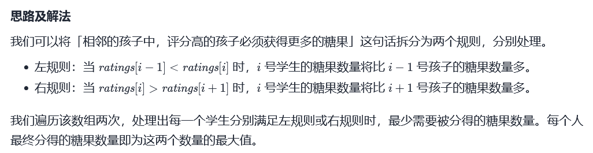

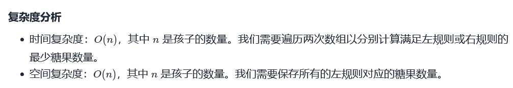

```java
class Solution {
    public int candy(int[] ratings) {
        int[] left = new int[ratings.length];
        int result = 0;
        //左规则
        for(int i = 0; i < ratings.length; i++){
            if(i > 0 && ratings[i] > ratings[i - 1]){
                left[i] = left[i - 1] + 1;
            }else{
                left[i] = 1;
            }
        }
        //右规则
        for(int i = ratings.length - 1; i >= 0; i--){
            int right = 0;
            if(i < ratings.length - 1 && ratings[i] > ratings[i + 1]){
                right = left[i + 1] + 1;
            }else{
                right = 1;
            }
            result += Math.max(right, left[i]);//需要同时满足左右规则
            left[i] = right;                  
        }
        return result;
    }
}
```

## [55. 跳跃游戏](https://leetcode-cn.com/problems/jump-game/)


```java
class Solution {
    public boolean canJump(int[] nums) {
        int right = 0;
        for(int i = 0; i < nums.length; i++){
            if(i > right){
                return false;
            }
            right = Math.max(i + nums[i], right);
        }
        return true;
    }
}
```

## [45. 跳跃游戏 II](https://leetcode-cn.com/problems/jump-game-ii/)


```java
//这个写法比较容易理解
class Solution {
    public int jump(int[] nums) {
        int result = 0;
        int start = 0;
        int end = 0;
        int rightMost = 0;
        for(int i = 0; i < nums.length - 1; i++){
            for(int j = start; j <= end; j++){
                rightMost = Math.max(nums[j] + j, rightMost);
                if(rightMost >= nums.length - 1){
                    result++;
                    return result;
                }
            }
            start = end + 1;
            end = rightMost;
            result++;
        }
        return result;
    }
}

//优化精简版写法
class Solution {
    public int jump(int[] nums) {
        int result = 0;
        int rightMost = 0;
        int end = 0;
        for(int i = 0; i < nums.length - 1; i++){
            rightMost = Math.max(rightMost, i + nums[i]);
            if(end == i){
                result++;
                end = rightMost;
            }
        }
        return result;
    }
}
```

## [179. 最大数](https://leetcode-cn.com/problems/largest-number/)

```java
class Solution {
    public String largestNumber(int[] nums) {
        String[] stringNums = new String[nums.length];
        for(int i = 0; i < nums.length; i++){
            stringNums[i] = nums[i] + "";
        }
        Arrays.sort(stringNums, (o1, o2) -> {
            return (o2 + o1).compareTo(o1 + o2);
        });

        if("0".equals(stringNums[0])){
                return "0";
        }
        
        String result = "";
        for(int i = 0; i < stringNums.length; i++){

            result += stringNums[i];
        }
        return result;
    }
}
```


## [240. 搜索二维矩阵 II](https://leetcode-cn.com/problems/search-a-2d-matrix-ii/)

```java
class Solution {
    public boolean searchMatrix(int[][] matrix, int target) {
        int x = 0;
        int y = matrix[0].length - 1;
        while(x <=  matrix.length - 1 && y >= 0){
            if(matrix[x][y] == target){
                return true;
            }
            if(matrix[x][y] > target){
                y--;
            }else{
                x++;
            }
        }
        return false;
    }
}
```

## [31. 下一个排列](https://leetcode-cn.com/problems/next-permutation/)

```java
class Solution {
    public void nextPermutation(int[] nums) {
        int i = nums.length - 2;
        int n = nums.length - 1;
        //从后向前查找第一个元素nums[i]，使得nums[i] < nums[i + 1]
        while(i >= 0){
            if(nums[i] < nums[i + 1]){
                break;
            }
            i--;
        }
        //若不存在，则代表当前序列最大，那么反转整个序列。
        if(i == -1){
            reverse(nums, i + 1, n);
            return;
        }
        //从后向前查找第一个元素nums[j],使得nums[j] > nums[i]
        int j = n;
        while(j >= i + 1){
            if(nums[j] > nums[i]){
                swap(nums, i, j);
                break;
            }
            j--;
        }
        //反转下标 i + 1 到 n 的元素
        reverse(nums, i + 1, n);
    }
    private void reverse(int[] nums, int i, int j){
        while(i < j){
            swap(nums, i, j);
            i++;
            j--;
        }
    }
    private void swap(int[] nums, int i, int j){
        int temp = nums[i];
        nums[i] = nums[j];
        nums[j] = temp;
    }
}
```


# 位运算

## [面试题 01.01. 判定字符是否唯一](https://leetcode-cn.com/problems/is-unique-lcci/)

```java
//26个英文字母 < 32 位，可以使用int作为hash表
class Solution {
    public boolean isUnique(String astr) {
        int hash = 0;
        int length = astr.length();
        for(int i = 0; i < length; i++){
            int move = astr.charAt(i) - 'a';
            int temp = hash | (1 << move);
            if(temp == hash){
                return false;
            }
            hash = temp;
        }
        return true;
    }
}
```

## [136. 只出现一次的数字](https://leetcode-cn.com/problems/single-number/)

```
//异或

class Solution {
    public int singleNumber(int[] nums) {
        int result  = nums[0];
        for(int i = 1; i < nums.length; i++){
            result = result ^ nums[i];
        }
        return result;
    }
}
```


# 数学

```java
class Solution {
    public String multiply(String num1, String num2) {
        if("0".equals(num1) || "0".equals(num2)){
            return "0";
        }
        int m = num1.length();
        int n = num2.length();
        int[] result = new int[m + n];
        StringBuilder ans = new StringBuilder();
        for(int i = m - 1; i >= 0; i--){
            int value1 = num1.charAt(i) - '0';
            for(int j = n - 1; j >= 0; j--){
                int value2 = num2.charAt(j) - '0';
                int temp = value1 * value2;
                result[m + n - i - j - 2] += temp;
            }
        }
        for(int i = 0; i < result.length; i++){
            int temp = result[i];
            result[i] = temp % 10;
            temp = temp / 10;
            int mark = i + 1;
            while(temp != 0){
                result[mark] += temp % 10;
                temp = temp / 10;
                mark++;
            }
        }
        for(int i = result.length - 1; i >= 0; i--){
            if(i == result.length - 1 && result[i] == 0){
                continue;
            }
            ans.append(result[i]);
        }
        return ans.toString();
        
    }
}
```


## [剑指 Offer II 002. 二进制加法](https://leetcode-cn.com/problems/JFETK5/)

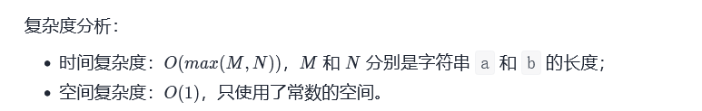

```java
//十分朴素地利用二进制相加概念进行coding
class Solution {
    public String addBinary(String a, String b) {
        StringBuilder result = new StringBuilder();
        int aPointer = a.length() - 1;
        int bPointer = b.length() - 1;
        int maxLength = Math.max(a.length(), b.length());
        int odd = 0;
        while(aPointer >= 0 || bPointer >= 0){
            int aValue = 0;
            int bValue = 0;
            if(aPointer >= 0){
                aValue = a.charAt(aPointer) - '0';
                aPointer--;
            }
            if(bPointer >= 0){
                bValue = b.charAt(bPointer) - '0';
                bPointer--;
            }
            int sum = aValue + bValue + odd;
            result.append((char)(sum % 2 + '0'));
            odd = sum / 2;
        }
        if(odd != 0){
            result.append('1');
        }
        return result.reverse().toString();
    }
}
```


# 设计

## [8. 字符串转换整数 (atoi)](https://leetcode-cn.com/problems/string-to-integer-atoi/)

```java
class Solution {
    public int myAtoi(String s) {
        int result = 0;
        boolean isNagtive = false;
        s = s.trim();
        for(int i = 0; i < s.length(); i++){
            if(i == 0){
                if(s.charAt(i) == '-'){
                    isNagtive = true;
                    continue;
                }else if (s.charAt(i) == '+'){
                    isNagtive = false;
                    continue;
                }
            }

            if(s.charAt(i) <= '9' && s.charAt(i) >= '0'){
                int curr = s.charAt(i) - '0';
                if(isNagtive){
                    if((-1 * result) < (Integer.MIN_VALUE / 10) || ((-1 * result) == (Integer.MIN_VALUE / 10) && (-1 * curr) <= (Integer.MIN_VALUE % 10))){
                        return Integer.MIN_VALUE;
                    }
                }else{
                    if((result > Integer.MAX_VALUE / 10) || ((result == Integer.MAX_VALUE / 10) &&  (curr >= Integer.MAX_VALUE % 10))){
                        return Integer.MAX_VALUE;
                    }
                }
                result = result * 10 + curr;
            }else{
                break;
            }
        }
        if(isNagtive){
            return result * -1;
        } else{
            return result;
        }
    }
}
```

## [232. 用栈实现队列](https://leetcode-cn.com/problems/implement-queue-using-stacks/)

```java
class MyQueue {

    private Deque<Integer> mainStack;
    private Deque<Integer> supportStack;

    public MyQueue() {
        mainStack = new LinkedList<>();
        supportStack = new LinkedList<>();
    }
    
    public void push(int x) {
        mainStack.push(x);
    }
    
    public int pop() {
        if(supportStack.isEmpty()){
            while(!mainStack.isEmpty()){
                supportStack.push(mainStack.pop());
            }
            
        }
         return supportStack.pop();
        
    }
    
    public int peek() {
        if(supportStack.isEmpty()){
            while(!mainStack.isEmpty()){
                supportStack.push(mainStack.pop());
            }
            
        }
         return supportStack.peek();
    }
    
    public boolean empty() {
        return mainStack.isEmpty() && supportStack.isEmpty();
    }
}

/**
 * Your MyQueue object will be instantiated and called as such:
 * MyQueue obj = new MyQueue();
 * obj.push(x);
 * int param_2 = obj.pop();
 * int param_3 = obj.peek();
 * boolean param_4 = obj.empty();
 */
```


## [146. LRU 缓存](https://leetcode-cn.com/problems/lru-cache/)

**双向链表+HashMap**

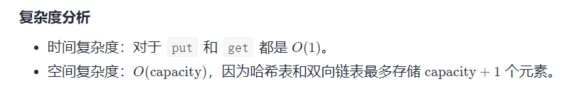

```java
class LRUCache {
    private DoubleList head;
    private DoubleList tail;
    private int capacity;
    private int size;
    private HashMap<Integer, DoubleList> map;


    public LRUCache(int capacity) {
        this.head = new DoubleList();
        this.tail = new DoubleList();
        head.next = tail;
        tail.prev = head;
        this.capacity = capacity;
        this.size = 0;
        this.map = new HashMap<>();
    }
    
    public int get(int key) {
        DoubleList node = map.get(key);
        if(node != null){
            moveToHead(node);
            return node.val;
        }
        return -1;
    }
    
    public void put(int key, int value) {
        DoubleList node = map.get(key);
        if(node != null){
            node.val = value;
            moveToHead(node);
        }else{
            DoubleList addNode = new DoubleList(key, value);
            map.put(key, addNode);
            addToHead(addNode);
            if(size > capacity){          
                DoubleList tail =  removeTail();
                map.remove(tail.key);
            } 
        }
    }

    private void addToHead(DoubleList node){
        node.prev = head;
        node.next = head.next;
        head.next.prev = node;
        head.next = node;
        size++;
    }

    private void moveToHead(DoubleList node){
        removeNode(node);
        addToHead(node);
    }
    private void removeNode(DoubleList node){
        node.prev.next = node.next;
        node.next.prev = node.prev;
        size--;
    }

    private DoubleList removeTail(){
        DoubleList result = tail.prev;
        removeNode(result);
        return result;
    }


    class DoubleList{
        public DoubleList prev;
        public DoubleList next;
        public int val;
        public int key;
        public DoubleList(){}
        public DoubleList(int key, int val){
            this.key = key;
            this.val = val;
        }
    }

}

/**
 * Your LRUCache object will be instantiated and called as such:
 * LRUCache obj = new LRUCache(capacity);
 * int param_1 = obj.get(key);
 * obj.put(key,value);
 */
```


## [468. 验证IP地址](https://leetcode-cn.com/problems/validate-ip-address/)

```java
class Solution {
    public String validIPAddress(String queryIP) {
        String[] ipv4 = queryIP.split("\\.");   // 一定要\\转义字符
        String[] ipv6 = queryIP.split(":");
        if(validIpv4(ipv4) && ipv4Count(queryIP)){
            return "IPv4" ;
        }
        if(validIpv6(ipv6) && ipv6Count(queryIP)){
            return "IPv6";
        }
        
        return "Neither";
        
    }

    //如果是ipv4格式的话 数一下有几个 .
    private boolean ipv4Count(String queryIP){
        int curr = 0;
        for(int i = 0; i < queryIP.length(); i++){
            if(queryIP.charAt(i) == '.'){
                curr++;
            }
        }
        if(curr == 3){
            return true;
        }else {
            return false;
        }
    }

    //如果是ipv6格式的话 数一下有几个 :
    private boolean ipv6Count(String queryIP){
        int curr = 0;
        for(int i = 0; i < queryIP.length(); i++){
            if(queryIP.charAt(i) == ':'){
                curr++;
            }
        }
        if(curr == 7){
            return true;
        }else {
            return false;
        }
    }

    private boolean validIpv4(String[] ipv4){
        //没有四个字符串的话肯定不符合
        if(ipv4.length != 4){
            return false;
        }
        for(int i = 0; i < 4; i++){
            //空串的话肯定不符合
            if(ipv4[i] == null || "".equals(ipv4[i])){
                return false;
            }
            int curr = 0;
            for(int j = 0; j < ipv4[i].length(); j++){
                //当前字符串长度最多为3
                if(ipv4[i].length() > 3){
                    return false;
                }
                //当前字符串不能有前导0
                if(j == 0 && ipv4[i].charAt(j) == '0'){
                    if(ipv4[i].length() != 1){
                        return false;
                    }
                }
                //当前字符必须为数字
                if(ipv4[i].charAt(j) >= '0' && ipv4[i].charAt(j) <= '9'){
                    curr = curr * 10 + (ipv4[i].charAt(j) - '0'); 
                }else{
                    return false;
                }
                //当前字符串不能超过255
                if(curr > 255){
                    return false;
                }
            }
        }
        return true;
    }

        private boolean validIpv6(String[] ipv6){
        //没有八个字符串的话肯定不符合
        if(ipv6.length != 8){
            return false;
        }
        for(int i = 0; i < 8; i++){
            //当前字符串为空的话肯定不符合
            if(ipv6[i] == null || "".equals(ipv6[i])){
                return false;
            }
            for(int j = 0; j < ipv6[i].length(); j++){
                //当前字符串长度最多为4
                if(ipv6[i].length() > 4){
                    return false;
                }
                //当前字符必须为十六进制数
                if(!(
                (ipv6[i].charAt(j) >= '0' && ipv6[i].charAt(j) <= '9') ||
                (ipv6[i].charAt(j) >= 'a'&& ipv6[i].charAt(j) <= 'f') ||
                (ipv6[i].charAt(j) >= 'A'&& ipv6[i].charAt(j) <= 'F') 
                )){
                    return false;
                }
            }
        }
        return true;
    }
}
```


# 理论

## 哈希相关理论

### 散列函数


### 布隆过滤器

#### 概念

- **布隆过滤器**（英语：Bloom Filter）是1970年由布隆提出的。它实际上是一个很长的二进制向量和一系列随机[映射函数。布隆过滤器可以用于检索一个元素是否在一个集合中。它的**优点**是空间效率和查询时间都远远超过一般的算法，**缺点**是有一定的**误识别率**（已经记录过的数据肯定能够识别，没被记录过可能会被误报成被记录过的）和**删除困难**。

#### 原理

- 布隆过滤器的原理是，当一个元素被加入集合时，通过K个散列函数将这个元素映射成一个位数组（bitarray，bitmap）中的K个点，把它们置为1。检索时，我们只要看看这些点是不是都是1就（大约）知道集合中有没有它了：如果这些点有任何一个0，则被检元素一定不在；如果都是1，则被检元素很可能在。这就是布隆过滤器的基本思想。

#### 公式

- 假设**样本数量**为n，**失误率**为p，则布隆过滤器需要的**位**的大小为：

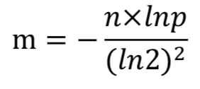

- 所需要**散列函数个数**为k：

  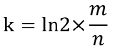

- 假设布隆过滤器真实的**大小**为m，并且使用了k个**散列函数**，那么设计出的布隆过滤器真实的失误率p为：

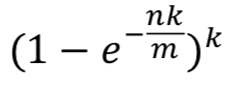

#### 应用

- **网页爬虫对URL的去重**：避免爬去相同的URL地址

- **黑名单**：可以存储十亿个邮箱或者网站的黑名单。

- **解决数据库缓存击穿**：黑客攻击服务器时，会构建大量不存在于缓存中的key向服务器发起请求，在数据量足够大的时候，频繁的数据库查询会导致挂机。将所有可能存在的数据哈希到布隆过滤器中，一个一定不存在的数据会被拦截掉，从而避免了对底层存储系统的查询压力。

  

### 一致性哈希算法

#### 解决的问题

- 在使用n台缓存服务器时，一种常用的负载均衡方式是：对资源的请求使用模运算来映射到某一台缓存服务器。当增加或减少一台缓存服务器时这种方式可能会改变所有资源对应的hash值，也就是所有的缓存都失效了，这会使得缓存服务器大量集中地向原始内容服务器更新缓存。
- 因此需要一致哈希算法来避免这样的问题： 一致哈希尽可能使同一个资源映射到同一台缓存服务器。这种方式要求增加一台缓存服务器时，新的服务器尽量分担存储其他所有服务器的缓存资源。减少一台缓存服务器时，其他所有服务器也可以尽量分担存储它的缓存资源。 一致哈希算法的主要思想是将每个缓存服务器与一个或多个哈希值域区间关联起来，其中区间边界通过计算缓存服务器对应的哈希值来决定。（定义区间的哈希函数不一定和计算缓存服务器哈希值的函数相同，但是两个函数的返回值的范围需要匹配。)如果一个缓存服务器被移除，则它所对应的区间会被并入到邻近的区间，其他的缓存服务器不需要任何改变。

#### 概念

- 一致性哈希算法（Consistent Hashing）最早在论文《[Consistent Hashing and Random Trees: Distributed Caching Protocols for Relieving Hot Spots on the World Wide Web](http://dl.acm.org/citation.cfm?id=258660)》中被提出，是一种特殊的哈希算法。目的是解决分布式缓存的问题。 在移除或者添加一个服务器时，能够尽可能小地改变已存在的服务请求与处理请求服务器之间的映射关系。一致性哈希解决了简单哈希算法在分布式哈希表( Distributed Hash Table，DHT) 中存在的动态伸缩等问题 。

#### 原理

- 系统将可用的节点机器（Node）利用Hash函数映射到一个圆环（假设圆环长度为2<sup>32</sup>）的不同位置。
- 将对象（Object）也利用Hash函数映射到一个圆环的不同位置。
- 在对象和节点都映射至同一个哈希环之后，要确定某个对象映射至哪个节点， 只需从该对象的位置开始，沿着哈希环顺时针方向查找，找到的第一个节点，即是所属节点。


#### 删除节点

 当删除一台节点机器（Node C）时，只需要将这台机器上保存的所有对象移动到下一台机器（Node D）即可。影响的只是下一台服务器（Node D）和对象（Object C）映射的节点位置。不会影响其他节点。

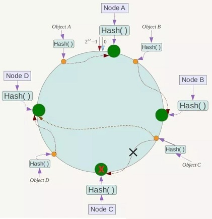

#### 增加节点

添加节点（Node X），只需要将节点映射到环上即可，影响的只是对象（Object C）映射的节点位置。不会影响其他节点。


#### 虚拟节点

一致性哈希算法在服务节点太少时，容易因为节点分部不均匀而造成数据倾斜问题。例如系统中只有两台服务器，其环分布如下，


为了解决这种数据倾斜问题，一致性哈希算法引入了虚拟节点机制，即对每一个服务节点计算多个哈希，每个计算结果位置都放置一个此服务节点，称为虚拟节点。具体做法可以在服务器ip或主机名的后面增加编号来实现。例如上面的情况，可以为每台服务器计算三个虚拟节点，于是可以分别计算 “Node A#1”、“Node A#2”、“Node A#3”、“Node B#1”、“Node B#2”、“Node  B#3”的哈希值。

同时数据定位算法不变，只是多了一步虚拟节点到实际节点的映射，例如定位到“Node A#1”、“Node A#2”、“Node  A#3”三个虚拟节点的数据均定位到Node  A上。这样就解决了服务节点少时数据倾斜的问题。在实际应用中，通常将虚拟节点数设置为32甚至更大，因此即使很少的服务节点也能做到相对均匀的数据分布。


