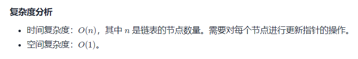

# 十大排序算法

| 排序算法 |  平均时间复杂度  | 最好情况 |     最坏情况     | 空间复杂度 | 排序方式 | 稳定性 |
| :------: | :--------------: | :------: | :--------------: | :--------: | :------: | :----: |
| 冒泡排序 | O(N<sup>2</sup>) |   O(N)   | O(N<sup>2</sup>) |    O(1)    | 内部排序 |  稳定  |
|          |                  |          |                  |            |          |        |
|          |                  |          |                  |            |          |        |
|          |                  |          |                  |            |          |        |
|          |                  |          |                  |            |          |        |
|          |                  |          |                  |            |          |        |
|          |                  |          |                  |            |          |        |
|          |                  |          |                  |            |          |        |
|          |                  |          |                  |            |          |        |
|          |                  |          |                  |            |          |        |


## 1.冒泡排序

### 1.原版

```java
public static void main(String[] args) {
    int[] array = new int[]{5,8,6,3,4,9,2,1,7};
    sort(array);
    System.out.println(Arrays.toString(array));
}

public static void sort(int[] array){
    int length = array.length;
    for(int i = 0; i < length - 1; i++){
        for(int j = 0; j < length - i - 1; j++){
            //升序
            if(array[j] > array[j+1]){
                swap(array, j, j + 1);
            }
        }
    }
}

public static void swap(int[] array, int i, int j){
    int temp = array[i];
    array[i] = array[j];
    array[j] = temp;
}
```

### 2.改进版1——当数组有序后不再进行剩下的排序

```java
public static void main(String[] args) {
    int[] array = new int[]{5,8,6,3,4,9,2,1,7};
    sort(array);
    System.out.println(Arrays.toString(array));
}

public static void sort(int[] array){
    //有序标记，每一轮的初始值都是true
    int length = array.length;
    for(int i = 0; i < length - 1; i++){
        boolean isSorted = true;
        for(int j = 0; j < length - i - 1; j++){
            //升序
            if(array[j] > array[j+1]){
                swap(array, j, j + 1);
                //因为有元素进行交换，所以不是有序的，标记变为false
                isSorted = false;
            }
        }
        //如果没有匀速进行交换，则说明数组已经有序，跳出循环
        if(isSorted){
            break;
        }
    }
}

public static void swap(int[] array, int i, int j){
    int temp = array[i];
    array[i] = array[j];
    array[j] = temp;
}
```

### 3.改进版2——避免有序区的重复比较

```java
    public static void main(String[] args) {
        int[] array = new int[]{3,4,2,1,5,6,7,8};
        sort(array);
        System.out.println(Arrays.toString(array));
    }

    public static void sort(int[] array){
        //有序标记，每一轮的初始值都是true
        int length = array.length;
        //无序数列的边界，每次比较只需要比到这里为止
        int sortedBorder = length - 1;
        //记录最后一次交换的位置
        int lastExchangeIndex = 0;

        for(int i = 0; i < length - 1; i++){
            boolean isSorted = true;
            for(int j = 0; j < sortedBorder; j++){
                //升序
                if(array[j] > array[j+1]){
                    swap(array, j, j + 1);
                    //因为有元素进行交换，所以不是有序的，标记变为false
                    isSorted = false;
                    //更新为最后一次交换元素的位置
                    lastExchangeIndex = j;
                }
            }
            //更新有序区的边界
            sortedBorder = lastExchangeIndex;
            //如果没有匀速进行交换，则说明数组已经有序，跳出循环
            if(isSorted){
                break;
            }
        }
    }

    public static void swap(int[] array, int i, int j){
        int temp = array[i];
        array[i] = array[j];
        array[j] = temp;
    }
```

# 数组

## 1.二分查找

### 1.[704. 二分查找](https://leetcode-cn.com/problems/binary-search)

```java
/*
target在[left, right) 区间内的写法
*/
class Solution {
    public int search(int[] nums, int target) {
        int left = 0, right = nums.length;
        while(left < right){
            int mid = ((right - left) >> 1)+ left;
            if(nums[mid] < target){
                left = mid + 1;
            }else if(nums[mid] > target){
                right = mid;
            }else{
                return mid;
            }
        }
        return -1;
    }
}


/*
target在[left, right] 区间内的写法
*/
class Solution {
    public int search(int[] nums, int target) {
        int left = 0, right = nums.length - 1;
        while(left <= right){
            int mid = ((right - left) >> 1)+ left;
            if(nums[mid] < target){
                left = mid + 1;
            }else if(nums[mid] > target){
                right = mid - 1;
            }else{
                return mid;
            }
        }
        return -1;
    }
}
```

## 2.双指针

#### [15. 三数之和](https://leetcode-cn.com/problems/3sum/)


```java
class Solution {
    public List<List<Integer>> threeSum(int[] nums) {
        List<List<Integer>> result = new ArrayList<>();
        if(nums == null || nums.length < 3){
            return result;
        }
        Arrays.sort(nums);
        for(int i = 0; i < nums.length; i++){
            if(nums[i] > 0){
                return result;
            }
            if(i > 0 && nums[i] == nums[i-1]){
                continue;
            }
            int left = i + 1;
            int right = nums.length - 1;
            int target = 0 - nums[i];
            while(left < right){
                if(nums[left] + nums[right] < target){
                    left++;
                }else if(nums[left] + nums[right] > target){
                    right--;
                }else{
                    result.add(Arrays.asList(nums[i], nums[left], nums[right]));
                    while(left < right && nums[left] == nums[left + 1]){
                        left++;
                    }
                    while(left < right && nums[right] == nums[right - 1]){
                        right--;
                    }
                    left++;
                    right--;
                }
            }
        }
            return result;
    }
}
```

#### [18. 四数之和](https://leetcode-cn.com/problems/4sum/)


```java
//注意整形溢出
class Solution {
    public List<List<Integer>> fourSum(int[] nums, int target) {
        List<List<Integer>> result = new ArrayList<>();
        if(nums == null || nums.length < 4){
            return result;
        }
        Arrays.sort(nums);
        for(int i = 0; i < nums.length - 3; i++){
			//剪枝：接下来的数之和大于目标数，则不用继续判断之后的数了
            if((long)nums[i] + nums[i + 1] + nums[i + 2] + nums[i + 3] > target){
                return result;
            }
            //重复则跳过
            if(i > 0 && nums[i] == nums[i - 1]){
                continue;
            }
            //剪枝：如果第一个数加上最大的三个数还是小于目标数，说明要将第一个数变大
            if ((long) nums[i] + nums[nums.length - 3] + nums[nums.length - 2] + nums[nums.length - 1] < target) {
                continue;
            }


            for(int j = i + 1; j < nums.length - 2; j++){
                //剪枝：接下来的数之和大于目标数，则不用继续判断之后的数了
                if((long)nums[j] + nums[j + 1] + nums[j + 2]> target - nums[i]){
                    break;
                }
                //重复则跳过
                if(j > i + 1 && nums[j] == nums[j - 1]){
                    continue;
                }
                //剪枝：如果第一个（已知）和第二个数 加上最大的二个数还是小于目标数，说明要将第二个数变大
                if ((long) nums[j] + nums[nums.length - 2] + nums[nums.length - 1] < target - nums[i]) {
                    continue;
                }
                //下面与三数之和一样
                int left = j + 1;
                int right = nums.length - 1;
                while(left < right){ 
                    long sum =  nums[i] + nums[j] + nums[left] + nums[right];
                    if(sum < target){
                        left++;
                    }else if(sum > target){
                        right--;
                    }else{
                        result.add(Arrays.asList(nums[i], nums[j], nums[left], nums[right]));
                        while(left < right && nums[left] == nums[left + 1]){
                            left++;
                        }
                        while(left < right && nums[right] == nums[right - 1]){
                            right--;
                        }
                        left++;
                        right--;
                    }
                }
            }
        }
        return result;
    }
}
```


#### [11. 盛最多水的容器](https://leetcode-cn.com/problems/container-with-most-water/)

```java
//S(i,j)=min(h[i],h[j])×(j−i)
//1.若向内 移动短板 ，水槽的短板 min(h[i],h[j]  可能变大，因此下个水槽的面积 可能增大 。
//2.若向内 移动长板 ，水槽的短板 min(h[i],h[j]) 不变或变小，因此下个水槽的面积 一定变小 。
//时间复杂度：O(N)  空间复杂度：O(1)
class Solution {
    public int maxArea(int[] height) {
        int left = 0, right = height.length - 1, ans = 0;
        boolean flag = true;
        while(left <= right){
            if(height[left] <= height[right]){
                ans = Math.max(ans, height[left] * (right - left));
                left++;
            }else{
                ans = Math.max(ans, height[right] * (right - left));
                right--;
            }
        }
        return ans;
    }
}
```


#### [611. 有效三角形的个数](https://leetcode-cn.com/problems/valid-triangle-number/)


```java
//然后固定最长边，使用双指针法
//空间复杂度:O(N^2),时间复杂度:O(1)
class Solution {
    public int triangleNumber(int[] nums) {
        if(nums == null || nums.length < 3){
            return 0;
        }
        int result = 0;
        Arrays.sort(nums);
        for(int i = nums.length - 1; i >= 0; i--){
            int start = 0, end = i - 1;
            while(start < end){
                if(nums[i] < nums[start] + nums[end]){
                    result += end - start;
                    end--;
                }else{
                    start++;
                }    
            }
        }
        return result;
    }
}
```


## 3.利用哈希表

### 1.原地哈希

#### [剑指 Offer 03. 数组中重复的数字](https://leetcode-cn.com/problems/shu-zu-zhong-zhong-fu-de-shu-zi-lcof/)

```java
//使用哈希表查重
//空间复杂度:O(N),时间复杂度:O(N)
class Solution {
    public int findRepeatNumber(int[] nums) {
        Set<Integer> dic = new HashSet<>();
        for(int num : nums) {
            if(dic.contains(num)) return num;
            dic.add(num);
        }
        return -1;
    }
}
//使用原地哈希表查重
//空间复杂度:O(N),时间复杂度:O(1)
class Solution {
    public int findRepeatNumber(int[] nums) {
        int i = 0;
        while(i < nums.length){
            if(nums[i] == i){
                i++;
                continue;
            }
            if(nums[nums[i]] == nums[i]){
                return nums[i];
            }
            int temp = nums[i];
            nums[i] = nums[temp];
            nums[temp] = temp;
        }
        return -1;
    }
} 
```

#### [448. 找到所有数组中消失的数字](https://leetcode-cn.com/problems/find-all-numbers-disappeared-in-an-array/)

```java
//题目要求空间复杂度达到O(1)
//使用原地哈希表查重
class Solution {
    public List<Integer> findDisappearedNumbers(int[] nums) {    
        for(int i = 0; i < nums.length; i++){
            while(nums[i] != nums[nums[i] - 1]){
                int temp = nums[nums[i] - 1];
                nums[nums[i] - 1] = nums[i] ;
                nums[i] = temp; 
            }
        }
        List<Integer> result = new ArrayList<>();
        for(int i = 0; i < nums.length; i++){
            if(nums[i] != i + 1){
                result.add(i + 1);
            }
        }
        return result;
    }
}


//题目要求空间复杂度达到O(1)
//使用原地哈希表查重
/*
对于第 i 个数字 nums[i]，我们位置 (nums[i] - 1) % n 的位置增加 n，这样不会覆盖原数组，因为 (nums[i] - 1) % n = (nums[i] - 1 + n) % n，这样如果最后遍历完数组，nums[i] 小于等于 n，就是数组中中消失的数字。
*/

class Solution {
    public List<Integer> findDisappearedNumbers(int[] nums) { 
        int n = nums.length;   
        for(int i = 0; i < n; i++){
            int x = (nums[i] - 1) % n;
            nums[x] += n;
        }
        List<Integer> result = new ArrayList<>();
        for(int i = 0; i < n; i++){
            if(nums[i] <= n){
                result.add(i + 1);
            }
        }
        return result;
    }
}
```

#### [41. 缺失的第一个正数](https://leetcode-cn.com/problems/first-missing-positive/)


```java
//题目要求空间复杂度达到O(1)
//使用原地哈希表查重
class Solution {
    public int firstMissingPositive(int[] nums) {
        int length = nums.length;
        for(int i = 0; i < nums.length; i++){
            while(nums[i] <= nums.length && nums[i] > 0 && nums[i] != nums[nums[i] - 1]){
                int temp = nums[nums[i] - 1];
                nums[nums[i] - 1] = nums[i];
                nums[i] = temp;
            }
        }
        int result = 0;
        for(int i = 0; i < nums.length; i++){
            if(nums[i] != i + 1){
                return i + 1;
            }
        }
        return nums.length + 1;
    }
}
```

### 2.使用额外空间

#### [128. 最长连续序列](https://leetcode-cn.com/problems/longest-consecutive-sequence/)


```java
class Solution {
    public int longestConsecutive(int[] nums) {
        Set<Integer> numSet = new HashSet<>();
        for(int num : nums){
            numSet.add(num);
        }
        int result = 0;
        for(int num : numSet){
            if(!numSet.contains(num - 1)){
                int currentNum = num + 1;
                int currentMax = 1;
                while(numSet.contains(currentNum)){
                    currentNum++;
                    currentMax++;
                }
                result = Math.max(currentMax, result);
            }       
        }
        return result;
    }
}

```

#### [349. 两个数组的交集](https://leetcode-cn.com/problems/intersection-of-two-arrays/)

```java
class Solution {
    public int[] intersection(int[] nums1, int[] nums2) {
        Set<Integer> set = new HashSet<>();
        Set<Integer> result = new HashSet<>();
        for(int i = 0; i < nums1.length; i++){
            set.add(nums1[i]);
        }
        for(int i = 0; i < nums2.length; i++){
            if(set.contains(nums2[i])){
                result.add(nums2[i]);
            }
        }
        int[] ans = new int[result.size()];
        int i = 0;
        for(int e : result){
            ans[i] = e;
            i++;
        }
        return ans;
        
    }
}
```


# 字符串

## 1.KMP算法

```java
    public static void main(String[] args) {
        String target = "aabaabaafa";
        String template = "aabaaf";
        System.out.println(Arrays.toString(getNext(template)));
        System.out.println("匹配结果：" + strStr(target, template));
    }

	//求模式串的next数组
    public static int[] getNext(String template){
        int length = template.length();
        int next[] = new int[length];
        /*i为后缀末尾，从[1] - [length - 1]
          j为前缀末尾，从[0] - [length - 2]*/
        int j = 0;
        for(int i = 1; i < length; i++){
            /*前后缀不相同时，需要一直回退*/
            while(j > 0 && template.charAt(i) != template.charAt(j)){
                j = next[j - 1];
            }
            /*前后缀相同时，j++*/
            if(template.charAt(i) == template.charAt(j)){
                j++;
            }
            /*更新next[i]*/
            next[i] = j;
        }
        return next;
    }

	//匹配函数
    public static int strStr(String target, String template){
        if(template.length() == 0){
            return 0;
        }
        int[] next = getNext(template);
        int j = 0;
        for(int i = 0; i < target.length(); i++){
            /*如果当前模式串索引为j的字符 与 文本串索引为i的字符不匹配， 注意：j = 0 时不匹配，下面的代码都不执行，j不动，i++
            j指针应该移动到next[j-1]的地方，重新进行匹配*/
            while (j > 0 && target.charAt(i) != template.charAt(j)){
                j = next[j - 1];
            }
            /*如果匹配，j指针后移*/
            if(target.charAt(i) == template.charAt(j)){
                j++;
            }
            if(j == template.length()){
                return i - template.length() + 1;
            }
        }
        return -1;
    }
```

### [14. 最长公共前缀](https://leetcode-cn.com/problems/longest-common-prefix/)

```java
class Solution {
    public String longestCommonPrefix(String[] strs) {
        if(strs == null || strs.length == 0){
            return "";
        }
        //将第一个字符串作为基准
        //循环的设计需要仔细思考
        for(int i = 0; i < strs[0].length(); i++){
            char temp = strs[0].charAt(i);
            for(int j = 1; j < strs.length; j++){
                if(i >= strs[j].length() || strs[j].charAt(i) != temp){
                    return strs[0].substring(0, i);
                }
            }
        }
        return strs[0];
    }
}
```


# 链表

## 1.双指针

#### [24. 两两交换链表中的节点](https://leetcode-cn.com/problems/swap-nodes-in-pairs/)



```java
class Solution {
    public String decodeString(String s) {
        Deque<StringBuilder> stack = new LinkedList<>();
        Deque<Integer> times = new LinkedList<>();
        StringBuilder result = new StringBuilder();
        char[] charArray = s.toCharArray();
        int tempTime = 0;

        for(char c : charArray){
            if(Character.isDigit(c)){
                tempTime = tempTime * 10 + c - '0';
            }else if(Character.isLetter(c)){
                result.append(c);
            }else if(c == '['){
                stack.push(result);
                times.push(tempTime);
                tempTime = 0;
                result = new StringBuilder();
            }else{
                int currTime = times.pop();
                StringBuilder topStr = stack.pop();
                StringBuilder tempStr = new StringBuilder();
                for(int i = 0; i < currTime; i++){
                    tempStr.append(result);
                }
                result = topStr.append(tempStr);
            }
        }
        return result.toString();
        
    }
}
```

# 树

## 深度遍历优先DFS

### 2.前序遍历

#### [剑指 Offer 26. 树的子结构](https://leetcode-cn.com/problems/shu-de-zi-jie-gou-lcof/)

```java
/**
 * Definition for a binary tree node.
 * public class TreeNode {
 *     int val;
 *     TreeNode left;
 *     TreeNode right;
 *     TreeNode(int x) { val = x; }
 * }
 */
class Solution {
    public boolean isSubStructure(TreeNode A, TreeNode B) {
        if(A == null || B == null){
            return false;
        }
        return solve(A, B) || isSubStructure(A.left, B) || isSubStructure(A.right, B);
    }

    public boolean solve(TreeNode A, TreeNode B){
        if(B == null){
            return true;
        }
        if(A == null || A.val != B.val){
            return false;
        }
        return solve(A.left, B.left) && solve(A.right, B.right);
    }
}
```


### 2.后序遍历

#### [236. 二叉树的最近公共祖先](https://leetcode-cn.com/problems/lowest-common-ancestor-of-a-binary-tree/)

```java
//时间复杂度：O(n)，空间复杂度：O(n)
class Solution {
    
    public TreeNode lowestCommonAsncestor(TreeNode root, TreeNode p, TreeNode q) {
        if(root == null){
            return null;
        }
        TreeNode left = lowestCommonAncestor(root.left, p, q);
        TreeNode right = lowestCommonAncestor(root.right, p, q);
        if(root == p || root == q){
            return root;
        }else if(left != null && right == null){
            return left;
        }else if(left == null && right != null){
            return right;
        }else if(left != null && right != null){
            return root;
        }
        return null;
    }
}
```


## 二叉搜索树

### [700. 二叉搜索树中的搜索](https://leetcode-cn.com/problems/search-in-a-binary-search-tree/)

```java
/**
 * Definition for a binary tree node.
 * public class TreeNode {
 *     int val;
 *     TreeNode left;
 *     TreeNode right;
 *     TreeNode() {}
 *     TreeNode(int val) { this.val = val; }
 *     TreeNode(int val, TreeNode left, TreeNode right) {
 *         this.val = val;
 *         this.left = left;
 *         this.right = right;
 *     }
 * }
 */
class Solution {
    public TreeNode searchBST(TreeNode root, int val) {
        if(root == null || root.val == val){
            return root;
        }
        if(val > root.val){
            return searchBST(root.right, val);
        }else{
            return searchBST(root.left, val);
        }
    }
}
```


# 栈

## [394. 字符串解码](https://leetcode-cn.com/problems/decode-string/)

```java
class Solution {
    public String decodeString(String s) {
        Deque<StringBuilder> stack = new LinkedList<>();
        Deque<Integer> times = new LinkedList<>();
        StringBuilder result = new StringBuilder();
        char[] charArray = s.toCharArray();
        int tempTime = 0;

        for(char c : charArray){
            if(Character.isDigit(c)){
                tempTime = tempTime * 10 + c - '0';
            }else if(Character.isLetter(c)){
                result.append(c);
            }else if(c == '['){
                stack.push(result);
                times.push(tempTime);
                tempTime = 0;
                result = new StringBuilder();
            }else{
                int time = times.pop();
                StringBuilder topStr = stack.pop();
                StringBuilder temp = new StringBuilder();
                for(int i = 0; i < time; i++){
                    temp.append(result);
                }
                result = topStr.append(temp);
            }
        }
        return result.toString();
        
    }
}
```


# 图

# 动态规划

## 子序列问题

### 1.单串

#### 1.LIS

##### [300. 最长递增子序列](https://leetcode-cn.com/problems/longest-increasing-subsequence/) (LIS)

```java
//动态规划
//时间复杂度：O(n^2)，空间复杂度：O(n)
class Solution {
    public int lengthOfLIS(int[] nums) {
        int[] dp = new int[nums.length];
        int ans = 0;
        for(int i = 0; i < nums.length; i++){
            dp[i] = 1;
            for(int j = 0; j < i; j++){
                if(nums[i] > nums[j]){
                    dp[i] = Math.max(dp[i], dp[j] + 1);
                }
            }
            ans = Math.max(ans, dp[i]);
        }
        return ans;
    }
}


//动态规划 + 二分查找
//时间复杂度：O(nlogn)，空间复杂度：O(n)
class Solution {
    public int lengthOfLIS(int[] nums) {
        int[] dp = new int[nums.length];
        int ans = 0;
        for(int i = 0; i < nums.length; i++){
            int left = 0, right = ans;
            while(left < right){
                int mid = (left + right) / 2;
                if(dp[mid] >= nums[i]){
                    right = mid;
                }else{
                    left = mid + 1;
                }
            }
            dp[right] = nums[i];
            if(ans == right){ans++;}
        }
        return ans;
    }
}
```

##### [673. 最长递增子序列的个数](https://leetcode-cn.com/problems/number-of-longest-increasing-subsequence/)(LIS)


##### [354. 俄罗斯套娃信封问题](https://leetcode-cn.com/problems/russian-doll-envelopes/)(LIS)

```java
//定制排序 + 动态规划
//时间复杂度：O(n^2)，空间复杂度：O(n)
class Solution {
    public int maxEnvelopes(int[][] envelopes) {
        int[] dp = new int[envelopes.length];
        int ans = 0;
        Arrays.sort(envelopes, (o1, o2) -> {
            if(o1[0] != o2[0]){
                return o1[0] - o2[0];
            }else{
                return o2[1] - o1[1];
            }
        });

        for(int i = 0; i < envelopes.length; i++){
            dp[i] = 1;
            for(int j = 0; j < i; j++){
                if(envelopes[i][0] > envelopes[j][0] && envelopes[i][1] > envelopes[j][1]){
                    dp[i] = Math.max(dp[i], dp[j] + 1);
                }
            }
            ans = Math.max(ans, dp[i]);
        }
        return ans;
    }
}


//定制排序 + 动态规划 + 二分查找
//时间复杂度：O(nlogn)，空间复杂度：O(n)
class Solution {
    public int maxEnvelopes(int[][] envelopes) {
        int ans = 0;
        int[] tails = new int[envelopes.length];

        //比起之前的LIS多了一个定制排序
        Arrays.sort(envelopes, (o1, o2) -> {
            if(o1[0] != o2[0]){
                return o1[0] - o2[0];
            }else{
                return o2[1] - o1[1];
            }
        });

        //因为排序过了，所以只需要考虑width维度
        for(int i = 0; i < envelopes.length; i++){
            int left = 0, right = ans;
            while(left < right){
                int mid = ((right - left) >> 1) + left;
                if(tails[mid] >= envelopes[i][1]){
                    right = mid;
                }else {
                    left = mid + 1;
                }
            }
            tails[right] = envelopes[i][1];
            if(right == ans) ans++;
        } 
         return ans;
    }
}
```


#### [32. 最长有效括号](https://leetcode-cn.com/problems/longest-valid-parentheses/)

```java
class Solution {
    public int longestValidParentheses(String s) {
        int result = 0;
        int length = s.length();
        int[] dp = new int[length];//以第i个字符结尾的最长有效子串的长度
        for(int i = 1; i < length; i++){
            if(s.charAt(i) == ')'){
                if(s.charAt(i - 1) == '('){
                    dp[i] = 2;
                    if(i - 2 >= 0){
                        dp[i] += dp[i - 2];
                    }
                }else{
                    if(i - dp[i - 1] - 1 >= 0 && s.charAt(i - dp[i - 1] - 1) == '('){
                        dp[i] = dp[i - 1] + 2;
                        if(i - dp[i - 1] - 2 >= 0){
                            dp[i] += dp[i - dp[i - 1] - 2];
                        }
                    }
                }
            }
            result = Math.max(result, dp[i]);
        }
        return result;
    }
}
```


### 2.双串

#### 1.LCS


#### 2.字符串匹配问题

##### [72. 编辑距离](https://leetcode-cn.com/problems/edit-distance/)

##### [10. 正则表达式匹配](https://leetcode-cn.com/problems/regular-expression-matching/)


```java
class Solution {
    public boolean isMatch(String s, String p) {
        //dp[i][j]表示s的前i个字符与p的前j个字符是否能匹配。
        boolean[][] dp = new boolean[s.length() + 1][p.length() + 1];
        dp[0][0] = true;
        for(int i = 0; i <= s.length(); i++){
            for(int j = 1; j <= p.length(); j++){
                if(p.charAt(j - 1) == '*'){
                    if(matches(s, p, i, j - 1)){
                        dp[i][j] = dp[i][j - 2] || dp[i - 1][j];
                    }else{
                        dp[i][j] = dp[i][j - 2];
                    }
                }else{
                    if(matches(s, p, i, j)){
                        dp[i][j] = dp[i - 1][j - 1];
                    }else{
                        dp[i][j] = false;
                    }
                }
            }
        }
        return dp[s.length()][p.length()];
    }
        public boolean matches(String s, String p, int i, int j) {
        if (i == 0) {
            return false;
        }
        if (p.charAt(j - 1) == '.') {
            return true;
        }
        return s.charAt(i - 1) == p.charAt(j - 1);
    }
}
```

## 前缀和问题

### [724. 寻找数组的中心下标](https://leetcode-cn.com/problems/find-pivot-index/)


```java
//简单的前缀和：total = nums[i] + sumLeft + sumRight 其中 sumLeft = sumRight
class Solution {
    public int pivotIndex(int[] nums) {
        int total = 0;
        for(int i = 0; i < nums.length; i++){
            total += nums[i];
        }
        int sumLeft = 0;
        for(int i = 0; i < nums.length; i++){
            if(nums[i] == total - 2 * sumLeft){
                return i;
            }
            sumLeft += nums[i];
        }
        return -1;
    }
}
```

### [560. 和为 K 的子数组](https://leetcode-cn.com/problems/subarray-sum-equals-k/)


```java
//前缀和+哈希表
class Solution {
    public int subarraySum(int[] nums, int k) {
        //该map就是前缀和，key为当前的和，value为当前和出现的次数
        Map<Integer, Integer> map = new HashMap<>();
        int result = 0;
        int preSum = 0;
        //一开始，前缀和为 0，个数为 1
        map.put(0, 1);
        for(int i = 0; i < nums.length; i++){
            preSum += nums[i];         
            if(map.containsKey(preSum - k)){
                result += map.get(preSum - k);
            }
            map.put(preSum, map.getOrDefault(preSum, 0) + 1);
        }
        return result;
    }
}
```

### [1248. 统计「优美子数组」](https://leetcode-cn.com/problems/count-number-of-nice-subarrays/)


```java
class Solution {
    public int numberOfSubarrays(int[] nums, int k) {
         // 该数组的下标是前缀和（即当前奇数的个数），值是前缀和的个数。
        int[] pre = new int[nums.length + 1];
        int preOddSum = 0;
        int result = 0;
        pre[0] = 1;
        for(int i = 0; i < nums.length; i++){
            preOddSum += nums[i] & 1; 
            if(preOddSum - k >= 0){
                result += pre[preOddSum - k];
            }  
            pre[preOddSum]++;
        }
        return result;
    }
}
```

### [974. 和可被 K 整除的子数组](https://leetcode-cn.com/problems/subarray-sums-divisible-by-k/)


```java
class Solution {
    public int subarraysDivByK(int[] nums, int k) {
        int preSum = 0;
        int result = 0;
        //该数组的下标是前缀和（即当前和取模后的结果），值是前缀和的个数
        int pre[] = new int[k];
        pre[0] = 1;
        for(int i = 0; i < nums.length; i++){
            preSum += nums[i];
            //注意：取模的特殊性，当被除数为负数时，取模结果也为负数，需要进行纠正
            int key = (preSum % k + k) % k;
            result += pre[key];
            pre[key]++;
        }
        return result;
    }
}
```

### [523. 连续的子数组和](https://leetcode-cn.com/problems/continuous-subarray-sum/)


```java
class Solution {
    public boolean checkSubarraySum(int[] nums, int k) {
        //该map就是前缀和，key为当前和取模的结果，value为key第一次出现的下标
        Map<Integer, Integer> map = new HashMap<>();
        int preSum = 0;
        map.put(0, -1);
        for(int i = 0; i < nums.length; i++){
            preSum += nums[i];
            int key = (preSum % k + k) % k;
            if(map.containsKey(key)){
                if(i - map.get(key) >= 2){
                    return true;
                }
            }else{
                map.put(key, i);
            }
        }
        return false;
    }
}
```


## 回文问题

### [5. 最长回文子串](https://leetcode-cn.com/problems/longest-palindromic-substring/)


```java
//中心扩散法，注意回文串是奇数还是偶数的中心点判定不同
class Solution {
    public String longestPalindrome(String s) {
        if (s == null || s.length() < 1) return "";
        int length = s.length();
        int start = 0;
        int end = 0;
        for(int i = 0; i < length; i++){
            int len1 = expandAroundCenter(s, i, i);
            int len2 = expandAroundCenter(s, i, i+1);
            int tempLen = Math.max(len1, len2);
            if(tempLen > end - start + 1){
                start = i - ((tempLen - 1) / 2);
                end = i + (tempLen / 2);
            }
        }
        return s.substring(start, end+1);

        
    }

    private int expandAroundCenter(String s, int left, int right){
        int length = s.length();
        while(left >= 0 && right < length && s.charAt(left) == s.charAt(right)){
            left--;
            right++;
        }
        return right - left - 1;
    }
}
```


## 路径问题

### [64. 最小路径和](https://leetcode-cn.com/problems/minimum-path-sum/)


```java
class Solution {
    public int minPathSum(int[][] grid) {
        int m = grid.length;
        int n = grid[0].length;
        int[][] dp = new int[m][n];  //dp[i][j] 代表 走到grid[i][j]的最小数字总和
        dp[0][0] = grid[0][0];  
        for(int i = 1; i < m; i++){
            dp[i][0] = grid[i][0] + dp[i - 1][0];
        }
        for(int j = 1; j < n; j++){
            dp[0][j] += grid[0][j] + dp[0][j - 1];
        }
        for(int i = 1; i < m; i++){
            for(int j = 1; j < n; j++){
                dp[i][j] = Math.min(dp[i - 1][j], dp[i][j - 1]) + grid[i][j];
            }
        }
        return dp[m - 1][n - 1];
    }
}
```

## 背包问题

### 01背包

#### 01背包f案例


### 完全背包

#### [139. 单词拆分](https://leetcode-cn.com/problems/word-break/)

# 回溯算法

#### [22. 括号生成](https://leetcode-cn.com/problems/generate-parentheses/)


```java
class Solution {
    private List<String> result = new ArrayList<>();
    private StringBuilder path = new StringBuilder();
    private int countLeft = 0;
    private int countRight = 0;
    public List<String> generateParenthesis(int n) {
        backTracking(n);
        return result;
    }

    private void backTracking(int n){
        if(countLeft + countRight == 2 * n){
            result.add(path.toString());
            return;
        }
            if(countLeft < n){
                countLeft++;
                path.append('(');
                backTracking(n);
                path.deleteCharAt(path.length() - 1);
                countLeft--;
            } 
            if(countRight < countLeft){
                countRight++;
                path.append(')');
                backTracking(n);
                path.deleteCharAt(path.length() - 1);
                countRight--;
            }
    }
}
```

# 贪心算法

## 排序贪心

### [881. 救生艇](https://leetcode-cn.com/problems/boats-to-save-people/)

```java
class Solution {
    public int numRescueBoats(int[] people, int limit) {
        Arrays.sort(people);
        int left = 0;
        int right = people.length - 1;
        int ans = 0;
        while(left <= right){
            if(people[right] + people[left] > limit){
                right--;
                ans++;
            }else{
                left++;
                right--;
                ans++;
            }
        }
        return ans;
    }
}
```

### [179. 最大数](https://leetcode-cn.com/problems/largest-number/)

```java
class Solution {
    public String largestNumber(int[] nums) {
        int length = nums.length;
        String[] newNums = new String[length];
        for(int i = 0; i < length; i++){
            newNums[i] = String.valueOf(nums[i]);
        }
        //String的compareTo()方法比较的时候是按照ASCII码逐位比较的
        //通过比较(o2+o1)和(o1+o2)的大小，就可以判断出a,b两个字符串谁应该在前面
        Arrays.sort(newNums, (o1, o2) ->{
            return (o2 + o1).compareTo(o1 + o2);
        });
        if("0".equals(newNums[0])){ //如果排序后第一个数是0，那么接下来的数肯定都是0
            return "0";
        }
        StringBuilder result = new StringBuilder();
        for(int i = 0; i < length; i++){
            result.append(newNums[i]);
        }
        return result.toString();
    }
}
```


## [135. 分发糖果](https://leetcode-cn.com/problems/candy/)


```java
class Solution {
    public int candy(int[] ratings) {
        int[] left = new int[ratings.length];
        int result = 0;
        //左规则
        for(int i = 0; i < ratings.length; i++){
            if(i > 0 && ratings[i] > ratings[i - 1]){
                left[i] = left[i - 1] + 1;
            }else{
                left[i] = 1;
            }
        }
        //右规则
        for(int i = ratings.length - 1; i >= 0; i--){
            int right = 0;
            if(i < ratings.length - 1 && ratings[i] > ratings[i + 1]){
                right = left[i + 1] + 1;
            }else{
                right = 1;
            }
            result += Math.max(right, left[i]);//需要同时满足左右规则
            left[i] = right;                  
        }
        return result;
    }
}
```

## [55. 跳跃游戏](https://leetcode-cn.com/problems/jump-game/)


```java
class Solution {
    public boolean canJump(int[] nums) {
        int right = 0;
        for(int i = 0; i < nums.length; i++){
            if(i > right){
                return false;
            }
            right = Math.max(i + nums[i], right);
        }
        return true;
    }
}
```

## [45. 跳跃游戏 II](https://leetcode-cn.com/problems/jump-game-ii/)


```java
//这个写法比较容易理解
class Solution {
    public int jump(int[] nums) {
        int result = 0;
        int start = 0;
        int end = 0;
        int rightMost = 0;
        for(int i = 0; i < nums.length - 1; i++){
            for(int j = start; j <= end; j++){
                rightMost = Math.max(nums[j] + j, rightMost);
                if(rightMost >= nums.length - 1){
                    result++;
                    return result;
                }
            }
            start = end + 1;
            end = rightMost;
            result++;
        }
        return result;
    }
}

//优化精简版写法
class Solution {
    public int jump(int[] nums) {
        int result = 0;
        int rightMost = 0;
        int end = 0;
        for(int i = 0; i < nums.length - 1; i++){
            rightMost = Math.max(rightMost, i + nums[i]);
            if(end == i){
                result++;
                end = rightMost;
            }
        }
        return result;
    }
}
```


# 位运算

## [面试题 01.01. 判定字符是否唯一](https://leetcode-cn.com/problems/is-unique-lcci/)

```java
//26个英文字母 < 32 位，可以使用int作为hash表
class Solution {
    public boolean isUnique(String astr) {
        int hash = 0;
        int length = astr.length();
        for(int i = 0; i < length; i++){
            int move = astr.charAt(i) - 'a';
            int temp = hash | (1 << move);
            if(temp == hash){
                return false;
            }
            hash = temp;
        }
        return true;
    }
}
```

# 数学

```java
class Solution {
    public String multiply(String num1, String num2) {
        if("0".equals(num1) || "0".equals(num2)){
            return "0";
        }
        int m = num1.length();
        int n = num2.length();
        int[] result = new int[m + n];
        StringBuilder ans = new StringBuilder();
        for(int i = m - 1; i >= 0; i--){
            int value1 = num1.charAt(i) - '0';
            for(int j = n - 1; j >= 0; j--){
                int value2 = num2.charAt(j) - '0';
                int temp = value1 * value2;
                result[m + n - i - j - 2] += temp;
            }
        }
        for(int i = 0; i < result.length; i++){
            int temp = result[i];
            result[i] = temp % 10;
            temp = temp / 10;
            int mark = i + 1;
            while(temp != 0){
                result[mark] += temp % 10;
                temp = temp / 10;
                mark++;
            }
        }
        for(int i = result.length - 1; i >= 0; i--){
            if(i == result.length - 1 && result[i] == 0){
                continue;
            }
            ans.append(result[i]);
        }
        return ans.toString();
        
    }
}
```

