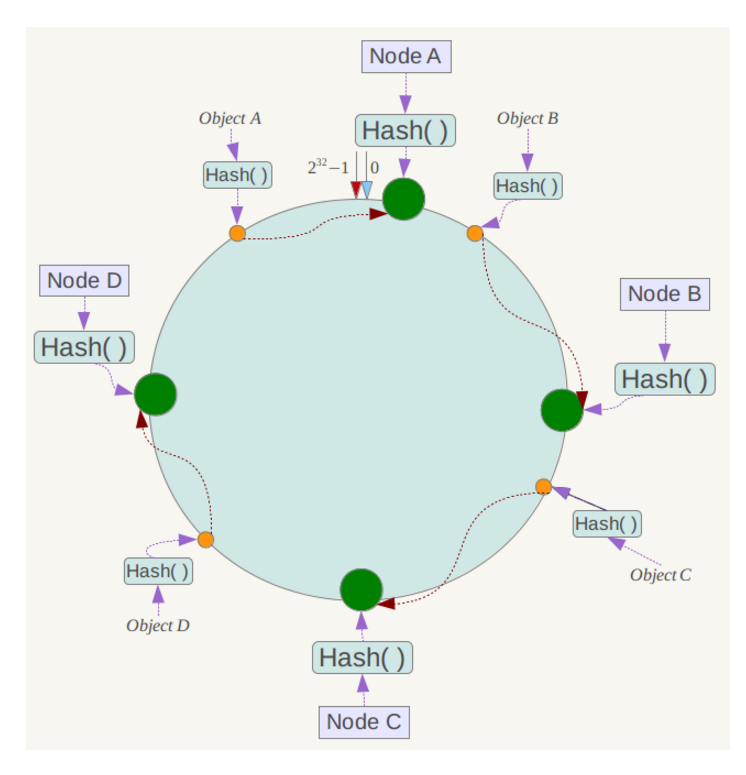

# 十大排序算法


## 对数器验证法

用于验证自己写的算法是否正确，对数意思是一个一个数比较，看看对不对。

```java
public class AlgorithmUtil {
    /**
     *  随机生成一个数组
     * @param maxSize 最大长度
     * @param maxValue 最大值
     * @return
     */
    public static int[] generateRandomArray(int maxSize, int maxValue){
        int[] arr = new int[(int) (Math.random() * (maxSize + 1))]; //长度随机：[0,maxSize]
        for(int i = 0; i < arr.length; i++){
            arr[i] = (int)(Math.random() * (maxSize + 1)) - (int)(Math.random() * maxSize); //数值数值：[-maxValue+1,maxValue]
        }
        return arr;
    }

    /**
     * 复制一个array
     * @param target
     * @return
     */
    public static int[] copyArray(int[] target){
        int[] result = new int[target.length];
        for(int i = 0; i < target.length; i++){
            result[i] = target[i];
        }
        return result;
    }

    /**
     * 比较两个array中的元素是否一致
     * @param arr1
     * @param arr2
     * @return
     */
    public static boolean isEqual(int[] arr1, int[] arr2){
        for(int i = 0; i < arr1.length; i++){
            if(arr1[i] != arr2[i]){
                return  false;
            }
        }
        return true;
    }
}
```

## 1.冒泡排序

### 1.原版

```java
public static void main(String[] args) {
    int[] array = new int[]{5,8,6,3,4,9,2,1,7};
    sort(array);
    System.out.println(Arrays.toString(array));
}

public static void sort(int[] array){
    int length = array.length;
    for(int i = 0; i < length - 1; i++){
        for(int j = 0; j < length - i - 1; j++){
            //升序
            if(array[j] > array[j+1]){
                swap(array, j, j + 1);
            }
        }
    }
}

public static void swap(int[] array, int i, int j){
    int temp = array[i];
    array[i] = array[j];
    array[j] = temp;
}
```

### 2.改进版1——当数组有序后不再进行剩下的排序

```java
public static void main(String[] args) {
    int[] array = new int[]{5,8,6,3,4,9,2,1,7};
    sort(array);
    System.out.println(Arrays.toString(array));
}

public static void sort(int[] array){
    //有序标记，每一轮的初始值都是true
    int length = array.length;
    for(int i = 0; i < length - 1; i++){
        boolean isSorted = true;
        for(int j = 0; j < length - i - 1; j++){
            //升序
            if(array[j] > array[j+1]){
                swap(array, j, j + 1);
                //因为有元素进行交换，所以不是有序的，标记变为false
                isSorted = false;
            }
        }
        //如果没有匀速进行交换，则说明数组已经有序，跳出循环
        if(isSorted){
            break;
        }
    }
}

public static void swap(int[] array, int i, int j){
    int temp = array[i];
    array[i] = array[j];
    array[j] = temp;
}
```

### 3.改进版2——避免有序区的重复比较

```java
    public static void main(String[] args) {
        int[] array = new int[]{3,4,2,1,5,6,7,8};
        sort(array);
        System.out.println(Arrays.toString(array));
    }

    public static void sort(int[] array){
        //有序标记，每一轮的初始值都是true
        int length = array.length;
        //无序数列的边界，每次比较只需要比到这里为止
        int sortedBorder = length - 1;
        //记录最后一次交换的位置
        int lastExchangeIndex = 0;

        for(int i = 0; i < length - 1; i++){
            boolean isSorted = true;
            for(int j = 0; j < sortedBorder; j++){
                //升序
                if(array[j] > array[j+1]){
                    swap(array, j, j + 1);
                    //因为有元素进行交换，所以不是有序的，标记变为false
                    isSorted = false;
                    //更新为最后一次交换元素的位置
                    lastExchangeIndex = j;
                }
            }
            //更新有序区的边界
            sortedBorder = lastExchangeIndex;
            //如果没有匀速进行交换，则说明数组已经有序，跳出循环
            if(isSorted){
                break;
            }
        }
    }

    public static void swap(int[] array, int i, int j){
        int temp = array[i];
        array[i] = array[j];
        array[j] = temp;
    }
```

## 2.选择排序

```java
    public static void selectionSort(int[] arr){
        if(arr == null || arr.length < 2){
            return;
        }
        for(int i = 0; i < arr.length; i++){
            int minIndex = i;
            for(int j = i + 1; j < arr.length; j++){
                minIndex = arr[j] < arr[minIndex] ? j : minIndex;
            }
            swap(arr, minIndex, i);
        }
    }

    public static void swap(int[] arr, int i, int j){
        int temp = arr[i];
        arr[i] = arr[j];
        arr[j] = temp;
    }

	/*对数器验证*/
    public static void main(String[] args) {
        int[] arr1 = AlgorithmUtil.generateRandomArray(10000,100);
        int[] arr2 = AlgorithmUtil.copyArray(arr1);
        Arrays.sort(arr1);
        selectionSort(arr2);
        System.out.println(AlgorithmUtil.isEqual(arr1, arr2));
    }
```

## 3.插入排序

```java
    public static void insertSort(int[] arr){
        if(arr == null || arr.length < 2){
            return;
        }
        for(int i = 1; i < arr.length; i++){
            int currentNum = arr[i];
            int j = i - 1;
            while(j >= 0 && currentNum < arr[j]){
                arr[j + 1] = arr[j];
                j--;
            }
            arr[j + 1] = currentNum;
        }
    }


    /*对数器验证*/
    public static void main(String[] args) {
        int[] arr1 = AlgorithmUtil.generateRandomArray(10000,100);
        int[] arr2 = AlgorithmUtil.copyArray(arr1);
        Arrays.sort(arr1);
        selectionSort(arr2);
        System.out.println(AlgorithmUtil.isEqual(arr1, arr2));
    }
```

## 4.归并排序

```java
   //详细的写法，写题目可以精简
   public static void mergeSort(int[] arr, int left, int right){
        if(left == right){
            return;
        }
        int mid = left + ((right - left) >> 1);
        mergeSort(arr, left, mid);
        mergeSort(arr, mid + 1, right);
        merge(arr, left, mid, right);
    }
    private static void merge(int[] arr, int left, int mid, int right) {
        int[] temp = new int[right -left + 1];
        int pointer1 = left;
        int pointer2 = mid + 1;
        int i = 0;
        while (pointer1 <= mid && pointer2 <= right){
            if(arr[pointer1] < arr[pointer2]){
                temp[i] = arr[pointer1];
                pointer1++;
            }else{
                temp[i] = arr[pointer2];
                pointer2++;
            }
            i++;
        }
        while(pointer1 <= mid){
            temp[i] = arr[pointer1];
            i++;
            pointer1++;
        }
        while (pointer2 <= right){
            temp[i] = arr[pointer2];
            i++;
            pointer2++;
        }
        for(i = 0; i < temp.length; i++){
            arr[left + i] = temp[i];
        }
    }

    /*对数器验证*/
    public static void main(String[] args) {
        int[] arr1 = AlgorithmUtil.generateRandomArray(10000,100);
        int[] arr2 = AlgorithmUtil.copyArray(arr1);
        Arrays.sort(arr1);
        mergeSort(arr2,0,arr2.length-1);
        System.out.println(AlgorithmUtil.isEqual(arr1, arr2));
    }
```

#### [剑指 Offer 51. 数组中的逆序对](https://leetcode.cn/problems/shu-zu-zhong-de-ni-xu-dui-lcof/)

```java
class Solution {
    int result = 0;
    public int reversePairs(int[] nums) {
        sort(nums, 0, nums.length - 1);
        return result;
    }

    private void sort(int[] nums, int left, int right){
        if(left >= right){
            return;
        }

        int mid = ((right - left) >> 1) + left;
        sort(nums, left, mid);
        sort(nums, mid + 1, right);
        merge(nums, left, mid, right);
    }

    private void merge(int[] nums, int left, int mid, int right){
        int i = 0;
        int p1 = left;
        int p2 = mid + 1;
        int[] temp = new int[right - left + 1];
        while(p1 <= mid && p2 <= right){
            if(nums[p1] > nums[p2]){
                result += right - p2 + 1;
                temp[i++] = nums[p1++];
            }else{
                temp[i++] = nums[p2++];
            }
        }

        while(p1 <= mid){
            temp[i++] = nums[p1++];
        }

        while(p2 <= right){
            temp[i++] = nums[p2++];
        }

        for(i = 0; i < temp.length; i++){
            nums[i + left] = temp[i];
        }
    }
}
```

#### [15. 计算右侧小于当前元素的个数](https://leetcode.cn/problems/count-of-smaller-numbers-after-self/)

```java
//需要同步排序，一个是原数组，另一个是原数组下标
class Solution {
    public List<Integer> countSmaller(int[] nums) {
        int[] result = new int[nums.length];
        int[] index = new int[nums.length];
        for(int i = 0; i < index.length; i++){
            index[i] = i;
        }

        solve(nums, result, index, 0, nums.length - 1);
        ArrayList<Integer> ans = new ArrayList(nums.length);
        for(int i = 0; i < result.length; i++){
            ans.add(result[i]);
        }
        return ans;
    }

    private void solve(int[] nums, int[] result, int[] index, int left, int right){
        if(left == right){
            return;
        }

        int mid = ((right - left) >> 1) + left;
        solve(nums, result, index, left, mid);
        solve(nums, result, index, mid + 1, right);
        merge(nums, result, index, left, mid, right);
    }

    private void merge(int[] nums, int[] result, int[] index, int left, int mid, int right){
        int[] temp = new int[right - left + 1];
        int[] tempIndex = new int[right - left + 1];
        int i = 0;
        int pointer1 = left;
        int pointer2 = mid + 1;

        while(pointer1 <= mid && pointer2 <= right){
            if(nums[pointer1] > nums[pointer2]){
                temp[i] = nums[pointer1];
                tempIndex[i] = index[pointer1];
                result[tempIndex[i]] += right - pointer2 + 1;
                pointer1++;
                i++;
            }else{
                temp[i] = nums[pointer2];
                tempIndex[i] = index[pointer2];
                i++;
                pointer2++;
            }
        }
        while(pointer1 <= mid){
            temp[i] = nums[pointer1];
            tempIndex[i] = index[pointer1];
            i++;
            pointer1++;
        }

        while(pointer2 <= right){
            temp[i] = nums[pointer2];
            tempIndex[i] = index[pointer2];
            i++;
            pointer2++;
        }

        for(i = 0; i < temp.length; i++){
            nums[left + i] = temp[i];
            index[left + i] = tempIndex[i];
        }

    }
}
```


#### [148. 排序链表](https://leetcode-cn.com/problems/sort-list/)

```JAVA
//自顶向下，空间复杂度为O(n)
class Solution {
    public ListNode sortList(ListNode head) {
        if(head == null || head.next == null){
            return head;
        }

        ListNode slow = head;
        ListNode fast = head.next;
        while(fast != null && fast.next != null){
            fast = fast.next.next;
            slow = slow.next;
        }
        ListNode temp = slow.next;
        slow.next = null;

        ListNode head1 = sortList(head);
        ListNode head2 = sortList(temp);

        ListNode merged = merge(head1, head2);
        return merged;
    }
    private ListNode merge(ListNode head1, ListNode head2){
        ListNode dummy = new ListNode(0);
        ListNode pointer1 = head1;
        ListNode pointer2 = head2;
        ListNode curr = dummy;
        while(pointer1 != null && pointer2 != null){
            if(pointer1.val < pointer2.val){
                curr.next = pointer1;
                pointer1 = pointer1.next;
            }else{
                curr.next = pointer2;
                pointer2 = pointer2.next;
            }
            curr = curr.next;
        }
        curr.next = pointer1 == null ? pointer2 : pointer1;
        return dummy.next;
    }
}
```

#### [23. 合并K个升序链表](https://leetcode.cn/problems/merge-k-sorted-lists/)

```java
class Solution {
    public ListNode mergeKLists(ListNode[] lists) {
        if(lists.length == 0){
            return null;
        }
        return solve(lists, 0, lists.length - 1);
    }

    private ListNode solve(ListNode[] lists, int left, int right){
        if(left >= right){
            return lists[left];
        }
        int mid = ((right - left)>> 1)  + left;
        ListNode l1 = solve(lists, left, mid);
        ListNode l2 = solve(lists, mid + 1, right);
        ListNode l3 = merge(l1, l2);
        return l3;
    }

    private ListNode merge(ListNode head1, ListNode head2){
        ListNode dummy = new ListNode();
        if(head1 == null){
            return head2;
        }
        if(head2 == null){
            return head1;
        }
        ListNode curr = dummy;
        while(head1 != null && head2 != null){
            if(head1.val < head2.val){
                curr.next = head1;
                curr = curr.next;
                head1 = head1.next;
            }else{
                curr.next = head2;
                curr = curr.next;
                head2 = head2.next;
            }
        }
        curr.next = head1 != null ? head1 : head2;
        return dummy.next;
    }
}
```


## 5.快速排序

```java
    private static Random random = new Random();
    private static void quickSort(int[] arr, int start, int end){
        if(end <= start){
            return;
        }
        int partitionIndex = partition(arr, start, end);
        quickSort(arr, start, partitionIndex - 1);
        quickSort(arr, partitionIndex + 1, end);
    }

    private static int partition(int[] arr, int start, int end) {
        int pivotIndex = random.nextInt(end - start + 1) + start;
        int mark = start;
        int pivot = arr[pivotIndex];
        swap(arr, start, pivotIndex);
        for(int i = start; i <= end; i++){
            if(arr[i] < pivot){
                mark++;
                swap(arr, i, mark);
            }
        }
        swap(arr, start, mark);
        return mark;
    }


    private static void swap(int[] arr, int i, int j){
        int temp = arr[i];
        arr[i] = arr[j];
        arr[j] = temp;
    }

    public static void main(String[] args) {
        int[] arr1 = AlgorithmUtil.generateRandomArray(10000,1000);
        int[] arr2 = AlgorithmUtil.copyArray(arr1);
        Arrays.sort(arr1);
        quickSort(arr2,0,arr2.length-1);
        System.out.println(AlgorithmUtil.isEqual(arr1, arr2));
    }
```

### [215. 数组中的第K个最大元素](https://leetcode-cn.com/problems/kth-largest-element-in-an-array/)

```


```


### [剑指 Offer 40. 最小的k个数](https://leetcode.cn/problems/zui-xiao-de-kge-shu-lcof/)

```java
//不要求有序返回
class Solution {
    private Random random = new Random();
    public int[] getLeastNumbers(int[] arr, int k) {
        int[] result = new int[k];
        quickSort(arr, 0, arr.length - 1, k - 1);
        for(int i = 0; i < k; i++){
            result[i] = arr[i];
        }
        return result;
    }

    private void quickSort(int[] arr, int start, int end, int position){
        if(end <= start){
            return;
        }
        int partitionIndex = partition(arr, start, end);
        //因为不要求有序返回，所以如果得到了对应位置的下标==position， 那么position及其左边小于等于position及其右边
        if(partitionIndex == position){
            return;
        }else if(partitionIndex < position){
            quickSort(arr, partitionIndex + 1, end, position);
        }else{
            quickSort(arr, start, partitionIndex - 1, position);
        }

    }

    private int partition(int[] arr, int start, int end){
        int pivotIndex = random.nextInt(end - start + 1) + start;
        int mark = start;
        int pivot = arr[pivotIndex];
        swap(arr, start, pivotIndex);
        for(int i = start; i <= end; i++){
            if(arr[i] < pivot){
                mark++;
                swap(arr, mark, i);
            }
        }
        swap(arr, start, mark);
        return mark;
    }

    private void swap(int[] arr, int i, int j){
        int temp = arr[i];
        arr[i] = arr[j];
        arr[j] = temp;
    }
}
```


## 6.堆排序

```java
    public static void heapSort(int[] arr){
        if(arr == null || arr.length < 2){
            return;
        }
        
        //构造堆，如果数是一个一个给的，可以用这个
        /*
        for(int i = 0; i < arr.length; i++){
            upper(arr, i);
        }
        */
        
        //构造堆更好的写法，如果直接给一个矩阵，可以用这个
        for(int i = arr.length / 2; i >= 0; i--){
            down(arr, i, arr.length - 1);
        }
        
        int end = arr.length - 1;
        //交换
        swap(arr, 0, end);
        while (end > 0){
            end--;
            //调整
            down(arr, 0, end);
            swap(arr, 0, end);
        }
    }

    //向上调整
    public static void upper(int[] arr, int index){
        while (index > 0 && arr[index] > arr[(index - 1) / 2] ){
            swap(arr, index, (index - 1) / 2);
            index = (index - 1) / 2;
        }
    }

    //向下调整
    public static void down(int[] arr, int index, int end){
        int leftIndex = (index * 2) + 1;
        while (leftIndex <= end){
            int largestIndex =  leftIndex;
            if(leftIndex + 1 <= end && arr[leftIndex] < arr[leftIndex + 1]){
                largestIndex = leftIndex + 1;
            }
            if(arr[index] < arr[largestIndex]){
                swap(arr, index, largestIndex);
            }else{
                break;
            }
            index = largestIndex;
            leftIndex = (index * 2) + 1;
        }
    }

    public static void swap(int[] arr, int i, int j){
        int temp = arr[i];
        arr[i] = arr[j];
        arr[j] = temp;
    }

    public static void main(String[] args) {
        int[] arr1 = AlgorithmUtil.generateRandomArray(10000,1000);
        int[] arr2 = AlgorithmUtil.copyArray(arr1);
        Arrays.sort(arr1);
        heapSort(arr2);
        System.out.println(AlgorithmUtil.isEqual(arr1, arr2));
    }
```

## 7.剩下三个懒得写


# 数组

## 二分查找


### 中等


#### [540. 有序数组中的单一元素](https://leetcode.cn/problems/single-element-in-a-sorted-array/)

```java
class Solution {
    public int singleNonDuplicate(int[] nums) {
        int left = 0;
        int right = nums.length - 1;
        while(left < right){
            int mid = ((right - left) >> 1) + left;
            boolean flag = (mid % 2 == 0);
            if(flag){
                if(nums[mid] == nums[mid + 1]){
                    left = mid + 1;
                }else{
                    right = mid;
                }
            }else{
                if(nums[mid] == nums[mid - 1]){
                    left = mid + 1;
                }else{
                    right = mid;
                }
            }         
        }
        return nums[left];
    }
}
```


### [704. 二分查找](https://leetcode-cn.com/problems/binary-search)

```java
/*
target在[left, right) 区间内的写法
*/
class Solution {
    public int search(int[] nums, int target) {
        int left = 0, right = nums.length;
        while(left < right){
            int mid = ((right - left) >> 1)+ left;
            if(nums[mid] < target){
                left = mid + 1;
            }else if(nums[mid] > target){
                right = mid;
            }else{
                return mid;
            }
        }
        return -1;
    }
}


/*
target在[left, right] 区间内的写法
*/
class Solution {
    public int search(int[] nums, int target) {
        int left = 0, right = nums.length - 1;
        while(left <= right){
            int mid = ((right - left) >> 1)+ left;
            if(nums[mid] < target){
                left = mid + 1;
            }else if(nums[mid] > target){
                right = mid - 1;
            }else{
                return mid;
            }
        }
        return -1;
    }
}
```

### [69. x 的平方根 ](https://leetcode-cn.com/problems/sqrtx/)

```java
class Solution {
    public int mySqrt(int x) {
        int right = x;
        int result = 0;
        while(left <= right){
            int mid = ((right - left) >> 1) + left;
            if((long) mid * mid > x){
                right = mid - 1;
            }else{
                left = mid + 1;
            }
        }
        return right;
    }
}
```

### [剑指 Offer 11. 旋转数组的最小数字](https://leetcode.cn/problems/xuan-zhuan-shu-zu-de-zui-xiao-shu-zi-lcof/)

```java
class Solution {
    public int minArray(int[] nums) {
        int left = 0;
        int right = nums.length - 1;
        while(left < right){
            int mid = ((right - left) >> 1) + left;
            if(nums[mid] < nums[right]){
                right = mid;
            }else if(nums[mid] > nums[right]){
                left = mid + 1;
            }else{
                right--;
            }
        }
        return nums[right];
    }
}
```

### [153. 寻找旋转排序数组中的最小值](https://leetcode-cn.com/problems/find-minimum-in-rotated-sorted-array/)

```java
class Solution {
    public int findMin(int[] nums) {
        int left = 0;
        int right = nums.length - 1;
        while(left < right){
            int mid = ((right - left) >> 1) + left;
            if(nums[mid] < nums[right]){
                right = mid;
            }else if(nums[mid] > nums[right]){
                left = mid + 1;
            }else{
                right--;
            }
        }
        return nums[right];
    }
}
```

### [154. 寻找旋转排序数组中的最小值 II](https://leetcode.cn/problems/find-minimum-in-rotated-sorted-array-ii/)

```java
class Solution {
    public int findMin(int[] nums) {
        int left = 0;
        int right = nums.length - 1;
        while(left < right){
            int mid = ((right - left) >> 1) + left;
            if(nums[mid] < nums[right]){
                right = mid;
            }else if(nums[mid] > nums[right]){
                left = mid + 1;
            }else{
                right--;
            }
        }
        return nums[right];
    }
}
```

### [162. 寻找峰值](https://leetcode-cn.com/problems/find-peak-element/)

```java
class Solution {
    public int findPeakElement(int[] nums) {
        int left = 0;
        int right = nums.length - 1;

        while(left < right){
            int mid = ((right - left) >> 1) + left;
            if(nums[mid] > nums[mid + 1]){
                right = mid;
            }else{
                left = mid + 1;
            }
        }
        return left;  
    }
}
```

### [34. 在排序数组中查找元素的第一个和最后一个位置](https://leetcode-cn.com/problems/find-first-and-last-position-of-element-in-sorted-array/)

```java
class Solution {
    public int[] searchRange(int[] nums, int target) {
        if(nums.length == 0){
            return new int[]{-1, -1};
        }

        int left = findLeft(nums, target);
        int right = findRight(nums, target);
        if(left >= 0 && left <= nums.length - 1 && nums[left] == target){
            return new int[]{left, right - 1};
        }else{
            return new int[]{-1, -1};
        }
    }
    private int findLeft(int[] nums, int target){
        int left = 0; int right = nums.length;
        while(left < right){
            int mid = ((right - left) >> 1) + left;
            if(nums[mid] > target){
                right = mid;
            }else if(nums[mid] < target){
                left = mid + 1;
            }else{
                right= mid;
            }
        }
        return left;
    }
    private int findRight(int[] nums, int target){
        int left = 0; int right = nums.length;
        while(left < right){
            int mid = ((right - left) >> 1) + left;
            if(nums[mid] > target){
                right = mid;
            }else if(nums[mid] < target){
                left = mid + 1;
            }else{
                left = mid + 1;
            }
        }
        return left;
    }
}
```

### [74. 搜索二维矩阵](https://leetcode.cn/problems/search-a-2d-matrix/)

```java
class Solution {
    public boolean searchMatrix(int[][] matrix, int target) {
        int column = columnSovle( matrix, target);
        if(column == -1){
            return false;
        }
        return rowSovle(matrix, target, column);
    }
    
    private int columnSovle(int[][] matrix, int target){
        int left = 0;
        int right = matrix.length;
        while(left < right){
            int mid = ((right - left) >> 1) + left;
            if(matrix[mid][0] > target){
                right = mid;
            }else if(matrix[mid][0] < target){
                left = mid + 1;
            }else{
                return mid;
            }
        }
        return left - 1;
    }
    
    private boolean rowSovle(int[][] matrix, int target, int column){
        int left = 0;
        int right = matrix[0].length;
        while(left < right){
            int mid = ((right - left) >> 1) + left;
            if(matrix[column][mid] > target){
                right = mid;
            }else if(matrix[column][mid] < target){
                left = mid + 1;
            }else{
                return true;
            }
        }
        return false;
    }
}
```


## 双指针

### [88. 合并两个有序数组](https://leetcode-cn.com/problems/merge-sorted-array/)

```JAVA
class Solution {
    public void merge(int[] nums1, int m, int[] nums2, int n) {
        int pointer1 = m - 1;
        int pointer2 = n - 1;

        while(pointer1 >= 0 && pointer2 >= 0){
            if(nums1[pointer1] > nums2[pointer2]){
                nums1[pointer1 + pointer2 + 1] = nums1[pointer1];
                pointer1--; 
            }else{
                nums1[pointer1 + pointer2 + 1] = nums2[pointer2];
                pointer2--;
            }
        }

        while(pointer2 >= 0){
            nums1[pointer2] = nums2[pointer2];
            pointer2--;
        }
    }
}
```

### [15. 三数之和](https://leetcode-cn.com/problems/3sum/)

```java
class Solution {
    public List<List<Integer>> threeSum(int[] nums) {
        List<List<Integer>> result = new ArrayList<>();
        if(nums == null || nums.length < 3){
            return result;
        }
        Arrays.sort(nums);
        for(int i = 0; i < nums.length; i++){
            if(nums[i] > 0){
                return result;
            }
            if(i > 0 && nums[i] == nums[i-1]){
                continue;
            }
            int left = i + 1;
            int right = nums.length - 1;
            int target = 0 - nums[i];
            while(left < right){
                if(nums[left] + nums[right] < target){
                    left++;
                }else if(nums[left] + nums[right] > target){
                    right--;
                }else{
                    result.add(Arrays.asList(nums[i], nums[left], nums[right]));
                    while(left < right && nums[left] == nums[left + 1]){
                        left++;
                    }
                    while(left < right && nums[right] == nums[right - 1]){
                        right--;
                    }
                    left++;
                    right--;
                }
            }
        }
            return result;
    }
}
```

### [18. 四数之和](https://leetcode-cn.com/problems/4sum/)

```java
//注意整形溢出
class Solution {
    public List<List<Integer>> fourSum(int[] nums, int target) {
        List<List<Integer>> result = new ArrayList<>();
        if(nums == null || nums.length < 4){
            return result;
        }
        Arrays.sort(nums);
        for(int i = 0; i < nums.length - 3; i++){
			//剪枝：接下来的数之和大于目标数，则不用继续判断之后的数了
            if((long)nums[i] + nums[i + 1] + nums[i + 2] + nums[i + 3] > target){
                return result;
            }
            //重复则跳过
            if(i > 0 && nums[i] == nums[i - 1]){
                continue;
            }
            //剪枝：如果第一个数加上最大的三个数还是小于目标数，说明要将第一个数变大
            if ((long) nums[i] + nums[nums.length - 3] + nums[nums.length - 2] + nums[nums.length - 1] < target) {
                continue;
            }


            for(int j = i + 1; j < nums.length - 2; j++){
                //剪枝：接下来的数之和大于目标数，则不用继续判断之后的数了
                if((long)nums[j] + nums[j + 1] + nums[j + 2]> target - nums[i]){
                    break;
                }
                //重复则跳过
                if(j > i + 1 && nums[j] == nums[j - 1]){
                    continue;
                }
                //剪枝：如果第一个（已知）和第二个数 加上最大的二个数还是小于目标数，说明要将第二个数变大
                if ((long) nums[j] + nums[nums.length - 2] + nums[nums.length - 1] < target - nums[i]) {
                    continue;
                }
                //下面与三数之和一样
                int left = j + 1;
                int right = nums.length - 1;
                while(left < right){ 
                    long sum =  nums[i] + nums[j] + nums[left] + nums[right];
                    if(sum < target){
                        left++;
                    }else if(sum > target){
                        right--;
                    }else{
                        result.add(Arrays.asList(nums[i], nums[j], nums[left], nums[right]));
                        while(left < right && nums[left] == nums[left + 1]){
                            left++;
                        }
                        while(left < right && nums[right] == nums[right - 1]){
                            right--;
                        }
                        left++;
                        right--;
                    }
                }
            }
        }
        return result;
    }
}
```

### [16. 最接近的三数之和](https://leetcode.cn/problems/3sum-closest/)

```java
class Solution {
    public int threeSumClosest(int[] nums, int target) {
        Arrays.sort(nums);
        int ans = nums[0] + nums[1] + nums[2];
        for(int i=0;i<nums.length;i++) {
            int start = i+1, end = nums.length - 1;
            while(start < end) {
                int sum = nums[start] + nums[end] + nums[i];
                if(Math.abs(target - sum) < Math.abs(target - ans))
                    ans = sum;
                if(sum > target)
                    end--;
                else if(sum < target)
                    start++;
                else
                    return ans;
            }
        }
        return ans;
    }
}
```

### [11. 盛最多水的容器](https://leetcode-cn.com/problems/container-with-most-water/)

```java
//S(i,j)=min(h[i],h[j])×(j−i)
//1.若向内 移动短板 ，水槽的短板 min(h[i],h[j]  可能变大，因此下个水槽的面积 可能增大 。
//2.若向内 移动长板 ，水槽的短板 min(h[i],h[j]) 不变或变小，因此下个水槽的面积 一定变小 。
//时间复杂度：O(N)  空间复杂度：O(1)
class Solution {
    public int maxArea(int[] height) {
        int left = 0, right = height.length - 1, ans = 0;
        boolean flag = true;
        while(left <= right){
            if(height[left] <= height[right]){
                ans = Math.max(ans, height[left] * (right - left));
                left++;
            }else{
                ans = Math.max(ans, height[right] * (right - left));
                right--;
            }
        }
        return ans;
    }
}
```


### [611. 有效三角形的个数](https://leetcode-cn.com/problems/valid-triangle-number/)

```java
//然后固定最长边，使用双指针法
//空间复杂度:O(N^2),时间复杂度:O(1)
class Solution {
    public int triangleNumber(int[] nums) {
        if(nums == null || nums.length < 3){
            return 0;
        }
        int result = 0;
        Arrays.sort(nums);
        for(int i = nums.length - 1; i >= 0; i--){
            int start = 0, end = i - 1;
            while(start < end){
                if(nums[i] < nums[start] + nums[end]){
                    result += end - start;
                    end--;
                }else{
                    start++;
                }    
            }
        }
        return result;
    }
}
```

### [4. 寻找两个正序数组的中位数](https://leetcode-cn.com/problems/median-of-two-sorted-arrays/)

```java
class Solution {
    public double findMedianSortedArrays(int[] nums1, int[] nums2) {
        int sum = nums1.length + nums2.length;
        int pointer1 = 0;
        int pointer2 = 0;
        int leftNum = 0;
        int rightNum = 0;

        for(int i = 0; i <= sum / 2; i++){
            leftNum = rightNum;
            if(pointer1 <= nums1.length - 1 && (pointer2 > nums2.length - 1 || nums1[pointer1] < nums2[pointer2])){
                rightNum = nums1[pointer1];
                pointer1++;
            }else{
                rightNum =  nums2[pointer2];
                pointer2++;
            }
        }

        if(sum % 2 == 1){
            return rightNum;
        }else{
            return (double)((rightNum + leftNum) / 2.0);
        }

    }
}
```

### [剑指 Offer 21. 调整数组顺序使奇数位于偶数前面](https://leetcode.cn/problems/diao-zheng-shu-zu-shun-xu-shi-qi-shu-wei-yu-ou-shu-qian-mian-lcof/)

```JAVA
class Solution {
    public int[] exchange(int[] nums) {
        int left = 0;
        int right = nums.length - 1;
        while(left < right){
            //偶数、 奇数
            if((nums[left] % 2 == 0) && nums[right] % 2 == 1){
                swap(nums, left, right);
                left++;
                right--;
            }
            //偶数，偶数
            if((nums[left] % 2 == 0) && nums[right] % 2 == 0){
                right--;
            }
                // jiji
            if((nums[left] % 2 == 1) && nums[right] % 2 == 1){
                left++;
            }
            //奇数偶数
            if((nums[left] % 2 == 1) && nums[right] % 2 == 0){
                left++;
                right--;
            }
        }
        return nums;
    }

    private void swap(int[] nums, int i, int j){
        int temp = nums[i];
        nums[i] = nums[j];
        nums[j] = temp;
    }
}
```

### [26. 删除有序数组中的重复项](https://leetcode.cn/problems/remove-duplicates-from-sorted-array/)

```java
class Solution {
    public int removeDuplicates(int[] nums) {
        if(nums == null){
            return 0;
        }

        if(nums.length == 1){
            return 1;
        }
        int j = 0;
        for(int i = 1; i < nums.length; i++){
            if(nums[i] != nums[j]){
                j++;
                nums[j] = nums[i];
            }
        }
        return j + 1;
    }
}
```

### [80. 删除有序数组中的重复项 II](https://leetcode.cn/problems/remove-duplicates-from-sorted-array-ii/)

```java
class Solution {
    public int removeDuplicates(int[] nums) {
        int right = 0;
        int left = 0;
        int count = 1;
        while(right < nums.length){
            if(right != 0 && nums[right] == nums[right - 1] && count == 1){
                left++;
                count++;
                nums[left] = nums[right];
            }else if(right != 0 && nums[right] != nums[right - 1]){
                left++;
                count = 1;
                nums[left] = nums[right];
            }
            right++;
        }
        return left + 1;
    }
}
```

### [75. 颜色分类](https://leetcode.cn/problems/sort-colors/)

```java
class Solution {
    public void sortColors(int[] nums) {
        int mark = -1;
        for(int i = 0; i < nums.length; i++){
            if(nums[i] == 0){
                mark++;
                swap(nums, i, mark);
            }
        }
        for(int i = mark + 1; i < nums.length; i++){
            if(nums[i] == 1){
                mark++;
                swap(nums, i, mark);
            }
        }
    }
    private void swap(int[] nums, int left, int right){
        int temp = nums[left];
        nums[left] = nums[right];
        nums[right] = temp;
    }
}
```

### [剑指 Offer 04. 二维数组中的查找](https://leetcode.cn/problems/er-wei-shu-zu-zhong-de-cha-zhao-lcof/)

```java
class Solution {
    public boolean findNumberIn2DArray(int[][] matrix, int target) {
        if(matrix == null || matrix.length == 0 || matrix[0].length == 0){
            return false;
        }
        int x = 0, y = matrix[0].length - 1;
        while(x <= matrix.length - 1 && y >= 0){
            if(matrix[x][y] < target){
                x++;
            }else if(matrix[x][y] > target){
                y--;
            }else{
                return true;
            }
        }
        return false;
    }
}
```

### [189. 轮转数组](https://leetcode.cn/problems/rotate-array/)

```java
class Solution {
    public void rotate(int[] nums, int k) {
        int steps = k % nums.length;
        reverse(nums, 0, nums.length - 1);
        reverse(nums, 0, steps - 1);
        reverse(nums, steps, nums.length - 1);
    }

    private void reverse(int[] nums, int start, int end){
        while(start < end){
            swap(nums, start, end);
            start++;
            end--;
        }
    }

    private void swap(int[] nums, int i, int j){
        int temp = nums[i];
        nums[i] = nums[j];
        nums[j] = temp;
    }
}
```

### [442. 数组中重复的数据](https://leetcode.cn/problems/find-all-duplicates-in-an-array/)

```java
class Solution {
    public List<Integer> findDuplicates(int[] nums) {
        for(int i = 0; i < nums.length; i++){
            while(nums[nums[i] - 1] != nums[i]){
                swap(nums, i, nums[i] - 1);
            }
        }
        List<Integer> list = new ArrayList<>();
        for(int i = 0; i < nums.length; i++){
            if(nums[i] != i + 1){
                list.add(nums[i]);
            }
        }
        return list;
    }

    private void swap(int[] nums, int i, int j){
        int temp = nums[i];
        nums[i] = nums[j];
        nums[j] = temp;
    }
}
```

### [674. 最长连续递增序列](https://leetcode.cn/problems/longest-continuous-increasing-subsequence/)

```java
class Solution {
    public int findLengthOfLCIS(int[] nums) {
        int result = 0;
        int left = 0;
        int right = 0;
        while(right < nums.length){
            if(right != 0 && nums[right] <= nums[right - 1]){
                left = right;
            }
            right++;
            result = Math.max(result, right - left);
        }
        return result;
    }
}
```

### [27. 移除元素](https://leetcode.cn/problems/remove-element/)

```java
class Solution {
    public int removeElement(int[] nums, int val) {
        int left = 0;
        int right = 0;
        while(right < nums.length){
            if(nums[right] != val){
                nums[left] = nums[right];
                left++;
            }
            right++;
        }
        return left;
    }
}
```

### [283. 移动零](https://leetcode.cn/problems/move-zeroes/)

```java
class Solution {
    public void moveZeroes(int[] nums) {
        int left = 0;
        int right = 0;
        while(right < nums.length){
            while(right < nums.length && nums[right] == 0){
                right++;
            }
            if(right == nums.length){
                break;
            }
            int temp = nums[left];
            nums[left] = nums[right];
            nums[right] = temp;
            left++;
            right++;
        }
    }
}
```


## 利用哈希

### [349. 两个数组的交集](https://leetcode.cn/problems/intersection-of-two-arrays/)

```java
class Solution {
    public int[] intersection(int[] nums1, int[] nums2) {
        Set<Integer> set = new HashSet<>();
        Set<Integer> resultSet = new HashSet<>();
        for(int i = 0; i < nums1.length; i++){
            set.add(nums1[i]);
        }
        for(int i = 0; i < nums2.length; i++){
            if(set.contains(nums2[i])){
                resultSet.add(nums2[i]);
            }
        }
        int[] result = new int[resultSet.size()];
        int i = 0;
        for(int e : resultSet){
            result[i] = e;
            i++;
        }
        return result;
    }
}


```


### 不使用额外空间

#### [剑指 Offer 03. 数组中重复的数字](https://leetcode-cn.com/problems/shu-zu-zhong-zhong-fu-de-shu-zi-lcof/)

```java
//使用哈希表查重
//空间复杂度:O(N),时间复杂度:O(N)
class Solution {
    public int findRepeatNumber(int[] nums) {
        Set<Integer> dic = new HashSet<>();
        for(int num : nums) {
            if(dic.contains(num)) return num;
            dic.add(num);
        }
        return -1;
    }
}
//使用原地哈希表查重
//空间复杂度:O(N),时间复杂度:O(1)
class Solution {
    public int findRepeatNumber(int[] nums) {
        int i = 0;
        while(i < nums.length){
            if(nums[i] == i){
                i++;
                continue;
            }
            if(nums[nums[i]] == nums[i]){
                return nums[i];
            }
            int temp = nums[i];
            nums[i] = nums[temp];
            nums[temp] = temp;
        }
        return -1;
    }
} 
```

#### [448. 找到所有数组中消失的数字](https://leetcode-cn.com/problems/find-all-numbers-disappeared-in-an-array/)

```java
//题目要求空间复杂度达到O(1)
//使用原地哈希表查重
class Solution {
    public List<Integer> findDisappearedNumbers(int[] nums) {    
        for(int i = 0; i < nums.length; i++){
            while(nums[i] != nums[nums[i] - 1]){
                int temp = nums[nums[i] - 1];
                nums[nums[i] - 1] = nums[i] ;
                nums[i] = temp; 
            }
        }
        List<Integer> result = new ArrayList<>();
        for(int i = 0; i < nums.length; i++){
            if(nums[i] != i + 1){
                result.add(i + 1);
            }
        }
        return result;
    }
}


//题目要求空间复杂度达到O(1)
//使用原地哈希表查重
/*
对于第 i 个数字 nums[i]，我们位置 (nums[i] - 1) % n 的位置增加 n，这样不会覆盖原数组，因为 (nums[i] - 1) % n = (nums[i] - 1 + n) % n，这样如果最后遍历完数组，nums[i] 小于等于 n，就是数组中中消失的数字。
*/

class Solution {
    public List<Integer> findDisappearedNumbers(int[] nums) { 
        int n = nums.length;   
        for(int i = 0; i < n; i++){
            int x = (nums[i] - 1) % n;
            nums[x] += n;
        }
        List<Integer> result = new ArrayList<>();
        for(int i = 0; i < n; i++){
            if(nums[i] <= n){
                result.add(i + 1);
            }
        }
        return result;
    }
}
```

#### [41. 缺失的第一个正数](https://leetcode-cn.com/problems/first-missing-positive/)

```java
//题目要求空间复杂度达到O(1)
//使用原地哈希表查重
class Solution {
    public int firstMissingPositive(int[] nums) {
        int length = nums.length;
        for(int i = 0; i < nums.length; i++){
            while(nums[i] <= nums.length && nums[i] > 0 && nums[i] != nums[nums[i] - 1]){
                int temp = nums[nums[i] - 1];
                nums[nums[i] - 1] = nums[i];
                nums[i] = temp;
            }
        }

        for(int i = 0; i < nums.length; i++){
            if(nums[i] != i + 1){
                return i + 1;
            }
        }
        return nums.length + 1;
    }
}
```

### 使用额外空间

#### [128. 最长连续序列](https://leetcode-cn.com/problems/longest-consecutive-sequence/)


```java
class Solution {
    public int longestConsecutive(int[] nums) {
        Set<Integer> set = new HashSet<>();
        int ans = 0;
        for(int i = 0; i < nums.length; i++){
            set.add(nums[i]);
        }
        for(int num : set){
            int currMax = 0;
            if(!set.contains(num - 1)){
                while(set.contains(num)){
                    currMax++;
                    num++;
                }
            }
            ans = Math.max(currMax, ans);
        }
        return ans;
    }
}
```

#### [349. 两个数组的交集](https://leetcode-cn.com/problems/intersection-of-two-arrays/)

```java
class Solution {
    public int[] intersection(int[] nums1, int[] nums2) {
        Set<Integer> set = new HashSet<>();
        Set<Integer> result = new HashSet<>();
        for(int i = 0; i < nums1.length; i++){
            set.add(nums1[i]);
        }
        for(int i = 0; i < nums2.length; i++){
            if(set.contains(nums2[i])){
                result.add(nums2[i]);
            }
        }
        int[] ans = new int[result.size()];
        int i = 0;
        for(int e : result){
            ans[i] = e;
            i++;
        }
        return ans;
        
    }
}
```

#### [242. 有效的字母异位词](https://leetcode.cn/problems/valid-anagram/)

```java
class Solution {
    public boolean isAnagram(String s, String t) {
        if(s.length() != t.length()){
            return false;
        }
        int[] map1 = new int[26];
        int[] map2 = new int[26];
        for(int i = 0; i < s.length(); i++){
            int curr = (int) (s.charAt(i) - 'a');
            map1[curr]++;
        }

        for(int i = 0; i < t.length(); i++){
            int curr = (int) (t.charAt(i) - 'a');
            map2[curr]++;            
        }

        for(int i = 0; i < 26; i++){
            if(map1[i] != map2[i]){
                return false;
            }
        }
        return true;
        
    }
}
```

#### [剑指 Offer 50. 第一个只出现一次的字符](https://leetcode.cn/problems/di-yi-ge-zhi-chu-xian-yi-ci-de-zi-fu-lcof/)

```java


class Solution {
    public char firstUniqChar(String s) {
        int[][] map = new int[26][2];
        for(int i = 0; i < map.length; i++){
            map[i][1] = Integer.MAX_VALUE;
        }
        for(int i = 0; i < s.length(); i++){
            map[s.charAt(i) - 'a'][0]++;
            map[s.charAt(i) - 'a'][1] = Math.min(i, map[s.charAt(i) - 'a'][1]);
        }
        int index = Integer.MAX_VALUE;
        for(int i = 0; i < map.length; i++){
            if(map[i][0] == 1){
                index = Math.min(map[i][1], index);
            }
        }
        return index == Integer.MAX_VALUE ? ' ' : s.charAt(index);
    }
}
```


#### [391. 完美矩形](https://leetcode.cn/problems/perfect-rectangle/)

```java
//把所有点都加入到hashMap中，
//如果可以组成完美矩形：1.那么矩形的四个顶点肯定只会在map中出现一次。2.其余的点只会重叠两次或者四次。3.最后的矩形面积和肯定等于分散所有矩形之和，否则一定有重叠。
class Solution {
    public boolean isRectangleCover(int[][] rectangles) {

        HashMap<Node, Integer> map = new HashMap<>();
        long area = 0;
		
        //最终矩形的四个顶点
        int minX0 = rectangles[0][0];
        int minY0 = rectangles[0][1];
        int maxX1 = rectangles[0][2];
        int maxY1 = rectangles[0][3];
        for(int[] rectangle : rectangles){
            int x0 = rectangle[0];
            int y0 = rectangle[1];
            int x1 = rectangle[2];
            int y1 = rectangle[3];

            minX0 = Math.min(x0, minX0);
            minY0 = Math.min(y0, minY0);
            maxX1 = Math.max(x1, maxX1);
            maxY1 = Math.max(y1, maxY1);

            area += (long) (x1 - x0) * (y1 - y0);
            
            Node node0 = new Node(x0, y0);
            Node node1 = new Node(x1, y1);
            Node node2 = new Node(x0, y1);
            Node node3 = new Node(x1, y0);

            map.put(node0, map.getOrDefault(node0, 0) + 1);
            map.put(node1, map.getOrDefault(node1, 0) + 1);
            map.put(node2, map.getOrDefault(node2, 0) + 1);
            map.put(node3, map.getOrDefault(node3, 0) + 1);
        }
        
        
        Node node0 = new Node(minX0, minY0);
        Node node1 = new Node(maxX1, maxY1);
        Node node2 = new Node(minX0, maxY1);
        Node node3 = new Node(maxX1, minY0);   
		
        
        //矩形面积是否重叠，矩形的四个顶点是否只出现一次
        if(area !=(long) (maxX1 - minX0) * (maxY1 - minY0) 
        || map.getOrDefault(node0, 0) != 1
        || map.getOrDefault(node1, 0) != 1
        || map.getOrDefault(node2, 0) != 1
        || map.getOrDefault(node3, 0) != 1){
            return false;
        }
        map.remove(node0);
        map.remove(node1);
        map.remove(node2);
        map.remove(node3);
        //其余点是否只出现过2次或者4次
        for(Map.Entry<Node, Integer> entry : map.entrySet()){
            int count = entry.getValue();
            if(count != 2 && count != 4){
                return false;
            }
        }
        return true;
    }


}

//点
class Node{
    int x;
    int y;
    Node(int x, int y){
        this.x = x;
        this.y = y;
    }

    public int hashCode(){
        return x * 131 + y;
    }

    public boolean equals(Object obj){
        if(obj instanceof Node){
            Node node2 = (Node) obj;
            return this.x == node2.x && this.y == node2.y;
        }
        return false;
    }
}

```

#### [454. 四数相加 II](https://leetcode.cn/problems/4sum-ii/)

```java
class Solution {
    public int fourSumCount(int[] nums1, int[] nums2, int[] nums3, int[] nums4) {
        HashMap<Long, Integer> map = new HashMap<>();

        for(int i = 0; i < nums1.length; i++){
            for(int j = 0; j < nums2.length; j++){
                long curr = (long)nums1[i] + (long)nums2[j];
                map.put(curr, map.getOrDefault(curr, 0) + 1);
            }
        }
        int result = 0;
        for(int i = 0; i < nums3.length; i++){
            for(int j = 0; j < nums4.length; j++){
                long curr = -((long)nums3[i] + (long)nums4[j]);
                result += map.getOrDefault(curr, 0);
            }
        }
        return result;
    }
}
```


## 未分类

### [剑指 Offer 61. 扑克牌中的顺子](https://leetcode.cn/problems/bu-ke-pai-zhong-de-shun-zi-lcof/)

```java
class Solution {
    public boolean isStraight(int[] nums) {
        Arrays.sort(nums);

        int kings = 0;
        int pointer = 0;
        while(pointer < nums.length){
            if(nums[pointer] == 0){
                kings++;
                pointer++;
            }else{
                break;
            }
        }

        for(int i = pointer + 1; i < nums.length; i++){
            if(nums[i] == nums[i - 1] + 1){
                continue;
            }
            if(nums[i] == nums[i - 1]){
                return false;
            }
            if(nums[i] != nums[i - 1] + 1){
                int interval = nums[i] - nums[i - 1] - 1;
                if(interval > kings){
                    return false;
                }else{
                    kings -= interval;
                }
            }
        }
        return true;
    }
}
```


# 字符串

## [459. 重复的子字符串](https://leetcode.cn/problems/repeated-substring-pattern/)

```java
class Solution {
    public boolean repeatedSubstringPattern(String s) {
        //枚举长度
        for(int i = 1; i <= s.length() / 2; i++){
            if(s.length() % i != 0){
                continue;
            }
            boolean flag = true;
            int index = 0;
            //枚举下标
            while(index != i){
                //枚举比较次数
                for(int j = 1; j < s.length() / i; j++){
                    if(s.charAt(index) != s.charAt(index + i * j)){
                        flag = false;
                        break;
                    }
                }
                index++;  
            }
            if(flag){
                return true;
            }
        }
        return false;
    }
}

/*
移位操作+KMP
例如：abcabc
移位一次：cabcab
移位两次：bcabca
移位三次：abcabc

现在字符串和原字符串匹配了，所以可以得出结论存在重复的子串。

基于这个思想，可以每次移动k个字符，直到匹配移动 length - 1 次。但是这样对于重复字符串很长的字符串，效率会非常低。在 LeetCode 中执行时间超时了。

为了避免这种无用的环绕，可以创建一个新的字符串 str，它等于原来的字符串 S 再加上 S 自身，这样其实就包含了所有移动的字符串。

比如字符串：S = acd，那么 str = S + S = acdacd

acd 移动的可能：dac、cda。其实都包含在了 str 中了。就像一个滑动窗口

一开始 acd (acd) ，移动一次 ac(dac)d，移动两次 a(cda)cd。循环结束

所以可以直接判断 str 中去除首尾元素之后，是否包含自身元素。如果包含。则表明存在重复子串。
*/

//用java自带的KMP。速度还不如暴力。要自己写KMP才行
class Solution {
    public boolean repeatedSubstringPattern(String s) {
        //移位操作
        String temp = s + s;
        return temp.substring(1, temp.length() - 1).contains(s);
    }
}

```


## 双指针

### [557. 反转字符串中的单词 III](https://leetcode.cn/problems/reverse-words-in-a-string-iii/)

```java
class Solution {
    public String reverseWords(String s) {
        String[] origin = s.split(" ");
        StringBuilder result = new StringBuilder();
        for(int i = 0 ; i < origin.length; i++){
            result.append(reverse(origin[i]));
            result.append(' ');
        }
        return result.toString().substring(0, result.length() - 1);

    }

    private String reverse(String s){
        char[] strs = s.toCharArray();

        int left = 0;
        int right = strs.length - 1;
        while(left < right){
            char temp = strs[left];
            strs[left] = strs[right];
            strs[right] = temp;
            left++;
            right--;
        }
        return new String(strs);
    }
}
```


### [443. 压缩字符串](https://leetcode.cn/problems/string-compression/)

```java
class Solution {
    public int compress(char[] chars) {
        char prev = chars[0];
        int slow = 1;
        int count = 1;
        for(int i = 1; i < chars.length; i++){
            if(chars[i] == prev){
                count++;
                prev = chars[i];
            }else{
                if(count != 1){
                    StringBuilder sb = new StringBuilder();
                    while(count != 0){
                        sb.append((char)(count % 10 + '0'));
                        count = count / 10;
                    }
                    for(int j = sb.length() - 1; j >= 0; j--){
                        chars[slow] = sb.charAt(j);
                        slow++;
                    }
                }
                chars[slow] = chars[i];
                slow++;
                count = 1;
                prev = chars[i];
            }
        }
        if(count != 1){
            StringBuilder sb = new StringBuilder();
            while(count != 0){
                sb.append((char)(count % 10 + '0'));
                count = count / 10;
            }
            for(int j = sb.length() - 1; j >= 0; j--){
                chars[slow] = sb.charAt(j);
                slow++;
            }
        }
        return slow;
    }
}
```

## KMP算法

```java
    public static void main(String[] args) {
        String target = "aabaabaafa";
        String template = "aabaaf";
        System.out.println(Arrays.toString(getNext(template)));
        System.out.println("匹配结果：" + strStr(target, template));
    }

	//求模式串的next数组
    public static int[] getNext(String template){
        int length = template.length();
        int next[] = new int[length];
        /*i为后缀末尾，从[1] - [length - 1]
          j为前缀末尾，从[0] - [length - 2]*/
        int j = 0;
        for(int i = 1; i < length; i++){
            /*前后缀不相同时，需要一直回退*/
            while(j > 0 && template.charAt(i) != template.charAt(j)){
                j = next[j - 1];
            }
            /*前后缀相同时，j++*/
            if(template.charAt(i) == template.charAt(j)){
                j++;
            }
            /*更新next[i]*/
            next[i] = j;
        }
        return next;
    }

	//匹配函数
    public static int strStr(String target, String template){
        if(template.length() == 0){
            return 0;
        }
        int[] next = getNext(template);
        int j = 0;
        for(int i = 0; i < target.length(); i++){
            /*如果当前模式串索引为j的字符 与 文本串索引为i的字符不匹配， 注意：j = 0 时不匹配，下面的代码都不执行，j不动，i++
            j指针应该移动到next[j-1]的地方，重新进行匹配*/
            while (j > 0 && target.charAt(i) != template.charAt(j)){
                j = next[j - 1];
            }
            /*如果匹配，j指针后移*/
            if(target.charAt(i) == template.charAt(j)){
                j++;
            }
            if(j == template.length()){
                return i - template.length() + 1;
            }
        }
        return -1;
    }
```

### [796. 旋转字符串](https://leetcode.cn/problems/rotate-string/)

```java
class Solution {
    public boolean rotateString(String s, String goal) {
        String temp = s + s;
        return temp.contains(goal) && s.length() == goal.length();
    }
}
```


# 队列

## 双端队列

### [239. 滑动窗口最大值](https://leetcode-cn.com/problems/sliding-window-maximum/)

```java
class Solution {
    //1.当滑动窗口右边的元素 > 队尾元素, 循环剔除队尾元素
    //2.加入滑动窗口右边的元素至队尾
    //3.确认队头元素在滑动窗口中，不在则循环剔除队头元素
    //4.将队头元素添入答案中
    public int[] maxSlidingWindow(int[] nums, int k) {
        //从队头到队尾，元素（对应的下标）依次递减的双端队列
        Deque<Integer> queue = new LinkedList<>();
        
        for(int i = 0; i < k; i++){
            while(!queue.isEmpty() && nums[i] > nums[queue.peekLast()]){
                queue.pollLast();
            }
            queue.offerLast(i);
        }

        int[] ans = new int[nums.length - k + 1];
        ans[0] = nums[queue.peekFirst()];
        for(int i = k; i < nums.length; i++){
            while(!queue.isEmpty() && nums[i] > nums[queue.peekLast()]){
                queue.pollLast();
            }
            queue.offerLast(i);
            while(!queue.isEmpty() && queue.peekFirst() < i - k + 1){
                queue.pollFirst();
            }
            ans[i - k + 1] = nums[queue.peekFirst()];
        }
        return ans;
    }
}
```


## 优先队列（具体实现可以是堆）

### [215. 数组中的第K个最大元素](https://leetcode.cn/problems/kth-largest-element-in-an-array/)

```java
class Solution {
    public int findKthLargest(int[] nums, int k) {
        PriorityQueue<Integer> queue = new PriorityQueue<>();
        for(int i = 0; i < nums.length; i++){
            if(queue.size() < k){
                queue.offer(nums[i]);
            }else{
                if(queue.peek() <= nums[i]){
                    queue.poll();
                    queue.offer(nums[i]);
                }
            }
        }
        return queue.peek();
    }
}
```

### [347. 前 K 个高频元素](https://leetcode.cn/problems/top-k-frequent-elements/)

```java
class Solution {

    public int[] topKFrequent(int[] nums, int k) {
        Map<Integer, Integer> map = new HashMap<>();
        for(int i = 0; i < nums.length; i++){
            if(map.containsKey(nums[i])){
                map.put(nums[i], map.get(nums[i]) + 1);
            }else{
                map.put(nums[i], 1);
            }
        }

        PriorityQueue<int[]> queue = new PriorityQueue<>((o1, o2) -> o1[1] - o2[1]);
        for(Map.Entry<Integer, Integer> entry : map.entrySet()){
            int num = entry.getKey();
            int count = entry.getValue();
            if(queue.size() == k){
                if(queue.peek()[1] < count){
                    queue.poll();
                    queue.offer(new int[]{num, count});
                }
            }else{
                queue.offer(new int[]{num, count});
            }
        }

        int[] result = new int[k];
        for(int i = 0; i < k; i++){
            result[i] = queue.poll()[0];
        }
        return result;
    }
}
```


### [239. 滑动窗口最大值](https://leetcode-cn.com/problems/sliding-window-maximum/)

```java
class Solution {
    public int[] maxSlidingWindow(int[] nums, int k) {
        //维护一个大顶堆，元素为 [下标，num[下标]]
        PriorityQueue<int[]> queue = new PriorityQueue<>((o1, o2) -> {
            return o1[0] != o2[0] ? o2[1] - o1[1] : o2[0] - o1[0];
        });

        int[] ans = new int[nums.length - k + 1];
        for(int i = 0; i < k; i++){
            queue.offer(new int[]{i, nums[i]});
        }
        ans[0] = nums[queue.peek()[0]];

        for(int i = k; i < nums.length; i++){
            queue.offer(new int[]{i, nums[i]});
            //看看堆顶元素是否在滑动窗口中，不在则循环剔除堆顶元素
            while(queue.peek()[0] < i - k + 1){
                queue.poll();
            }
            ans[i - k + 1] = nums[queue.peek()[0]];
        }
        return ans;
    }
}


//双向队列做法，O(n)
class Solution {
    public int[] maxSlidingWindow(int[] nums, int k) {
        //双向队列，存储数组下标，从队头到队尾单调递减
        LinkedList<Integer> list = new LinkedList<>();
        int[] result = new int[nums.length - k + 1];
        int right = 0;
        int i = 0;
        for(right = 0; right < k; right++){
            while(!list.isEmpty() && nums[list.getLast()] < nums[right]){
                list.removeLast();
            }
            list.addLast(right);
        }
        result[i] = nums[list.getFirst()];
        i++;

        while(right < nums.length){
            while(!list.isEmpty() && nums[list.getLast()] < nums[right]){
                list.removeLast();
            }
            list.addLast(right);
            //这里很重要，需要判断队头下标是否在还滑动窗口内，如果不在需要移除
            while(list.getFirst() <= right - k){
                list.removeFirst();
            } 
            result[i] = nums[list.getFirst()];
            i++;
            right++;
        }
        return result;
    }
}
```

### [295. 数据流的中位数](https://leetcode.cn/problems/find-median-from-data-stream/)

```java
class MedianFinder {
    private PriorityQueue<Integer> maxQueue;//大于等于中位数
    private PriorityQueue<Integer> minQueue;//小于等于中位数
    public MedianFinder() {
        maxQueue = new PriorityQueue<>((o1, o2) -> o1 - o2);
        minQueue = new PriorityQueue<>((o1, o2) -> o2 - o1);
    }
    
    public void addNum(int num) {
        if(minQueue.isEmpty() || minQueue.peek() >= num){
            minQueue.offer(num);
            if(minQueue.size() == maxQueue.size() + 2){
                maxQueue.offer(minQueue.poll());
            }
        }else{
            maxQueue.offer(num);
            if(minQueue.size() + 1 == maxQueue.size()){
                minQueue.offer(maxQueue.poll());
            }
        }
    }
    
    public double findMedian() {
        if(minQueue.size() == maxQueue.size() + 1){
            return (double)minQueue.peek();
        }else{
            return (double)(minQueue.peek() + maxQueue.peek()) / 2.0;
        }
    }
}

/**
 * Your MedianFinder object will be instantiated and called as such:
 * MedianFinder obj = new MedianFinder();
 * obj.addNum(num);
 * double param_2 = obj.findMedian();
 */
```


# 链表

## 链表主要技巧


### [206. 反转链表](https://leetcode.cn/problems/reverse-linked-list/)

```java
class Solution {
    public ListNode reverseList(ListNode head) {
        ListNode prev = null;
        ListNode curr = head;
        while(curr != null){
            ListNode next = curr.next;
            curr.next = prev;
            prev = curr;
            curr = next;
        }
        return prev;
    }
}
```

### [21. 合并两个有序链表](https://leetcode.cn/problems/merge-two-sorted-lists/)

```java
class Solution {
    public ListNode mergeTwoLists(ListNode list1, ListNode list2) {
        ListNode dummyNode = new ListNode(0);
        ListNode curr = dummyNode;
        while(list1 != null && list2 != null){
            if(list1.val <= list2.val){
                curr.next =  list1;
                curr = list1;
                list1 = list1.next;
            }else{
                curr.next = list2;
                curr = list2;
                list2 = list2.next;
            }
        }
        if(list1 != null){
            curr.next = list1;
        }
        if(list2 != null){
            curr.next = list2;
        }
        return dummyNode.next;
    }
}
```

### [328. 奇偶链表](https://leetcode.cn/problems/odd-even-linked-list/)

```java
class Solution {
    public ListNode oddEvenList(ListNode head) {
        ListNode oneNode = new ListNode(0);
        ListNode twoNode = new ListNode(0);
        ListNode dummyOne = oneNode;
        ListNode dummyTwo = twoNode;
        ListNode curr = head;
        while(curr != null){
            oneNode.next = curr;
            oneNode = curr;
            curr = curr.next;
            twoNode.next = curr;
            twoNode = curr;
            if(curr != null){
                curr = curr.next;
            }
        }
        oneNode.next = dummyTwo.next;
        return dummyOne.next;
    }
}
```


## 1.利用指针

#### [141. 环形链表](https://leetcode-cn.com/problems/linked-list-cycle/)


```java
/**
 * Definition for singly-linked list.
 * class ListNode {
 *     int val;
 *     ListNode next;
 *     ListNode(int x) {
 *         val = x;
 *         next = null;
 *     }
 * }
 */
 
public class Solution {
    public boolean hasCycle(ListNode head) {
        ListNode slow = head;
        ListNode fast = head;
        while(fast != null && fast.next != null){
            slow = slow.next;
            fast = fast.next.next;
            if(slow == fast){
                return true;
            }
        }
        return false;
    }
}
```

#### [142. 环形链表 II](https://leetcode-cn.com/problems/linked-list-cycle-ii/)

```java
/**
 * Definition for singly-linked list.
 * class ListNode {
 *     int val;
 *     ListNode next;
 *     ListNode(int x) {
 *         val = x;
 *         next = null;
 *     }
 * }
 */
//空间复杂度：0（n） 时间复杂度：O（1）
public class Solution {
    public ListNode detectCycle(ListNode head) {
        ListNode slow = head;
        ListNode fast = head;
        while(fast != null && fast.next != null){
            slow = slow.next;
            fast = fast.next.next;
            if(slow == fast){
                fast = head;
                while(fast != slow){
                    fast = fast.next;
                    slow = slow.next;
                }
                return slow;
            }
        }
        return null;
    }
}
```

#### [287. 寻找重复数](https://leetcode.cn/problems/find-the-duplicate-number/)

```java
class Solution {
    public int findDuplicate(int[] nums) {
        int slow = 0;
        int fast = 0;
        slow = nums[slow];
        fast = nums[nums[fast]];
        while(slow != fast){
            slow = nums[slow];
            fast = nums[nums[fast]];
        }
        int temp = 0;
        while(temp != slow){
            slow = nums[slow];
            temp = nums[temp];
        }
        return temp;
    }
}
```


#### [206. 反转链表](https://leetcode-cn.com/problems/reverse-linked-list/)


```java
/**
 * Definition for singly-linked list.
 * public class ListNode {
 *     int val;
 *     ListNode next;
 *     ListNode() {}
 *     ListNode(int val) { this.val = val; }
 *     ListNode(int val, ListNode next) { this.val = val; this.next = next; }
 * }
 */
class Solution {
    public ListNode reverseList(ListNode head) {
        ListNode prev = null;
        ListNode curr = head;
        while(curr != null){
            ListNode next = curr.next;
            curr.next = prev;
            prev = curr;
            curr = next;
        }
        return prev;
    }
}

```

#### [92. 反转链表 II](https://leetcode-cn.com/problems/reverse-linked-list-ii/)

```java
/**
 * Definition for singly-linked list.
 * public class ListNode {
 *     int val;
 *     ListNode next;
 *     ListNode() {}
 *     ListNode(int val) { this.val = val; }
 *     ListNode(int val, ListNode next) { this.val = val; this.next = next; }
 * }
 */
class Solution {
    public ListNode reverseBetween(ListNode head, int left, int right) {
        ListNode hair = new ListNode(0, head);
        ListNode prevNode = hair;
        ListNode nextNode = hair;
        ListNode leftNode = hair;
        ListNode rightNode = hair;

        for(int i = 0; i < left; i++){
            if(i != 0){
                prevNode = prevNode.next;
            }
            leftNode = leftNode.next;
        }

        for(int i = 0; i < right; i++){
            nextNode = nextNode.next;   
            rightNode = rightNode.next;
        }
        nextNode = nextNode.next;

        prevNode.next = null;
        rightNode.next = null;

        ListNode[] reverse = reverse(leftNode);
        prevNode.next = reverse[0];
        reverse[1].next = nextNode;

        return hair.next;
        
    }

    private ListNode[] reverse(ListNode node){
        ListNode prev = null;
        ListNode tail = node;
        while(node != null){
            ListNode next = node.next;
            node.next = prev;
            prev = node;
            node = next;
        }
        return new ListNode[]{prev, tail};
    }
}
```

#### [25. K 个一组翻转链表](https://leetcode-cn.com/problems/reverse-nodes-in-k-group/)


```java
/**
 * Definition for singly-linked list.
 * public class ListNode {
 *     int val;
 *     ListNode next;
 *     ListNode() {}
 *     ListNode(int val) { this.val = val; }
 *     ListNode(int val, ListNode next) { this.val = val; this.next = next; }
 * }
 */
class Solution {
    public ListNode reverseKGroup(ListNode head, int k) {
        ListNode hair = new ListNode(0);
        hair.next = head;
        ListNode currTail = hair;
        ListNode currHead = hair.next;
        
        while(true){
            ListNode prev = currTail;
            for(int i = 0; i < k; i++){
                 currTail = currTail.next;
                if(currTail != null){
                    continue;
                }else{
                    return hair.next;
                }
            }
            ListNode next = currTail.next;
            prev.next = null;
            currTail.next = null;
            ListNode[] result = reverse(currHead);
            ListNode tempHead = result[0];
            ListNode tempTail = result[1];
            prev.next = tempHead;
            tempTail.next = next;
            currHead = next;
            currTail = tempTail;
        }
        
    }
    //返回反转后的头，尾
    public ListNode[] reverse(ListNode head){
        ListNode tail = head;
        ListNode prev = null;
        ListNode curr = head;
        while(curr != null){
            ListNode next = curr.next;
            curr.next = prev;
            prev = curr;
            curr = next;
        }
        return new ListNode[]{prev, tail};
    }
}
```


#### [21. 合并两个有序链表](https://leetcode-cn.com/problems/merge-two-sorted-lists/)

```java
/**
 * Definition for singly-linked list.
 * public class ListNode {
 *     int val;
 *     ListNode next;
 *     ListNode() {}
 *     ListNode(int val) { this.val = val; }
 *     ListNode(int val, ListNode next) { this.val = val; this.next = next; }
 * }
 */
class Solution {
    public ListNode mergeTwoLists(ListNode list1, ListNode list2) {

        ListNode head = new ListNode(-1);
        ListNode prev = head;
        while(list1 != null && list2 != null){
            if(list1.val < list2.val){
                prev.next = list1;
                list1 = list1.next;
            }else{
                prev.next = list2;
                list2 = list2.next;
            }
            prev = prev.next;
        }
        prev.next = list1 == null ? list2 : list1;
        return head.next;
    }
}

```

#### [23. 合并K个升序链表](https://leetcode-cn.com/problems/merge-k-sorted-lists/)

```java
/**
 * Definition for singly-linked list.
 * public class ListNode {
 *     int val;
 *     ListNode next;
 *     ListNode() {}
 *     ListNode(int val) { this.val = val; }
 *     ListNode(int val, ListNode next) { this.val = val; this.next = next; }
 * }
 */
class Solution {
    public ListNode mergeKLists(ListNode[] lists) {
        if(lists == null || lists.length == 0 ){
            return null;
        }
        int left = 0;
        int right = lists.length - 1;
        return sovle(lists, left, right);
    }

    private ListNode sovle(ListNode[] lists, int left, int right){
        if(left == right){
            return lists[left];
        }
        int mid = ((right - left) >> 1) + left;
        ListNode node1 = sovle(lists, left, mid);
        ListNode node2  = sovle(lists, mid + 1, right);

        return merge(node1, node2);
    }

    private ListNode merge(ListNode node1, ListNode node2){
        ListNode head = new ListNode(0);
        
        ListNode prev = head;
        while(node1 != null && node2 != null){
            if(node1.val < node2.val){
                prev.next = node1;
                node1 = node1.next;
            }else{
                prev.next = node2;
                node2 = node2.next;
            }
            prev = prev.next;
        }
        prev.next = node1 == null ? node2 : node1;
        return head.next;

    }
}
```

#### [剑指 Offer 22. 链表中倒数第k个节点](https://leetcode-cn.com/problems/lian-biao-zhong-dao-shu-di-kge-jie-dian-lcof/)

```java
/**
 * Definition for singly-linked list.
 * public class ListNode {
 *     int val;
 *     ListNode next;
 *     ListNode(int x) { val = x; }
 * }
 */
class Solution {
    public ListNode getKthFromEnd(ListNode head, int k) {
    
        ListNode fast = head;
        for(int i = 0; i < k; i++){
            fast = fast.next;
        }
        ListNode slow = head;
        while(fast != null){
            slow = slow.next;
            fast = fast.next;
        }
        return slow;
    }
}
```

#### [19. 删除链表的倒数第 N 个结点](https://leetcode-cn.com/problems/remove-nth-node-from-end-of-list/)

```java
/**
 * Definition for singly-linked list.
 * public class ListNode {
 *     int val;
 *     ListNode next;
 *     ListNode() {}
 *     ListNode(int val) { this.val = val; }
 *     ListNode(int val, ListNode next) { this.val = val; this.next = next; }
 * }
 */
class Solution {
    public ListNode removeNthFromEnd(ListNode head, int n) {
        ListNode dummy = new ListNode(0, head);
        ListNode fast = dummy;

        for(int i = 0; i < n; i++){
            fast = fast.next;
        }

        ListNode prev = dummy;
        ListNode slow = head;
        while(fast.next != null){
            fast = fast.next;
            slow = slow.next;
            prev = prev.next;
        }
        
        prev.next = slow.next;
        return dummy.next;
    }
}
```

#### [82. 删除排序链表中的重复元素 II](https://leetcode-cn.com/problems/remove-duplicates-from-sorted-list-ii/)

```java
/**
 * Definition for singly-linked list.
 * public class ListNode {
 *     int val;
 *     ListNode next;
 *     ListNode() {}
 *     ListNode(int val) { this.val = val; }
 *     ListNode(int val, ListNode next) { this.val = val; this.next = next; }
 * }
 */
class Solution {
    public ListNode deleteDuplicates(ListNode head) {
        if(head == null || head.next == null){
            return head;
        }
        ListNode dummy = new ListNode(0, head);
        ListNode prev = dummy;
        ListNode curr = head;
        ListNode next = head.next;
        while(next != null){
            if(curr.val == next.val){
                while(curr.val == next.val){
                    next = next.next;
                    if(next == null){
                        prev.next = null;
                        return dummy.next;
                    }
                }
                curr = next;
                next = next.next;
                prev.next = curr;
            }else{
                prev = prev.next;
                curr = curr.next;
                next = next.next;
            }
        }
        return dummy.next;

    }
}
```

#### [2. 两数相加](https://leetcode-cn.com/problems/add-two-numbers/)

```java
/**
 * Definition for singly-linked list.
 * public class ListNode {
 *     int val;
 *     ListNode next;
 *     ListNode() {}
 *     ListNode(int val) { this.val = val; }
 *     ListNode(int val, ListNode next) { this.val = val; this.next = next; }
 * }
 */
class Solution {
    public ListNode addTwoNumbers(ListNode l1, ListNode l2) {
        ListNode dummy = new ListNode(0);
        ListNode tempNode = dummy;
        ListNode p1 = l1;
        ListNode p2 = l2;
        int sum = 0;
        int curr = 0;
        int odd = 0;
        while(p1 != null || p2 != null){
            int v1 = 0;
            int v2 = 0;
            if(p1 != null){
                v1 = p1.val;
                p1 = p1.next;
            }
            if(p2 != null){
                v2 = p2.val;
                p2 = p2.next;
            }
            sum = v1 + v2 + odd;
            curr = sum % 10;
            odd = sum / 10;
            tempNode.next = new ListNode(curr);
            tempNode = tempNode.next;  
        }
        if(odd != 0){
            tempNode.next = new ListNode(odd);
        }
        return dummy.next;
    }
}
```

#### [445. 两数相加 II](https://leetcode.cn/problems/add-two-numbers-ii/)

```java
/**
 * Definition for singly-linked list.
 * public class ListNode {
 *     int val;
 *     ListNode next;
 *     ListNode() {}
 *     ListNode(int val) { this.val = val; }
 *     ListNode(int val, ListNode next) { this.val = val; this.next = next; }
 * }
 */
class Solution {
    public ListNode addTwoNumbers(ListNode l1, ListNode l2) {
        int[] resultNums = add(getNums(l1), getNums(l2));
        ListNode dummyNode = new ListNode(0);
        ListNode temp = dummyNode;
        for(int i = resultNums.length - 1; i >= 0; i--){
            if(i == resultNums.length - 1 && resultNums[i] == 0){
                continue;
            }
            temp.next = new ListNode(resultNums[i]);
            temp = temp.next;
        }
        return dummyNode.next;
    }

    private int[] add(int[] nums1, int[] nums2){
        int length = nums1.length > nums2.length ? nums1.length + 1 : nums2.length + 1;
        int[] result = new int[length];
        int curr = 0;
        int odd = 0;
        for(int i = 0; i < result.length; i++){
            if(i < nums1.length){
                curr += nums1[i];
            }
            if(i < nums2.length){
                curr += nums2[i];
            }
            curr += odd;
            result[i] = curr % 10;
            odd = curr / 10;
            curr = 0;
        }
        return result;
    }

    private int[] getNums(ListNode node){
        int length = 0;
        ListNode temp = node;
        while(temp != null){
            temp = temp.next;
            length++;
        }
        int[] nums = new int[length];
        int count = 0;
        temp = node;
        while(temp != null){
            nums[length - count - 1] = temp.val;
            temp = temp.next;
            count++;
        }
        return nums;
    }
}
```

#### [面试题 02.05. 链表求和](https://leetcode.cn/problems/sum-lists-lcci/)

```java
/**
 * Definition for singly-linked list.
 * public class ListNode {
 *     int val;
 *     ListNode next;
 *     ListNode(int x) { val = x; }
 * }
 */
class Solution {
    public ListNode addTwoNumbers(ListNode l1, ListNode l2) {
        int odd = 0;
        ListNode node1 = l1;
        ListNode node2 = l2;
        ListNode dummyNode = new ListNode();
        ListNode currNode = dummyNode;
        while(node1 != null || node2 != null){
            int curr = 0;
            if(node1 != null){
                curr += node1.val;
                node1 = node1.next;
            }

            if(node2 != null){
                curr += node2.val;
                node2 = node2.next;
            }

            curr += odd;

            odd = curr / 10;
            curr = curr % 10;
            ListNode node = new ListNode(curr);
            currNode.next = node;
            currNode = node;
        }
        if(odd != 0){
            ListNode node = new ListNode(odd);
            currNode.next = node;
            currNode = node;
        }

        return dummyNode.next;
    }
}
```

#### [160. 相交链表](https://leetcode-cn.com/problems/intersection-of-two-linked-lists/)

```
public class Solution {
    public ListNode getIntersectionNode(ListNode headA, ListNode headB) {
        ListNode pointA = headA;
        ListNode pointB = headB;
        int lengthA = 0;
        int lengthB = 0;
        while(pointA != null){
            pointA = pointA.next;
            lengthA++;
        }

        while(pointB != null){
            pointB = pointB.next;
            lengthB++;
        }
        if(pointB != pointA){
            return null;
        }

        pointA = headA;
        pointB = headB;
        if(lengthA > lengthB){
            int move = lengthA - lengthB;
            for(int i = 0; i < move; i++){
                pointA = pointA.next;
            }
        }else{
            int move = lengthB - lengthA;
            for(int i = 0; i < move; i++){
                pointB = pointB.next;
            }
        }

        while(pointA != null){
            if(pointA == pointB){
                return pointA;
            }
            pointA = pointA.next;
            pointB = pointB.next;
        }
        return null;
    }
}
```

#### [剑指 Offer 52. 两个链表的第一个公共节点](https://leetcode.cn/problems/liang-ge-lian-biao-de-di-yi-ge-gong-gong-jie-dian-lcof/)

```java
/**
 * Definition for singly-linked list.
 * public class ListNode {
 *     int val;
 *     ListNode next;
 *     ListNode(int x) {
 *         val = x;
 *         next = null;
 *     }
 * }
 */
public class Solution {
    public ListNode getIntersectionNode(ListNode headA, ListNode headB) {
        int lengthA = 0;
        int lengthB = 0;
        ListNode tempA = headA;
        ListNode tempB = headB;
        while(tempA != null){
            tempA = tempA.next;
            lengthA++;
        }
        while(tempB != null){
            tempB = tempB.next;
            lengthB++;
        }
        
        tempA = headA;
        tempB = headB;
        if(lengthA > lengthB){
            int step = lengthA - lengthB;
            while(step != 0){
                tempA = tempA.next;
                step--;
            }
        }else{
            int step = lengthB - lengthA;
            while(step != 0){
                tempB = tempB.next;
                step--;
            }
        }

        int step = Math.min(lengthA, lengthB);
        while(step != 0){
            if(tempA == tempB){
                return tempA;
            }
            tempA = tempA.next;
            tempB = tempB.next;
            step--;
        }
        return null;
    }
}
```


#### [143. 重排链表](https://leetcode-cn.com/problems/reorder-list/)

```java
/**
 * Definition for singly-linked list.
 * public class ListNode {
 *     int val;
 *     ListNode next;
 *     ListNode() {}
 *     ListNode(int val) { this.val = val; }
 *     ListNode(int val, ListNode next) { this.val = val; this.next = next; }
 * }
 */
class Solution {
    public void reorderList(ListNode head) {
        ListNode mid = getMid(head);
        ListNode head2 = reverse(mid.next);
        mid.next = null;
        merge(head, head2);
    }

    private void merge(ListNode head1, ListNode head2){
        ListNode l1 = head1;
        ListNode l2 = head2;
        while(head1 != null && head2 != null){
            l1 = head1.next;
            l2 = head2.next;
            
            head1.next = head2;
            head2.next = l1;

            head1 = l1;
            head2 = l2;
        }
    }

    private ListNode reverse(ListNode head){
        ListNode prev = null;
        while(head != null){
            ListNode next = head.next;
            head.next = prev;
            prev = head;
            head= next;
        }
        return prev;
    }

    private ListNode getMid(ListNode head){
        ListNode slow = head;
        ListNode fast = head;
        while(fast != null && fast.next != null){
            slow = slow.next;
            fast = fast.next.next;
        }
        return slow;
    }
}
```


#### [234. 回文链表](https://leetcode-cn.com/problems/palindrome-linked-list/)

- **笔试（笔试就是要求写的快，过了就行）写法，利用数组：**


- **面试写法，双指针**

  

```java
/**
 * Definition for singly-linked list.
 * public class ListNode {
 *     int val;
 *     ListNode next;
 *     ListNode() {}
 *     ListNode(int val) { this.val = val; }
 *     ListNode(int val, ListNode next) { this.val = val; this.next = next; }
 * }
 */
 //笔试写法，时间复杂度O（n），空间复杂度O（n）
class Solution {
    public boolean isPalindrome(ListNode head) {
        List<Integer> list = new ArrayList<>();
        ListNode temp = head;
        while(temp != null){
            list.add(temp.val);
            temp = temp.next;
        }
        int front = 0;
        int end = list.size() - 1;
        while(front < end){
            if(list.get(front) != list.get(end)){
                return false;
            }
            front++;
            end--;
        }
        return true;
    }
}
```


#### [面试题 02.04. 分割链表](https://leetcode-cn.com/problems/partition-list-lcci/)

```java
/**
 * Definition for singly-linked list.
 * public class ListNode {
 *     int val;
 *     ListNode next;
 *     ListNode(int x) { val = x; }
 * }
 */
 
 //笔试写法 时间复杂度:O(n)  空间复杂度：O(N)
class Solution {
    public ListNode partition(ListNode head, int x) {
        List<ListNode> list = new ArrayList<>();
        ListNode temp = head;
        while(temp != null){
            list.add(temp);
            temp = temp.next;
        }
        int mark = 0;
        for(int i = 0; i < list.size(); i++){
            if(list.get(i).val < x){
                temp = list.get(i);
                list.set(i, list.get(mark));
                list.set(mark, temp);
                mark++;
            }
        }
        ListNode result = new ListNode();
        temp = result;
        for(int i = 0; i < list.size(); i++){
            temp.next = list.get(i);
            temp = temp.next;
        }
        temp.next = null;
        return result.next;
    }
}
```

#### [83. 删除排序链表中的重复元素](https://leetcode-cn.com/problems/remove-duplicates-from-sorted-list/)

```java
class Solution {
    public ListNode deleteDuplicates(ListNode head) {
        ListNode dummyNode = new ListNode();
        dummyNode.next = head;
        ListNode curr = head;
        
        while(curr != null){
            int temp = curr.val;
            ListNode next = curr.next;
            while(next != null && next.val == temp){
                next = next.next;
            }
            curr.next = next;
            curr = curr.next;
        }
        return dummyNode.next;
    }
}
```

#### [24. 两两交换链表中的节点](https://leetcode-cn.com/problems/swap-nodes-in-pairs/)

```java
class Solution {
    public ListNode swapPairs(ListNode head) {
        if(head == null || head.next == null){
            return head;
        }
        ListNode dummyNode = new ListNode(0, head);
        ListNode slow = head;
        ListNode fast = head.next;
        ListNode prev = dummyNode;
        while(fast != null){
            ListNode next = fast.next;
            slow.next = next;
            fast.next = slow;
            prev.next = fast;
            if(next == null || next.next == null){
                return dummyNode.next;
            }else{
                prev = slow;
                fast = next.next;
                slow = next;
            }
        }
        return dummyNode.next;
    }
}
```

#### [86. 分隔链表](https://leetcode.cn/problems/partition-list/)

```java
class Solution {
    public ListNode partition(ListNode head, int x) {
        ListNode dummy1 = new ListNode();
        ListNode dummy2 = new ListNode();
        ListNode curr1 = dummy1;
        ListNode curr2 = dummy2;
        ListNode curr = head;

        while(curr != null){
            ListNode next = curr.next;
            if(curr.val < x){
                curr1.next = curr;
                curr1 = curr1.next;
                curr1.next = null;
            }else{
                curr2.next = curr;
                curr2 = curr2.next;
                curr2.next = null;
            }
            curr = next;
        }

        curr1.next = dummy2.next;
        return dummy1.next;
    }
}
```


#### [补充题1. 排序奇升偶降链表](https://mp.weixin.qq.com/s/0WVa2wIAeG0nYnVndZiEXQ)


## 2.链表的深拷贝


#### [138. 复制带随机指针的链表](https://leetcode-cn.com/problems/copy-list-with-random-pointer/)

```java
//原节点后面跟一个深拷贝的结点
class Solution {
    public Node copyRandomList(Node head) {
        if(head == null){
            return head;
        }

        //原节点后跟随一个深拷贝结点
        Node curr = head;
        while(curr != null){
            Node next = curr.next;
            Node temp = new Node(curr.val);
            curr.next = temp;
            temp.next = next;
            curr = next;
        }

        //改变深拷贝结点的random指针
        curr = head;
        while(curr != null){
            Node mirror = curr.next;
            if(curr.random != null){
                mirror.random = curr.random.next;
            }else{
                mirror.random = null;
            }
            curr = mirror.next;
        }

        //还原原节点并且得到深拷贝节点
        curr = head;
        Node dummyNode = new Node(0);
        Node dummy = dummyNode;
        while(curr != null){
            Node mirror = curr.next;
            curr.next = mirror.next;
            dummy.next = mirror;
            curr = mirror.next;
            dummy = mirror;
        }
        return dummyNode.next;
    }
}
```


# 二分查找

## 简单

### [1539. 第 k 个缺失的正整数](https://leetcode.cn/problems/kth-missing-positive-number/)

```java
class Solution {
    public int findKthPositive(int[] arr, int k) {
        if(arr[arr.length - 1] - arr.length < k){
            return k + arr.length;
        }
        int left = 0;
        int right = arr.length - 1;
        while(left < right){
            int mid = ((right - left) >> 1) + left;
            int curr = arr[mid] - mid - 1;
            if(curr < k){
                left = mid + 1;
            }else if(curr > k){
                right = mid;
            }else{
                right = mid;
            }
        }
        if(right == 0){
            return k;
        }
        return k - (arr[right - 1] - (right - 1) - 1) + arr[right - 1];
    }
}
```


## 抽象二分查找

### 字符串双值Hash + 二分查找

两个数组，一个hash[]数组，代表字符串hash前缀和。一个p[]数组，代表进制。这里进制可以使用1313131。

假设abc

`hash[0] = 0`                                           `p[0] = 1`

`hash[1] = hash[0] * P + 'a'`		 `p[0] = p^1`		

`hash[2] = hash[1] * P + 'b'`  	   `p[0] = p^2`

`hash[3] = hash[2] * P + 'c'`  	 `p[0] = p^3`

假设我们需要`s[i] - s[j]`的`hash`值  `hash[i, j] = hash[j] - hash[i - 1] * p[j - i + 1]`,这里a是第一个，因此L从1开始。

#### 字符串双值Hash

##### [1316. 不同的循环子字符串](https://leetcode.cn/problems/distinct-echo-substrings/)

```java
class Solution {
    public int distinctEchoSubstrings(String text) {
        long P = 13131;
        int result = 0;
        long[] hash = new long[text.length() + 1];
        long[] p = new long[text.length() + 1];
        p[0] = 1;
        for(int i = 0; i < text.length(); i++){
            hash[i + 1] = hash[i] * P + text.charAt(i);
            p[i + 1] = p[i] * P;
        }

        for(int len = 2; len <= text.length(); len += 2){
            Set<Long> set = new HashSet<>();
            for(int i = 1; i + len - 1 <= text.length(); i++){
                int l1 = i;
                int r1 = i + len / 2 - 1;
                int l2 = i + len / 2;
                int r2 = i + len - 1;
                long hash1 = hash[r1] - hash[l1 - 1] * p[r1 - l1 + 1];
                long hash2 = hash[r2] - hash[l2 - 1] * p[r2 - l2 + 1];
                if(hash1 == hash2 && !set.contains(hash1)){
                    set.add(hash1);
                    result++;
                }
            }
        }
        return result;
    }
}
```

#### [1044. 最长重复子串](https://leetcode.cn/problems/longest-duplicate-substring/)

```java
class Solution {
    long[] hash;
    long[] p;
    long P = 13131;
    String result = "";
    public String longestDupSubstring(String s) {
        hash = new long[s.length() + 1];
        p = new long[s.length() + 1];
        p[0] = 1;
        for(int i = 0; i < s.length(); i++){
            hash[i + 1] = hash[i] * P + s.charAt(i);
            p[i + 1] = p[i] * P;
        }

        //可以找到长度为mid的重复字串，说明小于等于mid的字串一定能找到重复的，大于就不一定
        int left = 1; 
        int right = s.length();
        while(left < right){
            int mid = ((right - left) >> 1) + left;
            if(check(s, mid)){
                left = mid + 1;
            }else{
                right = mid;
            }
        }
        return result;
    }

    private boolean check(String s, int len){
        HashSet<Long> set = new HashSet<>();
        for(int i = 1; i + len -1 <= s.length(); i++){
            int j = i + len - 1;
            long currHash = hash[j] - hash[i - 1] * p[j - i + 1];
            if(set.contains(currHash)){
                result = s.substring(i - 1, j);
                return true;
            }else{
                set.add(currHash);
            }
        }
        return false;
    }
}
```

### 非负整数，连续子数组分割问题

#### [875. 爱吃香蕉的珂珂](https://leetcode.cn/problems/koko-eating-bananas/)

```java
class Solution {
    public int minEatingSpeed(int[] piles, int h) {
        int right = 0;
        int left = 1;
        for(int pile : piles){
            right = Math.max(pile, right);
        }
        while(left < right){
            int mid = ((right - left) >> 1) + left;
            long curr = getTime(piles, mid);
            if(curr <= h){
                right = mid;
            }else{
                left = mid + 1;
            }
        }
        return left;
    }

    private long getTime(int[] piles, int speed){
        long time = 0;
        for(int pile : piles){
            long curr = pile / speed;
            if(pile % speed == 0){
                time += curr;
            }else{
                time += curr + 1;
            }
        }
        return time;
    }
}
```

#### [LCP 12. 小张刷题计划](https://leetcode.cn/problems/xiao-zhang-shua-ti-ji-hua/)

```java
class Solution {
    public int minTime(int[] time, int m) {
        int left = 0;
        int right = 0;
        for(int i = 0; i < time.length - 1; i++){
            right += time[i];
        }
        while(left < right){
            int mid = ((right - left) >> 1) + left; 
            //可以被分成m组，mid要小一些
            if(check(time, mid, m)){
                right = mid;
            }else{
                left = mid + 1;
            }
        }
        return left;
    }

    //每天耗时为mid，是否可以将time分成m组，用到了滑动窗口和贪心算法
    private boolean check(int[] time, int mid, int m){
        int preSum = 0;
        int currMax = 0;
        int count = 0;
        int i = 0;
        while(i < time.length){
            while(i < time.length){
                currMax = Math.max(time[i], currMax);
                preSum = preSum + time[i];
                if(preSum - currMax > mid){
                    break;
                }
                i++;
            }
            count++;
            preSum = 0;
            currMax = 0;
        }
        return count <= m;
    }
}
```

#### [1482. 制作 m 束花所需的最少天数](https://leetcode.cn/problems/minimum-number-of-days-to-make-m-bouquets/)

```java
class Solution {
    public int minDays(int[] bloomDay, int m, int k) {
        int left = 0;
        int right = 0;
        if((long)bloomDay.length < (long)m * k){
            return -1;
        }
        for(int i = 0; i < bloomDay.length; i++){
            right = Math.max(right, bloomDay[i]);
        }
        while(left < right){
            int mid = ((right - left) >> 1) + left;
            //等mid天可以组成花束
            if(check(bloomDay, mid, m, k)){
                right = mid;

            }else{
                left = mid + 1;
            }
        }
        return left;
    }
    //等待mid天，能否组成m组花束。 用到了滑动窗口
    private boolean check(int[] bloomDay, int mid, int m, int k){
        int count = 0;
        int left = 0;
        int right = 0;
        while(right < bloomDay.length){
            if(bloomDay[right] <= mid){
                right++;
            }else{
                left = right + 1;
                right++;
            }
            if(right - left == k){
                left = right;
                count++;
            }
        }
        return count >= m;
    }
}
```


#### [410. 分割数组的最大值](https://leetcode.cn/problems/split-array-largest-sum/)


「力扣」第 1011 题：在 D 天内送达包裹的能力（中等）
「力扣」第 1552 题：两球之间的磁力（中等）

#### [1231. 分享巧克力](https://leetcode.cn/problems/divide-chocolate/)

[中等] 2064. 分配给商店的最多商品的最小值【数组】【二分查找】[二分查找] [2064. 分配给商店的最多商品的最小值]
[中等] 2187. 完成旅途的最少时间【数组】【二分查找】[二分查找] [2187. 完成旅途的最少时间]
[中等] 2226. 每个小孩最多能分到多少糖果【数组】【二分查找】[二分查找] [2226. 每个小孩最多能分到多少糖果]
[中等] LCP 12. 小张刷题计划【二分查找】[二分] [LCP 12. 小张刷题计划]


# 栈

## 中等

### [735. 行星碰撞](https://leetcode.cn/problems/asteroid-collision/)

```java
class Solution {
    public int[] asteroidCollision(int[] asteroids) {
        //前面是正数的下标
        Deque<Integer> stack = new LinkedList<>();
        ArrayList<Integer> result = new ArrayList<>();
        for(int i = 0; i < asteroids.length; i++){
            if(asteroids[i] > 0){
                stack.addLast(asteroids[i]);
            }else{
                while(!stack.isEmpty() && stack.getLast() < Math.abs(asteroids[i])){
                    stack.removeLast();
                }
                if(stack.isEmpty()){
                    result.add(asteroids[i]);
                }else{
                    if(stack.getLast() == Math.abs(asteroids[i])){
                        stack.removeLast();
                    }
                }
            }
        }
        while(!stack.isEmpty()){
            result.add(stack.removeFirst());
        }
        int[] ans = new int[result.size()];
        for(int i = 0; i < ans.length; i++){
            ans[i] = result.get(i);
        }
        return ans;
    }
}
```

### [1190. 反转每对括号间的子串](https://leetcode.cn/problems/reverse-substrings-between-each-pair-of-parentheses/)

```java
class Solution {
    public String reverseParentheses(String s) {
        Deque<StringBuilder> deque = new LinkedList<>();
        char[] chs = s.toCharArray();
        for(int i = 0; i < chs.length; i++){
            if(chs[i] == '(' || Character.isLetter(chs[i])){
                deque.addLast(new StringBuilder(String.valueOf(chs[i])));
            }else if(chs[i] == ')'){
                StringBuilder curr = new StringBuilder();
                while(!"(".equals(deque.getLast().toString())){
                    curr.append(deque.removeLast().reverse());
                }
                deque.removeLast();
                deque.addLast(curr);
            }
        }
        StringBuilder result = new StringBuilder();
        while(!deque.isEmpty()){
            result.append(deque.removeFirst());
        }
        return result.toString();
    }
}
```


## 困难

**中缀转后缀：**https://www.bilibili.com/video/BV1xp4y1r7rc/?spm_id_from=333.788.recommend_more_video.0&vd_source=9d12de043564864c043c95536122f255

- 使用一个辅助栈来存储操作符，栈内符号自底向上必须是优先级变高的。
- 遇到数字, 直接输出。
- 遇到`(`, 进栈。 
- 遇到`+, -, *, /`
  - 若当前操作符优先级大于栈顶操作符, 则直接进栈,注意：此时'('的优先级最低, 即栈顶符号为'(', 则操作符直接进栈; 
  - 若操作符优先级小于等于栈顶优先级时, 则栈顶操作符出栈并输出, 直到满足操作符优先级大于栈顶操作符优先级;
- 遇到右括号')', 则将辅助栈中操作符出栈并输出, 直到遇到'(', 并且'('也要出栈

**计算后缀：**https://www.bilibili.com/video/BV1iz4y1k7Ct/?spm_id_from=333.788.recommend_more_video.-1&vd_source=9d12de043564864c043c95536122f255

- 遇到数字就入栈
- 遇到符号就弹栈两个数字进行计算。	

### [227. 基本计算器 II](https://leetcode.cn/problems/basic-calculator-ii/)

```java

class Solution {
    public int calculate(String s) {
        return getResult(toBolan(s));
    }
    //这里的逆波兰要注意 最开始为负数，以及左括号后面为负数的情况，可以前面添0.
    //如：-2 + 3     3-（-2 + 3）
    private List<String> toBolan(String s){
        Deque<String> stack = new LinkedList<>();
        List<String> result  = new ArrayList<>();
        boolean prevFlag = true; //初始化为true，用于“-”判断前一个是否是“（”以及是否为0
        char[] chs = s.toCharArray();
        for(int i = 0; i < chs.length; i++){
            if(chs[i] == ' '){
                continue;
            }
            if(Character.isDigit(chs[i])){
                StringBuilder temp = new StringBuilder();
                while(i < chs.length && Character.isDigit(chs[i])){
                    temp.append(chs[i]);
                    i++;
                }
                i--;
                result.add(temp.toString());
                prevFlag = false;
            }else if(chs[i] == '('){
                stack.push(String.valueOf("("));
                prevFlag = true;
            }else if(chs[i] == ')'){
                while(!"(".equals(stack.peek())){
                    result.add(stack.pop());
                }
                stack.pop();
                prevFlag = false;
            }else{
                if(chs[i] == '-'){
                    if(prevFlag){
                        result.add("0");
                    }
                }
                 while(!stack.isEmpty() && !"(".equals(stack.peek())){
                    result.add(stack.pop());
                }
                stack.push(String.valueOf(chs[i]));
                prevFlag = false;
            }
        }
        while(!stack.isEmpty()){
            result.add(stack.pop());
        }
        return result;
    }

    private int getResult(List<String> list){
        Deque<Integer> stack  = new LinkedList<>();
        for(String s : list){
            if(Character.isDigit(s.charAt(0))){
                stack.push(Integer.parseInt(s));
            }else{
                int a = stack.pop();
                int b = stack.pop();
                if("-".equals(s)){
                    stack.push(b - a);
                }else{
                    stack.push(a + b);
                }
            }
        }
        return stack.peek();
    }
}
```


### [227. 基本计算器 II](https://leetcode.cn/problems/basic-calculator-ii/)

```java
//这个有空格，没有括号
class Solution {
    public int calculate(String s) {
        return getResult(toBolan(s));
    }

    private List<String> toBolan(String s){
        Deque<String> stack = new LinkedList<>();
        List<String> result  = new ArrayList<>();
        char[] chs = s.toCharArray();
        for(int i = 0; i < chs.length; i++){
            if(chs[i] == ' '){
                continue;
            }
            if(Character.isDigit(chs[i])){
                StringBuilder temp = new StringBuilder();
                while(i < chs.length && Character.isDigit(chs[i])){
                    temp.append(chs[i]);
                    i++;
                }
                i--;
                result.add(temp.toString());
            }else{
                 while(!stack.isEmpty() && !"(".equals(stack.peek()) && getPriority(String.valueOf(chs[i])) <= getPriority(stack.peek())){
                    result.add(stack.pop());
                }
                stack.push(String.valueOf(chs[i]));
            }
        }
        while(!stack.isEmpty()){
            result.add(stack.pop());
        }
        return result;
    }

    private int getResult(List<String> list){
        Deque<Integer> stack  = new LinkedList<>();
        for(String s : list){
            if(Character.isDigit(s.charAt(0))){
                stack.push(Integer.parseInt(s));
            }else{
                int a = stack.pop();
                int b = stack.pop();
                if("-".equals(s)){
                    stack.push(b - a);
                }else if("/".equals(s)){
                    stack.push(b / a);
                }else if("+".equals(s)){
                    stack.push(a + b);
                }else{
                    stack.push(a * b);
                }
            }
        }
        return stack.peek();
    }

    private int getPriority(String s){
        if("+".equals(s) || "-".equals(s)){
            return 1;
        }else if("*".equals(s) || "/".equals(s)){
            return 2;
        }
        return -1;
    }
}
```

### [772. 基本计算器 III](https://leetcode.cn/problems/basic-calculator-iii/)

```java
//这个没有空格，还全是正整数，比较简单。
class Solution {
    public int calculate(String s) {
        return getResult(toBolan(s));
    }

    private List<String> toBolan(String s){
        Deque<String> stack = new LinkedList<>();
        List<String> result  = new ArrayList<>();
        char[] chs = s.toCharArray();
        for(int i = 0; i < chs.length; i++){
            if(Character.isDigit(chs[i])){
                StringBuilder temp = new StringBuilder();
                while(i < chs.length && Character.isDigit(chs[i])){
                    temp.append(chs[i]);
                    i++;
                }
                i--;
                result.add(temp.toString());
            }else if(chs[i] == '('){
                stack.push(String.valueOf("("));
            }else if(chs[i] == ')'){
                while(!"(".equals(stack.peek())){
                    result.add(stack.pop());
                }
                stack.pop();
            }else{
                 while(!stack.isEmpty() && !"(".equals(stack.peek()) && getPriority(String.valueOf(chs[i])) <= getPriority(stack.peek())){
                    result.add(stack.pop());
                }
                stack.push(String.valueOf(chs[i]));
            }
        }
        while(!stack.isEmpty()){
            result.add(stack.pop());
        }
        return result;
    }

    private int getResult(List<String> list){
        Deque<Integer> stack  = new LinkedList<>();
        for(String s : list){
            if(Character.isDigit(s.charAt(0))){
                stack.push(Integer.parseInt(s));
            }else{
                int a = stack.pop();
                int b = stack.pop();
                if("-".equals(s)){
                    stack.push(b - a);
                }else if("/".equals(s)){
                    stack.push(b / a);
                }else if("+".equals(s)){
                    stack.push(a + b);
                }else{
                    stack.push(a * b);
                }
            }
        }
        return stack.peek();
    }

    private int getPriority(String s){
        if("+".equals(s) || "-".equals(s)){
            return 1;
        }else if("*".equals(s) || "/".equals(s)){
            return 2;
        }
        return -1;
    }
}
```


## [394. 字符串解码](https://leetcode-cn.com/problems/decode-string/)


```java
class Solution {
    public String decodeString(String s) {
        Deque<StringBuilder> stack = new LinkedList<>();
        Deque<Integer> times = new LinkedList<>();
        StringBuilder result = new StringBuilder();
        char[] charArray = s.toCharArray();
        int tempTime = 0;

        for(char c : charArray){
            if(Character.isDigit(c)){
                tempTime = tempTime * 10 + c - '0';
            }else if(Character.isLetter(c)){
                result.append(c);
            }else if(c == '['){
                stack.push(result);
                times.push(tempTime);
                tempTime = 0;
                result = new StringBuilder();
            }else{
                int time = times.pop();
                StringBuilder topStr = stack.pop();
                StringBuilder temp = new StringBuilder();
                for(int i = 0; i < time; i++){
                    temp.append(result);
                }
                result = topStr.append(temp);
            }
        }
        return result.toString();
        
    }
}
```


## [20. 有效的括号](https://leetcode-cn.com/problems/valid-parentheses/)

```java
class Solution {
    public boolean isValid(String s) {
        char[] arrary = s.toCharArray();
        Deque<Character> stack = new LinkedList<>();
        for(int i = 0; i < arrary.length; i++){
            if(arrary[i] == '('){
                stack.push(arrary[i]);
            }else if(arrary[i] == '['){
                stack.push(arrary[i]);
            }else if(arrary[i] == '{'){
                stack.push(arrary[i]);
            }

            if(arrary[i] == ')'){
                if(stack.size() == 0 || stack.peek() != '('){
                    return false;
                }
                stack.pop();  
            }else if(arrary[i] == ']'){
                if(stack.size() == 0 || stack.peek() != '['){
                    return false;
                }  
                stack.pop();               
            }else if(arrary[i] == '}'){
                if(stack.size() == 0 || stack.peek() != '{'){
                    return false;
                }
                stack.pop();  
            }
        }
        if(stack.size() != 0){
            return false;
        }else{
            return true;
        }
    }
}
```

## [224. 基本计算器](https://leetcode.cn/problems/basic-calculator/)

```java
class Solution {
    public int calculate(String s) {
        int sign = 1;
        Deque<Integer> stack = new LinkedList<>();
        stack.push(sign);

        int result = 0;
        int i = 0;
        while(i < s.length()){
            char curr = s.charAt(i);
            if(curr == '+'){
                sign = stack.peek();
                i++;
            }else if(curr == '-'){
                sign = -stack.peek();
                i++;
            }else if(curr == ' '){
                i++;
            }else if(curr == '('){
                stack.push(sign);
                i++;
            }else if(curr == ')'){
                stack.pop();
                i++;
            }else{
                int temp = 0;
                while(i < s.length() && s.charAt(i) >= '0' && s.charAt(i) <= '9'){
                    temp = temp * 10 + s.charAt(i) - '0';
                    i++;
                }
                result += temp * sign;
            }
        }
        return result;
    }
}
class Solution {
    public int calculate(String s) {
        int sign = 1;
        Deque<Integer> stack = new LinkedList<>();
        stack.push(sign);

        int result = 0;
        int i = 0;
        while(i < s.length()){
            char curr = s.charAt(i);
            if(curr == '+'){
                sign = stack.peek();
                i++;
            }else if(curr == '-'){
                sign = -stack.peek();
                i++;
            }else if(curr == ' '){
                i++;
            }else if(curr == '('){
                stack.push(sign);
                i++;
            }else if(curr == ')'){
                stack.pop();
                i++;
            }else{
                int temp = 0;
                while(i < s.length() && s.charAt(i) >= '0' && s.charAt(i) <= '9'){
                    temp = temp * 10 + s.charAt(i) - '0';
                    i++;
                }
                result += temp * sign;
            }
        }
        return result;
    }
}
```

## [1047. 删除字符串中的所有相邻重复项](https://leetcode.cn/problems/remove-all-adjacent-duplicates-in-string/)

```java
class Solution {
    public String removeDuplicates(String s) {
        LinkedList<Character> list = new LinkedList<>();
        for(int i = 0; i < s.length(); i++){
            char curr = s.charAt(i);
            if(list.isEmpty()){
                list.addLast(curr);
            }else{
                char top = list.getLast();
                if(top == curr){
                    list.removeLast();
                }else{
                    list.addLast(curr);
                }
            }
        }
        StringBuilder sb = new StringBuilder();
        while(!list.isEmpty()){
            sb.append(list.removeFirst());
        }
        return sb.toString();
    }
}
```

## [678. 有效的括号字符串](https://leetcode.cn/problems/valid-parenthesis-string/)

```java
class Solution {
    public boolean checkValidString(String s) {
        Deque<Integer> main = new LinkedList<>();
        Deque<Integer> support = new LinkedList<>();

        for(int i = 0; i < s.length(); i++){
            if(s.charAt(i) == '('){
                main.push(i);
            }else if(s.charAt(i) == '*'){
                support.push(i);
            }else if(s.charAt(i) == ')'){
                if(main.isEmpty() && support.isEmpty()){
                    return false;
                }
                if(!main.isEmpty()){
                    main.pop();
                    continue;
                }
                if(!support.isEmpty()){
                    support.pop();
                    continue;
                }
            }
        }

        while(!support.isEmpty() && !main.isEmpty()){
            int supportIndext = support.pop();
            int mainIndex = main.pop();
            if(supportIndext < mainIndex){
                return false;
            }
        }
        return main.isEmpty();
    }
}
```

## [71. 简化路径](https://leetcode.cn/problems/simplify-path/)

```java
class Solution {
    public String simplifyPath(String path) {
        LinkedList<String> list = new LinkedList<>();

        int p = 0;
        while(p < path.length()){
            if(path.charAt(p) == '/'){
                p++;
            }else{
                StringBuilder sb = new StringBuilder();
                int count = 0;
                while(p < path.length() && path.charAt(p) != '/' ){
                    sb.append(path.charAt(p));
                    if(path.charAt(p) == '.'){
                        count++;
                    }
                    p++;
                }
                if(sb.length() == 2 && count == 2){
                    if(!list.isEmpty()){
                        list.removeLast();
                    }
                }else if(sb.length() == 1 && count == 1){
                    continue;
                }else{
                    list.addLast(sb.toString());
                }
            }
        }

        StringBuilder result = new StringBuilder();
        result.append("/");
        if(list.isEmpty()){
            return result.toString();
        }
        while(!list.isEmpty()){
            result.append(list.removeFirst() + "/");
        }
        return result.substring(0, result.length() - 1).toString();
    }
}
```

## [32. 最长有效括号](https://leetcode.cn/problems/longest-valid-parentheses/)

```java
//栈底为最后一个没有被匹配的右括号的下标
/*
对于遇到的每个 ‘(’ ，我们将它的下标放入栈中
对于遇到的每个 ‘)’ ，我们先弹出栈顶元素表示匹配了当前右括号：
如果栈不为空，当前右括号的下标减去栈顶元素即为「以该右括号为结尾的最长有效括号的长度」
*/
class Solution {
    public int longestValidParentheses(String s) {
        Deque<Integer> stack = new LinkedList<>();
        int result = 0;
        char[] chars = s.toCharArray();
        stack.push(-1);
        for(int i = 0; i < chars.length; i++){
            if(chars[i] == '('){
                stack.push(i);
            }else{
                stack.pop();
                //栈为空，因为栈底永远是最后一个没有被匹配的')'，那么当前括号就得为栈底元素了
                if(stack.isEmpty()){
                    stack.push(i);
                }else{
                    result = Math.max(result, i - stack.peek());
                }
            }
        }
        return result;
    }
}
```


## 单调栈

单调栈：从栈底到栈顶所代表的元素是单调递增或递减的栈

应用：**通常是一维数组，要寻找任一个元素的右边**

**或者左边第一个比自己大或者小的元素的位置，此时我们就要想到可以用单调栈了**。


### 困难

#### [42. 接雨水](https://leetcode.cn/problems/trapping-rain-water/)

```java
class Solution {
    public int trap(int[] height) {
        Deque<Integer> stack = new LinkedList<>();
        int result = 0;
        for(int i = 0; i < height.length; i++){
            while(!stack.isEmpty() && height[i] > height[stack.peek()]){
                int top = stack.pop();
                if(!stack.isEmpty()){
                    int left = stack.peek();
                    int temp = (i - left - 1) * (Math.min(height[i], height[left]) - height[top]);
                    result += temp;
                }
            }
            stack.push(i);
        }
        return result;
    }
}
```

#### [84. 柱状图中最大的矩形](https://leetcode.cn/problems/largest-rectangle-in-histogram/)

```java
class Solution {
    public int largestRectangleArea(int[] heights) {
        int[] left = new int[heights.length];
        int[] right = new int[heights.length];

        Deque<Integer> stack = new LinkedList<>();
        for(int i = 0; i < heights.length; i++){
            while(!stack.isEmpty() && heights[stack.peek()] >= heights[i]){
                stack.pop();
            }
            
            left[i] = stack.isEmpty() ? -1 : stack.peek();
            stack.push(i);
        }

        stack = new LinkedList<>();
        for(int i = heights.length - 1; i >= 0; i--){
            while(!stack.isEmpty() && heights[stack.peek()] >= heights[i]){
                stack.pop();
            }
        
            right[i] = stack.isEmpty() ? heights.length : stack.peek();
            stack.push(i);
        }

        int result = Integer.MIN_VALUE;
        for(int i = 0; i < heights.length; i++){
            result = Math.max((right[i] - left[i] - 1) * heights[i], result);
        }
        return result;

    }
}
```

#### [85. 最大矩形](https://leetcode.cn/problems/maximal-rectangle/)

```


```

### 中等

#### [402. 移掉 K 位数字](https://leetcode.cn/problems/remove-k-digits/)

```

```


#### [739. 每日温度](https://leetcode-cn.com/problems/daily-temperatures/)

```java
class Solution {
    public int[] dailyTemperatures(int[] temperatures) {
        //单调栈，需要维持一个从栈底到栈顶所代表的元素由大到小的单调栈
        //这里单调栈记录数组下标
        Deque<Integer> stack = new LinkedList<>();
        int result[] = new int[temperatures.length];

    
        for(int i = 0; i < temperatures.length; i++){
            while(stack.size() != 0 && temperatures[i] > temperatures[stack.peek()]){
                int index = stack.pop();
                result[index] = i - index;
            }
            stack.push(i);
        }

        //最后栈里剩下的下标右边没有比它大的
        while(!stack.isEmpty()){
            result[stack.pop()] = 0;
        }
        return result;
    }
}
```


### [316. 去除重复字母](https://leetcode-cn.com/problems/remove-duplicate-letters/)

```java
//贪心+单调栈，但是每次遍历需要判断当前字符是否在栈中
class Solution {
    public String removeDuplicateLetters(String s) {
        int[] countMap = new int[26];
        boolean[] existMap = new boolean[26];
        StringBuilder result = new StringBuilder();
        Deque<Character> deque = new LinkedList<>();
        for(int i = 0; i < s.length(); i++){
            countMap[s.charAt(i) - 'a']++;
        }

        for(int i = 0; i < s.length(); i++){
            char curr = s.charAt(i);
            if(!existMap[curr - 'a']){
                while(!deque.isEmpty() && curr < deque.getLast() && countMap[deque.getLast() - 'a'] > 1){
                    char remove = deque.removeLast();
                    existMap[remove - 'a'] = false;
                    countMap[remove - 'a']--;
                }
                deque.addLast(curr);
                existMap[curr - 'a'] = true;
            }else{
                countMap[curr - 'a']--;
            }
        }
        while(!deque.isEmpty()){
            result.append(deque.removeFirst());
        }

        return result.toString();
    }
}
```


### [321. 拼接最大数](https://leetcode-cn.com/problems/create-maximum-number/)

### [496. 下一个更大元素 I](https://leetcode.cn/problems/next-greater-element-i/)

```java
class Solution {
    public int[] nextGreaterElement(int[] nums1, int[] nums2) {
        Deque<Integer> stack = new LinkedList<>();
        Map<Integer, Integer> map = new HashMap<>();
        for(int i = 0; i < nums2.length; i++){
            while(!stack.isEmpty() && nums2[stack.peek()] < nums2[i]){
                int index = stack.pop();
                map.put(nums2[index], nums2[i]);
            }
            stack.push(i);
        }
        while(!stack.isEmpty()){
            int index = stack.pop();
            map.put(nums2[index], - 1);
        }
        int[] result = new int[nums1.length];
        for(int i = 0; i < nums1.length; i++){
            result[i] = map.get(nums1[i]);   
        }
        return result;
    }
}
```

### [503. 下一个更大元素 II](https://leetcode.cn/problems/next-greater-element-ii/)

```java

class Solution {
    public int[] nextGreaterElements(int[] nums) {
        Deque<Integer> stack = new LinkedList<>();
        int[] result = new int[nums.length];
        Arrays.fill(result, -1);
        //长度为n的数组，如何循环：把前n-1个数拼接到nums后面
        for(int i = 0; i < nums.length * 2 - 1; i++){
            while(!stack.isEmpty() && nums[stack.peek()] < nums[i  % nums.length]){
                int index = stack.pop();
                result[index] = nums[i % nums.length];
            }
            stack.push(i % nums.length);
        }
        return result;
    }
}

```

# 树

## 深度遍历优先DFS

### 前序遍历

#### 中等

##### [513. 找树左下角的值](https://leetcode.cn/problems/find-bottom-left-tree-value/)

```java
class Solution {
    TreeNode result = null;
    int maxDepth = -1;
    public int findBottomLeftValue(TreeNode root) {
        solve(root, 1);
        return result.val;
    }

    private void solve(TreeNode root, int currDepth){
        if(root == null){
            return;
        }
        if(currDepth > maxDepth){
            result = root;
            maxDepth = currDepth;
        }
        solve(root.left, currDepth + 1);
        solve(root.right, currDepth + 1);
    }
}
```


#### [剑指 Offer 26. 树的子结构](https://leetcode-cn.com/problems/shu-de-zi-jie-gou-lcof/)

```java
/**
 * Definition for a binary tree node.
 * public class TreeNode {
 *     int val;
 *     TreeNode left;
 *     TreeNode right;
 *     TreeNode(int x) { val = x; }
 * }
 */
class Solution {
    public boolean isSubStructure(TreeNode A, TreeNode B) {
        if(A == null || B == null){
            return false;
        }
        return solve(A, B) || isSubStructure(A.left, B) || isSubStructure(A.right, B);
    }

    public boolean solve(TreeNode A, TreeNode B){
        if(B == null){
            return true;
        }
        if(A == null || A.val != B.val){
            return false;
        }
        return solve(A.left, B.left) && solve(A.right, B.right);
    }
}
```

#### [129. 求根节点到叶节点数字之和](https://leetcode-cn.com/problems/sum-root-to-leaf-numbers/)

```java
/**
 * Definition for a binary tree node.
 * public class TreeNode {
 *     int val;
 *     TreeNode left;
 *     TreeNode right;
 *     TreeNode() {}
 *     TreeNode(int val) { this.val = val; }
 *     TreeNode(int val, TreeNode left, TreeNode right) {
 *         this.val = val;
 *         this.left = left;
 *         this.right = right;
 *     }
 * }
 */
class Solution {
    public int sumNumbers(TreeNode root) {
        return solve(root, 0);
    }

    private int solve(TreeNode root, int curr){ 
        if(root == null){
            return 0;
        }
        curr = curr * 10 + root.val;
        if(root.left == null && root.right == null){
            return curr;
        }
        return solve(root.left, curr) + solve(root.right, curr);
    }
}
```


#### [199. 二叉树的右视图](https://leetcode-cn.com/problems/binary-tree-right-side-view/)

```java
/**
 * Definition for a binary tree node.
 * public class TreeNode {
 *     int val;
 *     TreeNode left;
 *     TreeNode right;
 *     TreeNode() {}
 *     TreeNode(int val) { this.val = val; }
 *     TreeNode(int val, TreeNode left, TreeNode right) {
 *         this.val = val;
 *         this.left = left;
 *         this.right = right;
 *     }
 * }
 */
class Solution {
    List<Integer> result = new ArrayList<>();

    public List<Integer> rightSideView(TreeNode root) {
        solve(root, 0);
        return result;
    }
    private void solve(TreeNode root, int depth){
        if(root == null){
            return;
        }
        if(depth == result.size()){
            result.add(root.val);     
        }
        depth++;
        solve(root.right, depth);
        solve(root.left, depth);
    }
}
```

#### [112. 路径总和](https://leetcode-cn.com/problems/path-sum/)

```java
/**
 * Definition for a binary tree node.
 * public class TreeNode {
 *     int val;
 *     TreeNode left;
 *     TreeNode right;
 *     TreeNode() {}
 *     TreeNode(int val) { this.val = val; }
 *     TreeNode(int val, TreeNode left, TreeNode right) {
 *         this.val = val;
 *         this.left = left;
 *         this.right = right;
 *     }
 * }
 */
class Solution {
    public boolean hasPathSum(TreeNode root, int targetSum) {
        return sovle(root, targetSum, 0);
    }

    public boolean sovle(TreeNode root, int targetSum, int sum){
        if(root == null){
            return false;
        }
        sum += root.val;
        if(root.left == null && root.right == null && targetSum == sum){
            return true;
        }

        return sovle(root.left, targetSum, sum) || sovle(root.right, targetSum, sum);
    }
}
```

#### [572. 另一棵树的子树](https://leetcode.cn/problems/subtree-of-another-tree/)

```java
/**
 * Definition for a binary tree node.
 * public class TreeNode {
 *     int val;
 *     TreeNode left;
 *     TreeNode right;
 *     TreeNode() {}
 *     TreeNode(int val) { this.val = val; }
 *     TreeNode(int val, TreeNode left, TreeNode right) {
 *         this.val = val;
 *         this.left = left;
 *         this.right = right;
 *     }
 * }
 */
class Solution {
    public boolean isSubtree(TreeNode root, TreeNode subRoot) {
        if(root == null){
            return false;
        }
        if(root.val == subRoot.val){
            if(solve(root, subRoot) == true){
                return true;
            }
        }
        boolean leftAns = isSubtree(root.left, subRoot);
        if(leftAns == true){
            return true;
        }
        boolean rightAns = isSubtree(root.right, subRoot);
        if(rightAns == true){
            return true;
        }
        return false;
    }

    public boolean solve(TreeNode root, TreeNode subRoot){
        if(root == null && subRoot == null){
            return true;
        }
        if((root == null && subRoot != null) || (root != null && subRoot == null) || (root.val != subRoot.val)){
               return false;
        }
        boolean leftAns = solve(root.left, subRoot.left);
        if(leftAns == false){
            return false;
        }
        boolean rightAns = solve(root.right, subRoot.right);
        if(rightAns == false){
            return false;
        }
        return true;
    }
}
```

#### [100. 相同的树](https://leetcode.cn/problems/same-tree/)

```java
class Solution {
    public boolean isSameTree(TreeNode p, TreeNode q) {
        if(p == null && q == null){
            return true;
        }
        if(p == null || q == null){
            return false;
        }

        if(p.val != q.val){
            return false;
        }
        return true && isSameTree(p.left, q.left) && isSameTree(p.right, q.right);
    }
}
```

#### [剑指 Offer 34. 二叉树中和为某一值的路径](https://leetcode.cn/problems/er-cha-shu-zhong-he-wei-mou-yi-zhi-de-lu-jing-lcof/)

```java
class Solution {
    List<List<Integer>> result = new ArrayList<>();
    LinkedList<Integer> path = new LinkedList<>();

    public List<List<Integer>> pathSum(TreeNode root, int target) {
        solve(root, target, 0);
        return result;
    }

    private void solve(TreeNode root, int target, int sum){
        if(root == null){
            return;
        }
        sum += root.val;
        path.addLast(root.val);
        if(root.left == null && root.right == null){
            if(sum == target){
                result.add(new ArrayList<>(path));
                path.removeLast();
                return;
            }
        }
        solve(root.left, target, sum);
        solve(root.right, target, sum);
        path.removeLast();
    }
}
```


### 中序遍历

#### [94. 二叉树的中序遍历](https://leetcode-cn.com/problems/binary-tree-inorder-traversal/)

```java
/**
 * Definition for a binary tree node.
 * public class TreeNode {
 *     int val;
 *     TreeNode left;
 *     TreeNode right;
 *     TreeNode() {}
 *     TreeNode(int val) { this.val = val; }
 *     TreeNode(int val, TreeNode left, TreeNode right) {
 *         this.val = val;
 *         this.left = left;
 *         this.right = right;
 *     }
 * }
 */
 //递归版本
class Solution {
    public List<Integer> inorderTraversal(TreeNode root) {
        List<Integer> result = new ArrayList<>();
        solve(root, result);
        return result;
    }
    private void solve(TreeNode root, List<Integer> result){
        if(root == null){
            return;
        }
        solve(root.left, result);
        result.add(root.val);
        solve(root.right, result);
        return;
    }
}

//非递归版本
class Solution {
    public List<Integer> inorderTraversal(TreeNode root) {
        List<Integer> result = new ArrayList<>();
        Deque<TreeNode> stack = new LinkedList<>();
        while(root != null || !stack.isEmpty()){
            while(root != null){
                stack.push(root);
                root = root.left;
            }
            root = stack.pop();
            result.add(root.val);
            root = root.right;
        }
        return result;
    }
}
```

#### [98. 验证二叉搜索树](https://leetcode-cn.com/problems/validate-binary-search-tree/)

```java
/**
 * Definition for a binary tree node.
 * public class TreeNode {
 *     int val;
 *     TreeNode left;
 *     TreeNode right;
 *     TreeNode() {}
 *     TreeNode(int val) { this.val = val; }
 *     TreeNode(int val, TreeNode left, TreeNode right) {
 *         this.val = val;
 *         this.left = left;
 *         this.right = right;
 *     }
 * }
 */
//中序遍历递归方式  
class Solution {
    private long preValue = Long.MIN_VALUE;
    public boolean isValidBST(TreeNode root) {    
        if(root == null){
            return true;
        }
        boolean leftResult = isValidBST(root.left);
        if(!leftResult){
            return false;
        }
        if(root.val <= preValue){
            return false;
        }else{
            preValue = root.val;
        }
        return isValidBST(root.right);
    }
}

//中序遍历非递归方式
class Solution {
    public boolean isValidBST(TreeNode root) {   
        long prev = Long.MIN_VALUE; 
        Deque<TreeNode> stack = new LinkedList<>();
        while(root != null || !stack.isEmpty()){
            while(root != null){
                stack.push(root);
                root = root.left;
            }
            root = stack.pop();
            if(prev < root.val){
                prev = root.val;
            }else{
                return false;
            }
            root = root.right;
        }
        return true;
    }
}
```

#### [剑指 Offer 36. 二叉搜索树与双向链表](https://leetcode-cn.com/problems/er-cha-sou-suo-shu-yu-shuang-xiang-lian-biao-lcof/)

```java
class Solution {
    private Node prev, head;
    public Node treeToDoublyList(Node root) {
        if(root == null){
            return root;
        }
        solve(root);
        head.left = prev;
        prev.right = head;
        return head;
    }


    private void solve(Node curr){
        if(curr == null){
            return;
        }
        solve(curr.left);
        if(prev == null){
            head = curr;
        }else{
            prev.right = curr;
        }
        curr.left = prev;
        prev = curr;
        solve(curr.right);
    }
}
```

#### [剑指 Offer 54. 二叉搜索树的第k大节点](https://leetcode-cn.com/problems/er-cha-sou-suo-shu-de-di-kda-jie-dian-lcof/)

```java
class Solution {
    private int count = 0;
    private int result = 0;
    public int kthLargest(TreeNode root, int k) {
        solve(root, k);
        return result;
    }
    private void solve(TreeNode root, int k){
        if(root == null){
            return;
        }
        solve(root.right, k);
        count++;
        if(count == k){
            result = root.val;
            return;
        }
        solve(root.left, k);
    }
}
```

#### [230. 二叉搜索树中第K小的元素](https://leetcode.cn/problems/kth-smallest-element-in-a-bst/)

```java
/**
 * Definition for a binary tree node.
 * public class TreeNode {
 *     int val;
 *     TreeNode left;
 *     TreeNode right;
 *     TreeNode() {}
 *     TreeNode(int val) { this.val = val; }
 *     TreeNode(int val, TreeNode left, TreeNode right) {
 *         this.val = val;
 *         this.left = left;
 *         this.right = right;
 *     }
 * }
 */
class Solution {
    private int count = 0;
    private int result = 0;
    public int kthSmallest(TreeNode root, int k) {
        solve(root, k);
        return result;
    }

    private void solve(TreeNode root, int k){
        if(root == null){
            return;
        }

        solve(root.left, k);
        count++;
        if(count == k){
            result = root.val;
            return;
        }
        solve(root.right, k);
    }
}
```


### 后序遍历

#### [110. 平衡二叉树](https://leetcode-cn.com/problems/balanced-binary-tree/)

```java
//自顶向下 O(N^2)
class Solution {
    public boolean isBalanced(TreeNode root) {
        if(root == null){
            return true;
        }
        boolean left = isBalanced(root.left);
        boolean right = isBalanced(root.right);
        return left && right && Math.abs(solve(root.left) - solve(root.right)) <= 1;
    }

    private int solve(TreeNode root){
        if(root == null){
            return 0;
        }
        int left = solve(root.left);
        int right = solve(root.right);
        return Math.max(left , right) + 1;
    }
}

//自底向上
class Solution {
    public boolean isBalanced(TreeNode root) {
        return solve(root) != -1;
    }

    private int solve(TreeNode root){
        if(root == null){
            return 0;
        }
        int left = solve(root.left);
        int right = solve(root.right);
        if(left == -1 || right == -1 || Math.abs(left - right) > 1){
            return -1;
        }
        return Math.max(left, right) + 1;
    }
}


```


#### [104. 二叉树的最大深度](https://leetcode-cn.com/problems/maximum-depth-of-binary-tree/)

```java
/**
 * Definition for a binary tree node.
 * public class TreeNode {
 *     int val;
 *     TreeNode left;
 *     TreeNode right;
 *     TreeNode() {}
 *     TreeNode(int val) { this.val = val; }
 *     TreeNode(int val, TreeNode left, TreeNode right) {
 *         this.val = val;
 *         this.left = left;
 *         this.right = right;
 *     }
 * }
 */
class Solution {
    public int maxDepth(TreeNode root) {
        if(root == null){
            return 0;
        }
        
        int left = maxDepth(root.left);
        int right = maxDepth(root.right);
        int curr = Math.max(left, right) + 1;
        return curr;
    }
}
```


#### [236. 二叉树的最近公共祖先](https://leetcode-cn.com/problems/lowest-common-ancestor-of-a-binary-tree/)

```java
//时间复杂度：O(n)，空间复杂度：O(n)
class Solution {
    
    public TreeNode lowestCommonAsncestor(TreeNode root, TreeNode p, TreeNode q) {
        if(root == null){
            return null;
        }
        TreeNode left = lowestCommonAncestor(root.left, p, q);
        TreeNode right = lowestCommonAncestor(root.right, p, q);
        if(root == p || root == q){
            return root;
        }else if(left != null && right == null){
            return left;
        }else if(left == null && right != null){
            return right;
        }else if(left != null && right != null){
            return root;
        }
        return null;
    }
}
```


#### [124. 二叉树中的最大路径和](https://leetcode-cn.com/problems/binary-tree-maximum-path-sum/)

```JAVA
/**
 * Definition for a binary tree node.
 * public class TreeNode {
 *     int val;
 *     TreeNode left;
 *     TreeNode right;
 *     TreeNode() {}
 *     TreeNode(int val) { this.val = val; }
 *     TreeNode(int val, TreeNode left, TreeNode right) {
 *         this.val = val;
 *         this.left = left;
 *         this.right = right;
 *     }
 * }
 */
class Solution {
    int result = Integer.MIN_VALUE;
    public int maxPathSum(TreeNode root) {
        sovle(root);
        return result;
    }
    public int sovle(TreeNode root){
        if(root == null){
            return 0;
        }

        int leftMax = sovle(root.left);
        int rightMax = sovle(root.right);
        int returnValue = Math.max(Math.max(leftMax + root.val, rightMax + root.val), root.val);
        result = Math.max(Math.max(leftMax + rightMax + root.val, returnValue), result);
        
        return returnValue;
    }
}
```

#### [226. 翻转二叉树](https://leetcode-cn.com/problems/invert-binary-tree/)


#### [剑指 Offer 27. 二叉树的镜像](https://leetcode.cn/problems/er-cha-shu-de-jing-xiang-lcof/)

```java
class Solution {
    public TreeNode mirrorTree(TreeNode root) {
        if(root == null){
            return null;
        }
        TreeNode rightResult = mirrorTree(root.right);
        TreeNode leftResult = mirrorTree(root.left);
        root.left = rightResult;
        root.right = leftResult;
        return root;
    }
}
```


## 广度优先遍历

```java
/**
 * Definition for a binary tree node.
 * public class TreeNode {
 *     int val;
 *     TreeNode left;
 *     TreeNode right;
 *     TreeNode() {}
 *     TreeNode(int val) { this.val = val; }
 *     TreeNode(int val, TreeNode left, TreeNode right) {
 *         this.val = val;
 *         this.left = left;
 *         this.right = right;
 *     }
 * }
 */
class Solution {
    public TreeNode invertTree(TreeNode root) {
        if(root == null){
            return root;
        }
        TreeNode left = invertTree(root.left);
        TreeNode right = invertTree(root.right);
        root.left = right;
        root.right = left;
        return root;
    }
}
```


### [102. 二叉树的层序遍历](https://leetcode-cn.com/problems/binary-tree-level-order-traversal/)

```java
class Solution {
    public List<List<Integer>> levelOrder(TreeNode root) {
        List<List<Integer>> result = new ArrayList<>();
        if(root == null){
            return result;
        }
        Deque<TreeNode> queue = new LinkedList<>();
        queue.offer(root);
        while(!queue.isEmpty()){
            int size = queue.size();
            List<Integer> layerResult = new ArrayList<>();
            for(int i = 0; i < size; i++){
                TreeNode curr = queue.poll();
                layerResult.add(curr.val);
                if(curr.left != null){
                    queue.offer(curr.left);
                }
                if(curr.right != null){
                    queue.offer(curr.right);
                }
            }
            result.add(layerResult);
        }
        return result;
    }
}
```

### [107. 二叉树的层序遍历 II](https://leetcode.cn/problems/binary-tree-level-order-traversal-ii/)

```java
class Solution {
    public List<List<Integer>> levelOrderBottom(TreeNode root) {
        List<List<Integer>> result = new ArrayList<>();
        if(root == null){
            return result;
        }
        Deque<TreeNode> queue = new LinkedList<>();
        queue.offer(root);
        while(!queue.isEmpty()){
            int levelSize = queue.size();
            List<Integer> levelResult = new ArrayList<>();
            for(int i = 0; i < levelSize; i++){
                TreeNode currNode = queue.poll();
                levelResult.add(currNode.val);
                if(currNode.left != null){
                    queue.offer(currNode.left);
                }

                if(currNode.right != null){
                    queue.offer(currNode.right);
                }
            }
            result.add(levelResult);
        }
        Collections.reverse(result);
        return result;
    }
}
```


### 是否为完全二叉树

```java
     public  class TreeNode {
          int val;
          TreeNode left;
          TreeNode right;
          TreeNode(int x) { val = x; }
      }

    public  boolean isCompleteBinaryTree(TreeNode root){
        if(root == null){
            return true;
        }
        Deque<TreeNode> queue = new LinkedList<>();
        queue.offer(root);
        boolean isLeaf = false;
        while (!queue.isEmpty()){
            TreeNode node = queue.poll();
            TreeNode left = node.left;
            TreeNode right = node.right;
            if(left == null && right != null){
                return false;
            }
            if(isLeaf && (left != null || right != null)){
                return false;
            }
            if(left != null){
                queue.offer(left);
            }
            if(right != null){
                queue.offer(right);
            }

            if(left == null || right == null){
                isLeaf = true;
            }
        }
        return true;
    }
```


### [662. 二叉树最大宽度](https://leetcode-cn.com/problems/maximum-width-of-binary-tree/)

```java
class Solution {
    public int widthOfBinaryTree(TreeNode root) {
        if(root == null){
            return 0;
        }

        Deque<MyNode> queue = new LinkedList<>();
        queue.offer(new MyNode(root, 0));
        int result = 0;
        while(!queue.isEmpty()){
            int levelCount = queue.size();
            int leftPosition = 0;
            int rightPosition = 0;
            for(int i = 0; i < levelCount; i++){
                MyNode currNode = queue.poll();
                if(i == 0){
                    leftPosition = currNode.position;
                }
                if(i == levelCount - 1){
                    rightPosition = currNode.position;
                }
                if(currNode.node.left != null){
                    queue.offer(new MyNode(currNode.node.left, currNode.position * 2 + 1));
                }
                if(currNode.node.right != null){
                    queue.offer(new MyNode(currNode.node.right, currNode.position * 2 + 2));
                }
            }
            result = Math.max(rightPosition - leftPosition + 1, result);
        }
        return result;
    }

    //内部类，记录当前node的position
    class MyNode{
        TreeNode node;
        int position;
        MyNode(TreeNode node, int position){
            this.node = node;
            this.position = position;
        }
    }
}
```


### [103. 二叉树的锯齿形层序遍历](https://leetcode-cn.com/problems/binary-tree-zigzag-level-order-traversal/)


```java
/**
 * Definition for a binary tree node.
 * public class TreeNode {
 *     int val;
 *     TreeNode left;
 *     TreeNode right;
 *     TreeNode() {}
 *     TreeNode(int val) { this.val = val; }
 *     TreeNode(int val, TreeNode left, TreeNode right) {
 *         this.val = val;
 *         this.left = left;
 *         this.right = right;
 *     }
 * }
 */
class Solution {
    public List<List<Integer>> zigzagLevelOrder(TreeNode root) {
        boolean flag = false;
        List<List<Integer>> result = new ArrayList<>();
        if(root == null){
            return result;
        }
        Deque<TreeNode> queue = new LinkedList<>();
        queue.addFirst(root);

        while(queue.size() != 0 && root != null){
            int layerSize = queue.size();
            Deque<Integer> layerResult = new LinkedList<>();
            for(int i = 0; i < layerSize; i++){
                TreeNode currNode = queue.poll();
                if(currNode.left != null){
                    queue.offer(currNode.left);
                }
                if(currNode.right != null){
                    queue.offer(currNode.right);
                }
                if(flag){
                    layerResult.addFirst(currNode.val);
                }else{
                    layerResult.addLast(currNode.val);
                }
            }
             flag = !flag;
            result.add(new ArrayList<>(layerResult));

        }
        return result;
        
    }
}
```

### [958. 二叉树的完全性检验](https://leetcode-cn.com/problems/check-completeness-of-a-binary-tree/)

```java
class Solution {
    public boolean isCompleteTree(TreeNode root) {
        int count = 0;
        Deque<MyNode> queue = new LinkedList<>();
        queue.offer(new MyNode(root, 0));
        while(!queue.isEmpty()){
            int levelCount = queue.size();
            for(int i = 0; i < levelCount; i++){
                MyNode currNode = queue.poll();
                if(count != currNode.position){
                    return false;
                }
                if(currNode.node.left != null){
                    queue.offer(new MyNode(currNode.node.left, currNode.position * 2 + 1));
                }
                if(currNode.node.right != null){
                    queue.offer(new MyNode(currNode.node.right, currNode.position * 2 + 2));
                }
                count++;
            }
        }
        return true;
    }

    class MyNode{
        TreeNode node;
        int position;
        MyNode(TreeNode node, int position){
            this.node = node;
            this.position = position;
        }
    }
}
```

###  [993. 二叉树的堂兄弟节点](https://leetcode.cn/problems/cousins-in-binary-tree/)

```java
class Solution {
    public boolean isCousins(TreeNode root, int x, int y) {
        if(root == null || root.val == x || root.val == y){
            return false;
        }
        Deque<TreeNode> queue = new LinkedList<>();
        queue.offer(root);
        int deepX = -1;
        int deepY = -1;
        int parentX = -1;
        int parentY = -1;
        int currLevel = 0;
        while(!queue.isEmpty()){
            int levelSize = queue.size();
            int currParent = 0;
            currLevel++;
            for(int i = 0; i < levelSize; i++){
                TreeNode currNode = queue.poll();
                if(currNode.left != null){
                    if(currNode.left.val == x){
                        deepX = currLevel + 1;
                        parentX = currParent;
                    }
                    if(currNode.left.val == y){
                        deepY = currLevel + 1;
                        parentY = currParent;
                    }
                    queue.offer(currNode.left);
                }

                if(currNode.right != null){
                    if(currNode.right.val == x){
                        deepX = currLevel + 1;
                        parentX = currParent;
                    }
                    if(currNode.right.val == y){
                        deepY = currLevel + 1;
                        parentY = currParent;
                    }
                    queue.offer(currNode.right);
                }
                currParent++;
            }
            if(deepX != -1 || deepY != -1){
                if(parentX == -1 || parentY == -1 || parentX == parentY){
                    return false;
                }else{
                    return true;
                }
            }
        }
        return false;
    }
}
```


## 树型DP

很多后序遍历题目一种公式型写法和思路，适用于：汇集左右两颗子树的所有信息，并结合自己可以得到答案的题。

经验：看看头节点是否参与，要进行讨论和总和

### 验证满二叉树

```java
class Solution {
    public  boolean isFullTree(TreeNode root){
        Info result = solve(root);
        return ((1 << result.height) - 1) == result.nodes;
    }

    public  Info solve(TreeNode root){
        if(root == null){
            return new Info(0, 0);
        }
        Info leftResult = solve(root.left);
        Info rightResult = solve(root.right);
        int height = Math.max(leftResult.height, rightResult.height) + 1;
        int nodes = leftResult.nodes + rightResult.nodes + 1;
        return new Info(height, nodes);
    }

    public static class Info{
         public int height;
         public int nodes;
        public Info(int height, int nodes) {
            this.height = height;
            this.nodes = nodes;
        }
    }
    
}
```

### [98. 验证二叉搜索树](https://leetcode-cn.com/problems/validate-binary-search-tree/)

```java
class Solution {
 
    public boolean isValidBST(TreeNode root) {
        return solve(root).isValid;
    }

    public Info solve(TreeNode root){
        if(root == null){
            return null;
        }

        Info leftResult = solve(root.left);
        Info rightResult = solve(root.right);

        boolean isValid = true;
        int max = root.val;
        int min = root.val;
        if(leftResult != null){
            min = Math.min(min, leftResult.min);
            max = Math.max(max, leftResult.max);
            isValid = isValid && leftResult.isValid && leftResult.max < root.val;
        }

        if(rightResult != null){
            min = Math.min(min, rightResult.min);
            max = Math.max(max, rightResult.max);
            isValid = isValid && rightResult.isValid && rightResult.min > root.val;
        }

        return new Info(max, min, isValid);
    }


    class Info{
        int max;
        int min;
        boolean isValid;
        Info(int max, int min, boolean isValid){
            this.max = max;
            this.min = min;
            this.isValid = isValid;
        }
    }

}
```


### [110. 平衡二叉树](https://leetcode-cn.com/problems/balanced-binary-tree/)


```java

class Solution {
    public boolean isBalanced(TreeNode root) {   
        return solve(root).isBalanced;
    }

    public ReturnType solve(TreeNode root){
        if(root == null){
            return new ReturnType(true, 0);
        }
        ReturnType leftResult = solve(root.left);
        ReturnType rightResult = solve(root.right);

        //当前节点高度
        int height = Math.max(leftResult.height, rightResult.height) + 1;
        boolean isBalanced = leftResult.isBalanced && rightResult.isBalanced && (Math.abs(leftResult.height - rightResult.height) < 2);
        return new ReturnType(isBalanced, height);

    }
    
    class ReturnType{
        boolean isBalanced;
        int height;
        
        ReturnType(boolean isBalanced, int height){
            this.isBalanced = isBalanced;
            this.height = height;
        }
    }
}
```

### [337. 打家劫舍 III](https://leetcode.cn/problems/house-robber-iii/)

```java
/*动态规划思路：
DP.yes ：代表打劫当前节点
DP.no：代表不打劫当前节点

利用后序遍历解决问题
动态转移方程：
1.得到左边的DP(left)和右边的DP(right)
2.当前的DP(curr)
2.1. curr.no代表不打劫当前节点，说明可以打劫left和right，或者只打劫left，或者只打劫right，或者left，right都不打劫。因此：curr.no = max(left.no + right.no, left.yes + right.yes, left.yes + right.no, left.no, right.yes)
2.2. curr.yes代表不打劫当前节点，说明left和rihgt都不能打劫。因此：curr.yes = left.no + right.no + root.val
3.返回curr*/
class Solution {
    public int rob(TreeNode root) {
        DP result = solve(root);
        int temp0 = result.yes;
        int temp1 = result.no;
        return Math.max(result.yes, result.no);
    }

    private DP solve(TreeNode root){
        if(root == null){
            return new DP(0, 0);
        }
        DP left = solve(root.left);
        DP right= solve(root.right);
        DP curr = new DP(0, 0);
        curr.yes = left.no + right.no + root.val;
        int temp1 = left.no + right.no;
        int temp2 = left.yes + right.yes;
        int temp3 = left.yes + right.no;
        int temp4 = left.no + right.yes;
        curr.no = Math.max(Math.max(temp1, temp2),  Math.max(temp3, temp4));
        return curr;

    }
}
class DP{
    int yes;
    int no;
    DP(int yes, int no){
        this.yes = yes;
        this.no = no;
    }
}
```


## 构造二叉树/二叉树的序列化

### [105. 从前序与中序遍历序列构造二叉树](https://leetcode-cn.com/problems/construct-binary-tree-from-preorder-and-inorder-traversal/)

```java
/**
 * Definition for a binary tree node.
 * public class TreeNode {
 *     int val;
 *     TreeNode left;
 *     TreeNode right;
 *     TreeNode() {}
 *     TreeNode(int val) { this.val = val; }
 *     TreeNode(int val, TreeNode left, TreeNode right) {
 *         this.val = val;
 *         this.left = left;
 *         this.right = right;
 *     }
 * }
 */
class Solution {
    public TreeNode buildTree(int[] preorder, int[] inorder) {
        Map<Integer, Integer> map = new HashMap<>();
        for(int i = 0; i < inorder.length; i++){
            map.put(inorder[i], i);
        }
        return solve(preorder, inorder, 0, preorder.length - 1, 0, inorder.length - 1, map);
    }
//使用前序遍历进行构造，注意区间左闭右闭
    private TreeNode solve(int[] preorder, int[] inorder, int preStart, int preEnd, int inStart, int inEnd, Map<Integer, Integer> map){
        if(preStart > preEnd){
            return null;
        }
        TreeNode root = new TreeNode(preorder[preStart]);
        int indexOfInorder = map.get(root.val);
        int leftCount = indexOfInorder - inStart;
        int rightCount = inEnd - indexOfInorder;
        root.left = solve(preorder, inorder, preStart + 1, preStart + leftCount, indexOfInorder - leftCount, indexOfInorder - 1, map);
        root.right = solve(preorder, inorder, preStart + 1 + leftCount, preEnd, indexOfInorder + 1, indexOfInorder + rightCount, map);
        return root;
    }
}
```

### [106. 从中序与后序遍历序列构造二叉树](https://leetcode-cn.com/problems/construct-binary-tree-from-inorder-and-postorder-traversal/)

```java
/**
 * Definition for a binary tree node.
 * public class TreeNode {
 *     int val;
 *     TreeNode left;
 *     TreeNode right;
 *     TreeNode() {}
 *     TreeNode(int val) { this.val = val; }
 *     TreeNode(int val, TreeNode left, TreeNode right) {
 *         this.val = val;
 *         this.left = left;
 *         this.right = right;
 *     }
 * }
 */
class Solution {
    public TreeNode buildTree(int[] inorder, int[] postorder) {
        Map<Integer, Integer> map = new HashMap<>();
        
        for(int i = 0; i < inorder.length; i++){
            map.put(inorder[i], i);
        }
        return solve(inorder, postorder, 0, inorder.length - 1, 0, postorder.length - 1, map);
    }
//使用前序遍历进行构造，注意区间左闭右闭
    private TreeNode solve(int[] inorder, int[] postorder, int inStart, int inEnd, int postStart, int postEnd, Map<Integer, Integer> map){
        if(inStart > inEnd){
            return null;
        }
        TreeNode root = new TreeNode(postorder[postEnd]);
        int indexOfInorder = map.get(postorder[postEnd]);
        int leftCount = indexOfInorder - inStart;
        int rightCount = inEnd - indexOfInorder;
        root.left = solve(inorder, postorder, inStart, indexOfInorder - 1, postStart, postStart + leftCount - 1, map);
        root.right = solve(inorder, postorder, indexOfInorder + 1, inEnd, postEnd - rightCount, postEnd - 1, map);
        return root;
    }
}
```

### [889. 根据前序和后序遍历构造二叉树](https://leetcode-cn.com/problems/construct-binary-tree-from-preorder-and-postorder-traversal/)

```java
/**
 * Definition for a binary tree node.
 * public class TreeNode {
 *     int val;
 *     TreeNode left;
 *     TreeNode right;
 *     TreeNode() {}
 *     TreeNode(int val) { this.val = val; }
 *     TreeNode(int val, TreeNode left, TreeNode right) {
 *         this.val = val;
 *         this.left = left;
 *         this.right = right;
 *     }
 * }
 */
class Solution {
    public TreeNode constructFromPrePost(int[] preorder, int[] postorder) {
        Map<Integer, Integer> map = new HashMap<>();
        for(int i = 0; i < postorder.length; i++){
            map.put(postorder[i], i);
        }
        return solve(preorder, postorder, 0, preorder.length - 1, 0, postorder.length, map);
    }

    private TreeNode solve(int[] preorder, int[] postorder, int preStart, int preEnd, int postStart, int postEnd, Map<Integer, Integer> map){
        if(preStart > preEnd){
            return null;
        }
        TreeNode root = new TreeNode(preorder[preStart]);
        if(preStart + 1 > preEnd){
            return root;
        }
        int indexOfPostorder = map.get(preorder[preStart + 1]);
        int leftCount = indexOfPostorder - postStart + 1;
        int rightCount = postEnd - 1 - indexOfPostorder;
        root.left = solve(preorder, postorder, preStart + 1, preStart + leftCount, postStart, indexOfPostorder, map);
        root.right = solve(preorder, postorder, preStart + leftCount + 1, preEnd, indexOfPostorder + 1, postEnd - 1, map);
        return root;
    }
}
```


### [剑指 Offer 37. 序列化二叉树](https://leetcode-cn.com/problems/xu-lie-hua-er-cha-shu-lcof/)

```java
/**
 * Definition for a binary tree node.
 * public class TreeNode {
 *     int val;
 *     TreeNode left;
 *     TreeNode right;
 *     TreeNode(int x) { val = x; }
 * }
 */
public class Codec {

    // Encodes a tree to a single string.
    public String serialize(TreeNode root) {
        if(root == null){
            return "#";
        }
        String curr = root.val + "," + serialize(root.left) + "," + serialize(root.right);
        return curr;
    }

    // Decodes your encoded data to tree.
    public TreeNode deserialize(String data) {
        Deque<String> queue = new LinkedList<>();
        String[] nodes = data.split(",");
        for(String node : nodes){
            queue.offer(node);
        }
        return solve(queue);
    }
    private TreeNode solve(Deque<String> queue){
        String node = queue.poll();
        if("#".equals(node)){
            return null;
        }
        TreeNode root = new TreeNode(Integer.valueOf(node));
        root.left = solve(queue);
        root.right = solve(queue);
        return root;
    }
}

// Your Codec object will be instantiated and called as such:
// Codec codec = new Codec();
// codec.deserialize(codec.serialize(root));
```

### [652. 寻找重复的子树](https://leetcode.cn/problems/find-duplicate-subtrees/)

```java
class Solution {
    Map<String, Integer> map = new HashMap<>();
    List<TreeNode> result = new ArrayList<>();
    public List<TreeNode> findDuplicateSubtrees(TreeNode root) {
        solve(root);
        return result;
    }

    private String solve(TreeNode root){
        if(root == null){
            return "#";
        }
        String curr = root.val + "," + solve(root.left) + "," + solve(root.right);
        if(!map.containsKey(curr)){
            map.put(curr, 1);
        }else{
            map.put(curr, map.get(curr) + 1);
        }
        if(map.get(curr) == 2){
            result.add(root);
        }
        return curr;
    }
}
```


## 二叉搜索树

- 若任意节点的左子树不空，则左子树上所有节点的值均小于它的根节点的值

- 若任意节点的右子树不空，则右子树上所有节点的值均大于它的根节点的值
- 任意节点的左、右子树也分别为二叉查找树


### [700. 二叉搜索树中的搜索](https://leetcode-cn.com/problems/search-in-a-binary-search-tree/)

```java
class Solution {
    public TreeNode searchBST(TreeNode root, int val) {
        if(root == null || root.val == val){
            return root;
        }
        if(val > root.val){
            return searchBST(root.right, val);
        }else{
            return searchBST(root.left, val);
        }
    }
}
```

### [701. 二叉搜索树中的插入操作](https://leetcode.cn/problems/insert-into-a-binary-search-tree/)

```java
class Solution {
    //前序遍历
    public TreeNode insertIntoBST(TreeNode root, int val) {
        //如果root为null，说明现在出于插入位置，生成一个新节点并且返回。
        if(root == null){
            return new TreeNode(val);
        }
        //如果root.val < val，说明需要在root的右边插入一个节点
        //如果root.val > val，说明需要在root的左边插入一个节点
        if(root.val < val){
            root.right = insertIntoBST(root.right, val);
        }else{
            root.left = insertIntoBST(root.left, val);
        }
        return root;
    }
}
```

### [450. 删除二叉搜索树中的节点](https://leetcode.cn/problems/delete-node-in-a-bst/)

```java
//前序遍历
class Solution {
    public TreeNode deleteNode(TreeNode root, int key) {
        if(root == null){
            return root;
        }

        //root.val < key，说明需要去右子树删除
        if(root.val < key){
            root.right = deleteNode(root.right, key);
        }

        //root.val > key，说明需要去左子树删除
        if(root.val > key){
            root.left = deleteNode(root.left, key);
        }

        //root.val == key，说明需要删除当前节点
        if(root.val == key){
            //当前是叶子节点，直接删除，返回null
            if(root.left == null && root.right == null){
                return null;
            }
            //当前左子树为null，删除当前节点，右子树顶上
            if(root.left == null){
                return root.right;
            }
            //当前右子树为null，删除当前节点，左子树顶上
            if(root.right == null){
                return root.left;
            }
            //左右都不为null，有两种选择：
            //1.交换当前节点和左子树中最大的节点（也是中序遍历的前驱节点，也是叶子节点），并删除 
            //2.交换当前节点和右子树最小的节点（也是中序遍历的后继节点，也是叶子节点），并删除
            //这里选择1
            TreeNode prev = getPrev(root);
            root.val = prev.val;     //这里使用值交换即可
            root.left = deleteNode(root.left, prev.val);  //root.left = 删除了交换的节点的子树
        } 
        return root;

    }
    private TreeNode getPrev(TreeNode root){
        TreeNode result = root.left;
        while(result.right != null){
            result = result.right;
        }
        return result;
    }
}

```


### [108. 将有序数组转换为二叉搜索树](https://leetcode.cn/problems/convert-sorted-array-to-binary-search-tree/)

```java
//前序遍历
class Solution {
    public TreeNode sortedArrayToBST(int[] nums) {
        return build(nums, 0, nums.length - 1);
    }
    private TreeNode build(int[] nums, int left, int right){
        if(left > right){
            return null;
        }
        int mid = ((right - left) >> 1) + left;
        TreeNode root = new TreeNode(nums[mid]);
        root.left = build(nums, left, mid - 1);
        root.right = build(nums, mid + 1, right);
        return root;
    }
}
```


### [109. 有序链表转换二叉搜索树](https://leetcode.cn/problems/convert-sorted-list-to-binary-search-tree/)

```java
//前序遍历，二分构造搜索二叉树
class Solution {  
    public TreeNode sortedListToBST(ListNode head) {
        List<Integer> list = new ArrayList<>();
        while(head != null){
            list.add(head.val);
            head = head.next;
        }
        return build(list, 0, list.size() - 1);
    }

    private TreeNode build(List<Integer> list, int left, int right){
        if(left > right){
            return null;
        }
        int mid = ((right - left) >> 1) + left;
        TreeNode root = new TreeNode(list.get(mid));
        root.left = build(list, left, mid - 1);
        root.right = build(list, mid + 1, right);
        return root;
    }
}

//中序遍历
class Solution {
    ListNode globalHead;

    public TreeNode sortedListToBST(ListNode head) {
        globalHead = head;
        int length = getLength(head);
        return buildTree(0, length - 1);
    }

    public int getLength(ListNode head) {
        int ret = 0;
        while (head != null) {
            ++ret;
            head = head.next;
        }
        return ret;
    }

    public TreeNode buildTree(int left, int right) {
        if (left > right) {
            return null;
        }
        int mid = (left + right) / 2;
        TreeNode root = new TreeNode();

        root.left = buildTree(left, mid - 1); //构造左边

        root.val = globalHead.val;          //  构造根节点
        globalHead = globalHead.next;

        root.right = buildTree(mid + 1, right); //构造右边
        return root;
    }
}
```

### [99. 恢复二叉搜索树](https://leetcode.cn/problems/recover-binary-search-tree/)

```java
//中序遍历。 
//有两种情况：1，3，2，4.  需要交换2，3
//1,2,7,4,5,6,3  需要交换7，3    
class Solution {
    private TreeNode prevNode = null;
    private TreeNode x = null;
    private TreeNode y = null;
    private boolean flag = true;
    public void recoverTree(TreeNode root) {
        sovle(root);
        int temp = x.val;
        x.val = y.val;
        y.val = temp;
    }

    private void sovle(TreeNode root){
        if(root == null){
            return;
        }
        sovle(root.left);
        if(prevNode != null){
            if(root.val < prevNode.val && flag == false){
                y = root;
            } 
            if(root.val < prevNode.val && flag == true){
                x = prevNode;
                y = root;
                flag = false;
            }            
        }
        prevNode = root;
        sovle(root.right);
    }
}
```


### [96. 不同的二叉搜索树](https://leetcode.cn/problems/unique-binary-search-trees/)

```java
//动态规划

class Solution {
    public int numTrees(int n) {
        //G(n)代表由n个节点可以构成G(n)个二叉搜索数
        //f(n)代表由n为根节点可以构成f(n)个二叉搜索树
        //f(i) = G(i - 1) * G(n - i)   笛卡尔乘积
        //G(n) = f(1) + f(2) + f(3) + ....... + f(n) 
        int[] G = new int[n + 1];

        //当序列长度为 1（只有根）或为 0（空树）时，只有一种情况
        G[0] = 1;  
        G[1] = 1;
        for(int i = 2; i <= n; i++){
            for(int j = 1; j <= i; j++){
                G[i] += G[j - 1] * G[i - j];
            }
        }
        return G[n];
    }
}
```

### [95. 不同的二叉搜索树 II](https://leetcode.cn/problems/unique-binary-search-trees-ii/)

```java
//回溯算法

class Solution {
    public List<TreeNode> generateTrees(int n) {
        if (n == 0) {
            return new LinkedList<TreeNode>();
        }
        return generateTrees(1, n);
    }

    public List<TreeNode> generateTrees(int start, int end) {
        List<TreeNode> allTrees = new LinkedList<TreeNode>();
        if (start > end) {
            allTrees.add(null);
            return allTrees;
        }

        // 枚举可行根节点
        for (int i = start; i <= end; i++) {
            // 获得所有可行的左子树集合
            List<TreeNode> leftTrees = generateTrees(start, i - 1);

            // 获得所有可行的右子树集合
            List<TreeNode> rightTrees = generateTrees(i + 1, end);

            // 从左子树集合中选出一棵左子树，从右子树集合中选出一棵右子树，拼接到根节点上
            for (TreeNode left : leftTrees) {
                for (TreeNode right : rightTrees) {
                    TreeNode currTree = new TreeNode(i);
                    currTree.left = left;
                    currTree.right = right;
                    allTrees.add(currTree);
                }
            }
        }
        return allTrees;
    }
}
```

### [剑指 Offer 33. 二叉搜索树的后序遍历序列](https://leetcode.cn/problems/er-cha-sou-suo-shu-de-hou-xu-bian-li-xu-lie-lcof/)

```java
class Solution {
    public boolean verifyPostorder(int[] postorder) {
        return sovle(postorder, 0, postorder.length - 1);
    }

    private boolean sovle(int[] postorder, int start, int end){
        if(start >= end){
            return true;
        }

        int rootVal = postorder[end];
        int rightBegin = end;
        for(int i = start; i <= end - 1; i++){
            if(postorder[i] > rootVal){
                rightBegin = i;
                break;
            }
        }
        for(int i = rightBegin; i <= end - 1; i++){
            if(postorder[i] < rootVal){
                return false;
            }
        }
        return sovle(postorder, start, rightBegin - 1) && sovle(postorder, rightBegin, end - 1);
    }
}
```

### [173. 二叉搜索树迭代器](https://leetcode.cn/problems/binary-search-tree-iterator/)

```java
class BSTIterator {
    private List<Integer> list;
    private int pointer;

    public BSTIterator(TreeNode root) {
        this.list = new ArrayList<>();
        this.pointer = 0;
        build(root, list);
    }

    private void build(TreeNode root, List<Integer> list){
        if(root == null){
            return;
        }
        build(root.left, list);
        list.add(root.val);
        build(root.right, list);
    }
    
    public int next() {
        return list.get(pointer++);
    }
    
    public boolean hasNext() {
        return pointer < list.size();
    }
}

/**
 * Your BSTIterator object will be instantiated and called as such:
 * BSTIterator obj = new BSTIterator(root);
 * int param_1 = obj.next();
 * boolean param_2 = obj.hasNext();
 */
```

### [235. 二叉搜索树的最近公共祖先](https://leetcode.cn/problems/lowest-common-ancestor-of-a-binary-search-tree/)

```java
class Solution {
    public TreeNode lowestCommonAncestor(TreeNode root, TreeNode p, TreeNode q) {
        TreeNode result = root;
        while(true){
            if(result.val < p.val && result.val < q.val){
                result = result.right;
            }else if(result.val > p.val && result.val > q.val){
                result = result.left;
            }else{
                return result;
            }
        }
    }
}
```


## 字典树/前缀树

### 字典树模板

```java
/* 26个小写英文字母的字典树*/
public class Trie {
    class TrieNode {
        private int pass;  //单词前缀经过当前节点的单词数量
        private int end;   //以当前节点结尾的单词数量
        private TrieNode[] nexts;

        public TrieNode() {
            this.pass = 0;
            this.end = 0;
            this.nexts = new TrieNode[26];
        }
    }

    //root节点作为占位
    private TrieNode root;

    public Trie() {
        this.root = new TrieNode();
    }

    public void insert(String word) {
        if (word == null || word.length() == 0) {
            return;
        }
        //将字符串转换为字符数组
        char[] wordArray = word.toCharArray();
        TrieNode curr = root;
        for (int i = 0; i < wordArray.length; i++) {
            int index = wordArray[i] - 'a';
            if (curr.nexts[index] == null) {
                curr.nexts[index] = new TrieNode();
            }
            curr = curr.nexts[index];
            curr.pass++;
        }
        curr.end++;
    }

    //查找字典树该单词出现的次数
    public int wordAppearCount(String word) {
        if (word == null || word.length() == 0) {
            return 0;
        }
        char[] wordArray = word.toCharArray();
        TrieNode curr = root;
        for (int i = 0; i < wordArray.length; i++) {
            int index = wordArray[i] - 'a';
            if (curr.nexts[index] == null) {
                return 0;
            }
            curr = curr.nexts[index];
        }
        return curr.end;
    }

    //查找是否出现过该单词
    public boolean wordIsAppear(String word) {
        return wordAppearCount(word) != 0;
    }

    //查找字典树该前缀出现的次数
    public int prefixCount(String prefix) {
        if (prefix == null || prefix.length() == 0) {
            return 0;
        }
        char[] wordArray = prefix.toCharArray();
        TrieNode curr = root;
        for (int i = 0; i < wordArray.length; i++) {
            int index = wordArray[i] - 'a';
            if (curr.nexts[index] == null) {
                return 0;
            }
            curr = curr.nexts[index];
        }
        return curr.pass;
    }

    //查找是否有该前缀
    public boolean prefixIsAppear(String prefix) {
        return prefixCount(prefix) != 0;
    }
}
```

### [208. 实现 Trie (前缀树)](https://leetcode-cn.com/problems/implement-trie-prefix-tree/)

```java
class Trie {
    class TrieNode{
        boolean end;
        boolean pass;
        TrieNode nexts[];
        public TrieNode(){
            this.end = false;
            this.pass = false;
            this.nexts = new TrieNode[26]; 
        }
    }

    private TrieNode root;

    public Trie() {
        root = new TrieNode();
    }
    
    public void insert(String word) {
        char[] wordArray = word.toCharArray();
        TrieNode curr = root;
        for(int i = 0; i < wordArray.length; i++){
            int index = wordArray[i] - 'a';
            if(curr.nexts[index] == null){
                curr.nexts[index] = new TrieNode();
            }
            curr = curr.nexts[index];
            curr.pass = true;
        }
        curr.end = true;
    }
    
    public boolean search(String word) {
        char[] wordArray = word.toCharArray();
        TrieNode curr = root;
        for(int i = 0; i < wordArray.length; i++){
            int index = wordArray[i] - 'a';
            if(curr.nexts[index] == null){
                return false;
            }
            curr = curr.nexts[index];
        }
        return curr.end;
    }
    
    public boolean startsWith(String prefix) {
        char[] wordArray = prefix.toCharArray();
        TrieNode curr = root;
        for(int i = 0; i < wordArray.length; i++){
            int index = wordArray[i] - 'a';
            if(curr.nexts[index] == null){
                return false;
            }
            curr = curr.nexts[index];
        }
        return curr.pass;
    }
}

/**
 * Your Trie object will be instantiated and called as such:
 * Trie obj = new Trie();
 * obj.insert(word);
 * boolean param_2 = obj.search(word);
 * boolean param_3 = obj.startsWith(prefix);
 */
```

### [386. 字典序排数](https://leetcode.cn/problems/lexicographical-numbers/)

```java
class Solution {
    public List<Integer> lexicalOrder(int n) {
        List<Integer> result = new ArrayList<>();

        int curr = 1;
       while(result.size() < n){
            result.add(curr);
            //能不能往下
            if(curr * 10 <= n){
                curr *= 10;
            }else{
                //不能往下，看看能不能往右
                while(curr + 1 > n || curr % 10 == 9){
                    curr /= 10;
                }
                curr++;
            }
        }
        return result;
    }
}
```


### [440. 字典序的第K小数字](https://leetcode.cn/problems/k-th-smallest-in-lexicographical-order/)

```java
class Solution {
    //前序遍历
    public int findKthNumber(int n, int k) {
        //当前遍历到的节点
        int curr = 1;
        //还需要多少节点需要遍历
        k--;
        
        while(k > 0){
            //当前节点及其子节点个数（包括当前节点）
            int count = getCount(curr, n);
            //当前节点下的子节点个数 >= 剩余需要遍历的个数
            //去左下的第一个子节点
            if(count > k){
                k--;
                curr = curr * 10;
            }else{
                //当前节点下的子节点个数 < 剩余需要遍历的个数
                //去右边的兄弟节点
                k -= count;
                curr++;
            }
        }
        return curr;
    }
    //当前节点及其子节点个数（包括当前节点）
    private int getCount(int curr, int n){
        long first = curr; //这里必须为long，因为 first*10 会溢出
        long last = curr;
        int result = 0;
        while(first <= n){
            result += Math.min(last, n) - first + 1;
            first = first * 10;
            last = last * 10 + 9;
        }
        return result;
    }
}
```

### [820. 单词的压缩编码](https://leetcode.cn/problems/short-encoding-of-words/)

```java
//方法一：HashSet保存后缀。暴力遍历即可
class Solution {
    public int minimumLengthEncoding(String[] words) {
        //将所有词语插入set
        Set<String> set = new HashSet<>(Arrays.asList(words));
        
        //根据后缀remove set中的词语
        for(String word: words){
            for(int i = 1; i < word.length(); i++){
                set.remove(word.substring(i));
            }
        }
        
        int result = 0;
        for(String word : set){
            result += word.length() + 1;
        }
        return result;
    }
}

//方法二：反向插入字典树。
class Solution {
    public int minimumLengthEncoding(String[] words) {
        Trie trie = new Trie();
        Arrays.sort(words, (s1, s2) -> s2.length() - s1.length());
        int result = 0;
        for(String word : words){
            result += trie.insert(word);
        }
        return result;
    }
}

class Trie{
    private TrieNode root = new TrieNode();

    public int insert(String word){
        boolean isNew = false;
        TrieNode curr = root;
        char[] chs = word.toCharArray();
        for(int i = word.length() - 1; i >= 0; i--){
            int c = chs[i] - 'a';
            if(curr.nexts[c] == null){
                isNew = true;
                curr.nexts[c] = new TrieNode();
            }
            curr = curr.nexts[c];
        }
        return isNew ? word.length() + 1 : 0;
    }
}

class TrieNode{
    public TrieNode[] nexts = new TrieNode[26];
}
```


## 堆

### [剑指 Offer 41. 数据流中的中位数](https://leetcode-cn.com/problems/shu-ju-liu-zhong-de-zhong-wei-shu-lcof/)

```java
class MedianFinder {

    private PriorityQueue<Integer> maxHeap;
    private PriorityQueue<Integer> minHeap;


    /** initialize your data structure here. */
    public MedianFinder() {
        maxHeap = new PriorityQueue<>((o1, o2) -> {
            return o2 - o1;
        });
        minHeap = new PriorityQueue<>((o1, o2) -> {
            return o1 - o2;
        });
    }
    
    public void addNum(int num) {
        //第一个数先进大根堆
        if(maxHeap.isEmpty()){
            maxHeap.offer(num);
            return;
        }
    
        //来一个数num，判断num是否<=大根堆的堆顶,是的话进入大根堆，否则，进入小根堆
        if(!maxHeap.isEmpty()){
            if(num <= maxHeap.peek()){
                maxHeap.offer(num);
            }else{
                minHeap.offer(num);
            }
        }

        //判断两个堆是否size >= 2 ，是的话 size大的poll一个数到size小的堆去
        if(maxHeap.size() >= minHeap.size() + 2){
            minHeap.offer(maxHeap.poll());
        }else if(minHeap.size() >= maxHeap.size() + 2){
            maxHeap.offer(minHeap.poll());
        }

    }
    
    public double findMedian() {
        if(!maxHeap.isEmpty() && !minHeap.isEmpty()){
            if(maxHeap.size() == minHeap.size()){
                //偶数：返回两个堆顶的元素/2.0
                return ((double)maxHeap.peek() + (double)minHeap.peek()) / 2.0;
            }else{
                //奇数：返回size较大的堆顶元素
                return maxHeap.size() > minHeap.size() ? maxHeap.peek() : minHeap.peek();
            }
        } 
        if(!maxHeap.isEmpty()){
            return maxHeap.peek();
        }
        return 0.0;      
    }

}

/**
 * Your MedianFinder object will be instantiated and called as such:
 * MedianFinder obj = new MedianFinder();
 * obj.addNum(num);
 * double param_2 = obj.findMedian();
 */
```


# 图

## 深度遍历优先（DFS）

做题面试，可以把原数组给改了，但是实际生产情况下，建议不要改原数组。

### [547. 省份数量](https://leetcode.cn/problems/number-of-provinces/)

```java
class Solution {
    public int findCircleNum(int[][] isConnected) {
        boolean[] visited = new boolean[isConnected.length];
        int result = 0;
        for(int i = 0; i < isConnected.length; i++){
            if(visited[i] != true){
                deepFirst(isConnected, visited, i);
                result++;
            }

        }
        return result;
    }


    private void deepFirst(int[][] isConnected, boolean[] visited, int i){
        if(visited[i] == true){
            return;
        }
        for(int j = 0; j < isConnected.length; j++){
            if(isConnected[i][j] == 1 && visited[j] != true){
                visited[j] = true;
                deepFirst(isConnected, visited, j);
            }
        }
    }
}
```

### [797. 所有可能的路径](https://leetcode-cn.com/problems/all-paths-from-source-to-target/)


```java
//本题中的图为有向无环图，搜索过程中不会反复遍历同一个点，因此我们无需判断当前点是否遍历过。
class Solution {
    private List<List<Integer>> result = new ArrayList<>();
    private List<Integer> path = new ArrayList<>();
    public List<List<Integer>> allPathsSourceTarget(int[][] graph) {
        solve(graph, 0);
        return result;
    }

    private void solve(int[][] graph, int curr){
        path.add(curr);
        if(curr == graph.length - 1){
            result.add(new ArrayList<>(path));
            return;
        }

        for(int next : graph[curr]){
            solve(graph, next);
            path.remove(path.size() - 1);
        }
        return;
    }
}
```

### [200. 岛屿数量](https://leetcode-cn.com/problems/number-of-islands/)

```java
class Solution {
    public int numIslands(char[][] grid) {
        int result = 0;
        for(int i = 0; i < grid.length; i++){
            for(int j = 0; j < grid[0].length; j++){
                if(grid[i][j] == '1'){
                    result++;
                    solve(grid, i, j);
                }
            }
        }
        return result;
    }

    public void solve(char[][] grid, int i, int j){
        if(i < 0 || i >= grid.length || j < 0 || j >= grid[0].length || grid[i][j] == '0'){
            return;
        }
        grid[i][j] = '0';
        solve(grid, i + 1, j);
        solve(grid, i - 1, j);
        solve(grid, i, j + 1);
        solve(grid, i, j - 1);
    }
}
```

### [695. 岛屿的最大面积](https://leetcode-cn.com/problems/max-area-of-island/)

```java
class Solution {
    public int maxAreaOfIsland(int[][] grid) {
        int result = 0;
        for(int i = 0; i < grid.length; i++){
            for(int j = 0; j < grid[0].length; j++){
                if(grid[i][j] == 1){
                    int area = solve(grid, i, j);
                    result = Math.max(result, area);
                }
            }
        }
        return result;
    }

    private int solve(int[][] grid, int i, int j){
        if(i >= grid.length || i < 0 || j >= grid[0].length || j < 0 || grid[i][j] == 0){
            return 0;
        }
        grid[i][j] = 0;

        int top = solve(grid, i + 1, j);
        int bottom = solve(grid, i - 1, j);
        int right = solve(grid, i, j + 1);
        int left = solve(grid, i, j - 1);

        return top + bottom + right + left + 1;
    }
}
```

### [417. 太平洋大西洋水流问题](https://leetcode.cn/problems/pacific-atlantic-water-flow/)

```java
class Solution {
    int[][] directions = new int[][]{{1, 0}, {-1, 0}, {0, 1}, {0, -1}};
    public List<List<Integer>> pacificAtlantic(int[][] heights) {
        List<List<Integer>> result = new ArrayList<>();
        int m = heights.length;
        int n = heights[0].length;
        boolean[][] pacific = new boolean[m][n];
        boolean[][] atlantic = new boolean[m][n];

        for(int i = 0; i < m; i++){
            solve(heights, pacific, i, 0);
        }
        for(int j = 0; j < n; j++){
            solve(heights, pacific, 0, j);
        }
        for(int i = 0; i < m; i++){
            solve(heights, atlantic, i, n - 1);
        }
         for(int j = 0; j < n; j++){
            solve(heights, atlantic, m - 1, j);
        }

        for(int i = 0; i < m; i++){
            for(int j = 0; j < n; j++){
                if(pacific[i][j] && atlantic[i][j]){
                    List<Integer> temp = new ArrayList<>();
                    temp.add(i);
                    temp.add(j);
                    result.add(temp);
                }
            }
        }
        return result;
    }

    private void solve(int[][] heights, boolean[][] ocean, int i, int j){
        ocean[i][j] = true;
        for(int[] dir : directions){
            int newX = i + dir[0];
            int newY = j + dir[1];
            if(newX >= 0 && newY >= 0 && newX < heights.length && newY <heights[0].length && heights[newX][newY] >= heights[i][j] && ocean[newX][newY] == false)
            solve(heights, ocean, newX, newY);
        }
    }
}
```

### [1020. 飞地的数量](https://leetcode.cn/problems/number-of-enclaves/)

```java
class Solution {
    int[][] dirctions = new int[][]{{1, 0}, {-1, 0}, {0, 1}, {0, -1}};
    public int numEnclaves(int[][] grid) {

        for (int i = 0; i < grid.length; i++){
            sovle(grid, i, 0);
            sovle(grid, i, grid[0].length - 1);
        }

        for(int j = 0; j < grid[0].length; j++){
            sovle(grid, 0, j);
            sovle(grid, grid.length - 1, j);
        }

        int result = 0;
        for(int i = 0; i < grid.length; i++){
            for(int j = 0; j< grid[0].length; j++){
                if(grid[i][j] == 1){
                    result++;
                }
            }
        }
        return result;
    }

    private void sovle(int[][] grid, int i, int j){
        if(grid[i][j] == 0){
            return;
        }
        grid[i][j] = 0;
        for(int[] dir : dirctions){
            int newX = i + dir[0];
            int newY = j + dir[1];
            if(newX >= 0 && newY >= 0 && newX < grid.length && newY < grid[0].length && grid[newX][newY] == 1){
                sovle(grid, newX, newY);
            }
        }
    }
}
```

### [130. 被围绕的区域](https://leetcode.cn/problems/surrounded-regions/)

```JAVA
class Solution {
    int[][] directions = new int[][]{{-1, 0}, {1, 0}, {0, -1}, {0, 1}};
    public void solve(char[][] board) {
        int m = board.length;
        int n = board[0].length;
        
        for(int i = 0; i < m; i++){
            dfs(board, i, 0);
            dfs(board, i, n - 1);
        }

        for(int j = 0; j < n; j++ ){
            dfs(board, 0, j);
            dfs(board, m - 1, j);
        }

        for(int i = 0; i < m; i++){
            for(int j = 0; j < n; j++){
                if(board[i][j] == 'O'){
                    board[i][j] = 'X';
                }
                if(board[i][j] == 'A'){
                    board[i][j] = 'O';
                }
            }
        }
    }

    private void dfs(char[][] board, int i, int j){
        if(board[i][j] != 'O'){
            return;
        }

        board[i][j] = 'A';
        for(int[] dir : directions){
            int newX = i + dir[0];
            int newY = j + dir[1];
            if(newX >= 0 && newY >= 0 && newX < board.length && newY < board[0].length && board[newX][newY] == 'O'){
                dfs(board, newX, newY);
            }
        }

    }
}
```

### [934. 最短的桥](https://leetcode.cn/problems/shortest-bridge/)

```java
class Solution {
    private int[][] directions = new int[][]{{1, 0}, {-1, 0}, {0, 1}, {0, -1}};
    public int shortestBridge(int[][] grid) {
        boolean flag = false;
        Deque<int[]> queue = new LinkedList<>();

        //深度优先找岛，把找到的第一个岛由1改成2
        for(int i = 0; i < grid.length; i++){
            for(int j = 0; j < grid[0].length; j++){
                if(grid[i][j] == 1){
                    find(grid, i, j, queue);
                    flag = true;
                    break;
                }
            }
            if(flag){
                break;
            }
        }

        //广度优先，将岛（2）一圈一圈地向外扩展
        int result = 0;
        while(!queue.isEmpty()){
            int size = queue.size();
            result++;
            for(int i = 0; i < size; i++){
                int[] currNode = queue.poll();
                int x = currNode[0];
                int y = currNode[1];
                for(int[] dir : directions){
                    int newX = x + dir[0];
                    int newY = y + dir[1];
                    if(newX >= 0 && newY >= 0 && newX < grid.length && newY < grid[0].length && grid[newX][newY] == 0){
                        grid[newX][newY] = 2;
                        queue.offer(new int[]{newX, newY});
                    }
                    if(newX >= 0 && newY >= 0 && newX < grid.length && newY < grid[0].length && grid[newX][newY] == 1){
                        return result - 1;
                    }
                }
            }
        }
        return result;
    }

    private void find(int[][] grid, int i, int j, Deque<int[]> queue){
        grid[i][j] = 2;
        queue.offer(new int[]{i, j});
        for(int[] dir : directions){
            int newX = i + dir[0];
            int newY = j + dir[1];
            if(newX >= 0 && newY >= 0 && newX < grid.length && newY < grid[0].length && grid[newX][newY] == 1){
                find(grid, newX, newY, queue);
            }
        }
    }
}   
```


### [329. 矩阵中的最长递增路径](https://leetcode.cn/problems/longest-increasing-path-in-a-matrix/)

```java
class Solution {
    private int[][] directions = new int[][]{{1, 0}, {0, 1}, {-1, 0}, {0, -1}};
    private int columns;
    private int rows;
    public int longestIncreasingPath(int[][] matrix) {
        rows = matrix.length;
        columns = matrix[0].length;
        int[][] memo = new int[rows][columns];
        int result = 0;
        for(int i = 0; i < rows; i++){
            for(int j = 0; j < columns; j++){
                result = Math.max(sovle(matrix, memo, i, j), result);
            }
        }
        return result;
    }
    private int sovle(int[][] matrix, int[][] memo, int x, int y){
        if(memo[x][y] != 0){
            return memo[x][y];
        }
        memo[x][y] = 1;//自己肯定可以成为一条路
        
        //上下左右的找比自己大的元素
        //如果没有，那么以x,y为开头的最长路径就是1
        //如果有，那么就是 上下左右里面比自己大的元素为开头的最长路径 + 1；
        for(int[] direction : directions){
            int newX= x + direction[0];
            int newY = y + direction[1];
            if(newX >= 0 && newX < rows && newY >= 0 && newY < columns && matrix[newX][newY] > matrix[x][y]){
                memo[x][y] = Math.max(memo[x][y], sovle(matrix, memo, newX, newY) + 1);
            }
        }
                
        return memo[x][y];
    }
}
```

### [1254. 统计封闭岛屿的数目](https://leetcode.cn/problems/number-of-closed-islands/)

```java
class Solution {
    int[][] directions = new int[][]{{1, 0}, {-1, 0}, {0, 1}, {0, -1}};
    boolean flag = true;

    public int closedIsland(int[][] grid) {
        int result = 0;

        for(int i = 0; i < grid.length; i++){
            for(int j = 0; j < grid[0].length; j++){
                if(grid[i][j] == 0){
                    solve(grid, i, j);
                    if(flag){
                         result++;
                    }else{
                        flag = true;
                    }             
                }
            }
        }
        return result;
    }

    private void solve(int[][] grid, int i, int j){
        
        if(i < 0 || j < 0 || i >= grid.length || j >= grid[0].length){
            flag = false;
            return;
        }

        if(grid[i][j] != 0){
            return;
        }
        grid[i][j] = 2;
        for(int[] dir : directions){
            int newX = i + dir[0];
            int newY = j + dir[1];
            solve(grid, newX, newY);
        }
    }
}
```


### [323. 无向图中连通分量的数目](https://leetcode.cn/problems/number-of-connected-components-in-an-undirected-graph/)

```java
class Solution {
    public int countComponents(int n, int[][] edges) {
        List<List<Integer>> lists = new ArrayList<>();
        boolean[] visited = new boolean[n];
        int count = 0;

        for(int i = 0; i < n; i++){
            lists.add(new ArrayList<>());
        }
        for(int[] edge : edges){
            lists.get(edge[0]).add(edge[1]);
            lists.get(edge[1]).add(edge[0]);
        }
        for(int i = 0; i < n; i++){
            if(visited[i] == true){
                continue;
            }else{
                solve(lists, i, visited);
                count++;
            }
        }
        return count;
    }

    private void solve(List<List<Integer>> lists, int curr, boolean[] visited){
        visited[curr] = true;
        for(int next : lists.get(curr)){
            if(visited[next]){
                continue;
            }
            solve(lists, next, visited);
        }
    }
}
```

### [785. 判断二分图](https://leetcode.cn/problems/is-graph-bipartite/)

```java
class Solution {
    public boolean isBipartite(int[][] graph) {
        int[] color = new int[graph.length];
        for(int i = 0; i < graph.length; i++){
            if(color[i] == 0){
                if(sovle(graph, color, i, 1) == false){
                    return false;
                }
            }
        }
        return true;
    }
    //RED:1 BLUE:2 
    //代表从本结点出发，是否能分割成两组
    private boolean sovle(int[][] graph, int[] color, int currNode, int prevColor){
        color[currNode] = prevColor == 1 ? 2 : 1;
        for(int next : graph[currNode]){
            if(color[next] == 0){
                if(sovle(graph, color, next, color[currNode]) == false){
                    return false;
                }
            }
            if(color[currNode] == color[next]){
                return false;
            }
            if(color[currNode] != color[next]){
                continue;
            }
        }
        return true;
    }
}
```

## 广度优先遍历（BFS）

### [547. 省份数量](https://leetcode.cn/problems/number-of-provinces/)

```java
class Solution {
    public int findCircleNum(int[][] isConnected) {
        boolean visited[] = new boolean[isConnected.length];

        int result = 0;
        Deque<Integer> queue = new LinkedList<>();

        for(int k = 0; k < isConnected.length; k++){
            if(visited[k] == false){
                queue.offer(k);
                visited[k] = true;
                result++;
                while(!queue.isEmpty()){
                    int levelSize = queue.size();
                    for(int count = 0; count < levelSize; count++){
                        int i = queue.poll();
                        for(int j = 0; j < isConnected.length; j++){
                            if(isConnected[i][j] == 1 && visited[j] == false){
                                queue.offer(j);
                                visited[j] = true;
                            }
                        }
                    }
                }
            }
        }
        return result;

    }
}
```

### [797. 所有可能的路径](https://leetcode-cn.com/problems/all-paths-from-source-to-target/)


### [200. 岛屿数量](https://leetcode-cn.com/problems/number-of-islands/)

```java
class Solution {
    private int[][] directions = new int[][]{{1, 0}, {-1, 0}, {0, 1}, {0, -1}};
    public int numIslands(char[][] grid) {
        boolean[][] visited = new boolean[grid.length][grid[0].length];
        int result = 0;

        for(int i = 0; i < grid.length; i++){
            for(int j = 0; j < grid[0].length; j++){
                if(grid[i][j] == '1' && visited[i][j] == false){
                    sovle(grid, visited, i, j);
                    result++;
                }
            }
        }
        return result;
    }
    private void sovle(char[][] grid, boolean[][] visited, int i, int j){
        Deque<int[]> queue = new LinkedList<>();
        queue.offer(new int[]{i, j});
        visited[i][j] = true;
        while(!queue.isEmpty()){
            int[] currNode = queue.poll();
            int x = currNode[0];
            int y = currNode[1];
            for(int[] dir : directions){
                int newX = x + dir[0];
                int newY = y + dir[1];
                if(newX >= 0 && newY >= 0 && newX < grid.length && newY < grid[0].length && visited[newX][newY] == false && grid[newX][newY] == '1'){
                    queue.offer(new int[] {newX, newY});
                    visited[newX][newY] = true;
                }
            }
        }
    }
}

```

### [695. 岛屿的最大面积](https://leetcode.cn/problems/max-area-of-island/)

```java
class Solution {
    private int[][] directions = new int[][]{{1, 0}, {-1, 0}, {0, 1}, {0, -1}};

    public int maxAreaOfIsland(int[][] grid) {
        boolean[][] visited = new boolean[grid.length][grid[0].length];
        int result = 0;
        for(int i = 0; i < grid.length; i++){
            for(int j = 0; j < grid[0].length; j++){
                if(grid[i][j] != 0 && visited[i][j] ==false){
                    result = Math.max(result, solve(grid, visited, i, j));
                }
            }
        }
        return result;
    }


    private int solve(int[][] grid, boolean[][] visited, int i, int j){
        Deque<int[]> queue = new LinkedList<>();
        queue.offer(new int[]{i, j});
        int count = 0;
        visited[i][j] = true;

        while(!queue.isEmpty()){
            int[] currNode = queue.poll();
            int x = currNode[0];
            int y = currNode[1];
            count++;
            for(int[] dir : directions){
                int newX = x + dir[0];
                int newY = y + dir[1];
                if(newX >= 0 && newY >= 0 && newX < grid.length && newY < grid[0].length && visited[newX][newY] == false && grid[newX][newY] == 1){
                    queue.offer(new int[]{newX, newY});
                    visited[newX][newY] = true;
                }
            }
        }
        return count;
    }
}
```

### [417. 太平洋大西洋水流问题](https://leetcode.cn/problems/pacific-atlantic-water-flow/)

```java

class Solution {
    int[][] directions = new int[][]{{1, 0}, {-1, 0}, {0, 1}, {0, -1}};
    public List<List<Integer>> pacificAtlantic(int[][] heights) {
        List<List<Integer>> result = new ArrayList<>();
        int m = heights.length;
        int n = heights[0].length;
        boolean[][] pacific = new boolean[m][n];
        boolean[][] atlantic = new boolean[m][n];

        for(int i = 0; i < m; i++){
            solve(heights, pacific, i, 0);
        }
        for(int j = 0; j < n; j++){
            solve(heights, pacific, 0, j);
        }
        for(int i = 0; i < m; i++){
            solve(heights, atlantic, i, n - 1);
        }
         for(int j = 0; j < n; j++){
            solve(heights, atlantic, m - 1, j);
        }

        for(int i = 0; i < m; i++){
            for(int j = 0; j < n; j++){
                if(pacific[i][j] && atlantic[i][j]){
                    List<Integer> temp = new ArrayList<>();
                    temp.add(i);
                    temp.add(j);
                    result.add(temp);
                }
            }
        }
        return result;
    }

    private void solve(int[][] heights, boolean[][] ocean, int i, int j){
        Deque<int[]> queue = new LinkedList<>();
        queue.offer(new int[]{i, j});
        ocean[i][j] = true;
        while(!queue.isEmpty()){
            int[] currNode = queue.poll();
            int x = currNode[0];
            int y = currNode[1];
            for(int[] dir: directions){
                int newX = x + dir[0];
                int newY = y + dir[1];
                if(newX >= 0 && newY >= 0 && newX < heights.length && newY <heights[0].length && heights[newX][newY] >= heights[x][y] && ocean[newX][newY] == false){
                    queue.offer(new int[]{newX, newY});
                    ocean[newX][newY] = true;
                }
            }
        }
    }
}
```

### [1020. 飞地的数量](https://leetcode.cn/problems/number-of-enclaves/)


### [130. 被围绕的区域](https://leetcode.cn/problems/surrounded-regions/)


### [934. 最短的桥](https://leetcode.cn/problems/shortest-bridge/)

```java
class Solution {
    private int[][] directions = new int[][]{{1, 0}, {-1, 0}, {0, 1}, {0, -1}};
    public int shortestBridge(int[][] grid) {
        boolean flag = false;
        Deque<int[]> queue = new LinkedList<>();

        //深度优先找岛，把找到的第一个岛由1改成2
        for(int i = 0; i < grid.length; i++){
            for(int j = 0; j < grid[0].length; j++){
                if(grid[i][j] == 1){
                    find(grid, i, j, queue);
                    flag = true;
                    break;
                }
            }
            if(flag){
                break;
            }
        }

        //广度优先，将岛（2）一圈一圈地向外扩展
        int result = 0;
        while(!queue.isEmpty()){
            int size = queue.size();
            result++;
            for(int i = 0; i < size; i++){
                int[] currNode = queue.poll();
                int x = currNode[0];
                int y = currNode[1];
                for(int[] dir : directions){
                    int newX = x + dir[0];
                    int newY = y + dir[1];
                    if(newX >= 0 && newY >= 0 && newX < grid.length && newY < grid[0].length && grid[newX][newY] == 0){
                        grid[newX][newY] = 2;
                        queue.offer(new int[]{newX, newY});
                    }
                    if(newX >= 0 && newY >= 0 && newX < grid.length && newY < grid[0].length && grid[newX][newY] == 1){
                        return result - 1;
                    }
                }
            }
        }
        return result;
    }

    private void find(int[][] grid, int i, int j, Deque<int[]> queue){
        grid[i][j] = 2;
        queue.offer(new int[]{i, j});
        for(int[] dir : directions){
            int newX = i + dir[0];
            int newY = j + dir[1];
            if(newX >= 0 && newY >= 0 && newX < grid.length && newY < grid[0].length && grid[newX][newY] == 1){
                find(grid, newX, newY, queue);
            }
        }
    }
}   
```

### [529. 扫雷游戏](https://leetcode.cn/problems/minesweeper/)

```java
class Solution {
    private int[][] directions = new int[][]{{1, 0}, {0, 1}, {-1, 0}, {0, -1}, {1, 1}, {1, -1}, {-1, 1}, {-1, -1}};
    public char[][] updateBoard(char[][] board, int[] click) {
        int x = click[0];
        int y = click[1];

        if(board[x][y] == 'M'){
            board[x][y] = 'X';
        }else if (board[x][y] == 'E'){
            solve(board, x, y);
        }
        return board;
    }

    private void solve(char[][] board, int i, int j){
        Deque<int[]> queue = new LinkedList<>();

        queue.offer(new int[]{i, j});
        //把当前节点改为已经揭露了的
        board[i][j] = 'B';
        while(!queue.isEmpty()){
            int size = queue.size();
            for(int k = 0; k < size; k++){
                int[] currNode = queue.poll();
                int x = currNode[0];
                int y = currNode[1];

                //当前节点周围炸弹count
                int count = 0;
                //看看当前节点周围有多少炸弹
                for(int[] dir : directions){
                    int newX = x + dir[0];
                    int newY = y + dir[1];
                    if(newX >= 0 && newY >= 0 && newX < board.length && newY < board[0].length && board[newX][newY] == 'M'){
                        count++;
                    }
                }
                //当前节点周围有炸弹，标记一下后poll下一个节点
                if(count != 0){
                    board[x][y] = (char)('0' + count);
                    continue;
                }else{
                     //当前节点周围没炸弹
                    for(int[] dir : directions){
                        int newX = x + dir[0];
                        int newY = y + dir[1];
                        if(newX >= 0 && newY >= 0 && newX < board.length && newY < board[0].length && board[newX][newY] == 'E'){
                            board[newX][newY] = 'B';
                            queue.offer(new int[]{newX, newY});
                        }
                    }                    
                }
            }
        }
    }
}
```

### [1034. 边界着色](https://leetcode.cn/problems/coloring-a-border/)

```java
class Solution {
    int[][] directions = new int[][]{{1, 0}, {-1, 0}, {0, 1}, {0, -1}};
    public int[][] colorBorder(int[][] grid, int row, int col, int color) {
        int m = grid.length;
        int n = grid[0].length;
        boolean[][] visited = new boolean[m][n];
        boolean[][] isValid = new boolean[m][n];
        sovle(grid, row, col, visited, isValid);
        for(int i = 0; i < m; i++){
            for(int j = 0; j < n; j++){
                if(isValid[i][j]){
                    grid[i][j] = color;
                }
            }
        }
        return grid;

    }

    private void sovle(int[][] grid, int i, int j, boolean[][] visited, boolean[][] isValid){
        int originColor = grid[i][j];
        Deque<int[]> queue = new LinkedList<>();
        queue.offer(new int[]{i, j});

        visited[i][j] = true;
        while(!queue.isEmpty()){
            int[] currNode = queue.poll();
            int x = currNode[0];
            int y = currNode[1];
            for(int[] dir : directions){
                int newX = x + dir[0];
                int newY = y + dir[1];
                if(newX < 0 || newY < 0 || newX >= grid.length || newY >= grid[0].length || grid[newX][newY] != originColor){
                    isValid[x][y] = true;
                }
                if(newX >= 0 && newY >= 0 && newX < grid.length && newY < grid[0].length && grid[newX][newY] == originColor && visited[newX][newY] == false){
                    visited[newX][newY] = true;
                    queue.offer(new int[]{newX, newY});
                }
            }
        }
    }
}
```

### [剑指 Offer 13. 机器人的运动范围](https://leetcode.cn/problems/ji-qi-ren-de-yun-dong-fan-wei-lcof/)

```java
class Solution {
    int result = 0;
    int[][] directions = new int[][]{{1, 0}, {-1, 0}, {0, 1}, {0, -1}};
    public int movingCount(int m, int n, int k) {
        solve(m, n, 0, 0, k, new boolean[m][n]);
        return result;
    }

    private void solve(int m, int n, int i, int j, int k, boolean[][] visited){
        Deque<int[]> queue = new LinkedList<>();
        queue.offer(new int[]{i, j});
        result++;
        visited[i][j] = true;

        while(!queue.isEmpty()){
            int[] currNode = queue.poll();
            int x = currNode[0];
            int y = currNode[1];
            for(int[] dir : directions){
                int newX = x + dir[0];
                int newY = y + dir[1];
                if(newX >= 0 && newY >= 0 && newX < m && newY < n && visited[newX][newY] == false){
                    visited[newX][newY] = true;
                    if(add(newX, newY) <= k){
                        queue.offer(new int[]{newX, newY});
                        result++;
                    }
                }  
            }
        }
    }

    private int add(int x, int y){
        int sum = 0;
        while(x != 0){
            sum += x % 10;
            x = x / 10;
        }
        while(y != 0){
            sum += y % 10;
            y = y / 10;
        }
        return sum;
    }
}
```

### [994. 腐烂的橘子](https://leetcode.cn/problems/rotting-oranges/)

```java
class Solution {
    int[][] directions = new int[][]{{1, 0}, {-1, 0}, {0, 1}, {0, -1}};
    public int orangesRotting(int[][] grid) {
        int count = 0;
        int result = 0;
        int total = grid.length * grid[0].length;
        Deque<int[]> queue = new LinkedList<>();
        for(int i = 0; i < grid.length; i++){
            for(int j = 0; j < grid[0].length; j++){
                if(grid[i][j] == 0){
                    count++;
                }else if(grid[i][j] == 2){
                    count++;
                    queue.offer(new int[]{i, j});
                }
            }
        }

        if(count == total){
            return 0;
        }
        
        while(!queue.isEmpty()){
            int size = queue.size();
            for(int i = 0; i < size; i++){
                int[] curr = queue.poll();
                int x = curr[0];
                int y = curr[1];
                for(int[] dirc : directions){
                    int newX = x + dirc[0];
                    int newY = y + dirc[1];
                    if(newX >= 0 && newX < grid.length && newY >= 0 && newY < grid[0].length && grid[newX][newY] == 1){
                        grid[newX][newY] = 2;
                        queue.offer(new int[]{newX, newY});
                        count++;
                    }
                }
            }
            result++;
        }
        return count == total ?  result - 1  : -1;
    }
}
```

### [542. 01 矩阵](https://leetcode.cn/problems/01-matrix/)

```java
class Solution {
    int[][] directions = new int[][]{{-1, 0}, {1, 0}, {0, 1}, {0, -1}};
    public int[][] updateMatrix(int[][] mat) {
        int[][] result = new int[mat.length][mat[0].length];
        boolean[][] visited = new boolean[mat.length][mat[0].length];
        Deque<int[]> queue = new LinkedList<>();
        for(int i = 0; i < mat.length; i++){
            for(int j = 0; j < mat[0].length; j++){
                if(mat[i][j] == 0){
                    visited[i][j] = true;
                    queue.offer(new int[]{i, j});
                }
            }
        }
        sovle(queue, mat, result, visited);
        

        return result;
    }

    private void sovle(Deque<int[]> queue, int[][] mat, int[][] result, boolean[][] visited){
        int distance = 0;
       while(!queue.isEmpty()){
           int size = queue.size();
           distance++;
           for(int i = 0; i < size; i++){
               int[] node = queue.poll();
               int x = node[0];
               int y = node[1];
               for(int[] dir : directions){
                   int newX = x + dir[0];
                   int newY = y + dir[1];
                   if(newX >= 0 && newX < mat.length && newY >= 0 && newY < mat[0].length && !visited[newX][newY]){
                       if(mat[newX][newY] == 1){
                           visited[newX][newY] = true;
                            mat[newX][newY] = 0;
                            result[newX][newY] = distance;
                            queue.offer(new int[]{newX, newY});
                       }
                   }
               }  
           }
       }

    }
}
```


## 并查集

### 基于QuickUnion的按秩合并路径压缩的并查集

```java
    //记录各个节点的父结点，数组下标是node的position，数组元素为node的父节点position
    private int[] root;
    //记录根节点的高度，数组下标是root的position，数组元素是root的高度
    private int[] rank;

    public UnionFind(int size){
        this.root = new int[size];
        this.rank = new int[size];
        for (int i = 0; i < size; i++) {
            root[i] = i; // 初始化：每个node的root都是自己
            rank[i] = 1; // 初始化：每个root的高度都为1
        }
    }

    //按路径压缩的find函数,找到父节点后，将遍历过的所有元素的父节点都改成根节点
    public int find(int node){
        if(node == root[node]) {
            return node;
        }
        int rootPosition = find(root[node]);
        root[node] = rootPosition;

        return rootPosition;
    }

    //按秩的union函数
    public void union(int node1, int node2){
        int root1 = find(node1);
        int root2 = find(node2);
        if(root1 != root2){
            //node1的根节点高度更大，将node2的根节点合并入node1的根节点
            if(rank[root1] > rank[root2]){
                root[root2] = root1;
            }else if(rank[root1] < rank[root2]){
                root[root1] = root2;
            }else{
                //高度相同的时候，将node2的根节点合并入node1的根节点，node1的根节点高度+1
                root[root2] = root1;
                rank[root1] ++;
            }
        }
    }

    //判断两个节点是否连通
    public boolean connected(int node1, int node2) {
        return find(node1) == find(node2);
    }

    public static void main(String[] args) throws Exception {
        UnionFind uf = new UnionFind(10);
        // 1-2-5-6-7 3-8-9 4
        uf.union(1, 2);
        uf.union(2, 5);
        uf.union(5, 6);
        uf.union(6, 7);
        uf.union(3, 8);
        uf.union(8, 9);
        System.out.println(uf.connected(1, 5)); // true
        System.out.println(uf.connected(5, 7)); // true
        System.out.println(uf.connected(4, 9)); // false
        // 1-2-5-6-7 3-8-9-4
        uf.union(9, 4);
        System.out.println(uf.connected(4, 9)); // true
    }
```

### [684. 冗余连接](https://leetcode.cn/problems/redundant-connection/)

```java
class Solution {

    int[] rank;
    int[] root;
    public int[] findRedundantConnection(int[][] edges) {
        int n = edges.length;
        int[] result = new int[2];
        
        rank = new int[n + 1];
        root = new int[n + 1];
        for(int i = 1; i <= n; i++){
            rank[i] = 1;
            root[i] = i;
        }

        for(int[] edge : edges){
            int rootx = find(edge[0]);
            int rooty = find(edge[1]);
            if(rootx == rooty){
                result[0] = edge[0];
                result[1] = edge[1];
                return result;
            }else{
                if(rank[rootx] > rank[rooty]){
                    root[rooty] = rootx;
                }else if(rank[rootx] < rank[rooty]){
                    root[rootx] = rooty;
                }else{
                    root[rooty] = rootx;
                    rank[rootx]++;
                }
            }
        }
        return result;
    }

    private int find(int x){
        if(x == root[x]){
            return x;
        }
        return root[x] = find(root[x]);
    }
}
```

### [323. 无向图中连通分量的数目](https://leetcode.cn/problems/number-of-connected-components-in-an-undirected-graph/)

```java
class Solution {
    public int countComponents(int n, int[][] edges) {
        UF uf = new UF(n);
        for(int[] edge : edges){
            uf.union(edge[0], edge[1]);
        }
        return uf.count;
    }

    class UF{
        int[] rank;
        int[] root;
        int count;

        public UF(int n){
            rank = new int[n];
            count = n;
            root = new int[n];
            for(int i = 0; i < n; i++){
                root[i] = i;
                rank[i] = 1;
            }
        }
        
        public int find(int x){
            if(x == root[x]){
                return x;
            }
            return root[x] = find(root[x]);
        }

        public void union(int x, int y){
            int rootx = find(x);
            int rooty = find(y);
            if(rootx != rooty){
                if(rank[rootx] > rank[rooty]){
                    root[rooty] = rootx;
                }else if(rank[rootx] < rank[rooty]){
                    root[rootx] = rooty;
                }else{
                    root[rooty] = rootx;
                    rank[rootx]++;
                }
                count--;
            }
        }
    }
}
```

### [200. 岛屿数量](https://leetcode.cn/problems/number-of-islands/)

```java
class Solution {
    public int numIslands(char[][] grid) {
        UF uf = new UF(grid);
        int m = grid.length;
        int n = grid[0].length;
        int[][] directions = new int[][]{{1, 0}, {-1, 0}, {0, 1}, {0, -1}};
        for(int i = 0; i < m; i++){
            for(int j = 0; j < n; j++){
                if(grid[i][j] == '1'){
                    grid[i][j] = '0';
                    for(int[] dirc : directions){
                        int newX = i + dirc[0];
                        int newY = j + dirc[1];
                        if(newX >= 0 && newX < m && newY >= 0 && newY < n && grid[newX][newY] == '1'){
                            uf.union(newX * n + newY, i * n + j);
                        }
                    }
                }
            }
        }
        return uf.count;
    }
}

class UF{
    int[] root;
    int[] rank;
    int count;
    public UF(char[][] grid){
        int m = grid.length;
        int n = grid[0].length;
        count = 0;
        root = new int[m * n];
        rank = new int[m * n];
        for(int i = 0; i < m; i++){
            for(int j = 0; j < n; j++){
                if(grid[i][j] == '1'){
                    root[i * n + j] = i * n + j;
                    count++;
                }
            }
        }
    }

    public int find(int x){
        if(x == root[x]){
            return x;
        }
        return root[x] = find(root[x]);
    }

    public void union(int x, int y){
        int rootX = find(x);
        int rootY = find(y);
        if(rootX != rootY){
            if(rank[rootX] > rank[rootY]){
                root[rootY] = rootX;
            }else if(rank[rootX] < rank[rootY]){
                root[rootX] = rootY;
            }else{
                root[rootX] = rootY;
                rank[rootY]++;
            }
            count--;
        }
    }
}
```

### [305. 岛屿数量 II](https://leetcode.cn/problems/number-of-islands-ii/)

```java
class Solution {
    public List<Integer> numIslands2(int m, int n, int[][] positions) {
        UF uf = new UF(m, n);
        int[][] grid = new int[m][n];
        int[][] dirctions = new int[][]{{1, 0}, {-1, 0}, {0, 1}, {0, -1}};
        List<Integer> result = new ArrayList<>();
        for(int[] position : positions){
            int x = position[0];
            int y = position[1];
            uf.add(x * n + y);
            grid[x][y] = 1;
            for(int[] dir : dirctions){
                int newX = x + dir[0];
                int newY = y + dir[1];
                if(newX >= 0 && newY >= 0 && newX < m && newY < n && grid[newX][newY] == 1){
                    uf.union(x * n + y, newX * n + newY);
                }
            }
            result.add(uf.count);
        }
        return result;
    }

}

class UF{
    int[] rank;
    int[] root;
    int count;
    public UF(int m, int n){
        rank = new int[m * n];
        root = new int[m * n];
        Arrays.fill(root, -1);
        count = 0;
    }

    public void add(int x){
        if(root[x] == -1){
            root[x] = x;
            count++;
        }
    }

    public int find(int x){
        if(root[x] == x){
            return x;
        }
        return root[x] = find(root[x]);
    }

    public void union(int x, int y){
        int rootX = find(x);
        int rootY = find(y);
        if(rootX != rootY){
            if(rank[rootX] > rank[rootY]){
                root[rootY] = rootX;
            }else if(rank[rootX] < rank[rootY]){
                root[rootX] = rootY;
            }else{
                root[rootX] = rootY;
                rank[rootY]++;
            }
            count--;
        }
    }
}
```


## 最小生成树

### Kruskal 算法

```java
class Solution {
    public int minCostConnectPoints(int[][] points) {
        if(points == null || points.length < 1){
            return 0;
        }
        //利用优先队列将边根据边的权值从小大到大排序
        PriorityQueue<Edge> pq = new PriorityQueue<>((o1, o2) -> o1.weight - o2.weight);
        //利用并查集结构来快速合并结点，并验证结点是否连通
        UnionAndFind unionAndFind = new UnionAndFind(points.length);
        for(int i = 0; i < points.length; i++){
            for(int j = i + 1; j < points.length; j++){
                //构造边
                Edge edge = new Edge(i, j, Math.abs(points[i][0] - points[j][0]) + Math.abs(points[i][1] - points[j][1]));
                //加入优先队列，根据权值从小到大排列
                pq.offer(edge);
            }
        }
        //计算结果
        int result = 0;
        //只需要count条边即可生成最小生成树
        int count = points.length - 1;
        while(count > 0){
            Edge currEdge = pq.poll();
            if(!unionAndFind.isConnected(currEdge.start, currEdge.end)){
                unionAndFind.union(currEdge.start, currEdge.end);
                count--;
                result += currEdge.weight;
            }
        }
        return result;
    }


    class Edge{
        //边的起点
        public int start;
        //边的终点
        public int end;
        //边的权值
        public int weight;

        public Edge(int start, int end, int weight){
            this.start = start;
            this.end = end;
            this.weight = weight;
        }
    }

    class UnionAndFind{
        private int[] root;
        private int[] rank;
        
        public UnionAndFind(int size){
            this.root = new int[size];
            this.rank = new int[size];
            for(int i = 0; i < size; i++){
                root[i] = i;
                rank[i] = 1;
            }
        }

        public int find(int node){
            if(node == root[node]){
                return node;
            }
            int rootPosition = find(root[node]);
            root[node] = rootPosition;
            return rootPosition;
        }

        public void union(int node1, int node2){
            int root1 = find(node1);
            int root2 = find(node2);
            if(root1 != root2){
                int rank1 = rank[root1];
                int rank2 = rank[root2];
                if(rank1 > rank2){
                    root[root2] = root1;
                }else if(rank1 < rank2){
                    root[root1] = root2;
                }else{
                    root[root1] = root2;
                    rank[root2]++;
                }
            }
        }

        public boolean isConnected(int node1, int node2){
            return find(node1) == find(node2);
        }
    }
}
```

### Prim 算法


## 最短路径算法

### Dijkstra 算法

「Dijkstra 算法」针对的「图」的类型 **必须** 满足以下条件：

- 所有边的权重为非负数。

#### [743. 网络延迟时间](https://leetcode-cn.com/problems/network-delay-time/)

```java
class Solution {
    //防止distances[i] = Math.min(distances[minNode] + edges[minNode][i], distances[i]); 溢出
    private int INF = Integer.MAX_VALUE / 2;
    public int networkDelayTime(int[][] times, int n, int k) {
        
        //邻接表表示图
        int[][] edges = new int[n][n];
        //从k出发到对应节点的最小距离 （1点对应的数组下标为0）
        int[] distances = new int[n];
        //记录是否被访问过
        boolean[] isVisited = new boolean[n];

        //初始化邻接矩阵和distances数组
        for(int i = 0; i < n; i++){
            Arrays.fill(edges[i], INF);
            distances[i] = INF;
            isVisited[i] = false;
        }
        distances[k - 1] = 0;

        //构造图
        for(int i = 0; i < times.length; i++){
            int start = times[i][0] - 1;
            int end = times[i][1] - 1;
            edges[start][end] = times[i][2];
        }

        //从k点出发，开始查找
        int minNode = k - 1;
        while(minNode != INF){
            for(int i = 0; i < n; i++){
                //minNode和i连通并且i没有访问过，进行距离的更新
                if(edges[minNode][i] != INF && !isVisited[i]){
                    distances[i] = Math.min(distances[minNode] + edges[minNode][i], distances[i]);
                }
            }
            //标记一下该点已经被访问。
            isVisited[minNode] = true;
            //获得下一个没被访问过的distance值最小节点
            minNode= getMinNode(distances, isVisited);
        } 
        int result = -1;
        for(int i = 0; i < n; i++){
            //如果有distance值是INF，说明与起始点没有连通，return -1
            if(distances[i] == INF){
                return -1;
            }
            //否则找最大的
            result = Math.max(result, distances[i]);
        }
        return result;

    }

    //用遍历的方式找下一个distance最小且没被访问过的点
    private int getMinNode(int[] distances, boolean[] isVisited){
        int result = INF;
        int temp = INF;
        for(int i = 0; i < distances.length; i++){
            if(!isVisited[i] && distances[i] < temp){
                temp = distances[i];
                result = i;
            }
        }
        return result;
    }
}


//使用优先队列优化
class Solution {
    private int INF = Integer.MAX_VALUE / 2;
    public int networkDelayTime(int[][] times, int n, int k) {
        int[][] edges = new int[n][n];
        int[] distance = new int[n];
        boolean[] isVisited = new boolean[n];

        for(int i = 0; i < n; i++){
            distance[i] = INF;
            Arrays.fill(edges[i], INF);
            isVisited[i] = false;
        }
        distance[k - 1] = 0;

        for(int i = 0; i < times.length; i++){
            int start = times[i][0] - 1;
            int end = times[i][1] - 1;
            edges[start][end] = times[i][2];
        }

        //使用优先队列，快速找到下一个没被访问的distance值最小的节点
        PriorityQueue<int[]> queue = new PriorityQueue<int[]>((a, b) -> a[1] - b[1]);
        queue.offer(new int[]{k - 1, 0});
        while(!queue.isEmpty()){
            int[] temp =  queue.poll();
            int minNode = temp[0];
            for(int i = 0; i < n; i++){
                if(isVisited[i] == false && edges[minNode][i] != INF){
                    //如果现在的distance比之前短，需要进入优先队列
                    int currDistance = distance[minNode] + edges[minNode][i];
                    if(distance[i] > currDistance){
                        distance[i] = currDistance;
                        queue.offer(new int[]{i, currDistance});
                    }
                }
            }
            isVisited[minNode] = true;
        }

        int result = -1;
        for(int i = 0; i < distance.length; i++){
            if(distance[i] == INF){
                return -1;
            }
            result = Math.max(result, distance[i]);
        }
        return result;
    }
}
```

#### [505. 迷宫 II](https://leetcode.cn/problems/the-maze-ii/)

```java
//深度优先遍历
class Solution {
    //distance 记录从起始位置到 (i, j) 的最小步数 distance[i, j]
    int[][] distance;
    int[][] directions = new int[][]{{0, 1}, {0, -1}, {1, 0}, {-1, 0}};
    public int shortestDistance(int[][] maze, int[] start, int[] destination) {

        distance = new int[maze.length][maze[0].length];
        for(int[] row : distance){
            Arrays.fill(row, Integer.MAX_VALUE);
        }
        distance[start[0]][start[1]] = 0;
        solve(maze, start[0], start[1]);
        return distance[destination[0]][destination[1]] == Integer.MAX_VALUE ? -1 : distance[destination[0]][destination[1]];
    }

    private void solve(int[][] maze, int x, int y){

        for(int[] dir : directions){
            int newX = x + dir[0];
            int newY = y + dir[1];
            int count = 1;
            while(newX >= 0 && newY >= 0 && newX < maze.length && newY < maze[0].length && maze[newX][newY] ==0){
                newX += dir[0];
                newY += dir[1];
                count++;
            }

            newX -= dir[0];
            newY -= dir[1];
            count--;
            if(distance[x][y] + count < distance[newX][newY]){
                distance[newX][newY] = distance[x][y] + count;
                solve(maze, newX, newY);
            }
        }
    }
}


//广度优先遍历
class Solution {
    public int shortestDistance(int[][] maze, int[] start, int[] destination) {
        int[][] directions = new int[][]{{0, 1}, {0, -1}, {1, 0}, {-1, 0}};
        int[][] distance = new int[maze.length][maze[0].length];

        for(int[] row : distance){
            Arrays.fill(row, Integer.MAX_VALUE);
        }
        distance[start[0]][start[1]] = 0;

        Deque<int[]> queue = new LinkedList<>();
        queue.offer(start);

        while(!queue.isEmpty()){
            int[] currNode = queue.poll();
            int x = currNode[0];
            int y = currNode[1];

            for(int[] dir : directions){
                int newX = x + dir[0];
                int newY = y + dir[1];
                int count = 1;
                while(newX >= 0 && newY >= 0 && newX < maze.length && newY < maze[0].length && maze[newX][newY] == 0){
                    newX += dir[0];
                    newY += dir[1];
                    count++;
                }
                newX -= dir[0];
                newY -= dir[1];
                count--;
                if(distance[x][y] + count < distance[newX][newY]){
                    distance[newX][newY] = distance[x][y] + count;
                    queue.offer(new int[]{newX, newY});
                }
            }
        }
        return distance[destination[0]][destination[1]] == Integer.MAX_VALUE ? -1 : distance[destination[0]][destination[1]];
    }
}


//Dijkstra 算法
class Solution {
    int[][] directions = new int[][]{{0, 1}, {0, -1}, {1, 0}, {-1, 0}};
  
    public int shortestDistance(int[][] maze, int[] start, int[] destination) {
        int[][] distance = new int[maze.length][maze[0].length];
        boolean[][] visited = new boolean[maze.length][maze[0].length];
        for(int[] row : distance){
            Arrays.fill(row, Integer.MAX_VALUE);
        }
        distance[start[0]][start[1]] = 0;
        solve(maze, visited, distance);


        return distance[destination[0]][destination[1]] == Integer.MAX_VALUE ? -1 : distance[destination[0]][destination[1]];
    }
    

    private void solve(int[][] maze, boolean[][] visited, int[][] distance){
        while(true){
            int[] minNode = getMinNode(visited, distance);
            int x = minNode[0];
            int y = minNode[1];
            if(x == -1){
                break;
            }
            visited[x][y] = true;
            for(int[] dir : directions){
                int newX = x + dir[0];
                int newY = y + dir[1];
                int count = 1;
                while(newX >= 0 && newY >= 0 && newX < distance.length && newY < distance[0].length && maze[newX][newY] == 0){
                    newX += dir[0];
                    newY += dir[1];
                    count++;
                }
                newX -= dir[0];
                newY -= dir[1];
                count--;
                if(distance[newX][newY] > distance[x][y] + count){
                    distance[newX][newY] = distance[x][y] + count;
                }
            }
        }
    }

    private int[] getMinNode(boolean[][] visited, int[][] distance){
        int[] minNode = new int[]{-1, -1};
        int temp = Integer.MAX_VALUE;
        for(int i = 0; i < distance.length; i++){
            for(int j = 0; j < distance[0].length; j++){
                if(visited[i][j] == false){
                    if(temp > distance[i][j]){
                        temp = distance[i][j];
                        minNode[0] = i;
                        minNode[1] = j;
                    }
                }
            }
        }
        return minNode;
    }
}


//Dijkstra 算法 优先队列优化
class Solution {
    int[][] directions = new int[][]{{0, 1}, {0, -1}, {1, 0}, {-1, 0}};
    
    public int shortestDistance(int[][] maze, int[] start, int[] destination) {
        int[][] distance = new int[maze.length][maze[0].length];
        for(int[] row : distance){
            Arrays.fill(row, Integer.MAX_VALUE);
        }
        distance[start[0]][start[1]] = 0;
        solve(maze, distance, start);
        return distance[destination[0]][destination[1]] == Integer.MAX_VALUE ? -1 : distance[destination[0]][destination[1]];
    }
    

    private void solve(int[][] maze, int[][] distance, int[] start){
        PriorityQueue<int[]> queue = new PriorityQueue<>((a, b) -> (a[2] - b[2]));
        queue.offer(new int[]{start[0], start[1], 0});

        while(!queue.isEmpty()){
            int[] minNode = queue.poll();
            int x = minNode[0];
            int y = minNode[1];
            for(int[] dir : directions){
                int newX = x + dir[0];
                int newY = y + dir[1];
                int count = 1;
                while(newX >= 0 && newY >= 0 && newX < distance.length && newY < distance[0].length && maze[newX][newY] == 0){
                    newX += dir[0];
                    newY += dir[1];
                    count++;
                }
                newX -= dir[0];
                newY -= dir[1];
                count--;
                if(distance[newX][newY] > distance[x][y] + count){
                    distance[newX][newY] = distance[x][y] + count;
                    queue.offer(new int[]{newX, newY, distance[newX][newY]});
                }
            }
        }
    }
}
```

#### [LCP 09. 最小跳跃次数](https://leetcode.cn/problems/zui-xiao-tiao-yue-ci-shu/)

```java
//有点类似Dijkstra 
class Solution {
    public int minJump(int[] jump) {
        // node[0]: 下标， operation[1]：到达该下标操作的次数
        Deque<int[]> queue = new LinkedList<>();
        boolean[] visited = new boolean[jump.length];


        //到达下标0，需要操作0次
        queue.offer(new int[]{0, 0});
        visited[0] = true;

        //[0 - far] 都已经遍历过了，剪枝
        int far = 1;

        while(!queue.isEmpty()){
            int[] node = queue.poll();
            int currPosition = node[0];
            int currOperation = node[1];


            int nextPosition = currPosition + jump[currPosition];
            int nextOperation = currOperation + 1;
            //利用当前节点可以跳出去，直接返回答案
            if(nextPosition >= jump.length){
                return nextOperation;
            }
            visited[nextPosition] = true;
            queue.offer(new int[]{nextPosition, nextOperation});
           
            //跳不出去，则回头遍历没有尝试过的节点
            for(int i = far; i < nextPosition; i++){
                if(visited[i] == false){
                    visited[i] = true;
                    queue.offer(new int[]{i, nextOperation + 1});
                }
            }
            far = Math.max(nextPosition + 1, far);
        }
        return -1;
    }
}

```


## 拓扑排序

可以解决是否有循环依赖，并且找到优先加载顺序的问题

### [207. 课程表](https://leetcode-cn.com/problems/course-schedule/)


```java
class Solution {
    public boolean canFinish(int numCourses, int[][] prerequisites) {
        //记录每门课的入度，数组下标为课程序号，元素为入度
        int[] inDgree = new int[numCourses];
        //记录边，数组下标为出发节点序号，元素为目标节点序号
        List<List<Integer>> edges = new ArrayList<>();
        //利用队列进行广度遍历
        Deque<Integer> queue = new LinkedList<>();
        //记录结果,count为可以学习多少门课程
        int count = numCourses;

        //初始化
        for(int i = 0; i < numCourses; i++){
            edges.add(new ArrayList<>());
        }
        for(int[] course : prerequisites){
            edges.get(course[1]).add(course[0]);
            inDgree[course[0]]++;
        }
        //遍历入度数组，将入度为0的课程加入队列和结果中，表示需要优先学习
        for(int i = 0; i < numCourses; i++){
            if(inDgree[i] == 0){
                queue.offer(i);
                count--;
            }
        }
        //进行广度优先遍历，得到出队列的元素的邻接节点，并将邻接节点的入度减一（即：消除出队列元素的影响）
        while(!queue.isEmpty()){
            int curr = queue.poll();
            for(int next : edges.get(curr)){
                inDgree[next]--;
                if(inDgree[next] == 0){
                    queue.offer(next);
                    count--;
                }
            }
        }
        return count == 0;
    }
}
```


### [210. 课程表 II](https://leetcode-cn.com/problems/course-schedule-ii/)


```java
class Solution {
    public int[] findOrder(int numCourses, int[][] prerequisites) {
        //记录每门课的入度，数组下标为课程序号，元素为入度
        int[] inDgree = new int[numCourses];
        //记录边，数组下标为出发节点序号，元素为目标节点序号
        List<List<Integer>> edges = new ArrayList<>();
        //利用队列进行广度遍历
        Deque<Integer> queue = new LinkedList<>();
        //记录结果，count为可以学习多少门课程
        int[] result = new int[numCourses];
        int count = numCourses;
        //初始化
        for(int i = 0; i < numCourses; i++){
            edges.add(new ArrayList<>());
        }
        for(int[] course : prerequisites){
            edges.get(course[1]).add(course[0]);
            inDgree[course[0]]++;
        }
		//遍历入度数组，将入度为0的课程加入队列和结果中，表示需要优先学习
        for(int i = 0; i < numCourses; i++){
            
            if(inDgree[i] == 0){
                queue.offer(i);
                result[numCourses - count] = i;
                count--;
            }
        }
        //进行广度优先遍历，得到出队列的元素的邻接节点，并将邻接节点的入度减一（即：消除出队列元素的影响）
        while(!queue.isEmpty()){
            int curr = queue.poll();
            for(int next : edges.get(curr)){
                inDgree[next]--;
                if(inDgree[next] == 0){
                    queue.offer(next);
                    result[numCourses - count] = next;
                    count--;
                }
            }
        }
        if(count == 0){
            return result;
        }
        return new int[0];

    }
}
```

### [310. 最小高度树](https://leetcode.cn/problems/minimum-height-trees/)

```java
class Solution {
    public boolean canFinish(int numCourses, int[][] prerequisites) {
        List<List<Integer>> edges = new ArrayList<>();
        int[] inDgree = new int[numCourses];
        int count = numCourses;
        Deque<Integer> queue = new LinkedList<>();


        for(int i = 0; i < numCourses; i++){
            edges.add(new ArrayList<>());
        }
        
        for(int i = 0; i < prerequisites.length; i++){
            edges.get(prerequisites[i][1]).add(prerequisites[i][0]);
            inDgree[prerequisites[i][0]]++;
        }

        for(int i = 0; i < numCourses; i++){
            if(inDgree[i] == 0){
                queue.offer(i);
                count--;
            }
        }

        while(!queue.isEmpty()){
            int curr = queue.poll();
            for(int next : edges.get(curr)){
                inDgree[next]--;
                if(inDgree[next] == 0){
                    queue.offer(next);
                    count--;
                }
            }
        }

        return count == 0;

    }
}
```

### [802. 找到最终的安全状态](https://leetcode.cn/problems/find-eventual-safe-states/)

```java
class Solution {
    public List<Integer> eventualSafeNodes(int[][] graph) {
        List<List<Integer>> edges = new ArrayList<>();
        int[] inDgrees = new int[graph.length];
        Deque<Integer> queue = new LinkedList<>();
        List<Integer> result = new ArrayList<>();

        for(int i = 0; i < graph.length; i++){
            edges.add(new ArrayList<>());
        }

        for(int i = 0; i < graph.length; i++){
            for(int j = 0; j < graph[i].length; j++){
                edges.get(graph[i][j]).add(i);
            }
            inDgrees[i] = graph[i].length;
        }

        for(int i = 0; i < graph.length; i++){
            if(inDgrees[i] == 0){
                queue.offer(i);
            }
        }

        while(!queue.isEmpty()){
            int curr = queue.poll();
            for(int next : edges.get(curr)){
                inDgrees[next]--;
                if(inDgrees[next] == 0){
                    queue.offer(next);
                }
            }
        }

        for(int i = 0; i < graph.length; i++){
            if(inDgrees[i] == 0){
                result.add(i);
            }
        }

        return result;
    }
}
```

### [1136. 平行课程](https://leetcode.cn/problems/parallel-courses/)

```java
class Solution {
    public int minimumSemesters(int n, int[][] relations) {
        int[] inDegrees = new int[n];
        List<List<Integer>> edges = new ArrayList<>();

        for(int i = 0; i < n; i++){
            edges.add(new ArrayList<>());
        }

        for(int[] edge : relations){
            edges.get(edge[0] - 1).add(edge[1] - 1);
            inDegrees[edge[1] - 1]++;
        }

        Deque<Integer> queue = new LinkedList<>();
        int result = 0;
        int count = 0;
        for(int i = 0; i < n; i++){
            if(inDegrees[i] == 0){
                queue.offer(i);
                count++;
            }
        }

        while(!queue.isEmpty()){
            int size = queue.size();
            for(int i = 0; i < size; i++){
                int currNode = queue.poll();
                for(int next : edges.get(currNode)){
                    inDegrees[next]--;
                    if(inDegrees[next] == 0){
                        count++;
                        queue.offer(next);
                    }
                }
            }
            result++;
        }

        return count == n ? result : -1;

    }
}
```


# 滑动窗口

## 中等难度

### [3. 无重复字符的最长子串](https://leetcode-cn.com/problems/longest-substring-without-repeating-characters/)

```java
class Solution {
    public int lengthOfLongestSubstring(String s) {
        Set<Character> set = new HashSet<>();
        char[] chs = s.toCharArray();
        int right = 0;
        int left = 0;
        int result = 0;
        while(right < chs.length){
            while(set.contains(chs[right])){
                set.remove(chs[left]);
                left++;
            }
            set.add(chs[right]);
            right++;
            result = Math.max(right - left, result);
        }
        return result;
    }
}
```

### [209. 长度最小的子数组](https://leetcode-cn.com/problems/minimum-size-subarray-sum/)

```java
class Solution {
    public int minSubArrayLen(int target, int[] nums) {
        int left = 0;
        int right = 0;
        int result = Integer.MAX_VALUE;
        int currSum = 0;
        while(right < nums.length){
            currSum += nums[right];
            right++;
            
            while(currSum >= target){
                result = Math.min(right - left, result);
                currSum -= nums[left];
                left++;
            }
        }
        return result == Integer.MAX_VALUE ? 0 : result;
    }
}
```

### [1695. 删除子数组的最大得分](https://leetcode.cn/problems/maximum-erasure-value/)

```java
class Solution {
    public int maximumUniqueSubarray(int[] nums) {
        int currSum = 0;
        int result = 0;
        int left = 0;
        int right = 0;
        Set<Integer> set = new HashSet<>();

        while(right < nums.length){
            if(!set.contains(nums[right])){
                set.add(nums[right]);
                currSum += nums[right];
                right++;
            }

            result = Math.max(result, currSum);

            while(right < nums.length && set.contains(nums[right])){
                set.remove(nums[left]);
                currSum -= nums[left];
                left++;
            }
        }
        return result;
    }
}
```

### [438. 找到字符串中所有字母异位词](https://leetcode.cn/problems/find-all-anagrams-in-a-string/)

```java
class Solution {
    public List<Integer> findAnagrams(String s, String p) {
        List<Integer> result = new ArrayList<>();

        char[] chars = s.toCharArray();
        int[] count = new int[26]; //p的词频
        int[] currCount = new int[26];//当前滑动窗口的词频

        int wordCount = 0;//当前滑动窗口的符合条件的单词个数

        for(int i = 0; i < p.length(); i++){
            count[p.charAt(i) - 'a']++;
        }

        int left = 0;
        int right = 0;
     
        while(right < chars.length){
            if(count[chars[right] - 'a'] == 0){
                while(left < right){
                    currCount[chars[left] - 'a']--;
                    left++;
                }
                wordCount = 0;
                left++;
                right++;
            }else{
                if(currCount[chars[right] - 'a'] < count[chars[right] - 'a']){
                    currCount[chars[right] - 'a']++;
                    wordCount++;
                    right++;
                }else{
                    while(chars[left] != chars[right]){
                        currCount[chars[left] - 'a']--;
                        wordCount--;
                        left++;
                    }
                    currCount[chars[left] - 'a']--;
                    wordCount--;
                        left++;
                }
                if(wordCount == p.length()){
                    result.add(left);
                }
            }
        }
        return result;
    }
}
```


### [485. 最大连续 1 的个数](https://leetcode.cn/problems/max-consecutive-ones/)

```java
class Solution {
    public int findMaxConsecutiveOnes(int[] nums) {
        int result = 0;
        int left = 0;
        int right = 0;
        while(right < nums.length){
            if(nums[right] == 0){
                left = right + 1;
            }
            right++;
            result = Math.max(result, right - left);
        }
        return result;
    }
}
```

### [487. 最大连续1的个数 II](https://leetcode.cn/problems/max-consecutive-ones-ii/)

```java
class Solution {
    public int findMaxConsecutiveOnes(int[] nums) {
        int left = 0;
        int right = 0;
        int result = 0;
        int count = 0;
        while(right < nums.length){
            if(nums[right] == 0){
                count++;
            }
            while(count == 2){
                if(nums[left] == 0){
                    count--;
                }
                left++;
            }
            right++;
            result = Math.max(result, right - left);
        }
        
        return result;
    }
}
```

### [1004. 最大连续1的个数 III](https://leetcode.cn/problems/max-consecutive-ones-iii/)

```java
class Solution {
    public int longestOnes(int[] nums, int k) {
        int count = 0;
        int result = 0;
        int left = 0;
        int right = 0;
        while(right < nums.length){
            if(nums[right] == 0){
                count++;
            }
            right++;
            while(count == k + 1){
                if(nums[left] == 0){
                    count--;
                }
                left++;
            }
            result = Math.max(result, right - left);
        }
        return result;
    }
}
```

### [2024. 考试的最大困扰度](https://leetcode.cn/problems/maximize-the-confusion-of-an-exam/)

```java
class Solution {
    public int maxConsecutiveAnswers(String answerKey, int k) {
        char[] chs = answerKey.toCharArray();
        return Math.max(solve(chs, k, 'T'), solve(chs, k, 'F'));
    }

    private int solve(char[] chs, int k, char change){
        int left = 0;
        int right = 0;
        int count = k;
        int result = 0;
        while(right < chs.length){
            if(chs[right] == change){
                count--;
            }
            while(count < 0){
                if(chs[left] == change){
                    count++;
                }
                left++;
            }
            result = Math.max(result, right - left + 1);
            right++;
        }
        return result;
    }
}
```


### [187. 重复的DNA序列](https://leetcode.cn/problems/repeated-dna-sequences/)

```java
class Solution {
    public List<String> findRepeatedDnaSequences(String s) {
        HashMap<String, Integer> map = new HashMap<>();
        List<String> list = new ArrayList<>();
        if(s.length() < 10){
            return list;
        }
        for(int i = 0; i <= s.length() - 10; i++){
            String curr = s.substring(i, i + 10);
            if(map.containsKey(curr)){
                int freq = map.get(curr);
                if(freq == 1){
                    map.put(curr, freq + 1);
                    list.add(curr);
                }
            }else{
                map.put(curr, 1);
            }
        }
        return list;
    }
}
```

### [904. 水果成篮](https://leetcode.cn/problems/fruit-into-baskets/)

```java
class Solution {
    public int totalFruit(int[] fruits) {
        Map<Integer, Integer> map = new HashMap<>();
        int right = 0;
        int left = 0;
        int result = 0;
        while(right < fruits.length){
            map.put(fruits[right], map.getOrDefault(fruits[right], 0) + 1);
            while(map.size() > 2){
                map.put(fruits[left], map.get(fruits[left]) - 1);
                if(map.get(fruits[left]) == 0){
                    map.remove(fruits[left]);
                }
                left++;    
            }            
            result = Math.max(result, right - left + 1);
            right++;
        }
        return result;
    }
}
```


## 困难难度

### [30. 串联所有单词的子串](https://leetcode.cn/problems/substring-with-concatenation-of-all-words/)

```java
class Solution {
    public List<Integer> findSubstring(String s, String[] words) {
        Map<String, Integer> dict = new HashMap<>();
        for(String word : words){
            if(dict.containsKey(word)){
                dict.put(word, dict.get(word) + 1);
            }else{
                dict.put(word, 1);
            }
        }
        List<Integer> result = new ArrayList<>();
        int wordLen = words[0].length();
        int wordCount = words.length;
        int totalLen = wordLen * wordCount;
        for(int i = 0; i + totalLen <= s.length(); i++){
            Map<String, Integer> map = new HashMap<>();
            for(int j = 0; j < wordCount; j++){
                String temp = s.substring(i + j * wordLen, i + j * wordLen + wordLen);
                if(dict.containsKey(temp)){
                    if(map.containsKey(temp) && map.get(temp) < dict.get(temp)){
                        map.put(temp, map.get(temp) + 1);
                    }else if(!map.containsKey(temp)){
                        map.put(temp, 1);
                    }else{
                        break;
                    }
                }else{
                    break;
                }
                if(j == wordCount - 1){
                    result.add(i);
                }
            }
        }
        return result;
    }
}
```

### [76. 最小覆盖子串](https://leetcode-cn.com/problems/minimum-window-substring/)

```java
class Solution {
    public String minWindow(String s, String t) {
        Map<Character, Integer> dict = new HashMap<>();
        Map<Character, Integer> map = new HashMap<>();
        int len = t.length();
        char[]  chart = t.toCharArray();
        char[] chars = s.toCharArray();
        for(int i = 0; i < chart.length; i++){
            if(dict.containsKey(chart[i])){
                dict.put(chart[i], dict.get(chart[i]) + 1);
            }else{
                dict.put(chart[i], 1);
            }
            map.put(chart[i], 0);
        }
        int left = 0;
        int right = 0;
        int count = 0;
        int minLength = Integer.MAX_VALUE;
        int leftAns = 0;
        int rightAns = 0;

        while(right < chars.length){
            if(dict.containsKey(chars[right])){
                if(map.get(chars[right]) < dict.get(chars[right])){
                    count++;
                }
                map.put(chars[right], map.get(chars[right]) + 1);
            }
            right++;
            while(count == len){
                if(right - left < minLength){
                    minLength = right - left;
                    leftAns = left;
                    rightAns = right;
                }
                if(dict.containsKey(chars[left])){
                    if(map.get(chars[left]) <= dict.get(chars[left])){
                        count--;
                    }
                    map.put(chars[left], map.get(chars[left]) - 1);
                }
                left++;
            }
        }
        return s.substring(leftAns, rightAns);
    }
}
```


## [159. 至多包含两个不同字符的最长子串](https://leetcode-cn.com/problems/longest-substring-with-at-most-two-distinct-characters/)


```java
class Solution {
    public int lengthOfLongestSubstringTwoDistinct(String s) {
        HashMap<Character, Integer> map = new HashMap<>();
        int result = 0;
        int cnt = 0;
        int right = 0;
        int left = 0;

        while(right < s.length()){
            char curr = s.charAt(right);
            if(!map.containsKey(curr)){
                map.put(curr, 1);
                cnt++;
            }else{
                map.put(curr, map.get(curr) + 1);
            } 

            if(cnt <= 2){
                result = Math.max(result, right - left + 1); 
            }  

            while(cnt > 2){
                curr = s.charAt(left);
                map.put(curr, map.get(curr) - 1);
                if(map.get(curr) == 0){
                    cnt--;
                    map.remove(curr);
                }
                left++;
            }
            
            right++;
        }
        return result;
    }
}
```

## [340. 至多包含 K 个不同字符的最长子串](https://leetcode-cn.com/problems/longest-substring-with-at-most-k-distinct-characters/)

```java
class Solution {
    public int lengthOfLongestSubstringKDistinct(String s, int k) {
 HashMap<Character, Integer> map = new HashMap<>();
        int result = 0;
        int cnt = 0;
        int right = 0;
        int left = 0;

        while(right < s.length()){
            char curr = s.charAt(right);
            if(!map.containsKey(curr)){
                map.put(curr, 1);
                cnt++;
            }else{
                map.put(curr, map.get(curr) + 1);
            } 

            if(cnt <= k){
                result = Math.max(result, right - left + 1); 
            }  

            while(cnt > k){
                curr = s.charAt(left);
                map.put(curr, map.get(curr) - 1);
                if(map.get(curr) == 0){
                    cnt--;
                    map.remove(curr);
                }
                left++;
            }
            
            right++;
        }
        return result;
    }
}
```


## [567. 字符串的排列](https://leetcode-cn.com/problems/permutation-in-string/)

```java
class Solution {
    public boolean checkInclusion(String s1, String s2) {
        if(s1.length() > s2.length()){
            return false;
        }
        int[] map = new int[26];
        int[] supportMap = new int[26];
        for(int i = 0; i < s1.length(); i++){
            int index = s1.charAt(i) - 'a';
            map[index]++;
        }
        int cnt = 0;
        int left = 0;
        int right = 0;
        for(int i = 0; i < s1.length(); i++){
            int currIndex = s2.charAt(i) - 'a';
            if(map[currIndex] != 0 && supportMap[currIndex] < map[currIndex]){
                cnt++;
            }
            supportMap[currIndex]++;
            if(cnt == s1.length()){
                return true;
            }
            right++;
        }

        while(right < s2.length()){
            int leftIndex = s2.charAt(left) - 'a';
            if(map[leftIndex] != 0 && supportMap[leftIndex] <= map[leftIndex]){
                cnt--;
            }
            supportMap[leftIndex]--;

            int rightIndex = s2.charAt(right) - 'a';
            if(map[rightIndex] != 0 && supportMap[rightIndex] < map[rightIndex]){
                cnt++;
            }
            supportMap[rightIndex]++;
            
            if(cnt == s1.length()){
                return true;
            }
            left++;
            right++;
        }
        return false;
    }
}
```


## [239. 滑动窗口最大值](https://leetcode-cn.com/problems/sliding-window-maximum/)


```java
//利用双端队列，保证队列从头部到尾部代表的元素是递增的
class Solution {
    public int[] maxSlidingWindow(int[] nums, int k) {
        //双端队列,记录nums的下标，
        LinkedList<Integer> list = new LinkedList<>();
        //结果
        int[] result = new int[nums.length - k + 1];

        for(int i = 0; i < nums.length; i++){
           //滑动窗口右边界一直在往右移动
           //具体做法：每次新进来一个数，都需要让双端队列从队头到队尾代表的元素 严格递增
            while(list.size() != 0 && nums[i] >nums[list.peekLast()]){
                list.removeLast();
            }
                list.addLast(i);        
            
            //滑动左边界移动，只有i-k>=0才开始移动
            //具体做法：观察双端队列的头部元素是否为滑动窗口左边界元素下标，是则弹出。
            if(i - k >= 0){
                if(list.peekFirst() == (i - k)){
                    list.removeFirst();
                }
            }
            //记录答案
            if(i - k + 1>= 0){
                result[i - k + 1] = nums[list.peekFirst()];
            }
        }
        return result;
    }

}
```


## [632. 最小区间](https://leetcode-cn.com/problems/smallest-range/)

## [727. 最小窗口子序列](https://leetcode-cn.com/problems/minimum-window-subsequence/)

## [6098. 统计得分小于 K 的子数组数目](https://leetcode.cn/problems/count-subarrays-with-score-less-than-k/)

```java
class Solution {
/*
    子数组（连续）；
    有单调性。本题元素均为正数，这意味着只要某个子数组满足题目要求，在该子数组内的更短的子数组同样也满足题目要求。
    做法：枚举子数组右端点，去看对应的合法左端点的个数，那么根据上面的前提 2，我们需要求出合法左端点的最小值。
*/
    public long countSubarrays(int[] nums, long k) {
        long result = 0;
        long sum = 0;
        int left = 0;
        int right = 0;
        while(right < nums.length){
            sum += nums[right];
            while((right - left + 1) * sum >= k && left <= right){
                sum-=nums[left];
                left++;
            }
            result += right - left + 1;
            right++;
        }
        return result;
    }
}

```

## [1052. 爱生气的书店老板](https://leetcode.cn/problems/grumpy-bookstore-owner/)

```java
public class Solution {

    public int maxSatisfied(int[] customers, int[] grumpy, int X) {
        int len = grumpy.length;
        // 前缀和 preSum[i] 表示 [0..i) 里因为老板生气而感到不开心的顾客数
        int[] preSum = new int[len + 1];

        // 统计 1. 所有本来就不生气的顾客数量；2. 前缀和数组
        int originCount = 0;
        for (int i = 0; i < len; i++) {
            if (grumpy[i] == 0) {
                // 不生气
                originCount += customers[i];
                preSum[i + 1] = preSum[i];
            } else {
                // 生气时候前缀和
                preSum[i + 1] = preSum[i] + customers[i];
            }
        }

        int maxAngryCount = 0;
        // 固定长度的滑动窗口的左边界：[i..i + X)
        for (int left = 0; left < len - X + 1; left++) {
            maxAngryCount = Math.max(maxAngryCount, preSum[left + X] - preSum[left]);
        }
        // 所有本来就不生气的顾客
        return originCount + maxAngryCount;
    }
}
```

## [1423. 可获得的最大点数](https://leetcode.cn/problems/maximum-points-you-can-obtain-from-cards/)

```java
class Solution {
    public int maxScore(int[] cardPoints, int k) {
        int left = 0, right = cardPoints.length - 1;
        int curr = 0;
        while(left < k){
            curr += cardPoints[left];
            left++;
        }   
        int result = curr;
        left--;
        while(left >= 0){
            curr += cardPoints[right];
            curr -= cardPoints[left];
            result = Math.max(result, curr);
            left--;
            right--;
        }
        return result;
    }
}
```

## [1456. 定长子串中元音的最大数目](https://leetcode.cn/problems/maximum-number-of-vowels-in-a-substring-of-given-length/)

```java
class Solution {
    public int maxVowels(String s, int k) {
        int left = 0;
        int right = 0;
        int count = 0;
        while(right < k){
            if(isValid(s.charAt(right))){
                count++;
            }
            right++;
        }
        int result = count;
        while(right < s.length()){
            if(isValid(s.charAt(left))){
                count--;
            }
            if(isValid(s.charAt(right))){
                count++;
            }
            result = Math.max(count, result);
            left++;
            right++;
        }
        return result;
    }

    private boolean isValid(char c){
        if(c == 'a' || c == 'e' || c == 'i' || c == 'o' || c == 'u'){
            return true;
        }
        return false;
    }
}
```

## [1658. 将 x 减到 0 的最小操作数](https://leetcode.cn/problems/minimum-operations-to-reduce-x-to-zero/)

```java
class Solution {
    public int minOperations(int[] nums, int x) {
        int sum = 0;
        for(int i = 0; i < nums.length; i++){
            sum += nums[i];
        }
        if(sum < x){
            return -1;
        }
        int result = Integer.MAX_VALUE;
        int left = 0;
        int right = 0;
        int currSum = 0;
        int target = sum - x ;
        while(right < nums.length){
            currSum += nums[right];
            right++;
            while(currSum > target){
                currSum -= nums[left];
                left++;
            }
            if(currSum == target){
                result = Math.min(nums.length - right + left, result);
            }
        }
        return result == Integer.MAX_VALUE ? - 1 : result;
    }
}
```

## [424. 替换后的最长重复字符](https://leetcode.cn/problems/longest-repeating-character-replacement/)

```java
class Solution {
    public int characterReplacement(String s, int k) {
        int left = 0;
        int right = 0;
        int[] freq = new int[26];
        int maxCount = 0;
        int result = 0;
        char[] chars = s.toCharArray();
        while(right < chars.length){
            freq[chars[right] - 'A']++;
            maxCount = Math.max(maxCount, freq[chars[right] - 'A']);
            right++;
            if((right - left) > maxCount + k){
                freq[chars[left] - 'A']--;
                left++;
            }
            result =Math.max(result, right - left);
        }
        return result;
    }
}
```


# 动态规划

## 线性DP

### 爬楼梯问题

#### [剑指 Offer 46. 把数字翻译成字符串](https://leetcode.cn/problems/ba-shu-zi-fan-yi-cheng-zi-fu-chuan-lcof/)

```java
class Solution {
    public int translateNum(int num) {
        if(num == 0){
            return 1;
        }
        StringBuilder sb = new StringBuilder();
        int curr = num;
        while(curr != 0){
            sb.append(curr % 10);
            curr = curr / 10;
        }
        char[] chs = sb.reverse().toString().toCharArray();
        int[] dp = new int[chs.length + 1];


        dp[0] = 1;
        dp[1] = 1;

        for(int i = 2; i <= chs.length; i++){
            dp[i] += dp[i - 1];
            if(valid(chs[i - 2], chs[i - 1])){
                dp[i] += dp[i - 2];
            }
        }
        return dp[chs.length];

    }
    private boolean valid(char i, char j){
        if(i == '0' || i > '2'){
            return false;
        }
        int num = 0;
        num = (i - '0') * 10 + (j - '0');
        if(num <= 25){
            return true;
        }
        return false;

    }
}
```


## 子序列和字串问题

### 1.单串

#### 1.LIS

##### [300. 最长递增子序列](https://leetcode-cn.com/problems/longest-increasing-subsequence/) (LIS)

```java
//动态规划
//时间复杂度：O(n^2)，空间复杂度：O(n)
class Solution {
    public int lengthOfLIS(int[] nums) {
        int[] dp = new int[nums.length];
        int ans = 0;
        for(int i = 0; i < nums.length; i++){
            dp[i] = 1;
            for(int j = 0; j < i; j++){
                if(nums[i] > nums[j]){
                    dp[i] = Math.max(dp[i], dp[j] + 1);
                }
            }
            ans = Math.max(ans, dp[i]);
        }
        return ans;
    }
}


//动态规划 + 二分查找
//时间复杂度：O(nlogn)，空间复杂度：O(n)
class Solution {
    public int lengthOfLIS(int[] nums) {
        int[] dp = new int[nums.length];
        int ans = 0;
        for(int i = 0; i < nums.length; i++){
            int left = 0, right = ans;
            while(left < right){
                int mid = (left + right) / 2;
                if(dp[mid] >= nums[i]){
                    right = mid;
                }else{
                    left = mid + 1;
                }
            }
            dp[right] = nums[i];
            if(ans == right){ans++;}
        }
        return ans;
    }
}
```

##### [673. 最长递增子序列的个数](https://leetcode-cn.com/problems/number-of-longest-increasing-subsequence/)(LIS)

```java
class Solution {
    public int findNumberOfLIS(int[] nums) {
        int[] dp = new int[nums.length]; //dp[i] 表示以i结尾的最长递增子序列的长度
        int[] count = new int[nums.length]; //count[i] 表示以i结尾的最长递增子序列的个数
        
        dp[0] = 1;
        count[0] = 1;
        int maxLength = 1;

        for(int i = 0; i < nums.length; i++){
            dp[i] = 1;
            count[i] = 1;
            for(int j = 0; j < i; j++){
                if(nums[i] > nums[j]){
                    if(dp[j] + 1 > dp[i]){
                        dp[i] = dp[j] + 1; //最长递增子序列变长了
                        count[i] = count[j]; //子序列长度变长了，个数没变
                    }else if(dp[j] + 1 == dp[i]){
                        count[i] += count[j]; //子序列长度没变长，个数累加
                    }
                }
            }
            maxLength = Math.max(maxLength, dp[i]); 
        }
        int ans = 0;
        for(int i = 0; i < dp.length; i++){
            if(maxLength == dp[i]){
                ans += count[i];
            }
        }
        return ans;
    }
}
```


##### [354. 俄罗斯套娃信封问题](https://leetcode-cn.com/problems/russian-doll-envelopes/)(LIS)

```java
//定制排序 + 动态规划
//时间复杂度：O(n^2)，空间复杂度：O(n)
class Solution {
    public int maxEnvelopes(int[][] envelopes) {
        int[] dp = new int[envelopes.length];
        int ans = 0;
        Arrays.sort(envelopes, (o1, o2) -> {
            if(o1[0] != o2[0]){
                return o1[0] - o2[0];
            }else{
                return o2[1] - o1[1];
            }
        });

        for(int i = 0; i < envelopes.length; i++){
            dp[i] = 1;
            for(int j = 0; j < i; j++){
                if(envelopes[i][0] > envelopes[j][0] && envelopes[i][1] > envelopes[j][1]){
                    dp[i] = Math.max(dp[i], dp[j] + 1);
                }
            }
            ans = Math.max(ans, dp[i]);
        }
        return ans;
    }
}


//定制排序 + 贪心算法 + 动态规划 + 二分查找
//时间复杂度：O(nlogn)，空间复杂度：O(n)
class Solution {
    public int maxEnvelopes(int[][] envelopes) {
        int ans = 0;
        int[] tails = new int[envelopes.length];

        //比起之前的LIS多了一个定制排序
        Arrays.sort(envelopes, (o1, o2) -> {
            if(o1[0] != o2[0]){
                return o1[0] - o2[0];
            }else{
                return o2[1] - o1[1];
            }
        });

        //因为排序过了，所以只需要考虑width维度
        for(int i = 0; i < envelopes.length; i++){
            int left = 0, right = ans;
            while(left < right){
                int mid = ((right - left) >> 1) + left;
                if(tails[mid] >= envelopes[i][1]){
                    right = mid;
                }else {
                    left = mid + 1;
                }
            }
            tails[right] = envelopes[i][1];
            if(right == ans) ans++;
        } 
         return ans;
    }
}
```

##### [873. 最长的斐波那契子序列的长度](https://leetcode-cn.com/problems/length-of-longest-fibonacci-subsequence/)

```JAVA

/*
dp[i][j]：表示以A[i],A[j]结尾的斐波那契数列的最大长度 
即：dp[i][j]=Len(......,A[i],A[j])
在此之前说明有一个A[k]，使得A[k] + A[i] == A[j]
所以该问题就转化为最长子序列问题了,动态转移方程：
if(A[k]+A[i]==A[j])  dp[i][j]= max​(dp[k][i]+1)   

*/
class Solution {
    public int lenLongestFibSubseq(int[] A) {
        int[][] dp = new int[A.length - 1][A.length];
        int result = 0;
        Map<Integer, Integer> map = new HashMap<>();
        for(int i = 0; i < A.length; i++){
            map.put(A[i], i);
        }

        for(int i = 1; i < dp.length; i++){
            for(int j = i + 1; j < dp[0].length; j++){
                int diff = A[j] - A[i];
                if(map.containsKey(diff) && map.get(diff) < i){
                    int k = map.get(diff);
                    dp[i][j] = dp[k][i] + 1;
                    result = Math.max(dp[i][j] + 2, result);
                }
            }
        }
        return result;
    }
}
```


##### [1235. 规划兼职工作](https://leetcode.cn/problems/maximum-profit-in-job-scheduling/)

```java
class Solution {
    public int jobScheduling(int[] startTime, int[] endTime, int[] profit) {
        int reuslt = Integer.MIN_VALUE;
        //根据endTime 进行升序
        List<int[]> list = new ArrayList<>();
        for(int i = 0; i < startTime.length; i++){
            int[] temp = new int[3];
            temp[0] = startTime[i];
            temp[1] = endTime[i];
            temp[2] = profit[i];
            list.add(temp);
        }
        Collections.sort(list, (o1, o2) -> o1[1] - o2[1]);
        //dp表示第endtime[i]之前可以得到最多的钱，并不一定要endtime[i]结尾,这样可以使dp[i]单调不减。增加搜索效率
        //从i - 1开始，向左查找第一个end[j] <= start[i]， 如果有：dp[i] = profit[i] + dp[j]; 
        //dp[i]要和dp[i-1]比较一下，dp[i] = Math.max(dp[i - 1], dp[i]) 
        int[] dp = new int[startTime.length];
        for(int i = 0; i < startTime.length; i++){
            dp[i] = list.get(i)[2];
            for(int j = i - 1; j  >= 0; j--){
                if(list.get(i)[0] >= list.get(j)[1]){
                    if(dp[i] < list.get(i)[2] + dp[j]){
                        dp[i] = list.get(i)[2] + dp[j];
                        break;
                    }
                }
            }
            if(i >= 1){
                dp[i] = Math.max(dp[i], dp[i - 1]);
            }
        }
        return dp[startTime.length - 1];
    }
}

```


### 2.双串

#### LCS问题

##### [1143. 最长公共子序列](https://leetcode-cn.com/problems/longest-common-subsequence/)

```java
class Solution {
    public int longestCommonSubsequence(String text1, String text2) {
        int[][] dp = new int[text1.length() + 1][text2.length() + 1];
        for(int i = 1; i <= text1.length(); i++){
            char char1 = text1.charAt(i - 1) ;
            for(int j = 1; j <= text2.length(); j++){
                if(char1 == text2.charAt(j - 1)){
                    dp[i][j] = dp[i - 1][j - 1] + 1;
                }else{
                    dp[i][j] = Math.max(dp[i - 1][j], dp[i][j - 1]);
                }
            }
        }
        return dp[text1.length()][text2.length()];
    }
}
```


##### [712. 两个字符串的最小ASCII删除和](https://leetcode-cn.com/problems/minimum-ascii-delete-sum-for-two-strings/)

```
class Solution {
    public int minimumDeleteSum(String s1, String s2) {
        //dp[i][j] 表示 s1[0....i-1] -> s2[0....j-1]最小 ASCII 删除和
        int[][] dp = new int[s1.length() + 1][s2.length() + 1];
        //s1[i - 1] -> "" 最小 ASCII 删除和
        for(int i = 1; i < dp.length; i++){
            dp[i][0] = dp[i-1][0]+s1.charAt(i - 1);
        }
        //s2[j - 1] -> "" 最小 ASCII 删除和
        for(int j = 1; j < dp[0].length; j++){
            dp[0][j] = dp[0][j-1]+s2.charAt(j - 1);
        }

        for(int i = 1; i < dp.length; i++){
            for(int j = 1; j < dp[0].length; j++){
                if(s1.charAt(i - 1) == s2.charAt(j - 1)){
                    dp[i][j] = dp[i - 1][j - 1];
                }else{
                    dp[i][j] = Math.min(dp[i - 1][j] + s1.charAt(i - 1), Math.min(dp[i-1][j-1]+s1.charAt(i-1)+s2.charAt(j-1),dp[i][j-1]+s2.charAt(j-1)));
                }
            }
        }
        return dp[s1.length()][s2.length()];
    }
}

```

##### [718. 最长重复子数组](https://leetcode-cn.com/problems/maximum-length-of-repeated-subarray/)

```
class Solution {
    public int findLength(int[] nums1, int[] nums2) {
        int[][] dp = new int[nums1.length + 1][nums2.length + 1];
        int result = 0;
        for(int i = 1; i < dp.length; i++){
            for(int j = 1; j < dp[0].length; j++){
                if(nums1[i - 1] == nums2[j - 1]){
                    dp[i][j] = dp[i - 1][j - 1] + 1;
                    result = Math.max(dp[i][j], result);
                }else{
                    dp[i][j] = 0;
                }
            }
        }
        return result;
    }
}
```

##### [583. 两个字符串的删除操作](https://leetcode.cn/problems/delete-operation-for-two-strings/)

```java

//方法一：LCS


//方法二：dp[i][j] 代表使得word1前i个字符， word2前j个字符相同所需的最小步数。 i == 0 || j == 0 代表空字符串
 class Solution {
    public int minDistance(String word1, String word2) {
        int[][] dp = new int[word1.length() + 1][word2.length() + 1];

        for(int i = 0; i <= word1.length(); i++){
            dp[i][0] = i;
        }

        for(int j = 0; j <= word2.length(); j++){
            dp[0][j] = j;
        }

        for(int i = 1; i <= word1.length(); i++){
            for(int j = 1; j <= word2.length(); j++){
                char a = word1.charAt(i - 1);
                char b = word2.charAt(j - 1);
                if(a == b){
                    dp[i][j] = dp[i - 1][j - 1];
                }else{
                    dp[i][j] = Math.min(dp[i - 1][j], dp[i][j - 1]) + 1;
                }
            }
        }

        return dp[word1.length()][word2.length()];
    }
}
```


#### 2.字符串匹配问题

##### [72. 编辑距离](https://leetcode-cn.com/problems/edit-distance/)

```java
class Solution {
    public int minDistance(String word1, String word2) {
        int dp[][] = new int[word1.length() + 1][word2.length() + 1];
        for(int i = 1; i <= word1.length(); i++){
            dp[i][0] = dp[i - 1][0] + 1;
        }

        for(int i = 1; i <= word2.length(); i++){
            dp[0][i] = dp[0][i - 1] + 1;
        }

        for(int i = 1; i <= word1.length(); i++){
            for(int j = 1; j <= word2.length(); j++){
                if(word1.charAt(i - 1) == word2.charAt(j - 1)){
                    dp[i][j] = dp[i - 1][j - 1];
                }else{
                    dp[i][j] = Math.min(dp[i - 1][j - 1], Math.min(dp[i - 1][j], dp[i][j - 1])) + 1;
                }
            }
        }
        return dp[word1.length()][word2.length()];

    }
}
```

##### [44. 通配符匹配](https://leetcode-cn.com/problems/wildcard-matching/)

```java
class Solution {
    public boolean isMatch(String s, String p) {
        //dp[i][j] 表示 s[0.....i - 1]的字符是否能够匹配到p[0......j - 1]的字符
        boolean[][] dp = new boolean[s.length() + 1][p.length() + 1];
        dp[0][0] = true;
        for(int j = 1; j < dp[0].length; j++){
            if(p.charAt(j - 1) == '*'){
                dp[0][j] = true;
            }else{
                break;
            }
        }
        for(int i = 1; i < dp.length; i++){
            for(int j = 1; j < dp[0].length; j++){
             	/*
             	1.当前字符匹配上了：dp[i][j] = dp[i - 1][j - 1]
                2.当前字符匹配不上，但是p[j - 1] == '*',我们考虑使用'*’或者不使用。 dp[i][j] = 使用 || 不使用
                	使用：dp[i][j] = dp[i - 1][j]
                	不使用：dp[i][j] = dp[i][j - 1]  
                3.当前字符匹配不上，dp[i][j] = false
                */
                if(s.charAt(i - 1) == p.charAt(j - 1) || p.charAt(j - 1) == '?'){
                    dp[i][j] = dp[i - 1][j - 1]
                }else if(p.charAt(j - 1) == '*'){
                    dp[i][j] = dp[i - 1][j] || dp[i][j - 1];
                }
            }
        }
        return dp[s.length()][p.length()];
    }
}
```


##### [10. 正则表达式匹配](https://leetcode-cn.com/problems/regular-expression-matching/)

```java
class Solution {
    public boolean isMatch(String s, String p) {
        boolean[][] dp = new boolean[s.length() + 1][p.length() + 1];
        dp[0][0] = true;
        for(int j = 2; j < dp[0].length; j += 2){
            if(p.charAt(j - 1) == '*'){
                dp[0][j] = true;
            }else{
                break;
            }
        }
        /*
            1.当前字符匹配上了：dp[i][j] = dp[i - 1][j - 1]
            2.当前字符匹配不上，但是p[j - 1] == '*',我们考虑使用 "p[j-2]*" 组合使用或者不使用。 dp[i][j] = 使用 || 不使用
            	如果s[i-1]和p[j-2]匹配上了：
                	使用：dp[i][j] = dp[i - 1][j]
                	不使用：dp[i][j] = dp[i][j - 2]  
                如果匹配不上：
                	只能不使用：dp[i][j] = dp[i][j - 2]
            3.当前字符匹配不上，dp[i][j] = false
        */
        for(int i = 1; i < dp.length; i++){
            for(int j = 1; j < dp[0].length; j++){
                if(s.charAt(i - 1) == p.charAt(j - 1) || p.charAt(j - 1) == '.'){
                    dp[i][j] = dp[i - 1][j - 1];
                }else if(p.charAt(j - 1) == '*'){
                    if(s.charAt(i - 1) == p.charAt(j - 2) || p.charAt(j - 2) == '.'){
                        //p[j-2]* 组合用或者不用
                        dp[i][j] = dp[i - 1][j] || dp[i][j - 2];
                    }else{
                        //p[j-2]* 只能不使用
                        dp[i][j] = dp[i][j - 2];
                    }
                }
            }
        }
        return dp[s.length()][p.length()];

    }
}
```

##### [97. 交错字符串](https://leetcode-cn.com/problems/interleaving-string/)

```java

```

##### [115. 不同的子序列](https://leetcode-cn.com/problems/distinct-subsequences/)

```java
class Solution {
    public int numDistinct(String s, String t) {
        int[][] dp = new int[s.length() + 1][t.length() + 1];
        for(int i = 0; i < dp.length; i++){
            dp[i][0] = 1;
        }

        for(int i = 1; i < dp.length; i++){
            for(int j = 1; j < dp[0].length; j++){
                if(i < j){
                    continue;
                }else{
                    //是否让s[i - 1]进行匹配， 否：dp[i][j] = dp[i - 1][j]  是：dp[i][j] = dp[i - 1][j -1]
                    if(s.charAt(i - 1) != t.charAt(j - 1)){
                        //没法匹配，只能选否
                        dp[i][j] = dp[i - 1][j];
                    }else{
                        //可以匹配，所以相加
                        dp[i][j] = dp[i - 1][j - 1] + dp[i - 1][j];
                    }
                }
            }
        }
        return dp[s.length()][t.length()];
    }
}
```

## 最大子数组和系列

### [53. 最大子数组和](https://leetcode-cn.com/problems/maximum-subarray/)

```java
class Solution {
    public int maxSubArray(int[] nums) {
        int[] dp = new int[nums.length];
        dp[0] = nums[0];
        int result = nums[0];
        for(int i = 1; i < nums.length; i++){
            dp[i] = Math.max(nums[i], dp[i - 1] + nums[i]);
            result = Math.max(result, dp[i]);
        }
        return result;
    }
}

//空间优化
class Solution {
    public int maxSubArray(int[] nums) {
        int dp = nums[0];
        int result = nums[0];
        for(int i = 1; i < nums.length; i++){
            if(dp < 0){
                dp = nums[i];
            }else{
                dp += nums[i];
            }
            result = Math.max(dp, result);
        }
        return result;
    }
}
```

### [152. 乘积最大子数组](https://leetcode-cn.com/problems/maximum-product-subarray/)

```java
class Solution {
    public int maxProduct(int[] nums) {
        int[] maxDp = new int[nums.length];
        int[] minDp = new int[nums.length];
        int ans = nums[0];
        maxDp[0] = ans;
        minDp[0] = ans;

        for(int i = 1; i < nums.length; i++){
            maxDp[i] = Math.max(maxDp[i - 1] * nums[i], Math.max(minDp[i - 1] * nums[i], nums[i]));
            minDp[i] = Math.min(maxDp[i - 1] * nums[i], Math.min(minDp[i - 1] * nums[i], nums[i]));
            ans = Math.max(maxDp[i], ans);
          }
        return ans;
    }
}
```

### [918. 环形子数组的最大和](https://leetcode-cn.com/problems/maximum-sum-circular-subarray/)

```java
class Solution {
    public int maxSubarraySumCircular(int[] nums) {
        int maxSum = 0, minSum = 0, total = 0, maxResult = Integer.MIN_VALUE, minResult = Integer.MAX_VALUE;

        for(int i = 0; i < nums.length; i++){
            maxSum = Math.max(maxSum + nums[i], nums[i]);
            maxResult = Math.max(maxResult, maxSum);
            minSum = Math.min(minSum + nums[i], nums[i]);
            minResult = Math.min(minSum, minResult);
            total += nums[i];
        }

        if(total == minResult){
            return maxResult;
        }else{
            return Math.max(maxResult, total - minResult);
        }
    }
}
```

### [面试题 17.24. 最大子矩阵](https://leetcode-cn.com/problems/max-submatrix-lcci/)

```java
//将二维压缩成一维，转化为最大子数组和问题。  根本想不到啊，华为面试题
class Solution {
    public int[] getMaxMatrix(int[][] matrix) {
        int[] sum = null; //第i行到第j行，每一列之和
        int dp = 0;       //当前的dp[i]
        int maxSum = Integer.MIN_VALUE; //当前全局最大矩阵和
        int[] result = new int[]{0,0,0,0}; //结果
        int leftRow = 0;    //临时左上角
        int leftCol = 0;    //临时右上角

        for(int i = 0; i < matrix.length; i++){
            sum = new int[matrix[0].length]; //i变了，意味着上限行变了，需要重置一下每一列之和
            for(int j = i; j < matrix.length; j++){
                dp = 0; //j变了，意味着要重新计算一次最大子数组和
                for(int k = 0; k < matrix[0].length; k++){
                    //相当于一维 最大子数组和的nums[i]
                    sum[k] += matrix[j][k];
                    //如果dp[i - 1] > 0, 那么 dp[i] = dp[i - 1] + nums[i];
                    if(dp > 0){
                        dp = dp + sum[k];
                    }else{
                    //如果dp[i - 1] <= 0, 那么 dp[i] = nums[i]; 自己成为一段，那么需要更新一下初始位置
                        dp = sum[k];
                        leftRow = i;
                        leftCol = k;
                    }
                    //如果 maxSum < dp[i], 更新下标
                    if(maxSum < dp){
                        maxSum = dp;
                        result[0] = leftRow;
                        result[1] = leftCol;
                        result[2] = j;
                        result[3] = k; 
                    }
                }
            }
        }
        return result;
    }
}
```

### [363. 矩形区域不超过 K 的最大数值和](https://leetcode-cn.com/problems/max-sum-of-rectangle-no-larger-than-k/)

```java
class Solution {
    public int maxSumSubmatrix(int[][] matrix, int k) {
        int[] sum = null;     
        int result = Integer.MIN_VALUE;
        for(int i = 0; i < matrix.length; i++){
            sum = new int[matrix[0].length]; 
            for(int j = i; j < matrix.length; j++){ 
                for(int t = 0; t < matrix[0].length; t++){
                    sum[t] += matrix[j][t];
                }
                //使用前缀和的做法
                TreeSet<Integer> set = new TreeSet<>();
                set.add(0);
                int right = 0;
                for (int num : sum) {
                    right += num;
                    Integer left = set.ceiling(right - k);
                    if (left != null) {
                        result = Math.max(result, right - left);
                    }
                    set.add(right);
                }  
            }
        }
        return result;
    }
}
```


## 前缀和问题

### 经典前缀和

#### [303. 区域和检索 - 数组不可变](https://leetcode-cn.com/problems/range-sum-query-immutable/)

```java
class NumArray {

    private int[] sum;

    public NumArray(int[] nums) {
        sum = new int[nums.length + 1];
        for(int i = 1; i < sum.length; i++){
            sum[i] = sum[i - 1] + nums[i - 1];
        }

    }
    
    public int sumRange(int left, int right) {
        return sum[right + 1] - sum[left];
    }
}

/**
 * Your NumArray object will be instantiated and called as such:
 * NumArray obj = new NumArray(nums);
 * int param_1 = obj.sumRange(left,right);
 */
```

#### [304. 二维区域和检索 - 矩阵不可变](https://leetcode-cn.com/problems/range-sum-query-2d-immutable/)

```java
class NumMatrix {
    private int[][] preSum;

    public NumMatrix(int[][] matrix) {
        preSum = new int[matrix.length + 1][matrix[0].length + 1];
        for(int i = 1; i < preSum.length; i++){
            for(int j = 1; j < preSum[0].length; j++){
                preSum[i][j] = preSum[i - 1][j] + preSum[i][j - 1] - preSum[i - 1][j - 1] + matrix[i- 1][j - 1];
            }
        }
    }
    
    public int sumRegion(int row1, int col1, int row2, int col2) {
        return preSum[row2 + 1][col2 + 1] - preSum[row1][col2 + 1] - preSum[row2 + 1][col1] + preSum[row1][col1];
    }
}

/**
 * Your NumMatrix object will be instantiated and called as such:
 * NumMatrix obj = new NumMatrix(matrix);
 * int param_1 = obj.sumRegion(row1,col1,row2,col2);
 */
```


### 使用Hash维护前缀和

#### 键是前缀和的值，值为第一次出现时的索引

##### [325. 和等于 k 的最长子数组长度](https://leetcode-cn.com/problems/maximum-size-subarray-sum-equals-k/)

```java
class Solution {
    public int maxSubArrayLen(int[] nums, int k) {
        int preSum = 0;
        int result = 0;
        Map<Integer, Integer> preMap = new HashMap<>();
        preMap.put(0, -1);
        for(int i = 0; i < nums.length; i++){
            preSum += nums[i];
            if(!preMap.containsKey(preSum)){
                preMap.put(preSum, i);
            }
            if(preMap.containsKey(preSum - k)){
                int prev = preMap.get(preSum - k);
                result = Math.max(result, i - prev);
            }
        }
        return result;
    }
}
```

##### [525. 连续数组](https://leetcode-cn.com/problems/contiguous-array/)

```java
class Solution {
    public int findMaxLength(int[] nums) {
        int preSum = 0; // 0：++  1：--
        int result = 0;
        Map<Integer, Integer> map = new HashMap<>();
        map.put(0, -1);
        for(int i = 0; i < nums.length; i++){
            if(nums[i] == 0){
                preSum++;
            }else{
                preSum--;
            }
            if(map.containsKey(preSum)){
                result = Math.max(result, i - map.get(preSum));
            }
            if(!map.containsKey(preSum)){
                map.put(preSum, i);
            }
        }
        return result;
    }
}
```

##### [1371. 每个元音包含偶数次的最长子字符串](https://leetcode-cn.com/problems/find-the-longest-substring-containing-vowels-in-even-counts/)

```java
class Solution {
    public int findTheLongestSubstring(String s) {
        int preSum = 0;
        //map的key： a e i o u -> 0 0 0 0 0  -  1 1 1 1 1 (0代表偶数， 1代表奇数)
        //map的value：当前key出现的最早的下标
        int[] map = new int[1 << 5];
        char[] chs = s.toCharArray();
        int result = 0;
        Arrays.fill(map, Integer.MAX_VALUE);
        //初始化
        map[0] = -1;
        for(int i = 0; i < chs.length; i++){
            if(chs[i] == 'a'){
                //使用异或来转换奇偶性，别忘了位运算要加括号
                preSum ^= (1 << 4);
            }else if(chs[i] == 'e'){
                preSum ^= (1 << 3);
            }else if(chs[i] == 'i'){
                preSum ^= (1 << 2);
            }else if(chs[i] == 'o'){
                preSum ^= (1 << 1);
            }else if(chs[i] == 'u'){
                preSum ^= (1 << 0);
            }
            if(map[preSum] == Integer.MAX_VALUE){
                map[preSum] = i;
            }else{
                result = Math.max(result, i - map[preSum]);
            }
        }
        return result;
    }
}
```


##### [1542. 找出最长的超赞子字符串](https://leetcode.cn/problems/find-longest-awesome-substring/)

```java
class Solution {
    public int longestAwesome(String s) {
        Map<Long, Integer> map = new HashMap<>();
        map.put(0l, -1);
        long preSum = 0;
        int result = 0;
        char[] chs = s.toCharArray();
        for(int i = 0; i < chs.length; i++){
            preSum ^= (1 << (chs[i] - '0'));
            //计算偶数回文串， 如果存在相同key意味着出现过同样奇偶关系的前缀和
            if(map.containsKey(preSum)){
                result = Math.max(result, i - map.get(preSum));
            }

            //计算奇数回文串， 一个奇数 + 偶数
            for(int j = 0; j <= 9; j++){
                long curr = (preSum ^ (1 << j));
                if(map.containsKey(curr)){
                    result = Math.max(result,  i - map.get(curr));
                }
            }

            if(!map.containsKey(preSum)){
                map.put(preSum, i);
            }
        }
        return result;
    }
}
```


#### 键是前缀和的值，值为出现次数

##### [560. 和为 K 的子数组](https://leetcode-cn.com/problems/subarray-sum-equals-k/)

```java
//前缀和+哈希表
class Solution {
    public int subarraySum(int[] nums, int k) {
        //该map就是前缀和，key为当前的和，value为当前和出现的次数
        Map<Integer, Integer> map = new HashMap<>();
        int result = 0;
        int preSum = 0;
        //一开始，前缀和为 0，个数为 1
        map.put(0, 1);
        for(int i = 0; i < nums.length; i++){
            preSum += nums[i];         
            if(map.containsKey(preSum - k)){
                result += map.get(preSum - k);
            }
            map.put(preSum, map.getOrDefault(preSum, 0) + 1);
        }
        return result;
    }
}
```

##### [1248. 统计「优美子数组」](https://leetcode-cn.com/problems/count-number-of-nice-subarrays/)

```java
class Solution {
    public int numberOfSubarrays(int[] nums, int k) {
        HashMap<Integer, Integer> map = new HashMap<>();
        int preSum = 0;
        int result = 0;
        map.put(0, 1);
        for(int i = 0; i < nums.length; i++){
            if(nums[i] % 2 != 0){
                preSum += 1;
            }
            result += map.getOrDefault(preSum - k, 0);
            map.put(preSum, map.getOrDefault(preSum, 0) + 1);
        }
        return result;
    }
}
```

#### 键是前缀和模 K 的余数

##### [523. 连续的子数组和](https://leetcode-cn.com/problems/continuous-subarray-sum/)

```java
class Solution {
    public boolean checkSubarraySum(int[] nums, int k) {
        Map<Integer, Integer> map = new HashMap<>();
        int preSum = 0;
        map.put(0, -1);
        for(int i = 0; i < nums.length; i++){
            preSum = (preSum + nums[i]) % k;
            if(map.containsKey(preSum)){
                if(i - map.get(preSum) >= 2){
                    return true;
                }
            }
            if(!map.containsKey(preSum % k)){
                map.put(preSum, i);
            }
        }
        return false;
    }
}
```

##### [974. 和可被 K 整除的子数组](https://leetcode-cn.com/problems/subarray-sums-divisible-by-k/)

```java
class Solution {
    public int subarraysDivByK(int[] nums, int k) {
        Map<Integer, Integer> map = new HashMap<>();
        int result = 0;
        int preSum = 0;
        map.put(0, 1);
        for(int i = 0; i < nums.length; i++){
            preSum += nums[i];
            // 注意 Java 取模的特殊性，当被除数为负数时取模结果为负数，需要纠正
            preSum = (preSum % k + k) % k;
            result += map.getOrDefault(preSum, 0);
            map.put(preSum, map.getOrDefault(preSum, 0) + 1);
        }
        return result;
    }
}
```

##### [1590. 使数组和能被 P 整除](https://leetcode.cn/problems/make-sum-divisible-by-p/)

```java
class Solution {
    public int minSubarray(int[] nums, int p) {
        Map<Integer, Integer> map = new HashMap<>();
        int total = 0;
        for(int i = 0; i < nums.length; i++){
            total = (total + nums[i]) % p;
        }
        if(total == 0){
            return 0;
        }
        map.put(0, -1);
        int result = nums.length;
        int preSum = 0;
        for(int i = 0; i < nums.length; i++){
            preSum = (preSum + nums[i]) % p;
            int target = (preSum - total + p) % p;
            if(map.containsKey(target)){
                result = Math.min(result, i - map.get(target));
            }
            map.put(preSum, i);
        }
        return result == nums.length ? -1 : result;

    }
}
```

##### [1524. 和为奇数的子数组数目](https://leetcode.cn/problems/number-of-sub-arrays-with-odd-sum/)

```
class Solution {
    public int numOfSubarrays(int[] arr) {
        int[] map = new int[2];
        map[0] = 1;
        int preSum = 0;
        int result = 0;
        for(int i = 0; i < arr.length; i++){
            preSum = (preSum + arr[i]) % 2;
            if(preSum == 1){
                result = result + map[0];
            }else{
                result = result + map[1];
            }
            result = result % (1000000007);
            map[preSum]++;
        }
        return result;
    }
}

```

### 二维前缀和

#### [1074. 元素和为目标值的子矩阵数量](https://leetcode-cn.com/problems/number-of-submatrices-that-sum-to-target/)

```java
//560. 和为K的子数组的二维版本
class Solution {
    public int numSubmatrixSumTarget(int[][] matrix, int target) {
        int[][] columnSum = new int[matrix.length + 1][matrix[0].length];
        for(int i = 0; i < matrix.length; i++){
            for(int j = 0; j < matrix[0].length; j++){
                columnSum[i + 1][j] = matrix[i][j] + columnSum[i][j];
            }
        }
        int result = 0;
        for(int i = 0; i < matrix.length; i++){
            for(int j = i; j < matrix.length; j++){
                Map<Integer, Integer> map = new HashMap<>();
                map.put(0, 1);      
                int preSum = 0;                  
                for(int k = 0; k < matrix[0].length; k++){
                    preSum = preSum + matrix[j][k] + columnSum[j][k] - columnSum[i][k];
                    result += map.getOrDefault(preSum - target, 0);
                    map.put(preSum, map.getOrDefault(preSum, 0) + 1);
                }
            }
        }
        return result;
    }
}
```


#### [1292. 元素和小于等于阈值的正方形的最大边长](https://leetcode.cn/problems/maximum-side-length-of-a-square-with-sum-less-than-or-equal-to-threshold/)

```java
//304进阶

class Solution {
    public int maxSideLength(int[][] mat, int threshold) {
        int[][] preSum = new int[mat.length + 1][mat[0].length + 1];

        for(int i = 0; i < mat.length; i++){
            for(int j = 0; j < mat[0].length; j++){
                preSum[i + 1][j + 1] = mat[i][j] + preSum[i][j + 1] + preSum[i + 1][j] - preSum[i][j];
            }
        }

        int result = 0;
        for(int i = 0; i < mat.length; i++){
            for(int j = i; j < mat.length; j++){
                if(j - i + 1 <= result){
                    continue;
                }
                for(int k = 0; k < mat[0].length; k++){
                    if(k >= j - i){
                        int currSum = preSum[j + 1][k + 1] + preSum[i][k - j + i] - preSum[i][k + 1] - preSum[j + 1][k - j + i];
                        if(currSum <= threshold){
                            result = Math.max(j - i + 1, result);
                            break;
                        }
                    }else{
                        if(mat[j][k] <= threshold){
                            result = Math.max(result, 1);
                        }
                    }
                }
            }
        }
        return result;
    }
}
```

#### [1314. 矩阵区域和](https://leetcode.cn/problems/matrix-block-sum/)

```java
//304进阶
class Solution {
    public int[][] matrixBlockSum(int[][] mat, int k) {
        int[][] preSum = new int[mat.length + 1][mat[0].length + 1];
        for(int i = 0; i < mat.length; i++){
            for(int j = 0; j < mat[0].length; j++){
                preSum[i + 1][j + 1] = mat[i][j] + preSum[i][j + 1] + preSum[i + 1][j] - preSum[i][j];
            }
        }
        int[][] result = new int[mat.length][mat[0].length];
        for(int i = 0; i < mat.length; i++){
            for(int j = 0; j < mat[0].length; j++){
                int x0 = 0;
                int y0 = 0;
                int x1 = mat.length - 1;
                int y1 = mat[0].length - 1;
                if(i - k >= 0){
                    x0 = i - k;
                }
                if(j - k >= 0){
                    y0 = j - k;
                }
                if(i + k <= mat.length - 1){
                    x1 = i + k;
                }
                if(j + k <= mat[0].length - 1){
                    y1 = j + k;
                }

                result[i][j] = preSum[x1 + 1][y1 + 1] + preSum[x0][y0] - preSum[x1 + 1][y0] - preSum[x0][y1 + 1];
            }
        }
        return result;
    }
}


```

#### [1139. 最大的以 1 为边界的正方形](https://leetcode.cn/problems/largest-1-bordered-square/)

```java
class Solution {
    public int largest1BorderedSquare(int[][] grid) {
        int[][] rowSum = new int[grid.length ][grid[0].length + 1];
        int[][] columnSum = new int[grid.length + 1][grid[0].length];

        for(int i = 0; i < grid.length; i++){
            for(int j = 0; j < grid[0].length; j++){
                rowSum[i][j + 1] = rowSum[i][j] + grid[i][j];
                columnSum[i + 1][j] = columnSum[i][j] + grid[i][j];
            }
        }
        int result = 0;
        for(int i = 0; i < grid.length; i++){
            for(int j = i; j < grid.length; j++){
                if((j - i + 1) * (j - i + 1) <= result){
                    continue;
                }
                for(int k = 0; k < grid[0].length; k++){
                    if(grid[j][k] == 0){
                        continue;
                    }
                    if(k >= j - i && j - i != 0){
                        int target = (j - i + 1) * (j - i + 1) - Math.max(j - i - 1, 0) * Math.max(j - i - 1, 0);
                        int curr = rowSum[i][k + 1] - rowSum[i][k - j + i]
                        + rowSum[j][k + 1] - rowSum[j][k - j + i]
                        + columnSum[j][k] - columnSum[i + 1][k]
                        + columnSum[j][k - j + i] - columnSum[i + 1][k - j + i];
                        if(curr == target){
                            result = Math.max(result, (j - i + 1) * (j - i + 1));
                        }
                    }else{
                        result = Math.max(result, 1);
                    }
                }
            }
        }
        return result;
    }
}
```


### 差分前缀和

- 原序列`a{0}, a{1}, ..., a{n-1}` 的差分序列为 `b{0}, b{1}, ..., b{n-1}` ，其中 `b{0} = a{0} - 0,` `b{i} = a{i} - a{i-1}` 。对差分序列求前缀和序列，就得到原序列。

- 差分序列的好处是如果要对原序列的一个区间 `[l, r]` 上所有值加 `val`，原序列上要操作 `r−l+1次` `(a[l .. r] + val`)，在差分序列上只需要操作 2 次`(b[l] + val, b[r+1] - val)`。如果这种区间操作需要很多次，最后的查询只有一次的话，就非常适合在差分序列上操作。


#### [370. 区间加法](https://leetcode.cn/problems/range-addition/)

```java
class Solution {
    public int[] getModifiedArray(int length, int[][] updates) {
        int[] d = new int[length + 1];
        
        for(int[] update : updates){
            d[update[0]] += update[2];
            d[update[1] + 1] -= update[2];
        }

        int[] result = new int[length];
        result[0] = d[0];
        for(int i = 1; i < result.length; i++){
            result[i] = result[i - 1] + d[i];
        }
        return result;
    }
}
```

#### [1109. 航班预订统计](https://leetcode.cn/problems/corporate-flight-bookings/)

```java
class Solution {
    public int[] corpFlightBookings(int[][] bookings, int n) {
        int[] result = new int[n];
        int[] prefix = new int[n + 1];
        for(int[] booking : bookings){
            prefix[booking[0] - 1] += booking[2];
            prefix[booking[1]] -= booking[2];
        }

        result[0] = prefix[0];
        for(int i = 1; i < result.length; i++){
            result[i] = prefix[i] + result[i - 1];
        }
        return result;
    }
}
```


### 需要多个前缀和

#### [2055. 蜡烛之间的盘子](https://leetcode.cn/problems/plates-between-candles/)

```java
class Solution {
    public int[] platesBetweenCandles(String s, int[][] queries) {
        char[] chs = s.toCharArray();
        int[] preSum = new int[chs.length + 1];
        for(int i = 0; i < chs.length; i++){
            if(chs[i] == '*'){
                preSum[i + 1] = preSum[i] + 1;
            }else{
                preSum[i + 1] = preSum[i];
            }
        }
        //当前下标最近的左蜡烛下标
        int[] left = new int[chs.length];
        Arrays.fill(left, -1);
        if(chs[0] == '|'){
            left[0] = 0;
        }
        for(int i = 1; i < chs.length; i++){
            if(chs[i] == '|'){
                left[i] = i;
            }else{
                left[i] = left[i - 1];
            }    
        }

        //当前下标最近的右蜡烛下标
        int[] right = new int[chs.length];
        Arrays.fill(right, -1);
        if(chs[chs.length - 1] == '|'){
            right[chs.length - 1] = chs.length - 1;
        }
        for(int i = chs.length - 2; i >= 0; i--){
            if(chs[i] == '|'){
                right[i] = i;
            }else{
                right[i] = right[i + 1];
            }
        }

        int[] result = new int[queries.length];
        for(int i = 0; i < queries.length; i++){
           
            int leftTemp = right[queries[i][0]];
            int rightTemp = left[queries[i][1]];
            if(leftTemp != -1 && rightTemp != -1 && leftTemp <= rightTemp){
                result[i] = preSum[rightTemp + 1] - preSum[leftTemp];
            }
            
        }
        return result;

    }
}
```


### [1. 两数之和](https://leetcode-cn.com/problems/two-sum/)


```java
class Solution {
    public int[] twoSum(int[] nums, int target) {
        Map<Integer, Integer> map = new HashMap<>();
        for(int i = 0; i < nums.length; i++){
            int temp = target - nums[i];
            if(map.containsKey(temp)){
                return new int[]{i, map.get(temp)};
            }else{
                map.put(nums[i], i);
            }
        }
        return null;
    }
}
```

### [724. 寻找数组的中心下标](https://leetcode-cn.com/problems/find-pivot-index/)


```java
//简单的前缀和：total = nums[i] + sumLeft + sumRight 其中 sumLeft = sumRight
class Solution {
    public int pivotIndex(int[] nums) {
        int total = 0;
        for(int i = 0; i < nums.length; i++){
            total += nums[i];
        }
        int sumLeft = 0;
        for(int i = 0; i < nums.length; i++){
            if(nums[i] == total - 2 * sumLeft){
                return i;
            }
            sumLeft += nums[i];
        }
        return -1;
    }
}
```


### [974. 和可被 K 整除的子数组](https://leetcode-cn.com/problems/subarray-sums-divisible-by-k/)


```java
class Solution {
    public int subarraysDivByK(int[] nums, int k) {
        int preSum = 0;
        int result = 0;
        //该数组的下标是前缀和（即当前和取模后的结果），值是前缀和的个数
        int pre[] = new int[k];
        pre[0] = 1;
        for(int i = 0; i < nums.length; i++){
            preSum += nums[i];
            //注意：取模的特殊性，当被除数为负数时，取模结果也为负数，需要进行纠正
            int key = (preSum % k + k) % k;
            result += pre[key];
            pre[key]++;
        }
        return result;
    }
}
```


## 区间动态规划

### 回文问题

#### [5. 最长回文子串](https://leetcode-cn.com/problems/longest-palindromic-substring/)

```java
//区间动态规划法 （慢的一比，但是能通过）
class Solution {
    //dp[i][j] 代表 s[i] 到 s[j] 是否能组成回文子串
    //dp[i][j] = (dp[i + 1][j - 1]) && (s[i] == s[j])
    //边界条件之一：i == j      dp[i][j] = true;
    //边界条件之二：i == j + 1  dp[i][j] = s[i] == s[j]
    
    public String longestPalindrome(String s) {
        
        //结果
        int leftResult = 0;  
        int rightResult = 0;
        int maxLength = 1;

        //dp数组
        boolean[][] dp = new boolean[s.length()][s.length()];

        //边界条件之一：单个字符肯定是回文
        for(int i = 0; i < s.length(); i++){
            dp[i][i] = true;
        }

        //从长度为2开始dp
        for(int len = 2; len <= s.length(); len++){
            for(int i = 0; i <= s.length() - len; i++){
                int j = i + len - 1;
                if(len == 2){
                    //边界条件之二：两个字符
                    dp[i][j] = s.charAt(i) == s.charAt(j);
                }else{
                    dp[i][j] = (s.charAt(i) == s.charAt(j)) && dp[i + 1][j - 1];
                }
                if(dp[i][j]){
                    if(maxLength < len){
                        leftResult = i;
                        rightResult = j;
                    }
                }
            }
        }
        return s.substring(leftResult, rightResult + 1);
    }
}


//中心扩散法（比区间动态规划要快）
class Solution {
    public String longestPalindrome(String s) {
        int maxLength = 0;
        int[] resultIndex = new int[2];

        for(int i = 0; i < s.length() - 1; i++){
            int[] temp1 = expand(s, i, i);
            int[] temp2 = expand(s, i, i + 1);
            if(temp1[1] - temp1[0] + 1 >= maxLength){
                maxLength = temp1[1] - temp1[0] + 1;
                resultIndex[0] = temp1[0];
                resultIndex[1] = temp1[1];
            }
            if(temp2[1] - temp2[0] + 1 >= maxLength){
                maxLength = temp2[1] - temp2[0] + 1;
                resultIndex[0] = temp2[0];
                resultIndex[1] = temp2[1];
            }
        }
        return s.substring(resultIndex[0], resultIndex[1] + 1);
    }

    private int[] expand(String s, int left, int right){
        while(left >= 0 && right <= s.length() - 1){
            if(s.charAt(left) == s.charAt(right)){
                left--;
                right++;
            }else{
                break;
            }
        }
        return new int[]{left + 1, right - 1};
    }
}
```

#### [647. 回文子串](https://leetcode.cn/problems/palindromic-substrings/)

```java
class Solution {
    public int countSubstrings(String s) {
        int result = 0;
        boolean[][] dp = new boolean[s.length()][s.length()];

        for(int i = 0; i < s.length(); i++){
            dp[i][i] = true;
            result++;
        }

        for(int len = 2; len <= s.length(); len++){
            for(int i = 0; i <= s.length() - len; i++){
                int j = i + len - 1;
                if(len == 2){
                    dp[i][j] = s.charAt(i) == s.charAt(j);
                    
                }else{
                    dp[i][j] = (s.charAt(i) == s.charAt(j) && dp[i + 1][j - 1]); 
                }
                if(dp[i][j]){
                    result++;
                }
            }
        }
        return result;
    }
}
```

#### [516. 最长回文子序列](https://leetcode.cn/problems/longest-palindromic-subsequence/)

```java
class Solution {
    public int longestPalindromeSubseq(String s) {
        int[][] dp = new int[s.length()][s.length()];

        int reuslt = 1;
        for(int i = 0; i < s.length(); i++){
            dp[i][i] = 1;
        }

        for(int len = 2; len <= s.length(); len++){
            for(int i = 0; i <= s.length() - len; i++){
                int j = i + len - 1;
                if(s.charAt(i) == s.charAt(j)){
                    dp[i][j] = dp[i + 1][j - 1] + 2;
                }else{
                    dp[i][j] = Math.max(dp[i + 1][j], dp[i][j - 1]);
                }
            }
        }

        return dp[0][s.length() - 1];
    }
}
```

#### [1312. 让字符串成为回文串的最少插入次数](https://leetcode.cn/problems/minimum-insertion-steps-to-make-a-string-palindrome/)

```java
//方法一：求出字符串最长的回文子序列长度m  [516. 最长回文子序列]的做法
//答案就是： (s.length() - m)  ，因为只需要添加这么多就能构成一个回文
class Solution {
    public int minInsertions(String s) {
        int[][] dp = new int[s.length()][s.length()];

        for(int i = 0; i < s.length(); i++){
            dp[i][i] = 1;
        }

        for(int len = 2; len <= s.length(); len++){
            for(int i = 0; i <= s.length() - len; i++){
                int j = len + i - 1;
                if(s.charAt(i) == s.charAt(j)){
                    dp[i][j] = dp[i + 1][j - 1] + 2;
                }else{
                    dp[i][j] = Math.max(dp[i + 1][j], dp[i][j - 1]);
                }
            }
        }
        return s.length() - dp[0][s.length() - 1];
    }
}


/*
方法二：dp[i][j] 代表 使s[i]...s[j]成为回文串的最少插入次数
s[i] == s[j] : dp[i][j] = dp[i + 1][j - 1]  (最外层已经是回文串了，不需要插入。所以dp[i][j] = 内层成为回文串的最少插入次数)

s[i] ！= s[j] : dp[i][j] = max(dp[i + 1][j - 1] + 2，dp[i][j - 1] + 1, dp[i + 1][j] + 1) )
最外层不是回文串了，有三种插入方式:
1.s[i]...s[j - 1] 左边插入s[j] :dp[i + 1][j - 1]
2.s[i + 1]...s[j]右边插入s[i] :dp[i][j - 1] + 1
3.s[i + 1]...s[j - 1]左边插入一个s[j],右边插入一个s[i]:  dp[i + 1][j - 1] + 2
*/
class Solution {
    public int minInsertions(String s) {
        int[][] dp = new int[s.length()][s.length()];

        for(int len = 2; len <= s.length(); len++){
            for(int i = 0; i <= s.length() - len; i++){
                int j = len + i - 1;
                if(s.charAt(i) == s.charAt(j)){
                    dp[i][j] = dp[i + 1][j - 1];
                }else{
                    dp[i][j] = Math.min(dp[i + 1][j - 1] + 2, Math.min(dp[i][j - 1] + 1, dp[i + 1][j] + 1));
                }
            }
        }
        return dp[0][s.length() - 1];
    }
}
```


#### [131. 分割回文串](https://leetcode.cn/problems/palindrome-partitioning/)

```java
//本体可以用动态规划+递归解决。但是爷不乐意做，爷就是记忆化回溯
class Solution {
    List<List<String>> result = new ArrayList<>();
    LinkedList<String> path = new LinkedList<>();

    public List<List<String>> partition(String s) {
        solve(s);
        return result;
    }

    private void solve(String s){
        if(s == null || s.length() == 0){
            result.add(new ArrayList<>(path));
            return;
        }

        for(int i = 0; i < s.length(); i++){
            String left = s.substring(0, i + 1);
            String right = s.substring(i + 1, s.length());
            if(isValid(left)){
                path.addLast(left);
                solve(right);
                path.removeLast();
            }
        }
    }
    private boolean isValid(String s){
        int left = 0;
        int right = s.length() - 1;
        while(left < right){
            if(s.charAt(left) != s.charAt(right)){
                return false; 
            }
            left++;
            right--;
        }
        return true;
    }
}
```

#### [132. 分割回文串 II](https://leetcode.cn/problems/palindrome-partitioning-ii/)

```java
class Solution {
    public int minCut(String s) {
        //dp[i][j]： i...j是否是回文串
        boolean[][] dp = new boolean[s.length()][s.length()];

        for(int i = 0; i < s.length(); i++){
            dp[i][i] = true;
        }

        for(int len = 2; len <= s.length(); len++){
            for(int i = 0; i  <= s.length() - len; i++){
                int j = i + len - 1;
                if(len == 2){
                    dp[i][j] = s.charAt(i) == s.charAt(j);
                }else{
                    dp[i][j] = (s.charAt(i) == s.charAt(j)) && dp[i + 1][j - 1];
                }
            }
        }

        //f[i] 代表 0...i 最小分割次数
        int[] f = new int[s.length()];
        Arrays.fill(f, Integer.MAX_VALUE);
        for(int i = 0; i < s.length(); i++){
            //0....i 是回文串，不需要分割
            if(dp[0][i]){
                f[i] = 0;
            }else{
                //0....i 不是是回文串， f[i] = min(f[j]) + 1   (0 <= j <=i  && dp[i][j] == true) 
                for(int j = 0; j < i; j++){
                    if(dp[j + 1][i]){
                        f[i] = Math.min(f[j] + 1, f[i]);
                    }
                }
            }
        }
        return f[s.length() - 1];
    }
}
```


## 路径规划

### 简单

#### [118. 杨辉三角](https://leetcode.cn/problems/pascals-triangle/)

```java
class Solution {
    public List<List<Integer>> generate(int numRows) {
        List<List<Integer>> result = new ArrayList<>();
        for(int i = 0; i < numRows; i++){
            List<Integer> curr = new ArrayList<>();
            for(int j = 0; j < i + 1; j++){
                if(j == 0 || j == i){
                    curr.add(1);
                }else{
                    if(i >= 2){
                        curr.add(result.get(i - 1).get(j - 1) + result.get(i - 1).get(j));
                    }                     
                }
            }
            result.add(curr);
        }
        return result;
    }
}
```


### [120. 三角形最小路径和](https://leetcode-cn.com/problems/triangle/)

```java
class Solution {
    public int minimumTotal(List<List<Integer>> triangle) {
        int[][] dp = new int[triangle.size()][];
        for(int i = 0; i < triangle.size(); i++){
            dp[i] = new int[i + 1];
        }
        int result = Integer.MAX_VALUE;
        dp[0][0] = triangle.get(0).get(0);
        for(int i = 1; i < triangle.size(); i++){
            List<Integer> row = triangle.get(i);
            for(int j = 0; j < row.size(); j++){
                if(j == 0){
                    dp[i][j] = dp[i - 1][j] + row.get(j);
                }else if(j == row.size() - 1){
                    dp[i][j] = dp[i - 1][j - 1] + row.get(j);
                }else{
                    dp[i][j] = Math.min(dp[i - 1][j - 1], dp[i - 1][j]) + row.get(j);
                }
            }
        }
        for(int j = 0; j < dp[triangle.size() - 1].length; j++){
            result = Math.min(dp[triangle.size() - 1][j], result);
        }
        return result;
    }
}

```

### [62. 不同路径](https://leetcode-cn.com/problems/unique-paths/)

```java
class Solution {
    public int uniquePaths(int m, int n) {
        int[][] dp = new int[m][n];
        for(int i = 0; i < m; i++){
            dp[i][0] = 1;
        }

        for(int i = 0; i < n; i++){
            dp[0][i] = 1;
        }

        for(int i = 1; i < m; i++){
            for(int j = 1; j < n; j++){
                dp[i][j] = dp[i - 1][j] + dp[i][j - 1];
            }
        }
        return dp[m - 1][n - 1];
    }
}
```

### [63. 不同路径 II](https://leetcode.cn/problems/unique-paths-ii/)

```java
class Solution {
    public int uniquePathsWithObstacles(int[][] obstacleGrid) {
        int[][] dp = new int[obstacleGrid.length][obstacleGrid[0].length];
        for(int i = 0; i < obstacleGrid.length; i++){
            if(obstacleGrid[i][0] == 0){
                dp[i][0] = 1;
            }else{
                break;
            }
        }
        for(int j = 0; j < obstacleGrid[0].length; j++){
            if(obstacleGrid[0][j] == 0){
                dp[0][j] = 1;
            }else{
                break;
            }
        }
        for(int i = 1; i < obstacleGrid.length; i++){
            for(int j = 1; j < obstacleGrid[0].length; j++){
                if(obstacleGrid[i][j] == 0){
                    dp[i][j] = dp[i - 1][j] + dp[i][j - 1];
                }
            }
        }
        return dp[obstacleGrid.length - 1][obstacleGrid[0].length - 1];

    }
}
```

### [980. 不同路径 III](https://leetcode.cn/problems/unique-paths-iii/)

```java
class Solution {
    int[][] directions = new int[][]{{1, 0}, {-1, 0}, {0, 1}, {0, -1}};
    int[] start = new int[2];
    int[] end = new int[2];
    boolean[][] visited;
    int total = 0;
    int result = 0;
    public int uniquePathsIII(int[][] grid) {
        visited = new boolean[grid.length][grid[0].length];

        for(int i = 0; i < grid.length; i++){
            for(int j = 0; j < grid[0].length; j++){
                if(grid[i][j] == 0){
                    total++;
                }else if(grid[i][j] == 1){
                    start[0] = i;
                    start[1] = j;
                }else if(grid[i][j] == 2){
                    total++;
                } 
            }
        }
        visited[start[0]][start[1]] = true;
        solve(grid, 0, start[0], start[1]);
        return result;
    }

    private void solve (int[][] grid, int steps, int i, int j){
        if(grid[i][j] == 2){
            if(steps == total){
                result++;
            }
            return;
        }

        for(int[] dirc : directions){
            int newX = i + dirc[0];
            int newY = j + dirc[1];
            if(newX >= 0 && newX < grid.length && newY >= 0 && newY < grid[0].length && visited[newX][newY] == false && grid[newX][newY] != -1){
                visited[newX][newY] = true;
                solve(grid, steps + 1, newX, newY);
                visited[newX][newY] = false;
            }
        }
    }
}
```


### [64. 最小路径和](https://leetcode-cn.com/problems/minimum-path-sum/)

```java
class Solution {
    public int minPathSum(int[][] grid) {
        int m = grid.length;
        int n = grid[0].length;
        int[][] dp = new int[m][n];  //dp[i][j] 代表 走到grid[i][j]的最小数字总和
        dp[0][0] = grid[0][0];  
        for(int i = 1; i < m; i++){
            dp[i][0] = grid[i][0] + dp[i - 1][0];
        }
        for(int j = 1; j < n; j++){
            dp[0][j] += grid[0][j] + dp[0][j - 1];
        }
        for(int i = 1; i < m; i++){
            for(int j = 1; j < n; j++){
                dp[i][j] = Math.min(dp[i - 1][j], dp[i][j - 1]) + grid[i][j];
            }
        }
        return dp[m - 1][n - 1];
    }
}
```


### [174. 地下城游戏](https://leetcode-cn.com/problems/dungeon-game/)

```java
//dp[i][j] 代表 从 dungeon[i][j] 到终点所需最低处是健康点数。
//如果是从起点 到 dungeon[i][j] 到终点所需最低处是健康点数 不满足后效性。   
//如果正着推不出，可以试着反着推
class Solution {
    public int calculateMinimumHP(int[][] dungeon) {
        int m = dungeon.length, n = dungeon[0].length;
        int[][] dp = new int[m][n];

        if(dungeon[m - 1][n - 1] < 0){
            dp[m - 1][n - 1] = -dungeon[m - 1][n - 1] + 1;
        }else{
            dp[m - 1][n - 1] = 1;
        }

        for(int i = dungeon.length - 2; i >= 0; i--){
            dp[i][n - 1] = dp[i + 1][n - 1] - dungeon[i][n - 1] <= 0 ? 1 : dp[i + 1][n - 1] - dungeon[i][n - 1];
        }

        for(int j = dungeon[0].length - 2; j >= 0; j--){
            dp[m - 1][j] = dp[m - 1][j + 1] - dungeon[m - 1][j] <= 0 ? 1 : dp[m - 1][j + 1] - dungeon[m - 1][j];
        }

        for(int i = m - 2; i >= 0; i--){
            for(int j = n - 2; j >= 0; j--){
                int temp = Math.min(dp[i + 1][j], dp[i][j + 1]);
                dp[i][j] = temp - dungeon[i][j] <= 0 ? 1 : temp - dungeon[i][j];
            }
        }
        return dp[0][0];
    }
}
```

### [221. 最大正方形](https://leetcode-cn.com/problems/maximal-square/)

```java
class Solution {
    public int maximalSquare(char[][] matrix) {
        int[][] dp = new int[matrix.length][matrix[0].length];
        int ans = 0;

        for(int i = 0; i < matrix.length; i++){
            if(matrix[i][0] == '1'){
                ans = 1;
                dp[i][0] = 1;
            }
        }

        for(int j = 1; j < matrix[0].length; j++){
            if(matrix[0][j] == '1'){
                ans = 1;
                dp[0][j] = 1;
            }
        }

        for(int i = 1; i < matrix.length; i++){
            for(int j = 1; j < matrix[0].length; j++){
                if(matrix[i][j] == '1'){
                    dp[i][j] = Math.min(Math.min(dp[i - 1][j], dp[i][j - 1]), dp[i - 1][j - 1]) + 1;
                    ans = Math.max(ans, dp[i][j]);
                }
            }
        }
        return ans * ans;
    }
}
```

### [931. 下降路径最小和](https://leetcode-cn.com/problems/minimum-falling-path-sum/)

```java
class Solution {
    public int minFallingPathSum(int[][] matrix) {
        int[][] dp = new int[2][matrix[0].length];

        for(int j = 0; j < dp[0].length; j++){
            dp[0][j] = matrix[0][j];
        }

        for(int i = 1; i < matrix.length; i++){
            for(int j = 0; j < matrix[0].length; j++){
                dp[1][j] = dp[0][j];
                if(j - 1 >= 0){
                    dp[1][j] = Math.min(dp[1][j], dp[0][j - 1]);
                }
                if(j + 1 <= matrix[0].length - 1){
                    dp[1][j] = Math.min(dp[1][j], dp[0][j + 1]);
                }
                dp[1][j] += matrix[i][j];
            }
            for(int j = 0; j < matrix[0].length; j++){
                dp[0][j] = dp[1][j];
            }
        }
        
        int result = Integer.MAX_VALUE;
        for(int j = 0; j < matrix[0].length; j++){
            result = Math.min(dp[0][j] , result);
        }
        return result;
    }
}
```


## 背包问题

### 01背包

#### [01背包概念—三叶姐](https://leetcode.cn/link/?target=https%3A%2F%2Fmp.weixin.qq.com%2Fs%2FxmgK7SrTnFIM3Owpk-emmg)

#### [416. 分割等和子集](https://leetcode-cn.com/problems/partition-equal-subset-sum/)

```java
class Solution {
    public boolean canPartition(int[] nums) {
        int n = nums.length;

        //「等和子集」的和必然是总和的一半
        int sum = 0;
        for (int i : nums) sum += i;
        int target = sum / 2;
        
        // 对应了总和为奇数的情况，注定不能被分为两个「等和子集」
        if (target * 2 != sum) return false;

        int[][] f = new int[n][target + 1];
        // 先处理考虑第 1 件物品的情况
        for (int j = 0; j <= target; j++) {
            f[0][j] = j >= nums[0] ? nums[0] : 0;
        }

        // 再处理考虑其余物品的情况
        for (int i = 1; i < n; i++) {
            int t = nums[i];
            for (int j = 0; j <= target; j++) {
                // 不选第 i 件物品
                int no = f[i-1][j];
                // 选第 i 件物品
                int yes = j >= t ? f[i-1][j-t] + t : 0;
                f[i][j] = Math.max(no, yes);
            }
        }
        // 如果最大价值等于 target，说明可以拆分成两个「等和子集」
        return f[n-1][target] == target;
    }
}

//滚动数组版本
class Solution {
    public boolean canPartition(int[] nums) {
        int n = nums.length;

        //「等和子集」的和必然是总和的一半
        int sum = 0;
        for (int i : nums) sum += i;
        int target = sum / 2;

        // 对应了总和为奇数的情况，注定不能被分为两个「等和子集」
        if (target * 2 != sum) return false;

        // 将「物品维度」取消
        int[] f = new int[target + 1];
        for (int i = 0; i < n; i++) {
            int t = nums[i];
            // 将「容量维度」改成从大到小遍历
            for (int j = target; j >= 0; j--) {
                // 不选第 i 件物品
                int no = f[j];
                // 选第 i 件物品
                int yes = j >= t ? f[j-t] + t : 0;
                f[j] = Math.max(no, yes);
            }
        }
        // 如果最大价值等于 target，说明可以拆分成两个「等和子集」
        return f[target] == target;
    }
}

//另一种思路
class Solution {
    public boolean canPartition(int[] nums) {
        int n = nums.length;

        //「等和子集」的和必然是总和的一半
        int sum = 0;
        for (int i : nums) sum += i;
        int target = sum / 2;

        // 对应了总和为奇数的情况，注定不能被分为两个「等和子集」
        if (target * 2 != sum) return false;

        // f[i][j] 代表考虑前 i 件物品，能否凑出价值「恰好」为 j 的方案
        boolean[][] f = new boolean[n+1][target+1];
        f[0][0] = true;
        for (int i = 1; i <= n; i++) {
            int t = nums[i-1];
            for (int j = 0; j <= target; j++) {
                // 不选该物品
                boolean no = f[i-1][j];
                // 选该物品
                boolean yes = j >= t ? f[i-1][j-t] : false;
                f[i][j] = no | yes;
            }
        }
        return f[n][target];
    }
}

//滚动数组版本
class Solution {
    public boolean canPartition(int[] nums) {
        int n = nums.length;

        //「等和子集」的和必然是总和的一半
        int sum = 0;
        for (int i : nums) sum += i;
        int target = sum / 2;

        // 对应了总和为奇数的情况，注定不能被分为两个「等和子集」
        if (target * 2 != sum) return false;

        // 取消「物品维度」
        boolean[] f = new boolean[target+1];
        f[0] = true;
        for (int i = 1; i <= n; i++) {
            int t = nums[i-1];
            for (int j = target; j >= 0; j--) {
                // 不选该物品
                boolean no = f[j];
                // 选该物品
                boolean yes = j >= t ? f[j-t] : false;
                f[j] = no | yes;
            }
        }
        return f[target];
    }
}


```

#### [1049. 最后一块石头的重量 II](https://leetcode.cn/problems/last-stone-weight-ii/)

```java
//将石头分成大小相近的两堆，a，b。a <= sum / 2 <= b
//问题就转换成：用sum/2的背包，能装多重的石头，答案为sum-2 * dp[sum]

class Solution {
    public int lastStoneWeightII(int[] stones) {
        int sum = 0;
        for(int stone : stones){
            sum += stone;
        }
        int target = sum / 2;
        int[][] dp = new int[stones.length][target + 1];
        for(int j = 0; j <= target; j++){
            if(j >= stones[0]){
                dp[0][j] = stones[0];
            }
        }

        for(int i = 1; i < stones.length; i++){
            for(int j = 0; j <= target; j++){
                dp[i][j] = dp[i - 1][j];
                if(j >= stones[i]){
                    dp[i][j] = Math.max(dp[i][j], dp[i - 1][j - stones[i]] + stones[i]);
                }
            }
        }
        return sum - dp[stones.length - 1][target] * 2;
    }
}

//滚动数组
class Solution {
    public int lastStoneWeightII(int[] stones) {
        int sum = 0;
        for(int stone : stones){
            sum += stone;
        }
        int target = sum / 2;
        int[] dp = new int[target + 1];

        for(int j = 0; j <= target; j++){
            if(j >= stones[0]){
                dp[j] = stones[0];
            }
        }

        for(int i = 1; i < stones.length; i++){
            for(int j = target; j >= stones[i]; j--){
                dp[j] = Math.max(dp[j], dp[j - stones[i]] + stones[i]);
            }
        }
        return sum - dp[target] * 2;
    }
}

```

#### [474. 一和零](https://leetcode.cn/problems/ones-and-zeroes/)

```java

class Solution {
    public int findMaxForm(String[] strs, int m, int n) {
        int[][] counts = new int[strs.length][2];
        for(int i = 0; i < strs.length; i++){
            int count0 = 0;
            int count1 = 0;
            for(int j = 0; j < strs[i].length(); j++){
                if(strs[i].charAt(j) == '0'){
                    count0++;
                }else{
                    count1++;
                }
            }
            counts[i][0] = count0;
            counts[i][1] = count1;
        }
        //前i个物品，组成j个0，k个1，的最大子集长度
        int[][][] dp = new int[strs.length][m + 1][n + 1];

        for(int j = 0; j <= m; j++){
            for(int k = 0; k <= n; k++){
                if(j >= counts[0][0] && k >= counts[0][1]){
                    dp[0][j][k] = 1;
                }
            }
        }

        for(int i = 1; i < strs.length; i++){
            for(int j = 0; j <= m; j++){
                for(int k = 0; k <= n; k++){
                    dp[i][j][k] = dp[i - 1][j][k];
                    if(j >= counts[i][0] && k >= counts[i][1]){
                        dp[i][j][k] = Math.max(dp[i - 1][j - counts[i][0]][k - counts[i][1]] + 1, dp[i][j][k]);
                    }
                }
            }            
        }
        return dp[strs.length - 1][m][n];
    }
}

//滚动数组
class Solution {
    public int findMaxForm(String[] strs, int m, int n) {
        int[][] counts = new int[strs.length][2];
        for(int i = 0; i < strs.length; i++){
            int count0 = 0;
            int count1 = 0;
            for(int j = 0; j < strs[i].length(); j++){
                if(strs[i].charAt(j) == '0'){
                    count0++;
                }else{
                    count1++;
                }
            }
            counts[i][0] = count0;
            counts[i][1] = count1;
        }
        //前i个物品，组成j个0，k个1，的最大子集长度
        int[][] dp = new int[m + 1][n + 1];

        for(int j = 0; j <= m; j++){
            for(int k = 0; k <= n; k++){
                if(j >= counts[0][0] && k >= counts[0][1]){
                    dp[j][k] = 1;
                }
            }
        }

        for(int i = 1; i < strs.length; i++){
            for(int j = m; j >= counts[i][0]; j--){
                for(int k = n; k >= counts[i][1]; k--){
                    dp[j][k] = Math.max(dp[j - counts[i][0]][k - counts[i][1]] + 1, dp[j][k]);
                }
            }            
        }
        return dp[m][n];
    }
}
```

#### [494. 目标和](https://leetcode.cn/problems/target-sum/)

```java


class Solution {
    //分成两堆，一堆代表加正号 a，一堆代表加负号 b。 a - b = target。  a + b = sum
    //所以转换成装满容量为j的背包，装前i个物品有几种装法。  0 <= j <= a = (target + sum) / 2  0 <= i < nums.length
    //转台转移方程关键还是考虑当前物品装不装
    public int findTargetSumWays(int[] nums, int target) {
        int sum = 0;
        for(int num : nums){
            sum += num;
        }
        //全加起来，或者全部相减都不能凑成target，直接返回
        if(sum < Math.abs(target)){
            return 0;
        }
        
        //分不了两堆，直接返回
        if((target + sum) % 2 == 1){
            return 0;
        }
        //计算一下 a
        int weights = (target + sum) / 2;
        int[][] dp = new int[nums.length][weights + 1];
        
        //处理第一行
        //注意：装满容量为0的背包，有一种选法，就是不选第一个物品
        dp[0][0] = 1;
        //注意：如果j == nums[0] -> dp[j] += 1; 比如：第一个数为0，那么装满容量为0的背包就是选0 + 不选0
        for(int j = 0; j <= weights; j++){
            if(j == nums[0]){
                dp[0][j] += 1;
            }
        }
        for(int i = 1; i < nums.length; i++){
            for(int j = 0; j <= weights; j++){
                dp[i][j] = dp[i - 1][j];
                if(j >= nums[i]){
                    dp[i][j] += dp[i - 1][j - nums[i]];
                }
            }
        }
        return dp[nums.length - 1][weights];
    }
}


```

### 多维01背包

#### [879. 盈利计划](https://leetcode.cn/problems/profitable-schemes/)

```java
//当前可选择的工作，已选择的小组员工人数，以及目前状态的工作获利下限。
class Solution {
    public int profitableSchemes(int n, int minProfit, int[] group, int[] profit) {
        int len = group.length, MOD = (int)1e9 + 7;
        int[][][] dp = new int[len + 1][n + 1][minProfit + 1];
        dp[0][0][0] = 1;
        for (int i = 1; i <= len; i++) {
            for (int j = 0; j <= n; j++) {
                for (int k = 0; k <= minProfit; k++) {  
                    //当前不做第i个工作
                    dp[i][j][k] = dp[i - 1][j][k];
                    
                    //可以做
                    if(j >= group[i - 1]){
                        //那就把做的放加上去
                         dp[i][j][k] = (dp[i - 1][j][k] + dp[i - 1][j - group[i - 1]][Math.max(0, k - profit[i - 1])]) % MOD;
                    }
                }
            }
        }
        //注意，要算使用每种工人个数的方案总和，因为使用一个和使用两个工人是不一样的方案。
        int sum = 0;
        for (int j = 0; j <= n; j++) {
            sum = (sum + dp[len][j][minProfit]) % MOD;
        }
        return sum;
    }
}
```


### 完全背包

#### [完全背包概念—三叶姐](https://leetcode.cn/link/?target=https%3A%2F%2Fmp.weixin.qq.com%2Fs%3F__biz%3DMzU4NDE3MTEyMA%3D%3D%26mid%3D2247486107%26idx%3D1%26sn%3De5fa523008fc5588737b7ed801caf4c3)

#### [279. 完全平方数](https://leetcode.cn/problems/perfect-squares/)

```java
//核心思路就是：判断是否能使用j * j，然后考虑用还是不用
class Solution {
    public int numSquares(int n) {
        int[] dp = new int[n + 1];
        for(int i = 1; i <= n; i++){
            dp[i] = Integer.MAX_VALUE;
            for(int j = 1; j * j <= i; j++ ){
                dp[i] = Math.min(dp[i - j * j] + 1, dp[i]);
            }
        }
        return dp[n];
    }
}
```

#### [322. 零钱兑换](https://leetcode-cn.com/problems/coin-change/)

```java
//核心思路就是：判断是否能使用coins[j]，然后考虑用还是不用
class Solution {
    public int coinChange(int[] coins, int amount) {
        int[] dp = new int[amount + 1];
        Arrays.fill(dp, Integer.MAX_VALUE);
        dp[0] = 0;
        for(int i = 1; i <= amount; i++){
            for(int j = 0; j < coins.length; j++){
                if(i - coins[j] >= 0 && dp[i - coins[j]] != Integer.MAX_VALUE){
                    dp[i] = Math.min(dp[i], dp[i - coins[j]] + 1);
                }
            }
        }
        return dp[amount] == Integer.MAX_VALUE ? -1 : dp[amount];
    }
}
```

#### [518. 零钱兑换 II](https://leetcode-cn.com/problems/coin-change-2/)

```java
//核心思路就是：判断是否能使用coins[j]，然后考虑用还是不用。
class Solution {
    public int change(int amount, int[] coins) {
        int[] dp = new int[amount + 1];
        //不用硬币凑成0元钱也是一种方案
        dp[0] = 1;
        for(int i = 1; i <= coins.length; i++){
            for(int j = coins[i - 1]; j <= amount; j++){
                dp[j] += dp[j - coins[i - 1]];
            }
        }
        return dp[amount];
    }
}
```


#### [343. 整数拆分](https://leetcode.cn/problems/integer-break/)

```java
class Solution {
    public int integerBreak(int n) {
        int[] dp = new int[n + 1];
        for(int i = 2; i <= n; i++){
            dp[i] = Integer.MIN_VALUE;
            for(int j = 1; j < i; j++){
                dp[i] = Math.max(dp[i], Math.max(j * (i - j), j * dp[i - j]));
            }
        }
        return dp[n];
    }
}
```

#### [139. 单词拆分](https://leetcode.cn/problems/word-break/)

```java
//非典型，不能用选和不选思路
class Solution {
    public boolean wordBreak(String s, List<String> wordDict) {
        Set<String> set = new HashSet(wordDict);
        //s前i个字符能否使用字典拼接
        boolean[] dp = new boolean[s.length() + 1];
        //空字符串可以拼接（不用字典的单词）
        dp[0] = true;

        //其实就是一个背包的算法
        for(int i = 1; i <= s.length(); i++){
            for(int j = 0; j < i; j++){
                if(dp[j] && set.contains(s.substring(j, i))){
                    dp[i] = true;
                    break;
                }
            }
        }
        return dp[s.length()];
    }
}
```

#### [0377.组合总和Ⅳ.](https://leetcode.cn/link/?target=https%3A%2F%2Fprogrammercarl.com%2F0377.组合总和Ⅳ.html)

```java
//非典型，不能用选和不选思路
class Solution {
    public int combinationSum4(int[] nums, int target) {
        //组成target由几种不同的方式
        int[] dp = new int[target + 1];

        dp[0] = 1;
        for(int i = 1 ; i <= target; i++){
            //本质上就是在之前的排列中，加入一个末尾为num的数。组成一个不同的组合
            for(int num : nums){
                if(num <= i){
                    dp[i] += dp[i - num];
                }
            }
        }
        return dp[target];
    }
}

```


## 打家劫舍问题

### [198. 打家劫舍](https://leetcode-cn.com/problems/house-robber/)

```Java
//dp[i][0] : 代表不打劫第i个屋子能获得最大的利益。 前一个屋子要么被打劫过，要么就没被打劫过  dp[i][0] = Math.max(dp[i - 1][0], dp[i - 1][1])
//dp[i][1] : 代表打劫第i个屋子能获得最大的利益。 前一个屋子一定没被打劫过  dp[i][1] = dp[i - 1][0] + nums[i]


class Solution {
    public int rob(int[] nums) {
        int[][] dp = new int[nums.length][2];
        dp[0][0] = 0;
        dp[0][1] = nums[0];
        for(int i = 1; i < nums.length; i++){
            dp[i][0] = Math.max(dp[i - 1][0], dp[i - 1][1]);
            dp[i][1] = dp[i - 1][0] + nums[i];
        }
        return Math.max(dp[nums.length - 1][0], dp[nums.length - 1][1]);
    }
}

//滚动数组
class Solution {
    public int rob(int[] nums) {
        int[] dp = new int[2];
        dp[0] = 0;
        dp[1] = nums[0];
        for(int i = 1; i < nums.length; i++){
            int prev0 = dp[0];
            int prev1 = dp[1];
            dp[0] = Math.max(prev0, prev1);
            dp[1] = prev0 + nums[i];
        }
        return Math.max(dp[0], dp[1]);
    }
}

```

### [213. 打家劫舍 II](https://leetcode-cn.com/problems/house-robber-ii/)

```java
/*
dp[i][0] : 代表不打劫第i个屋子能获得最大的利益。 前一个屋子要么被打劫过，要么就没被打劫过  dp[i][0] = Math.max(dp[i - 1][0], dp[i - 1][1])
dp[i][1] : 代表打劫第i个屋子能获得最大的利益。 前一个屋子一定没被打劫过  dp[i][1] = dp[i - 1][0] + nums[i]
*/
class Solution {
    public int rob(int[] nums) {
        if(nums.length == 1){
            return nums[0];
        }
        /*房屋首尾连续，意味着偷了nums[0]，就不能偷nums[length - 1],反之亦然
          那么就在：（0 -> length - 2） 和  （1 -> length - 1） 范围内偷，看看哪种方式偷的多
        */
        int[][] dp0 = new int[nums.length][2]; //（0 -> length - 2）
        int[][] dp1 = new int[nums.length][2]; //（1 -> length - 1）

        dp0[0][0] = nums[0];
        dp0[0][1] = 0;
        
        dp1[1][0] = nums[1];
        dp1[1][1] = 0;
        
        for(int i = 1; i < nums.length; i++){
            if(i <= nums.length - 2){
                dp0[i][0] = dp0[i - 1][1] + nums[i];
                dp0[i][1] = Math.max(dp0[i - 1][0], dp0[i - 1][1]);
            }
            if(i >= 2 && i <= nums.length - 1){
                dp1[i][0] = dp1[i - 1][1] + nums[i];
                dp1[i][1] = Math.max(dp1[i - 1][0], dp1[i - 1][1]);
            }
        }

        return Math.max(Math.max(dp0[nums.length - 2][0], dp0[nums.length - 2][1]), Math.max(dp1[nums.length - 1][0], dp1[nums.length - 1][1]));

    }
}

//滚动数组
class Solution {
    public int rob(int[] nums) {
        if(nums.length == 1){
            return nums[0];
        }
        
        int[] dp0 = new int[2]; //（0 -> length - 2）
        int[] dp1 = new int[2]; //（1 -> length - 1）

        dp0[0] = nums[0];
        dp0[1] = 0;
        
        dp1[0] = nums[1];
        dp1[1] = 0;
        
        for(int i = 1; i < nums.length; i++){
            if(i <= nums.length - 2){
                int curr0 = dp0[1] + nums[i];
                int curr1 = Math.max(dp0[0], dp0[1]);
                dp0[0] = curr0;
                dp0[1] = curr1;
            }
            if(i >= 2 && i <= nums.length - 1){
                int curr0 = dp1[1] + nums[i];
                int curr1 = Math.max(dp1[0], dp1[1]);
                dp1[0] = curr0;
                dp1[1] = curr1;
            }
        }
        
        return Math.max(Math.max(dp0[0], dp0[1]), Math.max(dp1[0], dp1[1]));
    }
}
```

### [337. 打家劫舍 III](https://leetcode.cn/problems/house-robber-iii/)

```java
/*动态规划思路：
DP.yes ：代表打劫当前节点
DP.no：代表不打劫当前节点

利用后序遍历解决问题
动态转移方程：
1.得到左边的DP(left)和右边的DP(right)
2.当前的DP(curr)
2.1. curr.no代表不打劫当前节点，说明可以打劫left和right，或者只打劫left，或者只打劫right，或者left，right都不打劫。因此：curr.no = max(left.no + right.no, left.yes + right.yes, left.yes + right.no, left.no, right.yes)
2.2. curr.yes代表不打劫当前节点，说明left和rihgt都不能打劫。因此：curr.yes = left.no + right.no + root.val
3.返回curr*/
class Solution {
    public int rob(TreeNode root) {
        DP result = solve(root);
        int temp0 = result.yes;
        int temp1 = result.no;
        return Math.max(result.yes, result.no);
    }

    private DP solve(TreeNode root){
        if(root == null){
            return new DP(0, 0);
        }
        DP left = solve(root.left);
        DP right= solve(root.right);
        DP curr = new DP(0, 0);
        curr.yes = left.no + right.no + root.val;
        int temp1 = left.no + right.no;
        int temp2 = left.yes + right.yes;
        int temp3 = left.yes + right.no;
        int temp4 = left.no + right.yes;
        curr.no = Math.max(Math.max(temp1, temp2),  Math.max(temp3, temp4));
        return curr;

    }
}
class DP{
    int yes;
    int no;
    DP(int yes, int no){
        this.yes = yes;
        this.no = no;
    }
}
```


### [740. 删除并获得点数](https://leetcode-cn.com/problems/delete-and-earn/)

```java
/*                                    
                                        [0,1,2,3,4]
    将 nums = [2,2,3,3,3,4] 转化为sum数组 [0,0,2,3,1],  代表nums数组中的数字对应出现的次数
    删除sum[i] 就不能使用 i - 1， i + 1。 就和打家劫舍一样，不能打劫相邻的。
*/


class Solution {
    public int deleteAndEarn(int[] nums) {
        //构建sum数组
        int maxNum = Integer.MIN_VALUE;
        for(int i = 0; i < nums.length; i++){
            maxNum = Math.max(nums[i], maxNum);
        }
        int[] sum = new int[maxNum + 1];
        for(int i = 0; i < nums.length; i++){
            sum[nums[i]]++;
        }

        int[] dp = new int[2];
        dp[0] = 0;
        dp[1] = 0;

        for(int i = 1; i < sum.length; i++){
            int curr0 = dp[1] + sum[i] * i;
            int curr1 = Math.max(dp[0], dp[1]);
            dp[0] = curr0;
            dp[1] = curr1;
        }
        return Math.max(dp[0], dp[1]);
    }
}
```


### [1388. 3n 块披萨](https://leetcode-cn.com/problems/pizza-with-3n-slices/)

## 股票问题

参考：https://leetcode-cn.com/circle/article/qiAgHn/

通解:

符号规定：

- 用 `n` 表示股票价格数组的长度；
- 用 `i` 表示第 `i` 天（`i` 的取值范围是 `0` 到 `n - 1`）；
- 用 `k` 表示允许的最大交易次数；
- 用`j`表示当天结束后持有股票的份数
- `dp[i][k][j]`表示第`i`天结束时，最多可以进行`k`次交易的情况下，持有`j`份股票的情况下可以获得最大的利益。

初始情况：

```java
dp[-1][k][0] = 0   		  //没有进行股票交易时没有收益
dp[-1][k][1] = -MIN_VALUE  //没有进行股票交易时不允许持有股票。

dp[i][0][0] = 0			  	//每天结束后不持有股票，且最多只能交易0次，那肯定利润为0.
dp[i][0][1] = -MIN_VALUE   //没有进行股票交易时不允许持有股票
```

每天情况：

```java
//第i天结束后，没有持有股票，那第i天的操作就只能是卖出或者休息了。
//dp[i - 1][k][0] 是休息操作可以得到的最大收益
//T[i - 1][k][1] + prices[i] 是卖出操作可以得到的最大收益
dp[i][k][0] = max(dp[i - 1][k][0], dp[i - 1][k][1] + prices[i]) 

//第 i 天结束后，持有股票，进行的操作只能是休息或买入
//dp[i - 1][k][1] 是休息操作可以得到的最大收益
//dp[i - 1][k - 1][0] - prices[i] 是买入操作可以得到的最大收益。注意到允许的最大交易次数减少了一次，因为每次买入操作会使用一次交易。
dp[i][k][1] = max(dp[i - 1][k][1], dp[i - 1][k - 1][0] - prices[i])

```

最终答案：

```
//因为结束时持有 0 份股票的收益一定大于持有 1 份股票的收益。
dp[n - 1][k][0]
```


### [121. 买卖股票的最佳时机](https://leetcode-cn.com/problems/best-time-to-buy-and-sell-stock/)


```java
//在这里 k == 1
//通解：
			  //休息              //卖出
dp[i][1][0] = max(dp[i-1][1][0], dp[i-1][1][1] + prices[i])
			  //休息              //买入
dp[i][1][1] = max(dp[i-1][1][1], dp[i-1][0][0] - prices[i]) = max(dp[i - 1][1][1], -prices)

//简化：   
dp[i][0] = max(dp[i-1][0], dp[i-1][1] + prices[i]);
dp[i][1] = max(dp[i-1][1], -prices[i]);


public class Solution {
    public int maxProfit(int[] prices) {
        int[][] dp = new int[len][2];
        //初始化：第一天结束后的情况，防止下标溢出
        dp[0][0] = 0;
        dp[0][1] = -prices[0];

        //从第二天开始遍历
        for (int i = 1; i < len; i++) {
            dp[i][0] = Math.max(dp[i - 1][0], dp[i - 1][1] + prices[i]);
            dp[i][1] = Math.max(dp[i - 1][1], -prices[i]);
        }
        return dp[len - 1][0];
    }
}


//观察上面式子，i只与i-1有关，可以利用滚动数组优化空间：
class Solution {
    public int maxProfit(int[] prices) {
        int[]dp = new int[2];
        dp[0] = 0;
        dp[1] = -prices[0];
        for(int i = 1; i < prices.length; i++){
            dp[0] = Math.max(dp[0], dp[1] + prices[i]);
            dp[1] = Math.max(dp[1], -prices[i]);
        }
        return dp[0];
    }
}
```

### [122. 买卖股票的最佳时机 II](https://leetcode-cn.com/problems/best-time-to-buy-and-sell-stock-ii/)


```java
//在这里k == 无穷
//通解：
			  //休息              //卖出
dp[i][k][0] = max(dp[i-1][k][0], dp[i-1][k][1] + prices[i])
			  //休息              //买入
dp[i][k][1] = max(dp[i-1][k][1], dp[i-1][k-1][0] - prices[i]) = max(dp[i - 1][k][1], dp[i-1][k][0] - prices)
    
//k没用作用了，可以优化：
			  //休息              //卖出
dp[i][0] = max(dp[i-1][0], dp[i-1][1] + prices[i])
			  //休息              //买入
dp[i][1] = max(dp[i-1][1], dp[i-1][0] - prices[i]) 
    

class Solution {
    public int maxProfit(int[] prices) {
        int[][] dp = new int[prices.length][2];
        dp[0][0] = 0;
        dp[0][1] = -prices[0];
        for(int i = 1; i < prices.length; i++){
            dp[i][0] = Math.max(dp[i-1][0], dp[i-1][1] + prices[i]);
            dp[i][1] = Math.max(dp[i-1][1], dp[i-1][0] - prices[i]);
        }
        return dp[prices.length - 1][0];
    }
}

//滚动数组
class Solution {
    public int maxProfit(int[] prices) {
        int[] dp = new int[2];
        dp[0] = 0;
        dp[1] = -prices[0];
        for(int i = 1; i < prices.length; i++){
            dp[0] = Math.max(dp[0], dp[1] + prices[i]);
            dp[1] = Math.max(dp[1], dp[0] - prices[i]);
        }
        return dp[0];
    }
}
```

### [123. 买卖股票的最佳时机 III](https://leetcode-cn.com/problems/best-time-to-buy-and-sell-stock-iii/)


```java
//在这里k == 2
//通解：
			  //休息              //卖出
dp[i][2][0] = max(dp[i-1][2][0], dp[i-1][2][1] + prices[i])
			  //休息              //买入
dp[i][2][1] = max(dp[i-1][2][1], dp[i-1][1][0] - prices[i]) 
			  //休息              //卖出
dp[i][1][0] = max(dp[i-1][1][0], dp[i-1][1][1] + prices[i])
			  //休息              //买入
dp[i][1][1] = max(dp[i-1][1][1], dp[i-1][0][0] - prices[i]) = max(dp[i - 1][1][1],  -prices[i])


class Solution {
    public int maxProfit(int[] prices) {
        int[][][] dp = new int[prices.length][3][2];
        dp[0][2][0] = 0;
        dp[0][2][1] = -prices[0];
        dp[0][1][0] = 0;
        dp[0][1][1] = -prices[0];

        for(int i = 1; i < prices.length; i++){                 
            dp[i][2][0] = Math.max(dp[i-1][2][0], dp[i-1][2][1] + prices[i]);
            dp[i][2][1] = Math.max(dp[i-1][2][1], dp[i-1][1][0] - prices[i]);
            dp[i][1][0] = Math.max(dp[i-1][1][0], dp[i-1][1][1] + prices[i]);
            dp[i][1][1] = Math.max(dp[i-1][1][1], dp[i-1][0][0] - prices[i]);
        }
        return dp[prices.length - 1][2][0];
    }
}

//滚动数组
class Solution {
    public int maxProfit(int[] prices) {
        int[][] dp = new int[3][2];
        dp[2][0] = 0;
        dp[2][1] = -prices[0];
        dp[1][0] = 0;
        dp[1][1] = -prices[0];
        dp[0][0] = 0;

        for(int i = 1; i < prices.length; i++){                 
            dp[2][0] = Math.max(dp[2][0], dp[2][1] + prices[i]);
            dp[2][1] = Math.max(dp[2][1], dp[1][0] - prices[i]);
            dp[1][0] = Math.max(dp[1][0], dp[1][1] + prices[i]);
            dp[1][1] = Math.max(dp[1][1], dp[0][0] - prices[i]);
        }
        return dp[2][0];
    }
}
```

### [188. 买卖股票的最佳时机 IV](https://leetcode-cn.com/problems/best-time-to-buy-and-sell-stock-iv/)


```java

class Solution {
    public int maxProfit(int k, int[] prices) {
        if( prices == null || k == 0 || prices.length == 0 ){
            return 0;
        }
        int dp[][][] = new int[prices.length][k + 1][2];
        
        for(int i = 1; i <= k; i++){
            dp[0][i][0] = 0;
            dp[0][i][1] = -prices[0];    
        }

        for(int i = 1; i < prices.length; i++){
            for(int j = k; j > 0; j--){
                dp[i][j][0] = Math.max(dp[i-1][j][0], dp[i-1][j][1] + prices[i]);
                dp[i][j][1] = Math.max(dp[i-1][j][1], dp[i-1][j-1][0] - prices[i]);
            }
        }
        return dp[prices.length - 1][k][0];
    }
}

//滚动数组
class Solution {
    public int maxProfit(int k, int[] prices) {
        if( prices == null || k == 0 || prices.length == 0 ){
            return 0;
        }
        int dp[][] = new int[k + 1][2];
        
        for(int i = 1; i <= k; i++){
            dp[i][0] = 0;
            dp[i][1] = -prices[0];    
        }

        for(int i = 1; i < prices.length; i++){
            for(int j = k; j > 0; j--){
                dp[j][0] = Math.max(dp[j][0], dp[j][1] + prices[i]);
                dp[j][1] = Math.max(dp[j][1], dp[j-1][0] - prices[i]);
            }
        }
        return dp[k][0];
    }
}

//最终优化优化
```


### [309. 最佳买卖股票时机含冷冻期](https://leetcode-cn.com/problems/best-time-to-buy-and-sell-stock-with-cooldown/)


```java
//在这里k == 无穷，但是有冷冻期
//通解：
			  //休息              //卖出
dp[i][1][0] = max(dp[i-1][k][0], dp[i-1][k][1] + prices[i])
			  //休息              //买入，但是有冷冻期
dp[i][1][1] = max(dp[i-1][k][1], dp[i-2][k-1][0] - prices[i]) = max(dp[i - 1][k][1], dp[i-2][k][0] - prices)
    
//k没用作用了，可以优化：
			  //休息              //卖出
dp[i][1][0] = max(dp[i-1][0], dp[i-1][1] + prices[i])
			  //休息              //买入
dp[i][1][1] = max(dp[i-1][1], dp[i-2][0] - prices[i]) 
    
    
    
class Solution {
    public int maxProfit(int[] prices) {
        int[][] dp = new int[prices.length][2];
        dp[0][0] = 0;
        dp[0][1] = -prices[0];
        for(int i = 1; i < prices.length; i++){
            dp[i][0] = Math.max(dp[i-1][0], dp[i-1][1] + prices[i]);
            dp[i][1] = Math.max(dp[i-1][1], i < 2 ? 0 -prices[i] : (dp[i-2][0] - prices[i]));
        }
        return dp[prices.length - 1][0];
    }
}

//滚动数组
class Solution {
    public int maxProfit(int[] prices) {
        int prevProfit0 = 0, profit0 = 0, profit1 = -prices[0];
        int length = prices.length;
        for (int i = 1; i < length; i++) {
            int nextProfit0 = Math.max(profit0, profit1 + prices[i]);
            int nextProfit1 = Math.max(profit1, prevProfit0 - prices[i]);
            prevProfit0 = profit0;
            profit0 = nextProfit0;
            profit1 = nextProfit1;
        }
        return profit0;
    }
}
```

### [714. 买卖股票的最佳时机含手续费](https://leetcode-cn.com/problems/best-time-to-buy-and-sell-stock-with-transaction-fee/)


```java
//在这里k == 无穷，但是有手续费
//通解：
			  //休息              //卖出
dp[i][1][0] = max(dp[i-1][k][0], dp[i-1][k][1] + prices[i] - fee)
			  //休息              //买入
dp[i][1][1] = max(dp[i-1][k][1], dp[i-1][k-1][0] - prices[i]) = max(dp[i - 1][k][1], dp[i-1][k][0] - prices)
    
//k没用作用了，可以优化：
			  //休息              //卖出
dp[i][1][0] = max(dp[i-1][0], dp[i-1][1] + prices[i] - fee)
			  //休息              //买入
dp[i][1][1] = max(dp[i-1][1], dp[i-1][0] - prices[i]) 
    
    
    
class Solution {
    public int maxProfit(int[] prices, int fee) {
        int[][] dp = new int[prices.length][2];
        dp[0][0] = 0;
        dp[0][1] = -prices[0];
        for(int i = 1; i < prices.length; i++){
            dp[i][0] = Math.max(dp[i-1][0], dp[i-1][1] + prices[i] - fee);
            dp[i][1] = Math.max(dp[i-1][1], dp[i-1][0] - prices[i]);
        }
        return dp[prices.length - 1][0];
    }
}

//滚动数组
class Solution {
    public int maxProfit(int[] prices, int fee) {
        int[] dp = new int[2];
        dp[0] = 0;
        dp[1] = -prices[0];
        for(int i = 1; i < prices.length; i++){
            dp[0] = Math.max(dp[0], dp[1] + prices[i] - fee);
            dp[1] = Math.max(dp[1], dp[0] - prices[i]);
        }
        return dp[0];
    }
}
```

## 双位置动态规划

### [873. 最长的斐波那契子序列的长度](https://leetcode.cn/problems/length-of-longest-fibonacci-subsequence/)

```java
class Solution {
    public int lenLongestFibSubseq(int[] arr) {
        Map<Integer, Integer> map = new HashMap<>();
        int[][] dp = new int[arr.length][arr.length];
        int result = 0;

        for(int i = 0; i < arr.length; i++){
            for(int j = i + 1; j < arr.length; j++){
                int target = arr[j] - arr[i];
                if(map.containsKey(target)){
                    int k = map.get(target);
                    dp[i][j] = dp[k][i] + 1;
                    result = Math.max(result, dp[i][j]);
                }
            }
            map.put(arr[i], i);
        }
        return result == 0 ? 0 : result + 2;
    }
}

```

### [1027. 最长等差数列](https://leetcode.cn/problems/longest-arithmetic-subsequence/)

```jjavaava
class Solution {
    public int longestArithSeqLength(int[] arr) {
  Map<Integer, Integer> map = new HashMap<>();
        int[][] dp = new int[arr.length][arr.length];
        int result = 0;

        for(int i = 0; i < arr.length; i++){
            for(int j = i + 1; j < arr.length; j++){
                int target = 2 * arr[i] - arr[j];
                if(map.containsKey(target)){
                    int k = map.get(target);
                    dp[i][j] = dp[k][i] + 1;
                    result = Math.max(result, dp[i][j]);
                }
            }
            map.put(arr[i], i);
        }
        return result + 2;
    }
}

```


## 记忆化搜索


## 其他未归类

### 困难


### 中等


### [887. 鸡蛋掉落](https://leetcode.cn/problems/super-egg-drop/)

```java
class Solution {
    public int superEggDrop(int k, int n) {
        //i个鸡蛋，从j层楼扔下
        int[][] dp = new int[k + 1][n + 1];

        //初始赋值最大，因为计算要做min操作
        for(int i = 1; i <= k; i++){
            for(int j = 1; j <= n; j++){
                dp[i][j] = Integer.MAX_VALUE;
            }
        }

        //1个鸡蛋，j层楼
        for(int j = 1; j <= n; j++){
            dp[1][j] = j;
        }

        //i个鸡蛋, 1层楼
        for(int i = 1; i <= k; i++){
            dp[i][1] = 1;
        }

        for(int i = 2; i <= k; i++){
            for(int j = 2; j <= n; j++){
                int left = 1;
                int right = j;
                while(left + 1 < right){
                    int mid = (left + right) / 2;
                    int temp1 = dp[i][mid - 1];
                    int temp2 = dp[i - 1][j - mid];
                    if(temp1 > temp2){
                        right = mid - 1;
                    }else if(temp1 < temp2){
                        left = mid;
                    }else{
                        left = mid;
                        right = mid;
                    }
                }
                dp[i][j] = 1 + Math.min(dp[i][j], Math.min(Math.max(dp[i][left - 1], dp[i - 1][j - left]), Math.max(dp[i][right - 1], dp[i - 1][j - right])));

            }
        }
        return dp[k][n];
    }
}
```

### [338. 比特位计数](https://leetcode.cn/problems/counting-bits/)

```java
class Solution {
    public int[] countBits(int n) {
        if(n == 0){
            return new int[]{0};
        }
        if(n == 1){
            return new int[]{0, 1};
        }
        int[] dp = new int[n + 1];
        dp[0] = 0;
        dp[1] = 1;
        for(int i = 0; i <= n; i++){
            int temp1 = i / 2;
            int temp2 = i % 2;
            dp[i] = dp[temp1] + dp[temp2];
        }
        return dp;
    }
}
```


### [413. 等差数列划分](https://leetcode.cn/problems/arithmetic-slices/)

```java
class Solution {
    public int numberOfArithmeticSlices(int[] nums) {
        if(nums.length <= 2){
            return 0;
        }
        int[] dp = new int[nums.length];
        int result = 0;
        for(int i = 2; i < nums.length; i++){
            if((nums[i] -nums[i - 1]) == (nums[i - 1] - nums[i - 2])){
                dp[i] = dp[i - 1] + 1;
                result += dp[i];
            }
        }
        return result;
    }
}
```

### [91. 解码方法](https://leetcode.cn/problems/decode-ways/)

```java
class Solution {
    public int numDecodings(String s) {
        int[] dp = new int[s.length() + 1];
        dp[0] = 1;

        for(int i = 1; i <= s.length(); i++){
            if(s.charAt(i - 1) != '0'){
                dp[i] += dp[i - 1];
            }
            if(i >= 2 && s.charAt(i - 2) != '0' && ((s.charAt(i - 2) - '0') * 10 + (s.charAt(i -1) - '0')) <= 26){
                dp[i] += dp[i - 2];
            }

        }
        return dp[s.length()];
    }
}
```


### [1277. 统计全为 1 的正方形子矩阵](https://leetcode-cn.com/problems/count-square-submatrices-with-all-ones/)

```java
class Solution {
    public int countSquares(int[][] matrix) {
        int[][] dp = new int[matrix.length][matrix[0].length];
        int ans = 0;

        for(int i = 0; i < matrix.length; i++){
            if(matrix[i][0] == 1){
                ans += 1;
                dp[i][0] = 1;
            }
        }

        for(int j = 1; j < matrix[0].length; j++){
            if(matrix[0][j] == 1){
                ans += 1;
                dp[0][j] = 1;
            }
        }

        for(int i = 1; i < matrix.length; i++){
            for(int j = 1; j < matrix[0].length; j++){
                if(matrix[i][j] == 1){
                    dp[i][j] = Math.min(Math.min(dp[i - 1][j], dp[i][j - 1]), dp[i - 1][j - 1]) + 1;
                    ans += dp[i][j];
                }
            }
        }
        return ans;
    }
}
```


### [42. 接雨水](https://leetcode-cn.com/problems/trapping-rain-water/)

```java
class Solution {
    public int trap(int[] height) {
        int[] leftMax = new int[height.length];
        int[] rightMax = new int[height.length];

       
        leftMax[0] = height[0];
        rightMax[height.length - 1] = height[height.length - 1];
        for(int i = 1; i < height.length; i++){
            leftMax[i] = Math.max(height[i], leftMax[i - 1]);
        }

        for(int i = height.length - 2; i >= 0; i--){
            rightMax[i] = Math.max(height[i], rightMax[i + 1]);
        }

        int result = 0;
        for(int i = 0; i < height.length; i++){
            result += Math.min(leftMax[i], rightMax[i]) - height[i];
        }
        return result;
    }
}
```


# 回溯算法


## 中等

### [剑指 Offer 38. 字符串的排列](https://leetcode.cn/problems/zi-fu-chuan-de-pai-lie-lcof/)

```java
class Solution {
    boolean[] visited;
    StringBuilder path = new StringBuilder();
    List<String> result = new ArrayList<>();
    public String[] permutation(String s) {
        char[] chs = s.toCharArray();
        Arrays.sort(chs);
        visited = new boolean[s.length()];
        solve(chs);
        String[] ans = new String[result.size()];
        for(int i = 0; i < ans.length; i++){
            ans[i] = result.get(i);
        }
        return ans;
    }

    private void solve(char[] chs){
        if(path.length() == chs.length){
            result.add(path.toString());
            return;
        }

        for(int i = 0; i < chs.length; i++){
            if(visited[i]){
                continue;
            }
            if(i >= 1 && chs[i] == chs[i - 1] && visited[i - 1] == false){
                continue;
            }
            visited[i] = true;
            path.append(chs[i]);
            solve(chs);
            visited[i] = false;
            path.deleteCharAt(path.length() - 1);
        }
    }
}
```


## [面试题 08.06. 汉诺塔问题](https://leetcode-cn.com/problems/hanota-lcci/)


```java
class Solution {
    public void hanota(List<Integer> A, List<Integer> B, List<Integer> C) {
        solve(A.size(), A , B, C);
    }
    public void solve(int n, List<Integer> from, List<Integer> support, List<Integer> to){
        //baseCase：只有一个盘子，那就直接从A移动到C
        if(n == 1){
            to.add(from.remove(from.size() - 1));
            return;
        }
        //把A上面n - 1个盘子，从A借助C移动到B上。
        solve(n - 1, from, to, support);
        //把A的第n个盘子，移动到C上。
        to.add(from.remove(from.size() - 1));
        //把B上的盘子，借助A移动到C上即可
        solve(n - 1, support, from, to);;
    }

}
```

## [46. 全排列](https://leetcode-cn.com/problems/permutations/)

```java
class Solution {
    private List<List<Integer>> result = new ArrayList<>();
    private Deque<Integer> path = new LinkedList<>();

    public List<List<Integer>> permute(int[] nums) {
        boolean[] marks = new boolean[nums.length];
        sovle(nums, marks);
        return result;
    }

    private void sovle(int[] nums, boolean[] marks){
        if(path.size() == nums.length){
            result.add(new ArrayList<>(path));
            return; 
        }

        for(int i = 0; i < nums.length; i++){
            if(marks[i]){
                continue;
            }
            path.addLast(nums[i]);
            marks[i] = true;
            sovle(nums, marks);
            path.removeLast();
            marks[i] = false;
        }

    }
}
```

## [47. 全排列 II](https://leetcode.cn/problems/permutations-ii/)

```java
class Solution {
    private List<List<Integer>> result = new ArrayList<>();
    private LinkedList<Integer> path = new LinkedList<>();
    private boolean[] visited;

    public List<List<Integer>>  permuteUnique(int[] nums) {
        Arrays.sort(nums);
        visited = new boolean[nums.length];
        solve(nums);
        return result;
    }
    
    private void solve(int[] nums){
        if(path.size() == nums.length){
            result.add(new ArrayList<>(path));
            return;
        }
        for(int i = 0; i < nums.length; i++){
            if(visited[i] == true){
                continue;
            }
            if(i > 0 && nums[i] == nums[i - 1] && visited[i - 1] == false){
                continue;
            }
            visited[i] = true;
            path.addLast(nums[i]);
            solve(nums);
            visited[i] = false;
            path.removeLast();
        }
    }
}
```

## [1079. 活字印刷](https://leetcode.cn/problems/letter-tile-possibilities/)

```java
class Solution {
    int count= 0;
    int result = 0;
    boolean[] visited;


    public int numTilePossibilities(String tiles) {
        visited = new boolean[tiles.length()];
        char[] strs = tiles.toCharArray();
        Arrays.sort(strs);
        solve(strs);
        return result;

    }

    private void solve(char[] strs){

        for(int i = 0; i < strs.length; i++){
            if(visited[i] == true){
                continue;
            }
            if(i > 0 && strs[i] == strs[i - 1] && visited[i - 1] == false){
                continue;
            }
            count++;
            result++;
            visited[i] = true; 
            solve(strs);
            visited[i] = false;
            count--;
        }
    }
}
```


## [78. 子集](https://leetcode-cn.com/problems/subsets/)

```java
class Solution {
    List<List<Integer>> result = new ArrayList<>();
    List<Integer> path = new ArrayList<>();
    public List<List<Integer>> subsets(int[] nums) {
        sovle(nums, 0);
        return result;
    }

    public void sovle(int[] nums, int index){
        result.add(new ArrayList<>(path));
        if(index == nums.length){
            return;
        }

        for(int i = index; i < nums.length; i++){
            path.add(nums[i]);
            sovle(nums, i + 1);
            path.remove(path.size() - 1);
        }

    }
}
```

## [22. 括号生成](https://leetcode-cn.com/problems/generate-parentheses/)

```java
class Solution {
    int leftCount = 0;
    int rightCount = 0;
    StringBuilder path = new StringBuilder();
    List<String> result = new ArrayList<>();
    public List<String> generateParenthesis(int n) {
        solve(n);
        return result;
    }

    private void solve(int n){
        if(leftCount + rightCount == n * 2){
            result.add(path.toString());
            return;
        }

        if(leftCount < n){
            leftCount++;
            path.append('(');
            solve(n);
            leftCount--;
            path.deleteCharAt(path.length() - 1);
        }

        if(leftCount > rightCount){
            rightCount++;
             path.append(')');
            solve(n);
            rightCount--;
             path.deleteCharAt(path.length() - 1);
        }
    } 
}
```

## [93. 复原 IP 地址](https://leetcode-cn.com/problems/restore-ip-addresses/)

```java
class Solution {
    List<String> result = new ArrayList<>();

    public List<String> restoreIpAddresses(String s) {
        if (s.length() > 12) return result; // 算是剪枝了
        backTrack(s, 0, 0);
        return result;
    }

    // startIndex: 搜索的起始位置， pointNum:添加逗点的数量
    private void backTrack(String s, int startIndex, int pointNum) {
        if (pointNum == 3) {// 逗点数量为3时，分隔结束
            // 判断第四段⼦字符串是否合法，如果合法就放进result中
            if (isValid(s,startIndex,s.length()-1)) {
                result.add(s);
            }
            return;
        }
        for (int i = startIndex; i < s.length(); i++) {
            if (isValid(s, startIndex, i)) {
                s = s.substring(0, i + 1) + "." + s.substring(i + 1);    //在str的后⾯插⼊⼀个逗点
                pointNum++;
                backTrack(s, i + 2, pointNum);// 插⼊逗点之后下⼀个⼦串的起始位置为i+2
                pointNum--;// 回溯
                s = s.substring(0, i + 1) + s.substring(i + 2);// 回溯删掉逗点
            } else {
                break;
            }
        }
    }

    // 判断字符串s在左闭⼜闭区间[start, end]所组成的数字是否合法
    private Boolean isValid(String s, int start, int end) {
        if (start > end) {
            return false;
        }
        if (s.charAt(start) == '0' && start != end) { // 0开头的数字不合法
            return false;
        }
        int num = 0;
        for (int i = start; i <= end; i++) {
            if (s.charAt(i) > '9' || s.charAt(i) < '0') { // 遇到⾮数字字符不合法
                return false;
            }
            num = num * 10 + (s.charAt(i) - '0');
            if (num > 255) { // 如果⼤于255了不合法
                return false;
            }
        }
        return true;
    }
}

```

## [679. 24 点游戏](https://leetcode-cn.com/problems/24-game/)

```java
class Solution {
    private final int TARGET = 24;
    //魔数：当两个double数字相减的绝对值小于该数，则可以认为两数相等
    private final double MAGIC = 1e-6;
    private final int ADD = 0, MUL = 1, SUB = 2, DIV = 3;
    public boolean judgePoint24(int[] cards) {
        List<Double> list = new ArrayList<>();
        for(int i = 0; i < cards.length; i++){
            list.add((double)cards[i]);
        }
        return solve(list);
    }

    public boolean solve (List<Double> list){
        //如果list中只有一个数字的话，看看这个数字是否是24
        if(list.size() == 1){
            return Math.abs(list.get(0) - TARGET) < MAGIC;
        }

        int size = list.size();
        for(int i = 0; i < size; i++){
            for(int j = 0; j < size; j++){
                //选取list中的两个数字进行运算
                if(i != j){
                    List<Double> list2 = new ArrayList<>();
                    //其他的数字需要放到list2，以便下次递归
                    for(int k = 0; k < size; k++){
                        if(k != i && k != j){
                            list2.add(list.get(k));
                        }
                    }
                    //对两个数字进行四则运算
                    for(int k = 0; k < 4; k++){
                        //如果是 加法，乘法是满足交换律的，所以只要运算一次即可
                        if(k < 2 && i > j){
                            continue;
                        }

                        if(k == ADD){
                            list2.add(list.get(i) + list.get(j));
                        }else if(k == MUL){
                            list2.add(list.get(i) * list.get(j));
                        }else if(k == SUB){
                            list2.add(list.get(i) - list.get(j));
                        }else{
                            //除数不能为0
                            if(Math.abs(list.get(j)) < MAGIC){
                                continue;
                            }else{
                                list2.add(list.get(i) / list.get(j));
                            }
                        }

                        if(solve(list2)){
                            return true;
                        }
                        //回溯
                        list2.remove(list2.size() - 1);
                    }
                }
            }
        }
        return  false;
    }
}
```

## [39. 组合总和](https://leetcode-cn.com/problems/combination-sum/)

```java
class Solution {
    List<List<Integer>> result = new ArrayList();
    LinkedList<Integer> path = new LinkedList<>();
    int sum = 0;
    public List<List<Integer>> combinationSum(int[] candidates, int target) {
        solve(candidates, target, 0);
        return result;
    }
    private void solve(int[] candidates, int target, int startIndex){
        if(sum == target){
            result.add(new ArrayList<>(path));
            return;
        }

        for(int i = startIndex; i < candidates.length; i++){
            if(sum + candidates[i] <= target){
                sum += candidates[i];
                path.addLast(candidates[i]);
                solve(candidates, target, i);
                path.removeLast();
                sum -= candidates[i];
            }
        }
    }
}
```

## [40. 组合总和 II](https://leetcode.cn/problems/combination-sum-ii/)

```java
class Solution {
    private List<List<Integer>> reuslt = new ArrayList<>();
    private LinkedList<Integer> path = new LinkedList<>();
    private int curr =0;

    public List<List<Integer>> combinationSum2(int[] candidates, int target) {
        Arrays.sort(candidates);
        solve(candidates, target, 0);
        return reuslt;
    }

    private void solve(int[] candidates, int target, int startIndex){

        if(curr == target){
            reuslt.add(new ArrayList<>(path));
            return;
        }

        for(int i = startIndex; i < candidates.length; i++){
            if(candidates[i] > target || curr + candidates[i] > target){
                break;
            }
            if(i != startIndex){
                if(candidates[i] == candidates[i - 1]){
                    continue;
                }
            }
            curr += candidates[i];
            path.addLast(candidates[i]);
            solve(candidates, target, i + 1);
            curr -= candidates[i];
            path.removeLast();
        }
    }
}
```

## [51. N 皇后](https://leetcode.cn/problems/n-queens/)

```java
class Solution {
    private Set<Integer> colunms = new HashSet<>();   //列
    private Set<Integer> directions1 = new HashSet<>();  //左上到右下的对角线 ，同一条斜线上的每个位置满足行下标与列下标之差相等
    private Set<Integer> directions2 = new HashSet<>();  //右上到左下的对角线，同一条斜线上的每个位置满足行下标与列下标之和相等
    List<List<String>> result = new ArrayList<>();      //最终答案


    public List<List<String>> solveNQueens(int n) {
        int[] queens = new int[n];  //代表第i个queen放在第queens[i]列
        Arrays.fill(queens, -1);    //一开始没有queen
        solve(queens, 0);
        return result;
    }


    private void solve(int[] queens, int currRow){
        if(currRow == queens.length){
            List<String> path = generate(queens);
            result.add(path);
        }

        for(int i = 0; i < queens.length; i++){
            if(colunms.contains(i)){
                continue;
            }

            int direction1 = currRow - i;
            if(directions1.contains(direction1)){
                continue;
            }

            int direction2 = currRow + i;
            if(directions2.contains(direction2)){
                continue;
            }

            queens[currRow] = i;
            colunms.add(i);
            directions1.add(direction1);
            directions2.add(direction2);
            solve(queens, currRow + 1);
            queens[currRow] = -1;
            colunms.remove(i);
            directions1.remove(direction1);
            directions2.remove(direction2);
        }
    }

    private List<String> generate(int[] queens){
        List<String> path = new ArrayList<>();
        for(int i = 0; i < queens.length; i++){
            char[] row = new char[queens.length];
            Arrays.fill(row, '.');
            row[queens[i]] = 'Q';
            path.add(new String(row));
        }
        return path;
    }


}
```

## [37. 解数独](https://leetcode.cn/problems/sudoku-solver/)

```java
class Solution {
    boolean[][] rows = new boolean[9][9]; //第i行，是否已经有数字j。 下标0 对应 数字1
    boolean[][] columns = new boolean[9][9]; //第i列，是否已经有数字j。
    boolean[][][] blocks = new boolean[3][3][9]; //第i，j块，是否已经有数字k。 i = currX / 3， j = currY / 3
    List<int[]> blanks = new ArrayList<>(); //空白格数组，blanks.get(i) = [currX, currY]
    boolean isValid = false;    //dfs结果是否合法
    public void solveSudoku(char[][] board) {
        for(int i = 0; i < 9; i++){
            for(int j = 0; j < 9; j++){
                if(board[i][j] == '.'){
                    blanks.add(new int[]{i, j});
                }else{
                    int index = board[i][j] - '0' - 1;
                    rows[i][index] = columns[j][index] = blocks[i / 3][j / 3][index] = true;
                }
            }
        }
        solve(board, 0);
    }
    private void solve(char[][] board, int currPos){
        //处理完了，说明这次dfs合法
        if(currPos == blanks.size()){
            isValid = true;
            return;
        }

        int[] blank = blanks.get(currPos);
        int i = blank[0];
        int j = blank[1];
        //尝试在currBlank处填入数字1-9.
        for(int k = 0; k < 9; k++){
            //如果currBlank所在行，列，块种存在数字（k+1），填下一个数字
            if(rows[i][k] || columns[j][k] || blocks[i / 3][j / 3][k]){
                continue;
            }

            rows[i][k] = columns[j][k] = blocks[i / 3][j / 3][k] = true;
            board[i][j] = (char)('0' + k + 1);
            solve(board, currPos + 1); //进行dfs
            //如果合法，直接return。
            if(isValid){
                return;
            }
            //不合法，就得回溯
            rows[i][k] = columns[j][k] = blocks[i / 3][j / 3][k] = false;
            board[i][j] = '.';
        }
    }
}
```


## [79. 单词搜索](https://leetcode.cn/problems/word-search/)

```java
class Solution {
    public boolean exist(char[][] board, String word) {
        boolean result = false;
        for(int i = 0; i < board.length; i++){
            for(int j = 0; j < board[0].length; j++){
                if(board[i][j] == word.charAt(0)){
                    result = deepFirst(i, j, 0, board, word, new boolean[board.length][board[0].length]);
                    if(result == true){
                        return result;
                    }
                }
            }
        }
        return result;
    }

    private boolean deepFirst(int i, int j, int count, char[][] board, String word, boolean[][] visited){
        visited[i][j] = true;
        if(count + 1 == word.length()){
            return true;
        }
        boolean leftResult = false;
        boolean rightResult = false;
        boolean upResult = false;
        boolean downResult = false;

        if(i + 1 <= board.length - 1 && visited[i + 1][j] == false &&  board[i + 1][j] == word.charAt(count + 1)){
            rightResult = deepFirst(i + 1, j, count + 1, board, word, visited);
            visited[i + 1][j] = false;
        }

        if(i - 1 >= 0 && visited[i - 1][j] == false  && board[i - 1][j] == word.charAt(count + 1)){
            leftResult = deepFirst(i - 1, j, count + 1, board, word, visited);
            visited[i - 1][j] = false;
        }

        if(j + 1 <= board[0].length - 1 && visited[i][j + 1] == false  && board[i][j + 1] == word.charAt(count + 1)){
            upResult = deepFirst(i, j + 1, count + 1, board, word, visited);
            visited[i][j + 1] = false;
        }

        if(j - 1 >= 0 && visited[i][j - 1] == false  && board[i][j - 1] == word.charAt(count + 1)){
            downResult = deepFirst(i, j - 1, count + 1, board, word, visited);
            visited[i][j - 1] = false;
        }

        return leftResult || rightResult || upResult || downResult;
    }
}
```


## [17. 电话号码的字母组合](https://leetcode.cn/problems/letter-combinations-of-a-phone-number/)

```java
class Solution {
    StringBuilder path = new StringBuilder();
    List<String> result = new ArrayList<>();
     Map<Character, String> map = new HashMap<>();

    public List<String> letterCombinations(String digits) {
        if(digits == null || digits.length() == 0){
            return result;
        }
        map.put('2', "abc");
        map.put('3', "def");
        map.put('4', "hgi");
        map.put('5', "jkl");
        map.put('6', "mno");
        map.put('7', "pqrs");
        map.put('8', "tuv");
        map.put('9', "wxyz");
        solve(digits, 0);
        return result;
    }


    private void solve(String digits, int index){
        if(index == digits.length()){
            result.add(path.toString());
            return;
        }
        char currNum = digits.charAt(index);
        String letters = map.get(currNum);
        int length = letters.length();
        for(int i = 0; i < length; i++){
            path.append(letters.charAt(i));
            solve(digits, index + 1);
            path.deleteCharAt(path.length() - 1);
        }
    }
}
```

## [784. 字母大小写全排列](https://leetcode.cn/problems/letter-case-permutation/)

```jaava
class Solution {
    StringBuilder path = new StringBuilder();
    List<String> result = new ArrayList<>();

    public List<String> letterCasePermutation(String s) {
        solve(s, 0);
        return result;
    }

    private void solve(String s, int index){
        if(index == s.length()){
            result.add(path.toString());
            return;
        }

        if(Character.isDigit(s.charAt(index))){
            path.append(s.charAt(index));
            solve(s, index + 1);
            path.deleteCharAt(path.length() - 1);
        }

        if(Character.isLetter(s.charAt(index))){
            path.append(Character.toLowerCase(s.charAt(index)));
            solve(s, index + 1);
            path.deleteCharAt(path.length() - 1);
        }

        if(Character.isLetter(s.charAt(index))){
            path.append(Character.toUpperCase(s.charAt(index)));
            solve(s, index + 1);
            path.deleteCharAt(path.length() - 1);
        }
    }
}
```

## [473. 火柴拼正方形](https://leetcode.cn/problems/matchsticks-to-square/)


```java
class Solution {
    //正方形边长长度
    int edgeLength = 0;
    
    //需要将所有的火柴放到四个桶里，就是组成四条边
    int[] buckets = new int[4];

    public boolean makesquare(int[] matchsticks) {
        //三个火柴没法拼接
        if(matchsticks.length <= 3){
            return false;
        }
        //计算一下火柴长度总和，可以得到正方形边长为sum / 4
        int sum = 0;
        for(int i = 0; i < matchsticks.length; i++){
            sum += matchsticks[i];
        }
        //不是4的倍数，没法拼接
        if(sum % 4 != 0){
            return false;
        }
        edgeLength = sum / 4;

        //数组需要从大到小排序一下，减少搜索次数
        Arrays.sort(matchsticks);
        for (int i = 0, j = matchsticks.length - 1; i < j; i++, j--) {
            int temp = matchsticks[i];
            matchsticks[i] = matchsticks[j];
            matchsticks[j] = temp;
        }

        return solve(matchsticks, 0);
    }

    private boolean solve(int[] matchsticks, int index){
        //最后一根火柴都放完了，说明可以组合成正方形
        if(index == matchsticks.length){
            return true; 
        }
        //一共四个桶，把每个数字，一个一个桶放过去，能放完就正确
        for(int i = 0; i < 4; i++){
          	//如果 当前子集的元素和 与 前一个子集的元素和 是一样的，那就跳过。因为当前这个数字放在前一个桶和后一个桶都是一样的，对后面的数字摆放没有影响。
            //关键剪枝 （那是铁想不到）
            if(i > 0 && buckets[i] == buckets[i - 1]){
                continue;
            }
            if(buckets[i] + matchsticks[index] <= edgeLength){
                buckets[i] += matchsticks[index];
                if(solve(matchsticks, index + 1)){
                    return true;
                }
                buckets[i] -= matchsticks[index];
            }
        }
        //递归完了还是放不完，就说明不可以组成正方形
        return false;
    }
}
```

## [698. 划分为k个相等的子集](https://leetcode.cn/problems/partition-to-k-equal-sum-subsets/)

```java
class Solution {
    int[] buckets;
    int bucketSize;

    public boolean canPartitionKSubsets(int[] nums, int k) {
        if(nums.length < k){
            return false;
        }

        int sum = 0;
        for(int i = 0; i < nums.length; i++){
            sum += nums[i];
        }
        if(sum % k != 0){
            return false;
        }
        bucketSize = sum / k;
        buckets = new int[k];
        
        Arrays.sort(nums);
        int left = 0; int right = nums.length - 1;
        while(left < right){
            int temp = nums[left];
            nums[left] = nums[right];
            nums[right] = temp;
            left++;
            right--;
        }

        return solve(nums, 0);
    }

    private boolean solve(int[] nums, int currIndex){
        if(currIndex == nums.length){
            return true;
        }

        for(int i = 0; i < buckets.length; i++){
            //如果 当前子集的元素和 与 前一个子集的元素和 是一样的，那就跳过。因为当前这个数字放在前一个桶和后一个桶都是一样的，对后面的数字摆放没有影响。
            //关键剪枝 （那是铁想不到）
            if(i > 0 && buckets[i] == buckets[i - 1]){
                continue;
            }

            if(buckets[i] + nums[currIndex] <= bucketSize){
                buckets[i] += nums[currIndex];
                if(solve(nums, currIndex + 1)){
                    return true;
                }
                buckets[i] -= nums[currIndex];
            }
        }
        return false;
    }
}
```

## [5289. 公平分发饼干](https://leetcode.cn/problems/fair-distribution-of-cookies/)

```java
class Solution {
    int result = Integer.MAX_VALUE;
    int[] buckets;

    public int distributeCookies(int[] cookies, int k) {
        //排序
        Arrays.sort(cookies);
        buckets = new int[k];
        //从大到小分配饼干
        solve(cookies, cookies.length - 1, k);
        return result;
    }


    private void solve(int[] cookies, int curr, int k){
        //分完了，计算一次结果
        if(curr < 0){
            int temp = Integer.MIN_VALUE;
            for(int i = 0; i < k; i++){
                temp = Math.max(temp, buckets[i]);
            }
            result = Math.min(result, temp);
            return;
        }

        //如果发现当前有孩子的饼干比result还多，剪枝
        for(int i = 0; i < k; i++){
            if(buckets[i] >= result){
                return;
            }
        }

        //第curr个饼干分给第i个孩子
        for(int i = 0; i < k; i++){
            buckets[i] += cookies[curr];
            solve(cookies, curr - 1, k);
            buckets[i] -= cookies[curr];
        }
    }
}
```

## [1593. 拆分字符串使唯一子字符串的数目最大](https://leetcode.cn/problems/split-a-string-into-the-max-number-of-unique-substrings/)

```java
class Solution {
    int result = Integer.MIN_VALUE;
    Set<String> set = new HashSet<>();
    public int maxUniqueSplit(String s) {
        solve(s, 0, 0);
        return result;
    }

    private void solve(String s, int startIndex, int currSplit){
        if(startIndex == s.length()){
            result = Math.max(result, currSplit);
        }
        for(int i = startIndex ; i < s.length(); i++){
            //剪枝：在当前分割点，分左右两边，但是右边无论怎么分，答案都不会大于现在的result，就无需再判断了
            if(currSplit + s.length() - i + 1 <= result){
                break;
            }

            String subStr = s.substring(startIndex, i + 1);
            if(set.add(subStr)){
                solve(s, i + 1, currSplit + 1);
                set.remove(subStr);
            }
        }
    }
}
```


## 困难

### [301. 删除无效的括号](https://leetcode.cn/problems/remove-invalid-parentheses/)

```java
class Solution {
    Set<String> set = new HashSet<>();

    public List<String> removeInvalidParentheses(String s) {
        //left 代表需要删除left个'('，  right代表需要删除right个')'
        int left = 0;
        int right = 0;
        char[] chs = s.toCharArray();
        for(int i = 0; i < chs.length; i++){
            if(chs[i] == '('){
                left++;
            }else if(chs[i] == ')'){
                if(left == 0){
                    right++;
                }else{
                    left--;
                }
            }
        }
        //max代表最多可能会出现max对左右括号
        int temp0 = 0;
        int temp1 = 0;
        for(char c : chs){
            if(c == ')'){
                temp1++;
            }else if(c == '('){
                temp0++;
            }
        }
        int max = Math.min(temp0, temp1);
        StringBuilder sb = new StringBuilder();
        solve(0, chs, left, right, 0, max, sb);
        return new ArrayList<>(set);
    }
    /*
        i:当前下标
        left：需要删除left个左括号
        right：需要删除right个右括号
        score：加入一个左括号 +1， 加入一个右括号 -1
        max：最多有max对左右括号。
    */
    private void solve(int i, char[] chs, int left, int right, int score, int max, StringBuilder sb){
        if(score < 0 || score > max || left < 0 || right < 0){
            return;
        }

        if(i == chs.length){
            if(left == 0 && right == 0 && score == 0){
                set.add(sb.toString());
            }
            return;
        }


        if(chs[i] == '('){
            //加入
            sb.append(chs[i]);
            solve(i + 1, chs, left, right, score + 1, max, sb);
            sb.deleteCharAt(sb.length() - 1);   

            //跳过（也就是删除）
            solve(i + 1, chs, left - 1, right, score, max, sb);

        }else if(chs[i] == ')'){
            sb.append(chs[i]);
            solve(i + 1, chs, left, right, score - 1, max, sb);
            sb.deleteCharAt(sb.length() - 1);   

            solve(i + 1, chs, left, right - 1, score, max, sb);
        }else{
            sb.append(chs[i]);
            solve(i + 1, chs, left, right, score, max, sb);
            sb.deleteCharAt(sb.length() - 1); 
        }

    }
}
```


# 贪心算法

## 区间问题

### [252. 会议室](https://leetcode.cn/problems/meeting-rooms/)

```java
class Solution {
    public boolean canAttendMeetings(int[][] intervals) {
        if(intervals == null || intervals.length == 0){
            return true;
        }
        Arrays.sort(intervals, (o1, o2) -> {
            return o1[0] - o2[0];
        });

        for(int i = 0; i < intervals.length - 1; i++){
            if(intervals[i][1] > intervals[i + 1][0]){
                return false;
            }
        }
        return true;
    }
}
```

### [253. 会议室 II](https://leetcode.cn/problems/meeting-rooms-ii/)

```java
class Solution {
    public int minMeetingRooms(int[][] intervals) {
        //同一时间段最多会有几个会议同时开启
        //排序数组，用一个最小堆来维护最早结束的会议时间
        //当前会议开始时间<会议最早结束时间，增加一个会议室。  当前会议开始时间>=会议最早结束时间，把把当前会议结束时间替换最早结束时间。

        PriorityQueue<Integer> queue = new PriorityQueue<>();
        Arrays.sort(intervals, (o1, o2) -> {
            return o1[0] - o2[0];
        });
        queue.offer(intervals[0][1]);
        for(int i = 1; i < intervals.length; i++){
            if(queue.peek() <= intervals[i][0]){
                queue.poll();

            }
            queue.offer(intervals[i][1]);
        }
        return queue.size();
    }
}
```


### [435. 无重叠区间](https://leetcode.cn/problems/non-overlapping-intervals/)

```java
class Solution {
    public int eraseOverlapIntervals(int[][] intervals) {
        Arrays.sort(intervals, (o1, o2) -> {
            if(o1[0] < o2[0]){
                return -1;
            }else if(o1[0] > o2[0]){
                return 1;
            }else {
                return 0;
            }
        });
        int currEnd = intervals[0][1];
        int ans = 0;
        for(int i = 1; i < intervals.length; i++){
            if(intervals[i][0] < currEnd){
                currEnd = Math.min(currEnd, intervals[i][1]);
                ans++;
            }else{
                currEnd = intervals[i][1];
            }
        }
        return ans;
    }
}
```

### [452. 用最少数量的箭引爆气球](https://leetcode.cn/problems/minimum-number-of-arrows-to-burst-balloons/)

```java
//这里贼几把坑，o1[0] - o2[0] 会溢出，只能用比大小
class Solution {
    public int findMinArrowShots(int[][] points) {
        Arrays.sort(points, (o1, o2) -> {
            if(o1[0] < o2[0]){
                return -1;
            }else if(o1[0] > o2[0]{
                return 1;
            }else{
                return 0;
            }
        });

        int currEnd = points[0][1];
        int n = 1;
        for(int i = 1; i < points.length; i++){
            if(currEnd >= points[i][0]){
                currEnd = Math.min(currEnd, points[i][1]);
            }else{
                currEnd = points[i][1];
                n++;
            }
        }
        return n;
    }
}
```

### [56. 合并区间](https://leetcode.cn/problems/merge-intervals/)

```java
class Solution {
    public int[][] merge(int[][] intervals) {
        Arrays.sort(intervals, (o1, o2) ->{
            if(o1[0] != o2[0]){
                return o1[0] - o2[0];
            }else{
                return o2[1] - o1[1];
            }
        });

        List<int[]> result = new ArrayList<>();
        int currEnd = intervals[0][1];
        int currBegin = intervals[0][0];
        for(int i = 1; i < intervals.length; i++){
            if(currEnd >= intervals[i][0]){
                currEnd = Math.max(currEnd, intervals[i][1]);
            }else{
                result.add(new int[]{currBegin, currEnd});
                currBegin = intervals[i][0];
                currEnd = intervals[i][1];
            }
        }
        result.add(new int[]{currBegin, currEnd});
        
        int[][] ans = new int[result.size()][2];
        for(int i = 0; i < result.size(); i++){
            ans[i][0] = result.get(i)[0];
            ans[i][1] = result.get(i)[1];
        }
        return ans;

    }
}
```


### [763. 划分字母区间](https://leetcode.cn/problems/partition-labels/)

```java
//倒序遍历，记录字符出现的最后一个位置
class Solution {
    public List<Integer> partitionLabels(String s) {
        char[] chs = s.toCharArray();
        int[] lastIndex = new int[chs.length];
        int[] dict = new int[26];
        for(int i = chs.length - 1; i >= 0; i--){
            dict[chs[i] - 'a'] = Math.max(dict[chs[i] - 'a'], i);
            lastIndex[i] = dict[chs[i] - 'a'];
        }
        
        List<Integer> list = new ArrayList<>();
        int currMax = -1;
        int count = 0;
        for(int i = 0; i < lastIndex.length; i++){
            currMax = Math.max(lastIndex[i], currMax);
            count++;
            if(i == currMax){
                list.add(count);
                count = 0;
            }
        }
        return list;
    }
}
```


## 排序贪心


### [881. 救生艇](https://leetcode-cn.com/problems/boats-to-save-people/)

```java
class Solution {
    public int numRescueBoats(int[] people, int limit) {
        Arrays.sort(people);
        int left = 0;
        int right = people.length - 1;
        int ans = 0;
        while(left <= right){
            if(people[right] + people[left] > limit){
                right--;
                ans++;
            }else{
                left++;
                right--;
                ans++;
            }
        }
        return ans;
    }
}
```

### [179. 最大数](https://leetcode-cn.com/problems/largest-number/)

```java
class Solution {
    public String largestNumber(int[] nums) {
        int length = nums.length;
        String[] newNums = new String[length];
        for(int i = 0; i < length; i++){
            newNums[i] = String.valueOf(nums[i]);
        }
        //String的compareTo()方法比较的时候是按照ASCII码逐位比较的
        //通过比较(o2+o1)和(o1+o2)的大小，就可以判断出a,b两个字符串谁应该在前面
        Arrays.sort(newNums, (o1, o2) ->{
            return (o2 + o1).compareTo(o1 + o2);
        });
        if("0".equals(newNums[0])){ //如果排序后第一个数是0，那么接下来的数肯定都是0
            return "0";
        }
        StringBuilder result = new StringBuilder();
        for(int i = 0; i < length; i++){
            result.append(newNums[i]);
        }
        return result.toString();
    }
}
```


### [322. 零钱兑换](https://leetcode-cn.com/problems/coin-change/)


### [剑指 Offer 45. 把数组排成最小的数](https://leetcode.cn/problems/ba-shu-zu-pai-cheng-zui-xiao-de-shu-lcof/)

```java
class Solution {
    public String minNumber(int[] nums) {
        String[] strs = new String[nums.length];
        for(int i = 0; i < nums.length; i++){
            strs[i] = String.valueOf(nums[i]);
        }

        Arrays.sort(strs,  (s1,  s2) -> {
            return (s1 + s2).compareTo(s2 + s1);
        });

        StringBuilder sb = new StringBuilder();
        for(int i = 0; i < strs.length; i++){
            sb.append(strs[i]);
        }
        return sb.toString();
        
    }
}
```

### [406. 根据身高重建队列](https://leetcode.cn/problems/queue-reconstruction-by-height/)

```java
//这种题贪心思路经常就是第一个元素升序，第二个元素降序。或者第一个元素降序，第二个元素升序排列
class Solution {
    public int[][] reconstructQueue(int[][] people) {
        Arrays.sort(people, (p1, p2) -> {
            if(p1[0] != p2[0]){
                return p2[0] - p1[0];
            }
            return p1[1] - p2[1];
        });

        int[][] result = new int[people.length][];
        for(int i = 0; i < people.length; i++){
            if(result[people[i][1]] == null){
                result[people[i][1]] = new int[2]{people[i][0], people[i][1]};
            }else{
                for(int j = people[i][1]; )
            }
        }

    }
}
```

### [1984. 学生分数的最小差值](https://leetcode.cn/problems/minimum-difference-between-highest-and-lowest-of-k-scores/)

```java
class Solution {
    public int minimumDifference(int[] nums, int k) {
        int result = Integer.MAX_VALUE;
        Arrays.sort(nums);
        int right = k - 1;
        int left = 0;
        while(right < nums.length){
            result = Math.min(result, nums[right] - nums[left]);
            right++;
            left++;
        }
        return result;
    }
}
```


### [984. 不含 AAA 或 BBB 的字符串](https://leetcode.cn/problems/string-without-aaa-or-bbb/)

```java
class Solution {
    public String strWithout3a3b(int a, int b) {
        Freq freqA = new Freq('a', a);
        Freq freqB = new Freq('b', b);
        Freq[] freq = new Freq[]{freqA, freqB};
        StringBuilder sb = new StringBuilder();
        while(true){
            Arrays.sort(freq, (o1, o2) -> o2.count - o1.count);
            boolean hasNext = false;
            for(Freq curr : freq){
                if(curr.count == 0){
                    break;
                }
                if(sb.length() >= 2 && sb.charAt(sb.length() - 1) == curr.c && sb.charAt(sb.length() - 2) == curr.c){
                    continue;
                }
                sb.append(curr.c);
                curr.count--;
                hasNext = true;
                break;
            }
            if(!hasNext){
                break;
            }
        }
        return sb.toString();
    }
}

class Freq{
    int count;
    char c;

    Freq(char c, int count){
        this.c = c;
        this.count = count;
    }
}
```


### [1405. 最长快乐字符串](https://leetcode.cn/problems/longest-happy-string/)

```java
class Solution {
    public String longestDiverseString(int a, int b, int c) {
        Freq freqA = new Freq('a', a);
        Freq freqB = new Freq('b', b);
        Freq freqC = new Freq('c', c);
        Freq[] freq = new Freq[]{freqA, freqB, freqC};
        StringBuilder sb = new StringBuilder();
        while(true){
            Arrays.sort(freq, (o1, o2) -> o2.count - o1.count);
            boolean hasNext = false;
            for(Freq curr : freq){
                if(curr.count == 0){
                    break;
                }
                if(sb.length() >= 2 && sb.charAt(sb.length() - 1) == curr.c && sb.charAt(sb.length() - 2) == curr.c){
                    continue;
                }
                sb.append(curr.c);
                curr.count--;
                hasNext = true;
                break;
            }
            if(!hasNext){
                break;
            }
        }
        return sb.toString();
    }
}
class Freq{
    int count;
    char c;
    
    Freq(char c, int count){
        this.c = c;
        this.count = count;
    }
}
```


## 未分类

### 简单

#### [409. 最长回文串](https://leetcode.cn/problems/longest-palindrome/)

```java
class Solution {
    public int longestPalindrome(String s) {
        char[] chs = s.toCharArray();
        int[] count = new int[52];
        for(int i = 0; i < chs.length; i++){
            if(chs[i] >= 'a' && chs[i] <= 'z'){
                count[chs[i] - 'a']++;
            }else{
                count[chs[i] - 'A' + 26]++;
            }
        }
        int result = 0;
        boolean flag = false;
        for(int i = 0; i < count.length; i++){
            if(count[i] % 2 == 0){
                result += count[i];
            }else{
                flag = true;
                result += count[i] - 1;
            }
        }
        return flag ? result + 1 : result;
    }
}
```


### 中等


## [135. 分发糖果](https://leetcode-cn.com/problems/candy/)


```java
class Solution {
    public int candy(int[] ratings) {
        int[] left = new int[ratings.length];
        int result = 0;
        //左规则
        for(int i = 0; i < ratings.length; i++){
            if(i > 0 && ratings[i] > ratings[i - 1]){
                left[i] = left[i - 1] + 1;
            }else{
                left[i] = 1;
            }
        }
        //右规则
        for(int i = ratings.length - 1; i >= 0; i--){
            int right = 0;
            if(i < ratings.length - 1 && ratings[i] > ratings[i + 1]){
                right = left[i + 1] + 1;
            }else{
                right = 1;
            }
            result += Math.max(right, left[i]);//需要同时满足左右规则
            left[i] = right;                  
        }
        return result;
    }
}
```

## [55. 跳跃游戏](https://leetcode-cn.com/problems/jump-game/)


```java
class Solution {
    public boolean canJump(int[] nums) {
        int right = 0;
        for(int i = 0; i < nums.length; i++){
            if(i > right){
                return false;
            }
            right = Math.max(i + nums[i], right);
        }
        return true;
    }
}
```

## [45. 跳跃游戏 II](https://leetcode-cn.com/problems/jump-game-ii/)


```java
//这个写法比较容易理解
class Solution {
    public int jump(int[] nums) {
        int result = 0;
        int start = 0;
        int end = 0;
        int rightMost = 0;
        for(int i = 0; i < nums.length - 1; i++){
            for(int j = start; j <= end; j++){
                rightMost = Math.max(nums[j] + j, rightMost);
                if(rightMost >= nums.length - 1){
                    result++;
                    return result;
                }
            }
            start = end + 1;
            end = rightMost;
            result++;
        }
        return result;
    }
}

//优化精简版写法
class Solution {
    public int jump(int[] nums) {
        int result = 0;
        int rightMost = 0;
        int end = 0;
        for(int i = 0; i < nums.length - 1; i++){
            rightMost = Math.max(rightMost, i + nums[i]);
            if(end == i){
                result++;
                end = rightMost;
            }
        }
        return result;
    }
}
```

## [179. 最大数](https://leetcode-cn.com/problems/largest-number/)

```java
class Solution {
    public String largestNumber(int[] nums) {
        String[] stringNums = new String[nums.length];
        for(int i = 0; i < nums.length; i++){
            stringNums[i] = nums[i] + "";
        }
        Arrays.sort(stringNums, (o1, o2) -> {
            return (o2 + o1).compareTo(o1 + o2);
        });

        if("0".equals(stringNums[0])){
                return "0";
        }
        
        String result = "";
        for(int i = 0; i < stringNums.length; i++){

            result += stringNums[i];
        }
        return result;
    }
}
```


## [240. 搜索二维矩阵 II](https://leetcode-cn.com/problems/search-a-2d-matrix-ii/)

```java
class Solution {
    public boolean searchMatrix(int[][] matrix, int target) {
        int x = 0;
        int y = matrix[0].length - 1;
        while(x <=  matrix.length - 1 && y >= 0){
            if(matrix[x][y] == target){
                return true;
            }
            if(matrix[x][y] > target){
                y--;
            }else{
                x++;
            }
        }
        return false;
    }
}
```

## [31. 下一个排列](https://leetcode-cn.com/problems/next-permutation/)

```java
//左边的小数a[i]和右边的大数a[j]交换，小数尽量靠左，大数尽量靠右。 而且还得升序a[i + 1] - 末尾
class Solution {
    public void nextPermutation(int[] nums) {
        int i = nums.length - 2;
        int n = nums.length - 1;
        //从后向前查找第一个元素nums[i]，使得nums[i] < nums[i + 1]
        while(i >= 0){
            if(nums[i] < nums[i + 1]){
                break;
            }
            i--;
        }
        //若不存在，则代表当前序列最大，那么反转整个序列。
        if(i == -1){
            reverse(nums, i + 1, n);
            return;
        }
        //从后向前查找第一个元素nums[j],使得nums[j] > nums[i]
        int j = n;
        while(j >= i + 1){
            if(nums[j] > nums[i]){
                swap(nums, i, j);
                break;
            }
            j--;
        }
        //反转下标 i + 1 到 n 的元素
        reverse(nums, i + 1, n);
    }
    private void reverse(int[] nums, int i, int j){
        while(i < j){
            swap(nums, i, j);
            i++;
            j--;
        }
    }
    private void swap(int[] nums, int i, int j){
        int temp = nums[i];
        nums[i] = nums[j];
        nums[j] = temp;
    }
}
```

## [556. 下一个更大元素 III](https://leetcode.cn/problems/next-greater-element-iii/)

```java
class Solution {
    public int nextGreaterElement(int n) {
        char[] nums = String.valueOf(n).toCharArray();
        
        //找到左边的大数。
        int k = -1;
        for(int i = nums.length - 2; i >= 0; i--){
            if(nums[i] < nums[i + 1]){
                k = i;
                break;
            }
        }

        if(k == -1){
            return -1;
        }

        for(int i = nums.length - 1; i >= k + 1; i--){
            if(nums[i] > nums[k]){
                swap(nums, i, k);
                break;
            }
        }
        reverse(nums, k + 1);

        long result = 0;
        for(char num : nums){
            result = result * 10 + (long)(num - '0');
        }
        return result > Integer.MAX_VALUE ? -1 : (int)result;
    }

    private void reverse(char[] nums, int start){
        int left = start;
        int right = nums.length - 1;
        while(left < right){
            char temp = nums[left];
            nums[left] = nums[right];
            nums[right] = temp;
            left++;
            right--;         
        }        
    }

    private void swap(char[] nums, int i, int j){
        char temp = nums[i];
        nums[i] = nums[j];
        nums[j] = temp;
    }
}
```

## [11. 盛最多水的容器](https://leetcode.cn/problems/container-with-most-water/)

```java
class Solution {
    public int maxArea(int[] height) {
        int ans = 0;
        int left = 0;
        int right = height.length - 1;
        while(left < right){
            ans = Math.max(ans, (Math.min(height[left], height[right])) * (right - left));
            if(height[left] < height[right]){
                left++;
            }else{
                right--;
            }
        }
        return ans;
    }
}
```

## [134. 加油站](https://leetcode.cn/problems/gas-station/)

```java
public int canCompleteCircuit(int[] gas, int[] cost) {
    int len = gas.length;
    int spare = 0;
    int minSpare = Integer.MAX_VALUE;
    int minIndex = 0;

    for (int i = 0; i < len; i++) {
        spare += gas[i] - cost[i];
        if (spare < minSpare) {
            minSpare = spare;
            minIndex = i;
        }
    }

    return spare < 0 ? -1 : (minIndex + 1) % len;
}
```


## [670. 最大交换](https://leetcode.cn/problems/maximum-swap/)

```java
//暴力
class Solution {
    public int maximumSwap(int num) {
        char[] nums = String.valueOf(num).toCharArray();
        String max = new String(nums);
        for(int i = 0; i < nums.length; i++){
            for(int j = i + 1; j < nums.length; j++){
                swap(i, j, nums);
                String curr = new String(nums);
                if(max.compareTo(curr) < 0){
                    max = curr;
                }
                swap(i, j, nums);
            }
        }
        return Integer.valueOf(max);
    }
    private void swap(int i, int j, char[] nums){
        char temp = nums[i];
        nums[i] = nums[j];
        nums[j] = temp;
    }
}

//贪心算法
class Solution {
    public int maximumSwap(int num) {
        char[] nums = String.valueOf(num).toCharArray();
        int[] dp = new int[nums.length];

        char rightMax = 0;

        int rightMaxIndex = -1; 

        //最前面的小数 和 小数后面最大的数交换。
        //所以dp为：从右往左遍历，当前数右边最大数的下标   nums:99578 -》 dp:11444
        for(int i = nums.length - 1; i >= 0 ; i--){
            if(nums[i] > rightMax){
                rightMaxIndex = i;
                rightMax = nums[i];
            }
            dp[i] = rightMaxIndex;
        }
		
        //从左往右遍历，发现右边最大数大于自己就交换，并且停止寻找。 相等就继续找下一个数。（这里不会小于）
        for(int i = 0; i < nums.length; i++){
            if(nums[dp[i]] > nums[i]){
                char temp = nums[i];
                nums[i] = nums[dp[i]];
                nums[dp[i]] = temp;
                break;
            }
        }

        return Integer.valueOf(new String(nums));
    }
}

```


# 分治

## [50. Pow(x, n)](https://leetcode.cn/problems/powx-n/)

```Java
class Solution {
    public double myPow(double x, int n) {
        long N = n; //负数会溢出
        return N >= 0 ? solve(x, N) : 1.0 / solve(x, -N);
    }

    private double solve(double x, long n){
        if(n == 0){
            return 1.0;
        }
        double y = solve(x, n / 2);
        return n % 2 == 1 ?  x * y * y : y * y;
    }
}
```

## [面试题 08.05. 递归乘法](https://leetcode.cn/problems/recursive-mulitply-lcci/)

## [384. 打乱数组](https://leetcode.cn/problems/shuffle-an-array/)

```java
//可能全网唯一的题解
class Solution {
    private int[] originNums;
    private int[] shuffleNums;
    private Random random;
    private int pointer;
    public Solution(int[] nums) {
        originNums = nums;
        shuffleNums = new int[nums.length];
        random = new Random();
        pointer = 0;
    }
    
    public int[] reset() {
        return originNums;
    }
    
    public int[] shuffle() {
        solve(0, originNums.length - 1, originNums, shuffleNums);
        pointer = 0;
        return shuffleNums;
    }

    private void solve(int left, int right, int[] originNums, int[] shuffleNums){
        if(left == right){
            shuffleNums[pointer++] = originNums[left];
            return;
        }
        if(left > right){
            return;
        }

        int curr = random.nextInt(right - left + 1) + left;
        shuffleNums[pointer++] = originNums[curr];
        solve(left, curr - 1, originNums, shuffleNums);
        solve(curr + 1, right, originNums, shuffleNums); 
    }
}

/**
 * Your Solution object will be instantiated and called as such:
 * Solution obj = new Solution(nums);
 * int[] param_1 = obj.reset();
 * int[] param_2 = obj.shuffle();
 */


```

## [395. 至少有 K 个重复字符的最长子串](https://leetcode.cn/problems/longest-substring-with-at-least-k-repeating-characters/)

```java
class Solution {
    public int longestSubstring(String s, int k) {
        return solve(s, k);
    }

    private int solve(String s, int k){
        if(s.length() < k){
            return 0;
        }

        int[] map = new int[26];
        for(int i = 0; i < s.length(); i++){
            map[s.charAt(i) - 'a']++;
        }

        for(int i = 0; i < map.length; i++){
            if(map[i] > 0 && map[i] < k){
                int result = 0;
                for(String next : s.split(String.valueOf((char)(i + 'a')))){
                    result = Math.max(result, solve(next, k));
                }
                return result;
            }
        }
        return s.length();
    }
}
```


# 位运算

## [面试题 01.01. 判定字符是否唯一](https://leetcode-cn.com/problems/is-unique-lcci/)

```java
//26个英文字母 < 32 位，可以使用int作为hash表
class Solution {
    public boolean isUnique(String astr) {
        int hash = 0;
        int length = astr.length();
        for(int i = 0; i < length; i++){
            int move = astr.charAt(i) - 'a';
            int temp = hash | (1 << move);
            if(temp == hash){
                return false;
            }
            hash = temp;
        }
        return true;
    }
}
```

## [136. 只出现一次的数字](https://leetcode-cn.com/problems/single-number/)

```java
//异或
class Solution {
    public int singleNumber(int[] nums) {
        int result  = nums[0];
        for(int i = 1; i < nums.length; i++){
            result = result ^ nums[i];
        }
        return result;
    }
}
```

## [191. 位1的个数](https://leetcode.cn/problems/number-of-1-bits/)

```java
public class Solution {
    // you need to treat n as an unsigned value
    public int hammingWeight(int n) {
        int result = 0;
        for(int i = 0; i < 32; i++){
            if((n & (1 << i)) != 0){
                result++;
            }
        }
        return result;
    }
}
```


# 数学

## 约瑟夫环问题

### [1823. 找出游戏的获胜者](https://leetcode.cn/problems/find-the-winner-of-the-circular-game/)

```java
class Solution {
    public int findTheWinner(int n, int k) {
        return solve(n, k) + 1;
    }

    private int solve(int n, int k){
        if(n == 1){
            return 0;
        }
        return (solve(n - 1, k) + k) % n;
    }
}
```


### [剑指 Offer 62. 圆圈中最后剩下的数字](https://leetcode.cn/problems/yuan-quan-zhong-zui-hou-sheng-xia-de-shu-zi-lcof/)

```java
//递归  f(n, m) = (f(n - 1, m) + m) % n;
class Solution {
    public int lastRemaining(int n, int m) {
        return solve(n, m);
    }
    private int solve(int n, int m){
        if(n == 1){
            return 0;
        }
        return (solve(n - 1, m) + m) % n;
    }
}

//迭代
class Solution {
    public int lastRemaining(int n, int m) {
       int dp = 0;
       for(int i = 2; i <= n ; i++){
           dp = (dp + m) % i;
       }
       return dp;
    }
}
```

### [390. 消除游戏](https://leetcode.cn/problems/elimination-game/)

```java
//看着像约瑟夫环，其实不是。 是利用了等差数列的性质。
class Solution {
    public int lastRemaining(int n) {
        int num = n;
        int d = 1;
        int a0 = 1;
        boolean isLeftToRight = true;
        while(num != 1){
            if(num % 2 == 0){
                if(isLeftToRight){
                    a0 = a0 + d;
                }else{
                    a0 = a0;
                }
            }else{
                a0 = a0 + d;
            }
            d = d << 1;
            num = num >> 1;
            isLeftToRight = ! isLeftToRight;
        }
        return a0;
    }
}
```

## 中等

### [357. 统计各位数字都不同的数字个数](https://leetcode.cn/problems/count-numbers-with-unique-digits/)

```java
class Solution {
    public int countNumbersWithUniqueDigits(int n) {
        if(n == 0){
            return 1;
        }
        if(n == 1){
            return 10;
        }
        int result = 10;
        int curr = 9;
        for(int i = 0; i < n - 1; i++){
            curr *= (9 - i);
            result += curr;
        }
        return result;
    }
}
```


## 困难


```java
class Solution {
    public int consecutiveNumbersSum(int n) {
        int result = 0;
        n = 2 * n;
        for(int k = 1; k * (k + 1) <= n; k++){
            if(n % k != 0){
                continue;
            }
            if(((n / k) + 1 - k) % 2 == 0){
                 result++;
            }
        }
        return result;
    }
}
```


## [剑指 Offer 39. 数组中出现次数超过一半的数字](https://leetcode.cn/problems/shu-zu-zhong-chu-xian-ci-shu-chao-guo-yi-ban-de-shu-zi-lcof/)

```java
//摩尔投票
class Solution {
    public int majorityElement(int[] nums) {
        int candidate = nums[0];
        int count = 1;

        for(int i = 1; i < nums.length; i++){
            if(candidate != nums[i]){
                count--;
            }
            if(count == 0){
                candidate = nums[i];
            }
            if(candidate == nums[i]){
                count++;
            }
        }
        return candidate;
    }
}
```


## [剑指 Offer II 002. 二进制加法](https://leetcode-cn.com/problems/JFETK5/)


```java
//十分朴素地利用二进制相加概念进行coding
class Solution {
    public String addBinary(String a, String b) {
        StringBuilder result = new StringBuilder();
        int aPointer = a.length() - 1;
        int bPointer = b.length() - 1;
        int maxLength = Math.max(a.length(), b.length());
        int odd = 0;
        while(aPointer >= 0 || bPointer >= 0){
            int aValue = 0;
            int bValue = 0;
            if(aPointer >= 0){
                aValue = a.charAt(aPointer) - '0';
                aPointer--;
            }
            if(bPointer >= 0){
                bValue = b.charAt(bPointer) - '0';
                bPointer--;
            }
            int sum = aValue + bValue + odd;
            result.append((char)(sum % 2 + '0'));
            odd = sum / 2;
        }
        if(odd != 0){
            result.append('1');
        }
        return result.reverse().toString();
    }
}
```

## [43. 字符串相乘](https://leetcode-cn.com/problems/multiply-strings/)

```java
class Solution {
    public String multiply(String num1, String num2) {
        if (num1.equals("0") || num2.equals("0")) {
            return "0";
        }
        int[] arr = new int[num1.length() + num2.length()];
        for(int i = num1.length() - 1; i >= 0 ; i--){
            int a = num1.charAt(i) - '0';
            for(int j = num2.length() - 1; j >= 0; j--){
                int b = num2.charAt(j) - '0';
                int sum = arr[i + j + 1] + a * b;
                arr[i + j + 1] = sum % 10;
                arr[i + j] += sum  /10;
            }
        }
        StringBuilder result = new StringBuilder();
        for(int i = 0; i < arr.length; i++){
            if(i == 0 && arr[i] == 0){
                continue;
            }
            result.append(arr[i]);
        }
        return result.toString();
    }
}
```


## [470. 用 Rand7() 实现 Rand10()](https://leetcode-cn.com/problems/implement-rand10-using-rand7/)

```java

/*
拒绝采样+公式
公式：
已知 rand_N() 可以等概率的生成[1, N]范围的随机数
那么：
(rand_X() - 1) × Y + rand_Y() ==> 可以等概率的生成[1, X * Y]范围的随机数
*/
class Solution extends SolBase {
    public int rand10() {
        while(true) {
            int a = rand7();
            int b = rand7();
            int num = (a-1)*7 + b; // rand 49
            if(num <= 40) return num % 10 + 1; // 拒绝采样
            
            a = num - 40; // rand 9
            b = rand7();
            num = (a-1)*7 + b; // rand 63
            if(num <= 60) return num % 10 + 1;
            
            a = num - 60; // rand 3
            b = rand7();
            num = (a-1)*7 + b; // rand 21
            if(num <= 20) return num % 10 + 1;
        }
    }
}
```

## [169. 多数元素](https://leetcode-cn.com/problems/majority-element/)

```java
//摩尔投票
class Solution {
    public int majorityElement(int[] nums) {
        int count = 0;
        int curr = 0;
        for(int i = 0; i < nums.length; i++){
            if(count == 0){
                curr = nums[i];
            }
            if(curr == nums[i]){
                count++;
            }else{
                count--;
            }
        }
        return curr;
    }
}
```


## [7. 整数反转](https://leetcode.cn/problems/reverse-integer/)

```java
class Solution {
    public int reverse(int x) {
        int result = 0;
        while(x != 0){
            int curr = x % 10;
            if(result > Integer.MAX_VALUE / 10 || result < Integer.MIN_VALUE / 10){
                return 0;
            }
            if(result > 0 && result == Integer.MAX_VALUE / 10 && curr > Integer.MAX_VALUE % 10){
                return 0;
            }

            if(result < 0 && result == Integer.MIN_VALUE / 10 && curr < Integer.MIN_VALUE % 10){
                return 0;
            }
            result = result * 10 + curr;
            x = x / 10;
        }
        return result;
    }
}
```

## [168. Excel表列名称](https://leetcode.cn/problems/excel-sheet-column-title/)

```java
class Solution {
    public String convertToTitle(int columnNumber) {
        StringBuilder result = new StringBuilder();
        
        while(columnNumber != 0){
            int temp = columnNumber - 1;
            int temp1 = temp / 26;
            int temp2 = temp % 26;
            result.append((char)(temp2 + 'A'));
            columnNumber = temp1;
        }

        return result.reverse().toString();
    }
}
```

## [1995. 统计特殊四元组](https://leetcode.cn/problems/count-special-quadruplets/)

```java
class Solution {
    public int countQuadruplets(int[] nums) {
        Map<Integer, Integer> map = new HashMap<>();
        int result = 0;
        for(int b = nums.length - 2; b >= 1; b--){
            for(int d = b + 2; d <= nums.length - 1; d++){
                map.put(nums[d] - nums[b + 1], map.getOrDefault(nums[d] - nums[b + 1] , 0) + 1);
            }
            for(int a = 0; a < b; a ++){
                result += map.getOrDefault(nums[a] + nums[b], 0);
            }
        }
        return result;
    }
}
```

## [剑指 Offer II 001. 整数除法](https://leetcode.cn/problems/xoh6Oh/)

```java
class Solution {
    public int divide(int a, int b) {
        //处理特殊情况
        if(a == 0){
            return 0;
        }
        if(b == 1){
            return a;
        }
        if(b == -1){
            return a == Integer.MIN_VALUE ? Integer.MAX_VALUE : -a;
        }
        //利用异或，看看是不是正数。  true为正数
        boolean flag = (a ^ b) >= 0;
        //为了防止a或b溢出，就全部转换成负数进行运算
        a = a < 0 ? a : -a;
        b = b < 0 ? b : -b;
        int result = 0;
        while(a <= b){
            int divisor = b;
            int base = 1;
            while(a - divisor <= divisor){
                divisor <<= 1;
                base <<= 1;
            }
            result += base;
            a -= divisor;
        }
        return flag ? result : -result;
    }
}
```


## [780. 到达终点](https://leetcode.cn/problems/reaching-points/)

```java
class Solution {
    public boolean reachingPoints(int sx, int sy, int tx, int ty) {
        while(tx != ty && sx < tx && sy < ty){
            if(tx > ty){
                tx %= ty;
            }else{
                ty %= tx;
            }
        }
        if(sx == tx && sy == ty){
            return true;
        }
        if(sx == tx){
            return ty > sy && (ty - sy) % tx == 0;
        }
        if(sy == ty){
            return tx > sx && (tx - sx) % ty == 0;
        }

        return false;

    }
}
```


# 设计

## [8. 字符串转换整数 (atoi)](https://leetcode-cn.com/problems/string-to-integer-atoi/)

```java
class Solution {
    public int myAtoi(String s) {
        int result = 0;
        boolean isNagtive = false;
        s = s.trim();
        for(int i = 0; i < s.length(); i++){
            if(i == 0){
                if(s.charAt(i) == '-'){
                    isNagtive = true;
                    continue;
                }else if (s.charAt(i) == '+'){
                    isNagtive = false;
                    continue;
                }
            }

            if(s.charAt(i) <= '9' && s.charAt(i) >= '0'){
                int curr = s.charAt(i) - '0';
                if(isNagtive){
                    if((-1 * result) < (Integer.MIN_VALUE / 10) || ((-1 * result) == (Integer.MIN_VALUE / 10) && (-1 * curr) <= (Integer.MIN_VALUE % 10))){
                        return Integer.MIN_VALUE;
                    }
                }else{
                    if((result > Integer.MAX_VALUE / 10) || ((result == Integer.MAX_VALUE / 10) &&  (curr >= Integer.MAX_VALUE % 10))){
                        return Integer.MAX_VALUE;
                    }
                }
                result = result * 10 + curr;
            }else{
                break;
            }
        }
        if(isNagtive){
            return result * -1;
        } else{
            return result;
        }
    }
}
```

## [232. 用栈实现队列](https://leetcode-cn.com/problems/implement-queue-using-stacks/)

```java
class MyQueue {

    private Deque<Integer> mainStack;
    private Deque<Integer> supportStack;

    public MyQueue() {
        mainStack = new LinkedList<>();
        supportStack = new LinkedList<>();
    }
    
    public void push(int x) {
        mainStack.push(x);
    }
    
    public int pop() {
        if(supportStack.isEmpty()){
            while(!mainStack.isEmpty()){
                supportStack.push(mainStack.pop());
            }
            
        }
         return supportStack.pop();
        
    }
    
    public int peek() {
        if(supportStack.isEmpty()){
            while(!mainStack.isEmpty()){
                supportStack.push(mainStack.pop());
            }
            
        }
         return supportStack.peek();
    }
    
    public boolean empty() {
        return mainStack.isEmpty() && supportStack.isEmpty();
    }
}

/**
 * Your MyQueue object will be instantiated and called as such:
 * MyQueue obj = new MyQueue();
 * obj.push(x);
 * int param_2 = obj.pop();
 * int param_3 = obj.peek();
 * boolean param_4 = obj.empty();
 */
```

## [155. 最小栈](https://leetcode-cn.com/problems/min-stack/)


```java
class MinStack {

    private Deque<Integer> mainStack;
    private Deque<Integer> supportStack;
    public MinStack() {
        mainStack = new LinkedList<>();
        supportStack = new LinkedList<>();
    }
    
    public void push(int val) {
        mainStack.push(val);
        if(supportStack.isEmpty() || val <= supportStack.peek()){
            supportStack.push(val);
        }
    }
    
    public void pop() {
        int curr = mainStack.pop();
        if(curr == supportStack.peek()){
            supportStack.pop();
        }
    }
    
    public int top() {
        return mainStack.peek();
    }
    
    public int getMin() {
        return supportStack.peek();
    }
}

/**
 * Your MinStack object will be instantiated and called as such:
 * MinStack obj = new MinStack();
 * obj.push(val);
 * obj.pop();
 * int param_3 = obj.top();
 * int param_4 = obj.getMin();
 */
```


## [146. LRU 缓存](https://leetcode-cn.com/problems/lru-cache/)

```java
//双向链表+HashMap
class LRUCache {
    private DoubleList head;
    private DoubleList tail;
    private int capacity;
    private int size;
    private HashMap<Integer, DoubleList> map;


    public LRUCache(int capacity) {
        this.head = new DoubleList();
        this.tail = new DoubleList();
        head.next = tail;
        tail.prev = head;
        this.capacity = capacity;
        this.size = 0;
        this.map = new HashMap<>();
    }
    
    public int get(int key) {
        DoubleList node = map.get(key);
        if(node != null){
            moveToHead(node);
            return node.val;
        }
        return -1;
    }
    
    public void put(int key, int value) {
        DoubleList node = map.get(key);
        if(node != null){
            node.val = value;
            moveToHead(node);
        }else{
            DoubleList addNode = new DoubleList(key, value);
            map.put(key, addNode);
            addToHead(addNode);
            if(size > capacity){          
                DoubleList tail =  removeTail();
                map.remove(tail.key);
            } 
        }
    }

    private void addToHead(DoubleList node){
        node.prev = head;
        node.next = head.next;
        head.next.prev = node;
        head.next = node;
        size++;
    }

    private void moveToHead(DoubleList node){
        removeNode(node);
        addToHead(node);
    }
    private void removeNode(DoubleList node){
        node.prev.next = node.next;
        node.next.prev = node.prev;
        size--;
    }

    private DoubleList removeTail(){
        DoubleList result = tail.prev;
        removeNode(result);
        return result;
    }


    class DoubleList{
        public DoubleList prev;
        public DoubleList next;
        public int val;
        public int key;
        public DoubleList(){}
        public DoubleList(int key, int val){
            this.key = key;
            this.val = val;
        }
    }

}

/**
 * Your LRUCache object will be instantiated and called as such:
 * LRUCache obj = new LRUCache(capacity);
 * int param_1 = obj.get(key);
 * obj.put(key,value);
 */
```

## [460. LFU 缓存](https://leetcode.cn/problems/lfu-cache/)

```java
//两个HashMap + 双向链表
class LFUCache {
    int minFreq;
    int capacity;
    Map<Integer, Node> keyTable;
    Map<Integer, DoubleLinkedList> freqTable;
    public LFUCache(int capacity) {
        minFreq = 0;
        this.capacity = capacity;
        keyTable = new HashMap<>();
        freqTable = new HashMap<>();
    }   
    
    public int get(int key) {   
        if(capacity == 0){
            return -1;
        }
        if(!keyTable.containsKey(key)){
            return -1;
        }
        //得到node
        Node prevNode = keyTable.get(key);
        //得到node所在的链表
        DoubleLinkedList prevList = freqTable.get(prevNode.freq);
        //从链表中删除node
        prevList.remove(prevNode);

        //如果prevNode.freq链表为空，得删除该freq。并且判断是否更新minFreq，
        if(prevList.size == 0){
            freqTable.remove(prevNode.freq);
            if(minFreq == prevNode.freq){
                minFreq++;
            }
        }

      
        //得到prevNode.freq + 1 的链表，没有则创建
        DoubleLinkedList currList = freqTable.getOrDefault(prevNode.freq + 1, new DoubleLinkedList());
        //currNode 添加到prevNode.freq + 1 的链表队头，表示为该队列最近使用过
        Node currNode = new Node(prevNode.key, prevNode.val, prevNode.freq + 1);
        currList.addFirst(currNode);
        //更新一下freqTable
        freqTable.put(currNode.freq, currList);
        //更新一下keyTable
        keyTable.put(key, currNode);
        return currNode.val;
    }
    
    public void put(int key, int value) {
        if(capacity == 0){
            return;
        }

        if(!keyTable.containsKey(key)){
            //如果缓存已满，需要进行删除操作
            if(keyTable.size() == capacity){
                //从最小freq的队列中取得队尾节点
                DoubleLinkedList deleteList =freqTable.get(minFreq);
                Node deleteNode = deleteList.getLast();
                //从keyTable中删除node
                keyTable.remove(deleteNode.key);
                deleteList.remove(deleteNode);
                //如果freqTable中最小频率的链表为空，那就删除这个频率
                if(deleteList.size == 0){
                    freqTable.remove(minFreq);
                }
            }

            //put操作
            //找到freq = 1 的链表，没有则创造
            DoubleLinkedList putList = freqTable.getOrDefault(1, new DoubleLinkedList());
            Node putNode = new Node(key, value, 1);
            //把node放入链表头
            putList.addFirst(putNode);
            //更新keyTable
            keyTable.put(key, putNode);
            //更新freqTable
            freqTable.put(1, putList);
            //更新minFreq
            minFreq = 1;
        }else{
            //与get操作基本一致，就是更新一下value和minFreq
            //得到node
            Node prevNode = keyTable.get(key);
            //得到node所在的链表
            DoubleLinkedList prevList = freqTable.get(prevNode.freq);
            //从链表中删除node
            prevList.remove(prevNode);

            //如果prevNode.freq链表为空，得删除该freq。并且判断是否更新minFreq，
            if(prevList.size == 0){
                freqTable.remove(prevNode.freq);
                if(minFreq == prevNode.freq){
                    minFreq++;
                }
            }
        
            //得到prevNode.freq + 1 的链表，没有则创建
            DoubleLinkedList currList = freqTable.getOrDefault(prevNode.freq + 1, new DoubleLinkedList());
            //currNode 添加到prevNode.freq + 1 的链表队头，表示为该队列最近使用过
            Node currNode = new Node(key, value, prevNode.freq + 1);
            currList.addFirst(currNode);
            //更新一下freqTable
            freqTable.put(currNode.freq, currList);
            //更新一下keyTable
            keyTable.put(key, currNode);            
        }
    }
}

class Node{
    int key;
    int val;
    int freq;
    Node prev;
    Node next;
    Node(int key, int val, int freq){
        this.key = key;
        this.val = val;
        this.freq = freq;
    }
}


class DoubleLinkedList{
    Node head;
    Node tail;
    int size;
    DoubleLinkedList(){
        head = new Node(0, 0, 0);
        tail = new Node(0, 0, 0);
        head.next = tail;
        tail.prev = head;
        size = 0;
    }

    public void addFirst(Node node){
        Node next = head.next;
        head.next = node;
        node.prev = head;
        node.next = next;
        next.prev = node;
        size++;
    }
    public void remove(Node node){
        Node prev = node.prev;
        Node next = node.next;
        prev.next = next;
        next.prev = prev;
        size--;
    }

    public Node getFirst(){
        return head.next;
    }

    public Node getLast(){
        return tail.prev;
    }

}


/**
 * Your LFUCache object will be instantiated and called as such:
 * LFUCache obj = new LFUCache(capacity);
 * int param_1 = obj.get(key);
 * obj.put(key,value);
 */
```


## [895. 最大频率栈](https://leetcode.cn/problems/maximum-frequency-stack/)

```java
//Stack + HashMap
class FreqStack {
    private Map<Integer, Integer> freq;  //元素，频率
    private Map<Integer, Deque<Integer>> group; //频率，栈
    private int maxFreq;
    public FreqStack() {
        this.freq = new HashMap<>();
        this.group = new HashMap<>();
        this.maxFreq = 0;
    }
    
    public void push(int val) {
        //先放入freq map中
        if(!freq.containsKey(val)){
            freq.put(val, 1);
        }else{
            freq.put(val, freq.get(val) + 1);
        }
        int currFreq = freq.get(val);
        //根据当前元素的频率 放入对应的group map中
        if(group.containsKey(currFreq)){
            group.get(currFreq).push(val);
        }else{
            Deque<Integer> stack =  new LinkedList<>();
            stack.push(val);
            group.put(currFreq, stack);
        }
        //更新最大频率
        maxFreq = Math.max(maxFreq, currFreq);
    }
    
    public int pop() {
        Deque<Integer> stack =  group.get(maxFreq);
        int result = stack.pop();
        freq.put(result, freq.get(result) - 1);
        if(stack.isEmpty()){
            maxFreq--;
        }
        return result;
    }
}

/**
 * Your FreqStack object will be instantiated and called as such:
 * FreqStack obj = new FreqStack();
 * obj.push(val);
 * int param_2 = obj.pop();
 */

```

## [380. O(1) 时间插入、删除和获取随机元素](https://leetcode.cn/problems/insert-delete-getrandom-o1/)

```java
class RandomizedSet {
    private ArrayList<Integer> list = new ArrayList<>();
    private HashMap<Integer, Integer> map = new HashMap<>();
    private Random random = new Random();
    
    public RandomizedSet() {

    }
    
    public boolean insert(int val) {
        if(map.containsKey(val)){
            return false;
        }
        list.add(val);
        map.put(val, list.size() - 1);
        return true;
    }
    
    public boolean remove(int val) {
        if(!map.containsKey(val)){
            return false;
        }
        int index = map.get(val);
        int last = list.get(list.size() - 1);
        list.set(index, last);
        list.remove(list.size() - 1);
        map.put(last, index);
        map.remove(val);
        return true;

    }
    
    public int getRandom() {
        int index = random.nextInt(list.size());
        return list.get(index);
    }
}

/**
 * Your RandomizedSet object will be instantiated and called as such:
 * RandomizedSet obj = new RandomizedSet();
 * boolean param_1 = obj.insert(val);
 * boolean param_2 = obj.remove(val);
 * int param_3 = obj.getRandom();
 */
```


## [468. 验证IP地址](https://leetcode-cn.com/problems/validate-ip-address/)

```java
class Solution {
    public String validIPAddress(String queryIP) {
        String[] ipv4 = queryIP.split("\\.");   // 一定要\\转义字符
        String[] ipv6 = queryIP.split(":");
        if(validIpv4(ipv4) && ipv4Count(queryIP)){
            return "IPv4" ;
        }
        if(validIpv6(ipv6) && ipv6Count(queryIP)){
            return "IPv6";
        }
        
        return "Neither";
        
    }

    //如果是ipv4格式的话 数一下有几个 .
    private boolean ipv4Count(String queryIP){
        int curr = 0;
        for(int i = 0; i < queryIP.length(); i++){
            if(queryIP.charAt(i) == '.'){
                curr++;
            }
        }
        if(curr == 3){
            return true;
        }else {
            return false;
        }
    }

    //如果是ipv6格式的话 数一下有几个 :
    private boolean ipv6Count(String queryIP){
        int curr = 0;
        for(int i = 0; i < queryIP.length(); i++){
            if(queryIP.charAt(i) == ':'){
                curr++;
            }
        }
        if(curr == 7){
            return true;
        }else {
            return false;
        }
    }

    private boolean validIpv4(String[] ipv4){
        //没有四个字符串的话肯定不符合
        if(ipv4.length != 4){
            return false;
        }
        for(int i = 0; i < 4; i++){
            //空串的话肯定不符合
            if(ipv4[i] == null || "".equals(ipv4[i])){
                return false;
            }
            int curr = 0;
            for(int j = 0; j < ipv4[i].length(); j++){
                //当前字符串长度最多为3
                if(ipv4[i].length() > 3){
                    return false;
                }
                //当前字符串不能有前导0
                if(j == 0 && ipv4[i].charAt(j) == '0'){
                    if(ipv4[i].length() != 1){
                        return false;
                    }
                }
                //当前字符必须为数字
                if(ipv4[i].charAt(j) >= '0' && ipv4[i].charAt(j) <= '9'){
                    curr = curr * 10 + (ipv4[i].charAt(j) - '0'); 
                }else{
                    return false;
                }
                //当前字符串不能超过255
                if(curr > 255){
                    return false;
                }
            }
        }
        return true;
    }

        private boolean validIpv6(String[] ipv6){
        //没有八个字符串的话肯定不符合
        if(ipv6.length != 8){
            return false;
        }
        for(int i = 0; i < 8; i++){
            //当前字符串为空的话肯定不符合
            if(ipv6[i] == null || "".equals(ipv6[i])){
                return false;
            }
            for(int j = 0; j < ipv6[i].length(); j++){
                //当前字符串长度最多为4
                if(ipv6[i].length() > 4){
                    return false;
                }
                //当前字符必须为十六进制数
                if(!(
                (ipv6[i].charAt(j) >= '0' && ipv6[i].charAt(j) <= '9') ||
                (ipv6[i].charAt(j) >= 'a'&& ipv6[i].charAt(j) <= 'f') ||
                (ipv6[i].charAt(j) >= 'A'&& ipv6[i].charAt(j) <= 'F') 
                )){
                    return false;
                }
            }
        }
        return true;
    }
}
```


# 模拟

## [59. 螺旋矩阵 II](https://leetcode.cn/problems/spiral-matrix-ii/)

```java
class Solution {
    public int[][] generateMatrix(int n) {
        int count = 1;
        int[][] result = new int[n][n];
        int top = 0, left = 0, right = n - 1, bottom = n - 1;
        while(top <= bottom && left <= right){
            for(int j = left; j <= right; j++){
                result[top][j] = count;
                count++;
            }
            for(int i = top  + 1; i <= bottom; i++){
                result[i][right] = count;
                count++;
            }
            for(int j = right - 1; j >= left; j--){
                result[bottom][j] = count;
                count++;
            }
            for(int i = bottom - 1; i > top; i--){
                result[i][left] = count;
                count++;
            }
            left++;
            right--;
            top++;
            bottom--;
        }
        return result;
    }
}
```


## [48. 旋转图像](https://leetcode-cn.com/problems/rotate-image/)

```java
class Solution {
    public void rotate(int[][] matrix) {
        int top = 0, left = 0, right = matrix.length - 1, bottom = matrix[0].length - 1;
        while(top < bottom && left < right){
            for(int i = left; i < right; i++){
                int temp = matrix[top][i];
                matrix[top][i] = matrix[bottom - i + left][left];
                matrix[bottom - i + left][left] = matrix[bottom][right - i + left];
                matrix[bottom][right - i + left] = matrix[i][right];
                matrix[i][right] = temp;
            }
            top++;
            left++;
            right--;
            bottom--;
        }
    }
}
```


## [498. 对角线遍历](https://leetcode-cn.com/problems/diagonal-traverse/)

```java
/*
	1 2 3
	4 5 6
	7 8 9
	
	一共遍历五次。	                  横纵坐标相加和       
	第一次：(0,0)                      0            
	第二次：(1,0) (0,1)                1
	第三次：(0,2) (1,1) (2,0)          2             
	第四次：(1,2) (2,1)                3
	第五次：(2,2)                      4 
	
	每经过一趟：横纵坐标相加和 + 1
	奇数趟从下往上，每次行进： i + 1,  j - 1
	偶数趟从上往下，每次行进： i - 1,  j - 1
*/
class Solution {
    private int index = 0; //当前遍历次数
    private int ansIndex = 0;	//当前结果数组下标

    public int[] findDiagonalOrder(int[][] mat) {
        int[] ans = new int[mat.length * mat[0].length];
        while(ansIndex < ans.length){
            up(ans, mat);
            down(ans, mat);
        }
        return ans;
    }
	//从下往上
    private void up(int[] ans, int[][] mat){
        int i = 0;
        int j = 0;
        if(index >= mat.length - 1){
            i = mat.length - 1;
            j = index - (mat.length - 1);
        }else{
            i = index;
            j = 0;
        }
        while(i >= 0 && j <= mat[0].length - 1){
            ans[ansIndex] = mat[i][j];
            i--;
            j++;
            ansIndex++;
        }
        index++;
    }
	//从上往下
    private void down(int[] ans, int[][] mat){
        if(ansIndex >= ans.length){
            return;
        }
        int i = 0;
        int j = 0;
        if(index >= mat[0].length - 1){
            i = index - (mat[0].length - 1);
            j = mat[0].length - 1;
        }else{
            i = 0;
            j = index;
        }
        while(i <= mat.length - 1 && j >= 0){
            ans[ansIndex] = mat[i][j];
            i++;
            j--;
            ansIndex++;
        }
        index++;
    }
}
```


## [面试题 01.05. 一次编辑](https://leetcode.cn/problems/one-away-lcci/)

```java
class Solution {
    public boolean oneEditAway(String first, String second) {
        if(Math.abs(first.length() - second.length()) > 1){
            return false;
        }
        char[] chs1 = first.toCharArray();
        char[] chs2 = second.toCharArray();
        int p1 = 0;
        int p2 = 0;
        while(p1 < chs1.length && p2 < chs2.length){
            if(chs1[p1] == chs2[p2]){
                p1++;
                p2++;
            }else{
               if(isValid(p1 + 1, p2, chs1, chs2)){
                   return true;
               }
                if(isValid(p1, p2 + 1, chs1, chs2)){
                   return true;
               }
               if(isValid(p1 + 1, p2 + 1, chs1, chs2)){
                   return true;
               } 
                return false;
            }
        }
        return true;
    }

    private boolean isValid(int p1, int p2, char[] chs1, char[] chs2){
        while(p1 < chs1.length && p2 < chs2.length){
            if(chs1[p1] != chs2[p2]){
                return false;
            }
            p1++;
            p2++;
        }
        if(p1 >= chs1.length && p2 >= chs2.length){
            return true;
        }
        return false;
    }
}

```

## [838. 推多米诺](https://leetcode.cn/problems/push-dominoes/)

```java
class Solution {
    public String pushDominoes(String dominoes) {
        char[] chs = dominoes.toCharArray();
        int curr = 0;
        int left = 0;
        boolean hasR = false;
        while(curr < chs.length){
            if(chs[curr] == '.'){
                curr++;
            }else if(chs[curr] == 'R'){
                if(hasR){
                    while(left < curr){
                        chs[left] = 'R';
                        left++;
                    }
                }
                hasR = true;
                left = curr;
                curr++;
            }else{
                if(hasR == false){
                    for(int i = left; i <= curr - 1; i++){
                        chs[i] = 'L';
                    }
                }else{
                    int temp0 = left;
                    int temp1 = curr;
                    while(temp0 < temp1){
                        chs[temp0] = 'R';
                        chs[temp1] = 'L';
                        temp0++;
                        temp1--;
                    }
                    if(temp0 == temp1){
                        chs[temp0] = '.';
                    }
                    hasR = false;
                }
                left = curr;
                curr++;
            }
        }
        if(hasR){
            while(chs[left] != 'R'){
                left++;
            }
            while(left < chs.length){
                chs[left] = 'R';
                left++;
            }
        }

        return new String(chs);
    }
}
```


# 脑经急转弯

## [202. 快乐数](https://leetcode.cn/problems/happy-number/)

```java
class Solution {
    public boolean isHappy(int n) {
        Set<Integer> set = new HashSet<>();
        while(n != 1){
            n = calculate(n);
            if(set.contains(n)){
                return false;
            }
            set.add(n);
        }
        return true;
    }

    private int calculate(int n){
        int result = 0;
        while(n > 0){
            int temp = n % 10;
            result += temp * temp;
            n /= 10;
        }
        return result;
    }
}
```


# 理论

## 哈希相关理论

### 散列函数


### 布隆过滤器

#### 概念

- **布隆过滤器**（英语：Bloom Filter）是1970年由布隆提出的。它实际上是一个很长的二进制向量和一系列随机[映射函数。布隆过滤器可以用于检索一个元素是否在一个集合中。它的**优点**是空间效率和查询时间都远远超过一般的算法，**缺点**是有一定的**误识别率**（已经记录过的数据肯定能够识别，没被记录过可能会被误报成被记录过的）和**删除困难**。

#### 原理

- 布隆过滤器的原理是，当一个元素被加入集合时，通过K个散列函数将这个元素映射成一个位数组（bitarray，bitmap）中的K个点，把它们置为1。检索时，我们只要看看这些点是不是都是1就（大约）知道集合中有没有它了：如果这些点有任何一个0，则被检元素一定不在；如果都是1，则被检元素很可能在。这就是布隆过滤器的基本思想。

#### 公式

- 假设**样本数量**为n，**失误率**为p，则布隆过滤器需要的**位**的大小为：


- 所需要**散列函数个数**为k：

  

- 假设布隆过滤器真实的**大小**为m，并且使用了k个**散列函数**，那么设计出的布隆过滤器真实的失误率p为：


#### 应用

- **网页爬虫对URL的去重**：避免爬去相同的URL地址

- **黑名单**：可以存储十亿个邮箱或者网站的黑名单。

- **解决数据库缓存击穿**：黑客攻击服务器时，会构建大量不存在于缓存中的key向服务器发起请求，在数据量足够大的时候，频繁的数据库查询会导致挂机。将所有可能存在的数据哈希到布隆过滤器中，一个一定不存在的数据会被拦截掉，从而避免了对底层存储系统的查询压力。

  

### 一致性哈希算法

#### 解决的问题

- 在使用n台缓存服务器时，一种常用的负载均衡方式是：对资源的请求使用模运算来映射到某一台缓存服务器。当增加或减少一台缓存服务器时这种方式可能会改变所有资源对应的hash值，也就是所有的缓存都失效了，这会使得缓存服务器大量集中地向原始内容服务器更新缓存。
- 因此需要一致哈希算法来避免这样的问题： 一致哈希尽可能使同一个资源映射到同一台缓存服务器。这种方式要求增加一台缓存服务器时，新的服务器尽量分担存储其他所有服务器的缓存资源。减少一台缓存服务器时，其他所有服务器也可以尽量分担存储它的缓存资源。 一致哈希算法的主要思想是将每个缓存服务器与一个或多个哈希值域区间关联起来，其中区间边界通过计算缓存服务器对应的哈希值来决定。（定义区间的哈希函数不一定和计算缓存服务器哈希值的函数相同，但是两个函数的返回值的范围需要匹配。)如果一个缓存服务器被移除，则它所对应的区间会被并入到邻近的区间，其他的缓存服务器不需要任何改变。

#### 概念

- 一致性哈希算法（Consistent Hashing）最早在论文《[Consistent Hashing and Random Trees: Distributed Caching Protocols for Relieving Hot Spots on the World Wide Web](http://dl.acm.org/citation.cfm?id=258660)》中被提出，是一种特殊的哈希算法。目的是解决分布式缓存的问题。 在移除或者添加一个服务器时，能够尽可能小地改变已存在的服务请求与处理请求服务器之间的映射关系。一致性哈希解决了简单哈希算法在分布式哈希表( Distributed Hash Table，DHT) 中存在的动态伸缩等问题 。

#### 原理

- 系统将可用的节点机器（Node）利用Hash函数映射到一个圆环（假设圆环长度为2<sup>32</sup>）的不同位置。
- 将对象（Object）也利用Hash函数映射到一个圆环的不同位置。
- 在对象和节点都映射至同一个哈希环之后，要确定某个对象映射至哪个节点， 只需从该对象的位置开始，沿着哈希环顺时针方向查找，找到的第一个节点，即是所属节点。



#### 删除节点

 当删除一台节点机器（Node C）时，只需要将这台机器上保存的所有对象移动到下一台机器（Node D）即可。影响的只是下一台服务器（Node D）和对象（Object C）映射的节点位置。不会影响其他节点。


#### 增加节点

添加节点（Node X），只需要将节点映射到环上即可，影响的只是对象（Object C）映射的节点位置。不会影响其他节点。


#### 虚拟节点

一致性哈希算法在服务节点太少时，容易因为节点分部不均匀而造成数据倾斜问题。例如系统中只有两台服务器，其环分布如下，


为了解决这种数据倾斜问题，一致性哈希算法引入了虚拟节点机制，即对每一个服务节点计算多个哈希，每个计算结果位置都放置一个此服务节点，称为虚拟节点。具体做法可以在服务器ip或主机名的后面增加编号来实现。例如上面的情况，可以为每台服务器计算三个虚拟节点，于是可以分别计算 “Node A#1”、“Node A#2”、“Node A#3”、“Node B#1”、“Node B#2”、“Node  B#3”的哈希值。

同时数据定位算法不变，只是多了一步虚拟节点到实际节点的映射，例如定位到“Node A#1”、“Node A#2”、“Node  A#3”三个虚拟节点的数据均定位到Node  A上。这样就解决了服务节点少时数据倾斜的问题。在实际应用中，通常将虚拟节点数设置为32甚至更大，因此即使很少的服务节点也能做到相对均匀的数据分布。


